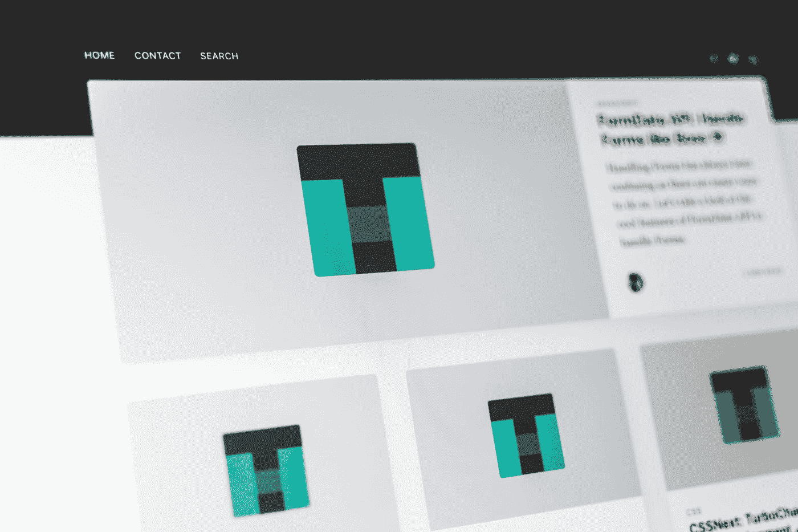

# 如何在网站和应用程序上更快地呈现大型列表

> 原文：<https://betterprogramming.pub/how-to-render-large-lists-faster-on-websites-and-apps-12c6389bf13e>

## 用户不会等一整天，所以我们不要考验他们的耐心

由[潘卡杰·帕特尔](https://unsplash.com/@pankajpatel?utm_source=medium&utm_medium=referral)在 [Unsplash](https://unsplash.com?utm_source=medium&utm_medium=referral) 拍摄的照片。

在许多网站上，你会发现自己在滚动列表。一些更简单，而另一些更花哨(如电子商务网站)。现代网站以大量内容为特色，但是没有人喜欢响应缓慢的体验。如果性能很差，用户可能会反弹。因此，我们努力让用户体验尽可能愉快。

呈现大型内容列表是一项挑战，原因有多种:

*   不是每个使用你产品的人都有一个强大的设备。
*   获取大量数据可能需要很长时间。
*   过滤和排序对于定制结果的显示非常有用，但是它们会导致大量的重新渲染。

以下是一些通用策略，有助于提高呈现内容列表时的感知性能和实际性能:

*   使用分页从后端延迟加载结果。
*   仅渲染视口内的内容(例如，使用虚拟滚动)。
*   不要重新呈现未更改的元素。
*   减少呈现 UI 所需的工作量。
*   显示加载状态以避免空屏幕(例如，带有骨架屏幕)。

让我们仔细看看如何在实践中应用这些策略。对于代码示例，我将使用 [Angular](https://angular.io) 框架。然而，无论您使用哪种平台或框架，这些策略都可以应用。

# 来自后端的延迟加载结果

假设你正在亚马逊上搜索一款新的笔记本电脑。有数千种不同型号的笔记本电脑可供选择。用户可能不会检查每个模型。相反，如果他们对显示的结果不满意，他们可能会看一下前十个结果并继续滚动。因此，从后端请求合理数量的结果是有意义的，如果用户要求更多，就继续请求更多的结果。

一种流行的技术是使用无限滚动。Twitter、YouTube 和 Instagram 等热门网站使用无限滚动来获取更多结果。有像`[ngx-infinite-scroll](https://github.com/orizens/ngx-infinite-scroll)`这样的第三方库可以方便地使用无限滚动。通常，实现相当简单:

*   最初，您请求固定数量的结果(例如 50 个)并呈现这些结果。
*   您需要监听列表容器中的滚动事件。
*   一旦用户将要到达列表的末尾，您就请求下一批结果并呈现这些结果。

# 仅渲染视口内的内容

网站和应用程序上的许多内容不是立即可见的。即使您限制了从后端获取的结果的数量，用户也不可能一次看到所有的结果。因此，可以通过不呈现未显示的 UI 元素来加速呈现。

虚拟滚动是一种用于通过仅呈现适合屏幕的元素来高效地呈现大型元素列表的技术。与无限滚动的区别在于，不可见的元素根本不会被渲染。这有助于保持呈现的列表元素数量最少。还有像 [Angular CDK](https://material.angular.io/cdk/scrolling/overview) 这样的第三方库来实现虚拟滚动。

如果你的列表元素包含图像，你可以通过延迟加载图像来提高性能，同时减少消耗的带宽[。现代浏览器允许你指定一个图像是否应该延迟加载。在这种情况下，只有当用户滚动到图像附近时，浏览器才会开始加载这样的图像。](https://itnext.io/how-to-use-native-image-and-iframe-lazy-loading-in-website-2109d577f7b1)

# 不要重新渲染未更改的元素

排序和过滤是帮助用户找到相关结果的常用功能。当我们对列表进行过滤或排序时，客户端会做一些事情:

*   我们展示了以前可能没有展示过的元素。
*   我们隐藏上面显示的元素。
*   我们改变元素显示的顺序。

我们导致了用户界面的渲染，这会让用户感觉迟钝。因此，我们希望将重新渲染的数量保持在最小。对列表进行筛选或排序时，通常会保留一些结果。这些结果不需要重新渲染，因为它们没有改变。提高性能的一种方法是不重新渲染没有改变的元素。

Angular 有一个内置的机制叫做`[trackBy](https://angular.io/api/core/TrackByFunction)`。我们只需要指定一个函数，告诉 Angular 如何跟踪数组中项目的变化。在下面的例子中，`uuid`属性用于此目的。现在，当我们应用过滤时，之前渲染过并且仍然存在的元素将不会被重新渲染。

# 减少呈现用户界面所需的工作量

操作的执行顺序对性能有很大影响。以下示例显示了城市列表。让我们假设`cities`包含 1000 个条目。为了对列表进行排序和过滤，使用了两个定制的角形管道(`sortByName`和`removeSmallCities`)。

*   第一种方法按名称对城市列表进行排序，然后从列表中删除小城市。
*   第二种方法从列表中删除小城市，然后按名称对列表进行排序。

正如您所猜测的，第二种方法在性能方面表现更好。通过删除小城市，要排序的列表会更小，因此需要做的工作更少。

# 显示加载状态以避免空屏幕

对用户来说，空屏幕看起来并不吸引人。他们注意力持续时间短，尤其是当他们不知道会发生什么的时候。如果他们看到一个空屏幕太长时间，他们会反弹。当然，有些操作可能需要一秒以上的时间，这是很难改善的(比如调用第三方 API)。

除了实际性能，还有感知性能——这当然可以改进。

*   最简单的方法是显示某种[装载杆或装载旋转器。](https://material.io/components/progress-indicators)加载栏和加载微调器都很容易实现，它们让用户意识到当他们等待时，一些后台工作正在进行。
*   近年来，脸书、Medium、微软等公司都采用了[骨架屏](https://uxdesign.cc/what-you-should-know-about-skeleton-screens-a820c45a571a)的用法。一旦一切准备就绪，一个框架屏幕已经向用户提供了将要显示的内容的粗略视图。它们还减少了布局偏移，因为它们相当接近将要呈现的实际布局。

以下是在 Angular 应用程序中异步获取数据时如何显示微调器的简单方法:

*   `async`管道允许我们打开可观察的`results$`，它发出一个 HTTP 请求并将其存储为一个可以在子节点中引用的`results`变量。
*   在请求完成之前，`results`为 falsy。因此，出现了`else`案例，这意味着显示了微调元素`app-spinner`。
*   请求完成后，应该定义`results`。因此，微调器将不再显示。相反，将呈现结果(或者如果`results`是空数组，则呈现一条信息消息)。

# 结论

感谢您阅读这篇关于提高大型列表呈现性能的文章。如您所见，有多种方法可以提高性能，从而创造出色的用户体验。

您知道其他提高列表呈现性能的方法吗？请在评论中告诉我。