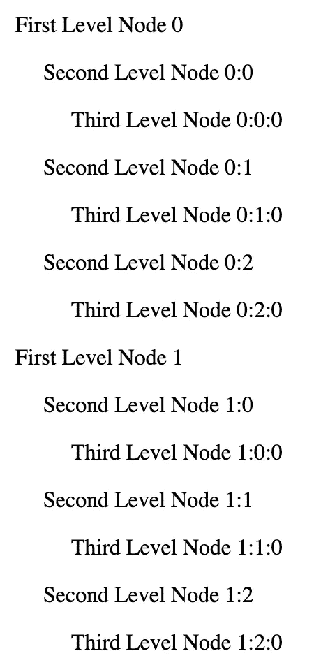

# 如何在 Angular 中渲染大型树数据结构

> 原文：<https://betterprogramming.pub/how-to-render-large-tree-data-structures-in-angular-653bf6cf0bd0>

## 使用虚拟滚动


照片由 [niko photos](https://unsplash.com/@niko_photos?utm_source=medium&utm_medium=referral) 在 [Unsplash](https://unsplash.com?utm_source=medium&utm_medium=referral) 上拍摄

在客户端应用程序中显示很长的项目列表需要特别注意，因为众所周知，当试图呈现包含数百甚至数千个项目的列表时，应用程序的性能会迅速下降。

发生这种情况是因为浏览器必须在显示给最终用户之前预先呈现整个页面和其中的所有数据，因此，在一个列表中呈现数千个项目会导致极大的挫败感。

幸运的是，我们可以使用虚拟滚动技术来解决这个问题。

从高级的角度来看，虚拟滚动允许客户端一次只呈现整个列表的一小部分，例如十个项目，并且当用户向上或向下滚动该列表时，仅呈现关于滚动位置应该在屏幕上显示的项目。

这样，除了缩短应用程序的加载时间之外，滚动列表也非常快。

我将通过解决我最近遇到的一个问题来深入研究这种技术，同时尝试在 Angular 应用程序中可视化一个树数据结构。

下图清楚地描述了期望的最终结果:页面上应该呈现一个树形数据结构，在某些情况下可能包含数百甚至数千个条目。



尽管 Angular Material 提供了一个非常好的[组件](https://material.angular.io/components/tree/overview)来显示这样的数据结构，但是它没有提供所需的灵活性。

正如我将在下面展示的，通过嵌套组件的递归呈现的一种天真的方法将会达到期望的结果，然而，由于必须呈现大量的项目，性能将会很糟糕。

更不用说这个表格视图的初始规范要求任何级别的项目都是可拖动/可放下的，并且它们的内容是可编辑的 *…*

但是为了让这篇文章简单有趣，我只是将每一项的内容表示为一个字符串，没有任何拖放功能。

我将从讨论呈现整个树结构的天真方法开始，然后我将继续进行一些修改以实现可伸缩的最终结果。

# 呈现树形结构的简单方法

最初，我创建了树条目数据结构`TreeNode`，它将保存数据、对父条目的引用(稍后我们将看到为什么我们需要它)和一个子条目数组，如下所示。

`Tree`数据结构如下所示。它由一个没有内容的根节点组成，该根节点包含将在列表中显示的第一级子节点。

为了呈现这个数据结构，我创建了一个父组件`TreeParentComponent`和一个子组件`TreeChildComponent`。

父组件将只呈现第一级项目，即`Root`节点的子节点，子组件将以递归方式呈现各自的子组件，直到每个项目都被呈现。

有人可能会说父组件可能会令人困惑，或者可能是不需要的，但是我喜欢分离关注点，并且不干涉可以在承载`Tree`视图的主组件中实现的逻辑。

下面的片段分别显示了`TreeParentComponent`和`TreeChildComponent`。

如果我尝试渲染成千上万个项目，这个解决方案的性能会很好吗？

当我试图拖动一个节点或简单地添加一个新节点时，我可以想象变化检测周期将我的笔记本电脑的风扇推到极限，这种实现立即成为问题。

下面的演示应用程序展示了这种不可伸缩的实现。

# 渲染树结构的优化方法

根据以前的经验，我知道虚拟滚动技术可以让我不至于抓狂。

这种技术允许我定义一个固定大小的容器，在其中呈现`Tree`结构，它将根据每个项目的高度，将当前在该容器中可见的一些元素附加到 DOM。

因此，要实现虚拟滚动，我们需要为项目的高度指定一个固定的大小。这个解决方案不适用于上面显示的编码示例，因为子组件的高度不能相同，因为它们可能有不同数量的子组件。

为了提供具有固定大小项目的虚拟滚动，我将对不可伸缩代码进行一些调整。

首先，我需要在一个平面列表中表示整个树，使用 [DFS](https://www.geeksforgeeks.org/depth-first-search-or-dfs-for-a-graph/) 算法根据需要可视化父子关系。下面给出了以这种方式展平树的代码:

接下来，子组件不会呈现任何内部子组件，相反，它们只会呈现节点数据。

现在，为了用基于节点级别的精确缩进来可视化不同的级别，我实现了一个方法来检索树中节点的级别，从级别为 0 的根开始，并使用它向每个节点添加动态填充:

```
[style.padding-left.px]="levelDistance() * 20"
```

主要逻辑位于父组件中，其中展平的树呈现在可滚动列表中。让我们分解以下代码:

应该使用 viewport 组件中的`*cdkVirtualFor`迭代平面树项目，即`cdk-virtual-scroll-viewport`。视口的主要必需属性是`itemSize`，它以像素表示树节点的大小。

为了获得更好的性能，我加入了一些可选属性，`minBufferPx`和`maxBufferPx`。它们控制需要缓冲的最小和最大空间。

在滚动列表时，如果当前渲染的剩余缓冲空间低于`minBufferPx`，视口将渲染额外的空间，直到其缓冲了`maxBufferPx`空间。这样，它确保了列表的平滑滚动。

另外，渲染性能的另一个改进是对`templateCacheSize`属性的规范。

使用这个，`*cdkVirtualFor`将缓存最多 20 个以前销毁的项目，当再次需要它们时，`*cdkVirtualFor`将从缓存中获取它们，而不是重新创建它们。

下面给出了可扩展解决方案的完整实现。

# 结论

感谢您的宝贵时间，希望这个解决方案对您有用。我期待着听到你的建议，让这个解决方案更好，或者一个完全不同的方法。

保重。

# 参考

*   [滚动](https://material.angular.io/cdk/scrolling/overview) —角状材料