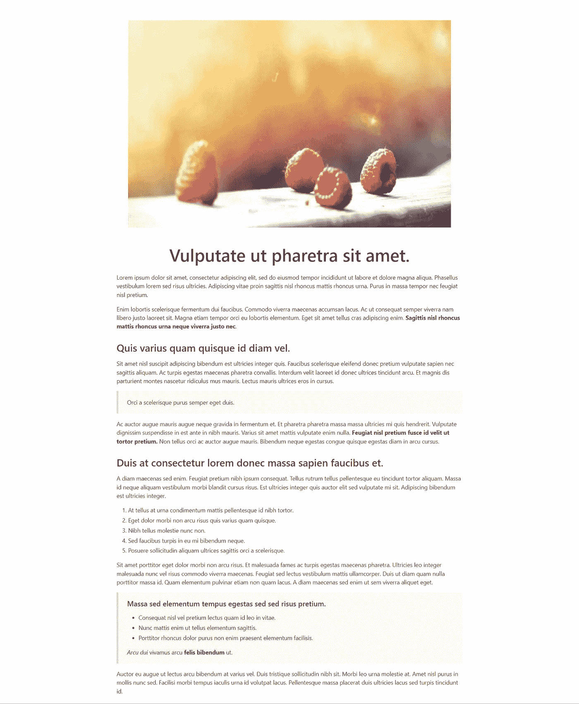

# 如何用 Golang 将 Markdown 渲染成 HTML

> 原文：<https://betterprogramming.pub/how-to-render-markdown-to-html-with-golang-957fd0f98326>

## 我们将把一个标准的 Markdown 文件呈现给一个使用布尔玛 CSS 框架的 HTML 页面。我们用 Golang Markdown 包和 Golang 模板实现了这个程序。

[Luke Lung](https://unsplash.com/@lukelung1991?utm_source=medium&utm_medium=referral) 在 [Unsplash](https://unsplash.com?utm_source=medium&utm_medium=referral) 上拍摄的照片

这篇文章将向你展示如何将一个 Markdown 文件转换成一个 HTML 页面。这个 HTML 页面将使用布尔玛 CSS 框架。为了应用这个 CSS 框架提供的一些特殊类，我们需要编写一个特殊的“钩子”来适应一些 HTML 标签的呈现方式。对于这个例子，我将坚持修改`h1`和`img`标签的渲染，并添加`figure`标签，但是如果需要的话，这可以很容易地扩展。

要查看我们将使用的降价文件[，请点击此处](https://gist.githubusercontent.com/jfjensen/0affc6fef055b1289e03ab2b3eff10c3/raw/8800f72181e93593ad5623b911e2c80cab1b7103/blog-post-example.md)。我们将使用的 Golang 降价包是[这个](https://github.com/gomarkdown/markdown)。如果你不太熟悉 Markdown 或者需要复习，那么[这是一个很好的资源](https://www.markdownguide.org/cheat-sheet/)。

你可以在这里找到布尔玛 CSS 框架。这是一个纯 CSS 框架，所以你只需要在你的 HTML 文件中包含一个到布尔玛 CSS 样式表的链接。不需要 JavaScript。

# 程序的 Go 代码

你可以在这里找到完整的代码。

下面，我将分别讨论`main()`和`renderHook()`功能。

## main()函数

在第 3–22 行，您可以找到我们希望呈现的 HTML 页面的 HTML 页眉和页脚。这些都是非常基本的，除了我们还在第 9 行导入了布尔玛 CSS 框架。

在第 24–27 行，我们使用`ioutil.ReadFile()`读取 markdown 文件，然后使用`panic()`处理任何可能发生的错误。

在第 29–32 行，我们确定了希望发送给降价呈现器的选项。在这里，我发现`html.FlagsNone`是最好用的标志。如果不放任何标志，默认设置为`html.CommonFlags`。然而，根据我的经验，这可能会产生不想要的结果。不渲染项目符号就是一个例子。

这里要注意的第二件事是，我们将`RenderNodeHook`设置为`renderHook()`函数。这个定制函数负责呈现`heading`和`image`节点。稍后会详细介绍。

在第 33 和 34 行，我们将降价内容呈现为 HTML。markdown 渲染器似乎返回了一个`[]byte`切片。因此，在将`output`输入模板之前，我使用`string()`函数将其转换成一个字符串。

在第 36–38 行，我们创建了一个简单的 Golang 模板，它由标题、一个在双括号之间的可变点和页脚组成。然后用`template.Must()`检查模板的正确性。

对于这样一个小应用程序来说，使用 Golang 模板似乎有些大材小用，但是这看起来是在几行代码中连接三个字符串的最简单的方法。此外，在 web 环境中，您可能会使用模板。

这里需要注意的是，我们需要使用`text/template`包，这样 HTML 标签就不会被转义。

在第 40 和 41 行，我们创建了一个名为`processed`的`bytes.Buffer`类型的输出缓冲区，并使用`Execute()`将模板渲染到其中。我们将 HTML 页面渲染到一个字节缓冲区中的原因是为了将它发送到`ioutil.WriteFile()`。

在第 43–46 行，我们使用`ioutil.WriteFile()`将输出缓冲区`processed`写入一个名为`index.html`的文件。如果出现错误，我们还会检查错误。

## 自定义 renderHook()函数

该功能属于`RenderNodeFunc`类型。你可以在这里阅读。

当 markdown 解析器运行时，它创建一个节点树来表示要呈现的 HTML。如果我们希望节点以不同于默认的方式呈现，我们可以使用自定义函数来呈现节点。

在第 3–15 行，我们处理标题节点[。](https://pkg.go.dev/github.com/gomarkdown/markdown@v0.0.0-20220310201231-552c6011c0b8/ast#Heading)

在第 4 行，我们得到了标题节点的级别。我们对级别 1 感兴趣，因为在这个例子中，我们只想修改`h1`标签的输出。

在第 6 行，我们检查节点是否是开始节点。这意味着变量`entering`应该为*真*。这里我们还测试了`level`是否等于 1。

在第 7 行，我们按照我们希望的那样编写输出`h1`标签。查看[布尔玛文档](https://bulma.io/)了解这些类的含义。对于任何其他 CSS 框架，我们可以在这里做类似的事情。

在第 8 行和第 9 行，我们再次测试`entering`是否为真。这一次，我们处理的是不是第 1 级的其他标题节点。同样，我们根据需要编写输出。在这种情况下，标签中没有添加特定的类。

在第 10 行和第 11 行中，`entering`将为假，这意味着我们正在处理结束标记。对于所有标题级别，结束标记以相同的方式呈现。我们将它写入输出流。

在第 14 行，我们从函数返回两个值。第一个值`ast.GoToNext()`告诉程序处理树中的下一个节点。这可以是一个子节点。第二个值是布尔值。在这种情况下，布尔值为 *true* ，因为我们的自定义函数会呈现标签。如果标准渲染器渲染标签，布尔值将为*假*。

在第 16–30 行，我们处理了[图像节点](https://pkg.go.dev/github.com/gomarkdown/markdown@v0.0.0-20220310201231-552c6011c0b8/ast#Image)。注意，在这个例子中，我们将把 image ( `img`)标签放在`figure`标签中。这允许我们使用布尔玛 CSS 框架中的一些特殊样式。

在第 17 行，我们得到了图像节点的源节点`src`。

在第 19 行和第 20 行，我们找到了 image 节点的第一个子节点，它包含“alt”文本。(这是我通过试错发现的)。

在第 22 行和第 23 行，我们测试看我们是否是图像节点`entering`以及文本`alt`是否不是空字符串。然后我们输出我们想要的`figure`和`img`标签；在`figure`标签中有几个类，在`img`标签中有`alt`文本。

在第 24 行和第 25 行，我们再次测试我们是否是一个图像节点，但是这次文本应该是空的。我们输出`figure`和`img`标签，因为我们希望它们出现，但是在`img`标签中没有`alt`文本属性，因为它是空白的。

在第 26 行和第 27 行中`entering`将为假，我们写结束`figure` 标签。这里不需要`img`标签。

在第 30 行，我们从函数中返回，但是带有与之前不同的值。我们将返回`ast.SkipChildren`作为第一个返回值，因为不应该呈现图像节点的子节点。这确保了`alt`文本不会在 HTML 页面中呈现为段落文本。第二个值再次为真。

在第 31 行和第 32 行，我们处理所有其他节点，即不代表标题或图像标签的节点。我们从带有`ast.GoToNext`和*假*的函数返回。这里我们返回 *false* 作为第二个值，因为默认渲染器需要渲染标签。

# 产生的 HTML 页面

呈现的 HTML/布尔玛 CSS 页面的屏幕截图

在上面的截图中，我们可以看到，包括图像和标题在内的所有内容都按照预期进行了渲染。

关于 Golang 模板的更多信息:

 [## 如何在 Golang 中使用模板？

### 标准模板包概述。

better 编程. pub](/how-to-use-templates-in-golang-46194c677c7d)  [## 如何用 Golang 模板生成 HTML

### 如何使用 Go 模板生成 HTML 页面的示例

better 编程. pub](/how-to-generate-html-with-golang-templates-5fad0d91252) 

# 参考

[用于 Go 的 Markdown 解析器和 HTML 呈现器](https://github.com/gomarkdown/markdown)

[《降价指南》中的“降价备忘单”](https://www.markdownguide.org/cheat-sheet/)

《布尔玛:刚刚运转的现代 CSS 框架》