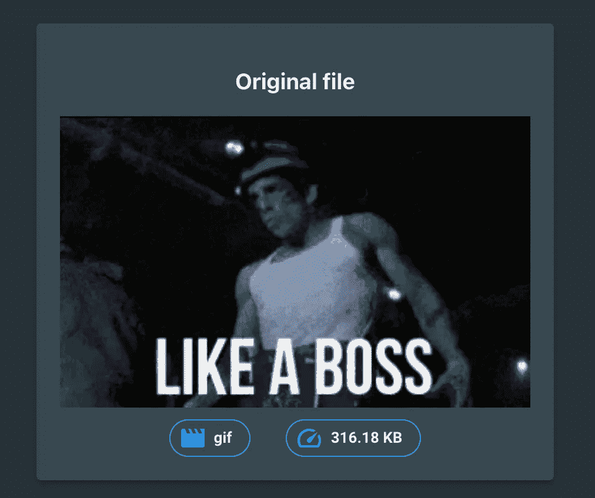
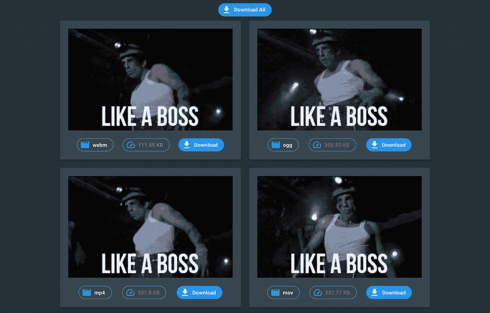
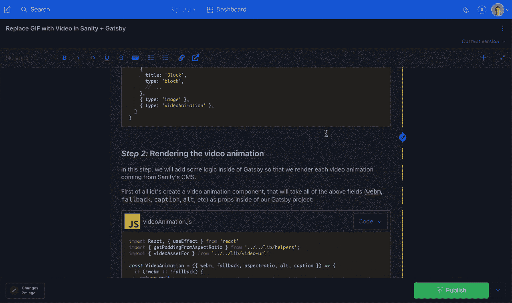

# 如何使用 Sanity 和 Gatsby 将 gif 替换为视频

> 原文：<https://betterprogramming.pub/how-to-replace-gifs-with-videos-using-sanity-and-gatsby-f4502424b841>

## 在 web 应用程序中渲染动画

插图由 [unDraw](https://undraw.co/illustrations)

GIF ( `.gif`)图像文件格式是一种非常古老的动画图像格式([1989 年的最新版本](https://www.w3.org/Graphics/GIF/spec-gif89a.txt))，随着模因、在线聊天和论坛的大量使用，这种格式得到了广泛使用。

虽然你可以通过混合连续的静止图像帧来创建 GIF 图像，但是大部分的 GIF 图像都是从视频格式转换而来的，以便在网络上使用。这很讽刺。

我的观点是，你最好将那段视频*静音*并让它*循环播放*和*自动播放*(稍后会详细介绍)，而不必将其转换成 GIF。那样的话，你可以节省几百千字节！由于压缩算法的原因，GIF 图像和视频之间的文件大小差异很大(这里我就不详细介绍了)。但是，这里有一个来自我创建的[转换工具](https://gif2video.com/)的例子来证明我的观点:

原始 GIF 图像(316 KB)

已转换的视频文件(WebM = 111 KB)

虽然 Sanity 还不支持将 GIF 图像转换为视频格式，但它目前支持两种类型的资源——各种[文件格式](https://www.sanity.io/docs/file-type),您可以使用它们来呈现视频，以代替沉重的 GIF 图像。

不幸的是，您将无法重用您的图像模式来在同一个组件中上传图像和视频。在本文的后面，我们将讨论如何在 Sanity studio 中建立一个简单的上传视频组件的模式，以及如何在 Gatsby web 应用程序中呈现它们。

## 限制

所以，在我们继续之前，总结一下我的方法的一些局限性:

1.  Sanity 的 API 还没有 gif 到视频的转换
2.  Sanity 的 API 还没有提供 mp4 到 webm 的转换
3.  需要在 Sanity Studio 中使用一个单独的组件来向块内容添加视频动画

我可以接受上面的第三点。当然，我的主要问题是整个 GIF 和视频转换部分，这还不像 Sanity 的图像转换功能那么容易。我希望他们能尽快添加这一功能，因为这将节省时间，但最重要的是，它可能会推动更多的人采用这种方法，使网络更快，更少的数据饥渴。

## 理智+盖茨比中的视频动画

对于这种方法的实施，让我们把它看作是一个由三部分组成的过程:

1.  在 Sanity Studio 中为新的视频动画组件创建模式
2.  渲染来自盖茨比内部的 Sanity 的 API 的视频
3.  (可选)惰性加载盖茨比中的视频动画

**注意:**所谓的“*视频动画，*”我指的是以与 GIF 动画相同的方式观看的视频——静音、循环播放和自动播放——但它有一种视频格式，例如`*mp4*`、`*webm*`。

好吧，那我们就开门见山吧！

# 步骤 Sanity Studio 中的视频模式

在我们的 Sanity studio 项目中的`studio/shemas/`目录下(或者你保存模式的任何地方),我们将创建一个新的文件来描述新的视频动画模式:

**最佳实践:**`*aspectratio*`字段对于本文来说当然是可选的，但是如果您有兴趣为您的用户节省一些[布局变化](https://web.dev/aspect-ratio/#example:-preventing-layout-shift)，尤其是(但不仅仅是)如果您计划添加延迟加载，这是一个不错的选择。

或者，如果您想在 Sanity Studio 中为您上传的视频添加预览，您可以在下面添加这些行:

在为我们的新视频动画组件创建模式之后，不要忘记将它和所有其他定制模式一起包含在`createSchema`方法中:

最后，将`videoAnimation`类型作为一个选项包含在您的博客帖子或任何其他内容中。在我的例子中，我已经在我用来写文章的`blockContent`组件中添加了这个选项:

Sanity Studio 演示

# 步骤 2:渲染视频动画

在这一步，我们将在 Gatsby 中添加一些逻辑，以便我们渲染来自 Sanity 的 CMS 的每个视频动画。

首先，让我们创建一个视频动画组件，它将包含上述所有字段(`webm`、`fallback`、`caption`、`alt`等)。)作为我们盖茨比项目的道具:

**提示:**如果你对`*getPaddingFromAspectRatio*` util 函数感兴趣，你可以在这里找到[代码和逻辑](https://www.charistheo.io/blog/2021/06/prevent-image-layout-shifts-in-sanity-gatsby/#step-3--calculate--padding)。

然后，在您的 Sanity [块内容序列化器](https://github.com/sanity-io/block-content-to-react#usage)中，为在 Sanity 块内容中找到的每个`videoAnimation`包含这个`VideoAnimation`组件:

# 步骤 3:延迟加载视频动画

好吧，如果你做到了这一步，拍拍自己的背，我知道这可能是一个乏味的过程，有很多事情可能会出错。

不过这最后一部分应该是最简单、最省事的。总而言之，为了让视频延迟加载正常工作，我们需要做以下更改:

1.  运行`npm i lozad`安装`[lozad](https://github.com/ApoorvSaxena/lozad.js#example-with-video)` [npm 包](https://github.com/ApoorvSaxena/lozad.js#example-with-video)
2.  初始化`useEffect`挂钩内的`lozad`(第 3-11 行)
3.  将`lozad` CSS 类添加到`<video>` HTML 元素(第 19 行)
4.  将`src`属性重命名为`data-src`(第 21 和 22 行)

就是这样！你现在应该为你的用户少提供几百 kb 的服务，并且拥有一个比以前快得多的网站。

如果你被困在某个地方，请随时联系 LinkedIn 或 Twitter，看看我是否能以某种方式帮助你。对于现场最终产品，只需检查[这一页](https://www.charistheo.io/blog/2021/07/replace-gif-with-video-in-sanity-gatsby/)。

# 进一步阅读

*   [懒人加载视频](https://web.dev/lazy-loading-video/) — web.dev
*   [为动画内容使用视频格式](https://web.dev/efficient-animated-content/) — web.dev
*   [用视频替换 gif 以加快页面加载速度](https://web.dev/replace-gifs-with-videos/) — web.dev