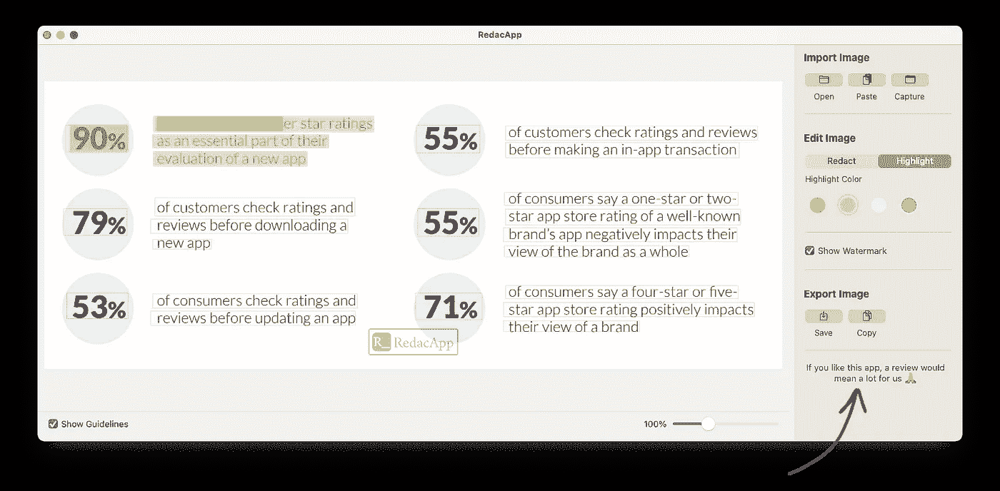
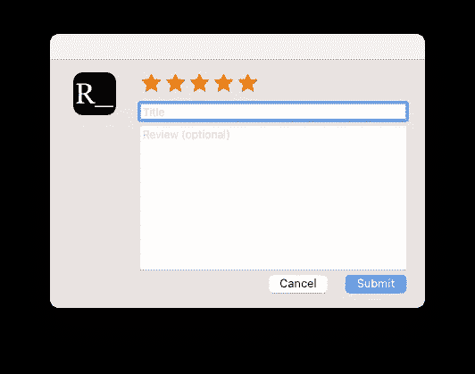
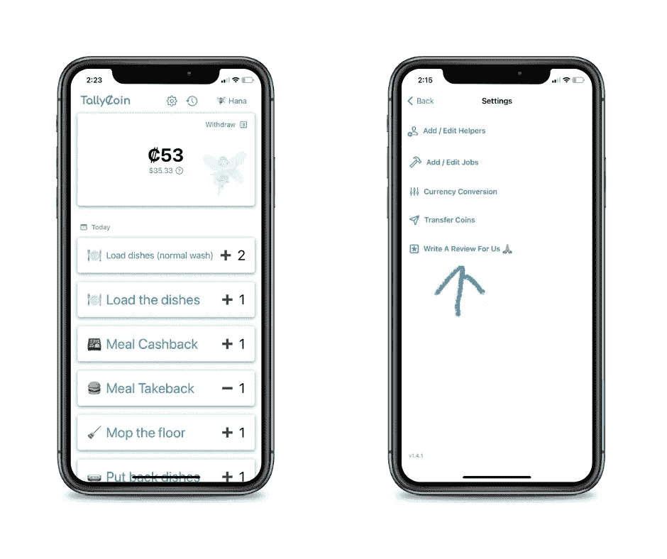
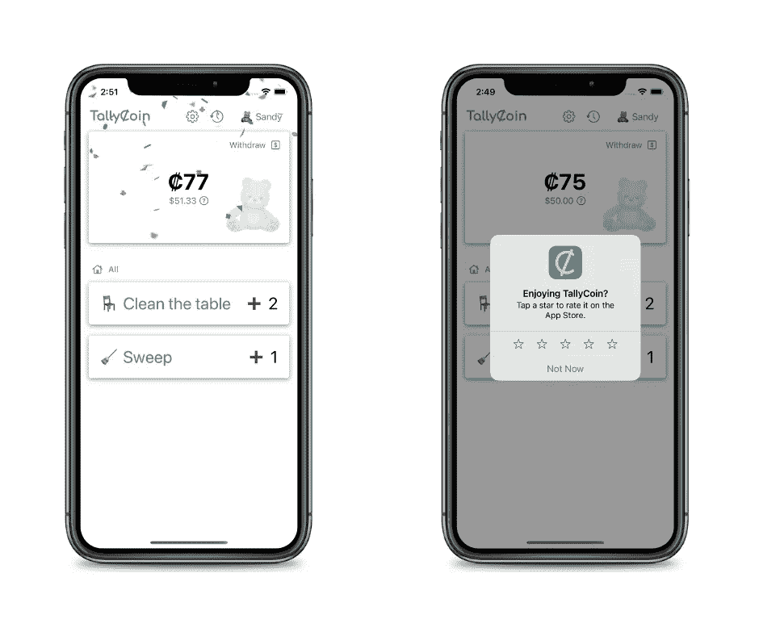

# 如何从您的 iOS 和 macOS 应用程序请求 App Store 评论

> 原文：<https://betterprogramming.pub/how-to-request-app-store-reviews-from-your-ios-and-macos-apps-47d3e66b21b0>

## 通过提示和对话框

[智月](https://unsplash.com/@zhiyue?utm_source=medium&utm_medium=referral)在 [Unsplash](https://unsplash.com?utm_source=medium&utm_medium=referral) 上拍照

如果你正在开发 iOS 和 macOS 应用程序，你会喜欢从你的客户那里得到评价和评论！这是在 App Store 中建立社交证明的必要方式，可以鼓励更多的客户试用你的产品。

根据一些轶事，一个普通的应用程序可能会在 1000 次下载中获得 1 次评论。

这样的比例下，零评分的新 app 很难脱颖而出。因此，创造一些用户体验以使客户更容易提供评级和评论是至关重要的。

在这篇文章中，我将讨论在 iOS 和 macOS 应用程序中设置审核请求的几种方法。

# 选项 1:链接到评论，适用于 iOS 和 macOS

在应用程序中，我们可以添加一个链接到应用程序商店评论对话框。这是一种较少打扰的提醒用户回顾的方式。

macOS 应用程序内部的链接。这是我做的 [RedacApp](https://apps.apple.com/us/app/redacapp-redacting-in-images/id6443662043)

一旦用户点击这个链接，就会进入 App Store 的评论对话框。

App Store 中的查看对话框

我还在我构建的 iOS 应用的菜单内添加了评论链接: [TallyCoin](https://apps.apple.com/us/app/tallycoin/id1633932632)

要显示链接，只需向 SwiftUI 结构添加一个链接组件，如下所示。

# 选项 2:提示审查，对于 iOS

一旦用户使用了应用程序的重要功能，您的应用程序也可以提示用户对应用程序进行评级。

显然，这是一种更具侵入性的体验。这需要仔细的设计和考虑，以确定什么时候是提示的最佳时机。

实现也有点复杂。它需要完全融入到体验中。

例如，我希望在单击按钮 10 次后弹出对话框。

在上面的代码中，应用版本号也被保存到永久存储器`UserDefaults`，所以我们将只显示一次应用的一个特定版本。

重要注意事项:如果开发人员决定一直显示评级对话框，对话框将*而不是*一直按预期弹出，因为这可能会降低用户体验。

根据[苹果的文档](https://developer.apple.com/documentation/storekit/requesting_app_store_reviews)，它在 365 天内最多只会出现 3 次。

> 使用`[SKStoreReviewController](https://developer.apple.com/documentation/storekit/skstorereviewcontroller)`向用户提出应用商店评论的请求是获得应用反馈的好方法。但是，请注意，系统在 365 天内最多向用户显示三次提示。您可以决定应用程序何时何地显示请求审核的提示。

仅此而已！

您可以选择这些选项中的任何一个或全部。试试看！此外，如果您有其他更好的想法来帮助评级，请随时分享。

*(更新:我的书* [*用 SwiftUI 构建 macOS 应用*](https://leanpub.com/macos-apps-swiftui) *出来了！获取更多详细信息和示例。)*