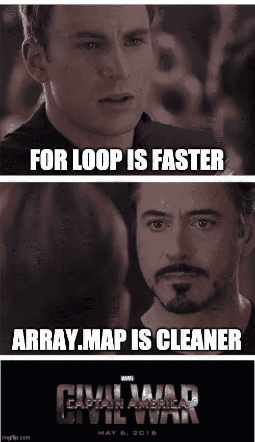
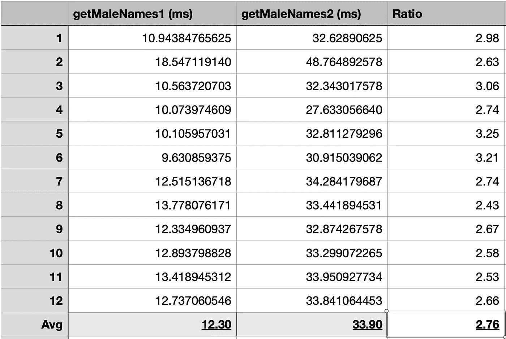

# 如何解决人与人之间的拉请求冲突

> 原文：<https://betterprogramming.pub/how-to-resolve-a-pull-request-conflict-between-humans-1b6715b1432d>

## 人类的冲突并不都是闪闪发光的金子

赫尔墨斯·里维拉在 [Unsplash](https://unsplash.com?utm_source=medium&utm_medium=referral) 上拍摄的照片

拉请求通常有两种冲突:代码冲突和人为冲突。

当源分支没有目标分支的提交时，就会发生代码冲突。您可以通过合并或重组来解决代码冲突。两种方式都是对的。然而，人类的冲突并不总是那么简单。

当两个开发人员，通常是作者和评审者，对一段代码有不同的观点时，就会发生人员冲突。有时一种观点显然比另一种更好。有时两者似乎都是正确的。

如果你是其中一方或者第三方，你会如何处理这种情况？你如何客观地判断一段代码？在这篇文章中，我将带你经历四个判断标准，这些标准可以用来解决这样的人类冲突。

# 个案研究

为了理解什么会导致人类冲突，让我们看看下面的示例代码:

*   第一个代码块生成一个包含 1，000，000 个元素的虚拟数组，其中包含字段`sex`和`name`。一半的元素是女性，另一半是男性。名字并不重要。
*   代码的第二部分是一个从上面的数组中获取男性姓名列表的函数。它使用传统的`for`循环来迭代数组。通过检查元素的`sex`字段，如果`sex === 'M'`，该函数将名称推送到输出数组。
*   第三个代码块是另一个旨在实现与前一个函数相同结果的函数，但是它使用了`Array.prototype`函数`filter`和`map`。
*   最后一段代码是调试两个函数的执行时间。

想象一下，你的团队里有人写了`getMaleNames1`函数，但你觉得`getMaleNames2`函数更好。你如何证明你的建议是正确的？还是反过来？

[漫威内战 1 迷因生成器](https://imgflip.com/memegenerator/Marvel-Civil-War-1)

# 1.正确性

实现的正确性是最重要的标准。如果拉请求中的解决方案显然返回了一个错误的结果或者没有处理所有的情况，那么必须采用解决问题的注释。

这非常简单，但它几乎不是冲突的原因。在案例研究中，两个函数都是正确的，并且产生相同的结果，所以我们需要考虑下一个因素。

# 2.表演

在继续或者运行上面的代码之前，能不能暂停一下，猜猜哪个函数更快？

[思迹思模因生成器](https://imgflip.com/memegenerator/316678270/Think-Mark-Think)

大概也没那么难猜。事不宜迟，让我们检查一下运行时比较:

两个函数的运行时比较

根据结果，第一个函数比第二个函数快，平均快 2.76 倍。虽然两个函数都有 O(n)时间复杂度，`for`循环只迭代数组一次，但是`filter`和`map`迭代数组 1.5 次。(在`filter`函数之后，数组长度变成一半。)

这并不是为了对比一个`for`循环与一个`map`功能或一个`filter`功能的性能。那将是改天的另一篇文章。

这种性能差异显著吗？是也不是，看比例的话，第一个函数比第二个函数跑快 276%！如果看毫秒，两者都很难达到 50ms。没有人会注意到延迟的变化，即使你交换它们。

你可能想指出元素的数量并不总是一百万。元素数量增加到 1 亿会怎样？两个函数之间的运行时间差异现在是`|1.230s — 3.390s| = 2.16s`。这是一个重大的延误。

然后我会辩论这一亿是现实的还是假设的。是一般情况还是最坏情况？是基于我们现在掌握的数据还是为了未来的预防？

性能方面，还是模棱两可。

# 3.指导方针

**原则**是编程中改进软件设计和代码实现的通用指南，例如，SOLID、DRY、YAGNI 等。

**规则**是一套指导方针，确保代码是基于一种令人愉快的风格和惯例编写的。

一些规则防止特定的问题，一些规则定义特定的代码风格。规则可以是基于项目、基于团队、基于组织或基于社区的。

在 JavaScript / TypeScript 中，您可以使用 ESLint 通过社区或知名组织的预设建议来实施规则。

对于您的团队和项目，您可能需要额外的自定义规则来确保每个人都以相似的方式编写代码。团队成员应该不时地讨论、同意、记录和更新这些规则。例如:

*   比起类组件，更喜欢功能组件。
*   比起常规函数，更喜欢箭头函数。
*   文件夹结构和命名约定。

案例研究中的两个功能似乎都没有违反任何标准规则或原则。除非您的团队有不使用传统的`for`循环的自定义规则，否则这两个函数都遵循标准指南。

# 4.所有权

让我们站在作者的角度思考一下。当你用一个`for`循环写函数，提出一个拉请求，一个评审建议你把它改成`filter`和`map`，你愿意改变吗？

肯定不是，你为什么要花额外的时间重写函数呢？可读性更强吗？语法是不是短了很多？重写一个不会带来显著改进的函数的成本只是浪费时间。

当一段代码不比另一段代码更好或更差时，拥有最终发言权的人应该是作者。作者拿起这张票，考虑了一下如何实现它，并花了真正的精力来编写这段代码。

应该尊重作者的决定。如果他们坚持他们的实现，那很酷。这为他们节省了时间去做更重要的事情。如果他们决定改变，那就是双赢。

# 你能拿走什么

总而言之，在审查拉请求时，您应该根据这些标准和优先级来评估任何代码段:

**正确性>性能>准则>所有权**

这种优先排序绝不是解决人类冲突黄金标准或银弹，但它消除了偏见，并导致一个明确的结论。如果你不这么认为，请在评论中告诉我。

如果你想知道更多关于拉式请求的礼节，看看下面的另一个故事。干杯！

 [## 审阅者和作者的拉式请求礼仪

### 小心那些 LGTMs

better 编程. pub](/pull-request-etiquettes-for-reviewer-and-author-f4e80360f92c)