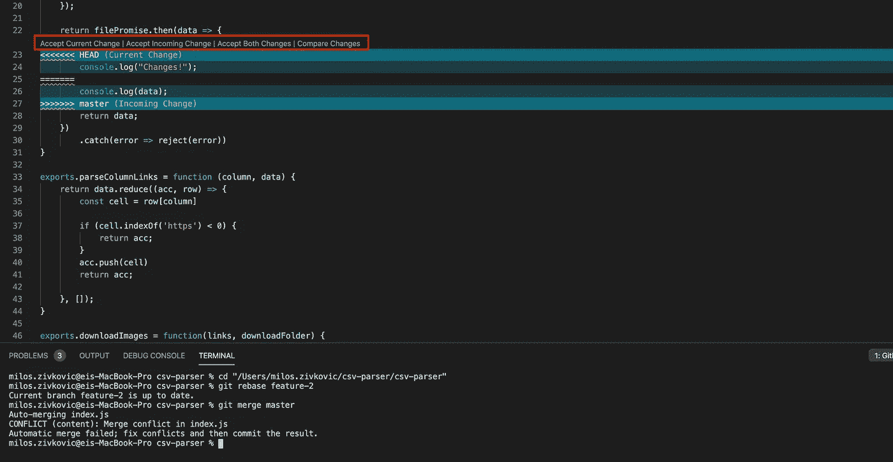
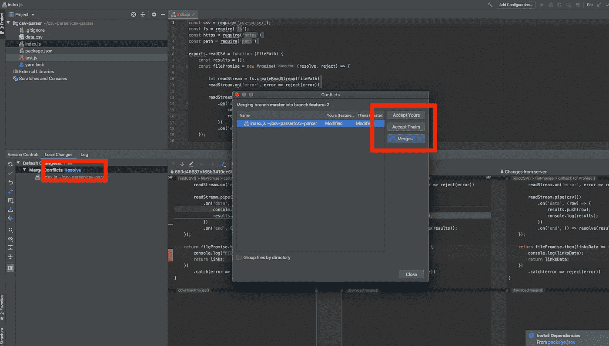
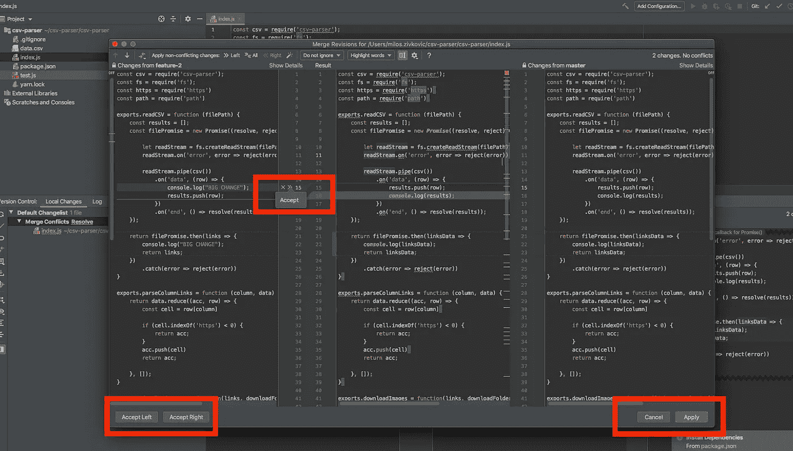
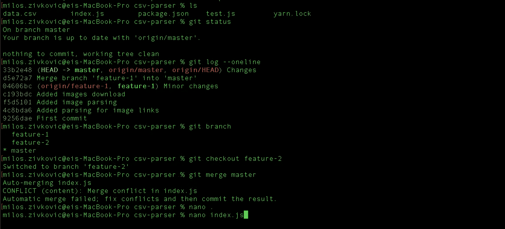
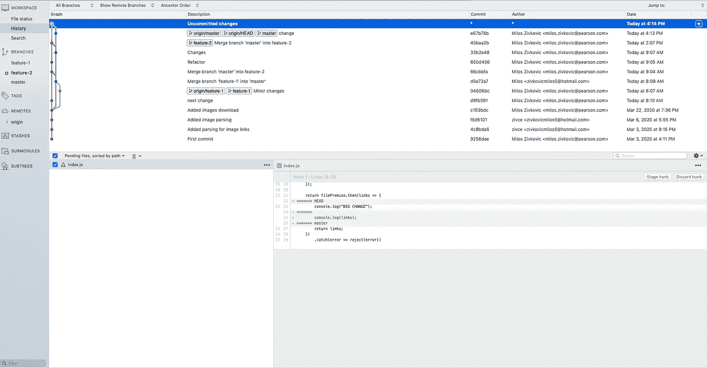
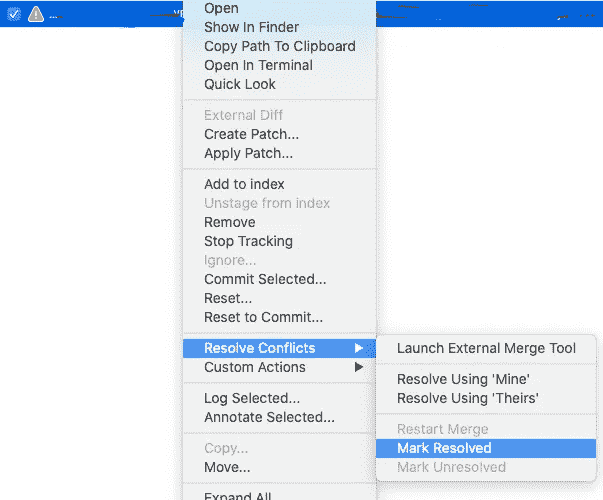
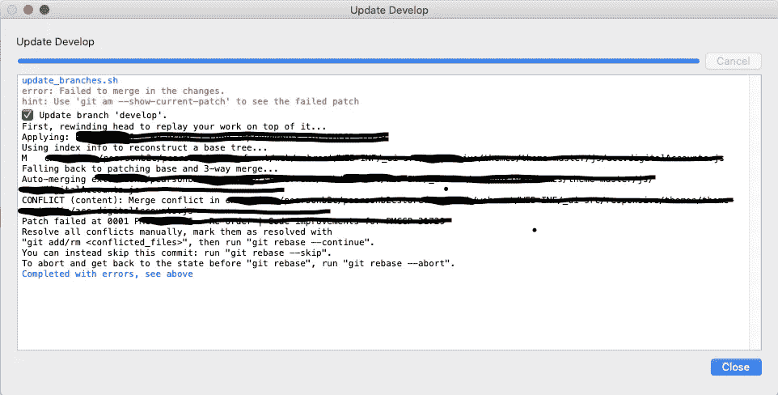
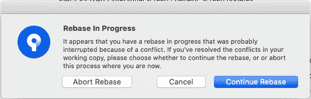

# 如何在您喜欢的 IDE 中更快更容易地解决 Git 冲突

> 原文：<https://betterprogramming.pub/how-to-resolve-git-conflicts-faster-and-more-easily-in-your-favorite-ide-9d2984283a79>

## 解决 VS 代码、IntelliJ、Nano 和 Sourcetree 中的 git 冲突

[李灿明](https://unsplash.com/@brock222?utm_source=medium&utm_medium=referral)在 [Unsplash](https://unsplash.com?utm_source=medium&utm_medium=referral) 上拍照。

# 冲突发生了

你修改了一个文件，你的同事也修改了。冲突会发生，很可能会在你的桌子上结束。

你落后于快速通道分支(例如`develop`)，你以冲突结束。解决这些问题可能需要一天的时间，因此找到一种快速解决问题的方法非常重要。

在本文中，我编译了五个快速方法来解决 git 冲突。

# 1.VS 代码

解决 VS 代码中的 git 冲突

VS 代码是迄今为止我最喜欢的冲突解决者。你会在冲突上方看到一个可爱的界面。解决冲突有三种选择:

1.  接受当前的变化。
2.  接受传入的更改。
3.  接受这两个更改。

这些选项不言自明。单击选项将应用它们描述的操作。冲突可以是内联的。对于这些，您可以在 VS 代码中编辑文件。️️️

# 2.IntelliJ

IntelliJ 中的 Git 冲突

如果你点击`Merge Conflicts`后的`Resolve`，你会看到这个窗口。您会看到一些类似于 VS 代码中的选项。接受您的意味着您保留了来自您的分支的变更(在我们的例子中，他们的变更来自于`master`)。

假设你对此不满意。然后双击有问题的文件:

以交互方式解决 IntelliJ 中的冲突

在这一步，你可以看到到底会发生什么。第一个标签是你的分支，`feature-2`。中间的选项卡将是合并结果。第三个选项卡是您试图合并的分支(`master`)。

您可以选择`>>`添加更改，或点击`X`放弃更改。

在右下角，您有两个选项:`Accept Left`将使用来自您的分支的变更，而`Accept Right`将使用来自`master`的变更。

# 3.毫微；纤（10 的负九次方）

在 Nano 编辑器中解决 git 冲突

你们有小冲突，想用 [Nano](https://www.nano-editor.org/) 。用命令`nano index.js`加载有问题的文件。像在任何文本编辑器中一样，冲突是固定的——只留下你需要的。完成后，执行`CTRL+X`保存更改。

执行`git status`打印出`all conflicts fixed`。提交后，我们合并成功。

Nano 编辑器中的 Git 冲突

# 4.带合并的源代码树

你会喜欢上[源码树](https://www.sourcetreeapp.com/)。它有一个干净的用户界面，在 Git 战斗中非常有用。

源树中的 Git 冲突

右键单击有问题的文件会给你一些选项。`Resolve Using ‘Mine’`会用你的变化作为真理的源泉。`Resolve Using ‘Theirs’`将使用您正在合并的分支的更改。

完成外部冲突解决后，您可以选择`Mark Resolved`选项。

解决 Sourcetree 中的 Git 冲突

# 5.基于 Rebase 的源代码树

自定义操作可以为您节省一些时间。要添加新的自定义操作，请转到操作>自定义操作>编辑。您可以添加[脚本](https://github.com/yzhong52/SourceTreeX/blob/master/bin/update_branches.sh)并通过快捷方式使用它们。我正在使用`update_branches.sh`来重置到`develop`上。

重置基础后源代码树中的冲突

冲突解决后，点击左上角的`Commit`按钮。你需要`Continue Rebase`，它相当于`git rebase --continue`。

读取时 Git 冲突

# 就这些了，伙计们

我希望你从这些建议中学到了一些东西。敬请关注更多内容。

# 偷我关于高质量代码评审的电子书

我发现了很多高质量评论的技巧。你可以在这里偷到它们[。](https://zivce.gumroad.com/l/become-high-quality-code-reviewer)

## 今天就加入 Medium！

*为什么你要* [*订阅*](https://zivce.medium.com/membership) *？*率先抛弃微服镀铬模式。其次，你会接触到很多精彩的故事。你可以从[实用程序员书架](https://medium.com/pragmatic-programmers/directory-of-pragmatic-programmer-books-on-medium-6a5cbadbd4b4)上读到 100 本左右的书。你可以看到来自 Pinterest 团队的障碍、非常有用的提示和很好的建议。你可以阅读关于谷歌云的最新进展。

这就是你每月花 5 美元(两杯咖啡)所得到的。你花 5 美元就可以阅读整个实用程序图书馆。

*免责声明:5 美元中的 2 美元将直接支持我，并为您提供精彩的话题。*

# 继续阅读相关文章

 [## 每个开发人员都会犯的 5 个常见 Git 错误

### 以及如何在 Sourcetree 中解析

levelup.gitconnected.com](https://levelup.gitconnected.com/5-common-git-mistakes-every-developer-makes-988cb563aee1)  [## 提高 Git 子模块知识的 3 个技巧

### 如何顺畅地使用 Git 子模块

better 编程. pub](/3-tips-to-improve-your-git-submodule-knowledge-171b10481a5a)  [## 避免肮脏的 Git 回购

### 如何清理你的 Git 回购

better 编程. pub](/avoid-a-dirty-git-repo-4e9518d7914c)