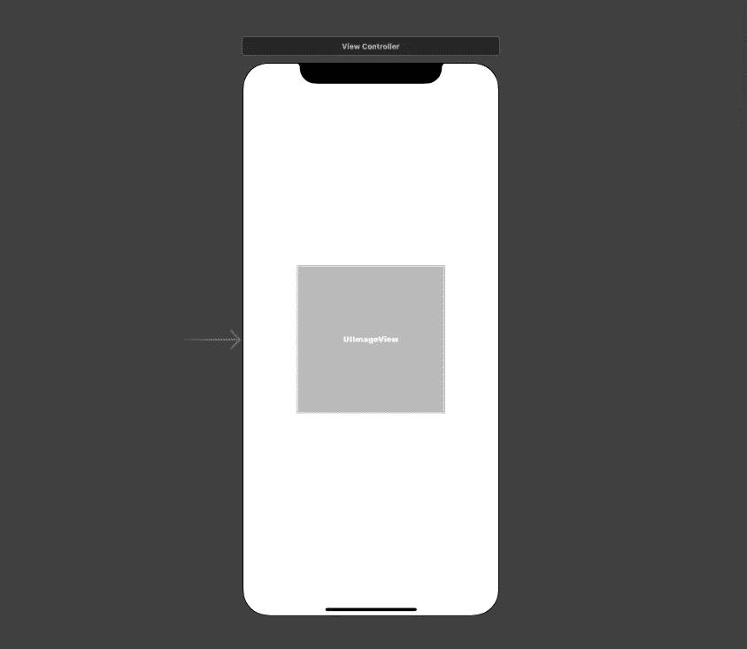
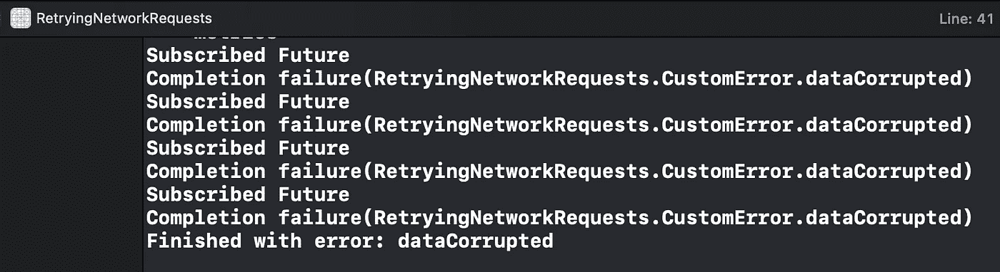
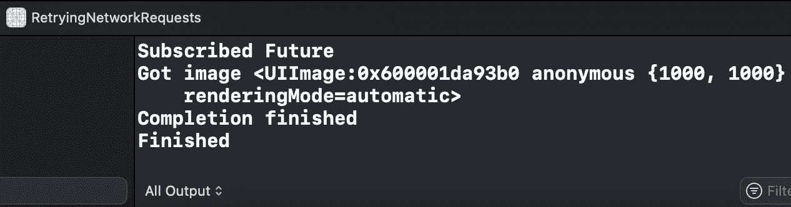
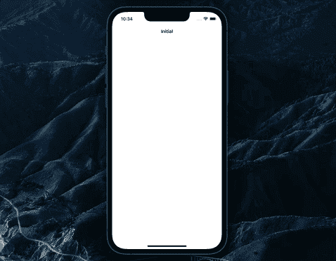

# 如何使用 Swift 的 Combine 重试网络请求

> 原文：<https://betterprogramming.pub/how-to-retry-network-requests-using-swifts-combine-5ac3f093adc5>

## 用简单的方法解决复杂的任务

由 [Mohamed Kerroudj](https://unsplash.com/@mok4?utm_source=medium&utm_medium=referral) 在 [Unsplash](https://unsplash.com?utm_source=medium&utm_medium=referral) 上拍摄的照片

在本文中，我们将探讨如何利用 Combine 来促进网络请求的重试。我们将通过使用一个强大的`.retry(_:)`操作符来做到这一点。

简而言之，完成教程后，您将会知道:

*   如何使用`.retry(_:)`运算符？
*   如何安排每次请求失败后的延迟时间？
*   如何根据网络运行的状态和结果设计一个样本`UIViewController`。

完成的项目的源代码可以在文章的底部找到。

# 我们开始吧

我们从一个简单的项目开始，在屏幕中央显示一个`UIImageView`:

`ViewController`的代码也很简单:

基本结构完成后，让我们创建一个自定义的`Error` enum 来表示错误，并创建一个`cancellables`属性来存储我们的订阅:

现在我们可以开始创建网络请求了。让我们按如下方式调整文件:

1.  `url`为我们提供了一个随机的图像。
2.  `Future`产生单个事件，然后结束或失败。然而，我们希望能够重试请求，因此我们将`Future`包装在`Deferred`发布器中。
3.  如果我们不能从响应中提取出`Data`和`UIImage`，我们就发送一个`.failure(CustomError.dataCorrupted)`事件。
4.  如果我们成功地获得了一个`UIImage`，则发送一个`.success(image)`事件。

我们在`ViewController`的`viewDidLoad()`方法中调用实现的方法:

在这里，我们实现了以下目标:

1.  监控并打印`.handleEvents`操作器内部发生的事件。
2.  通过使用`.receive(on:)`操作符，发出我们想要在主线程上获得操作结果的信号。
3.  一旦整个序列终止，在控制台中打印一条消息。这将在所有重试尝试之后，或者在成功的映像加载任务之后发生。
4.  一旦获得图像，在`UIImageView`中显示。

到目前为止看起来不错，但是如果我们的请求失败了呢？让我们通过在`.handleEvents`和`.receive`之间添加`.retry(_:)`操作符来实现重试功能:

这里我们说，如果出现错误，我们最多可以重试请求三次。让我们故意修改`getAvatarFromTheServer()`方法中的`URL`，使其失败:

现在，如果我们运行应用程序，我们将看到四次加载映像的尝试(因为重试计数参数会添加到初始尝试中):

又完成了一项任务，现在让我们看看是否可以优化操作。目前，重试尝试在失败后立即开始，而理想情况下，我们希望在后续尝试之间有一个小的延迟。这就是`.delay`来拯救我们的地方。让我们将它添加到`.handleEvents`和`.retry`操作符之间:

在这里，我们指定要将每次重试延迟 1 秒。如果操作由于互联网连接缓慢而失败，这种延迟给用户更多的机会来恢复连接并获得最终结果，即图像。

现在，我们可以将损坏的 URL 恢复到正确的状态，并再次运行应用程序:

正如我们所看到的，映像是按需加载的，没有发生重试下载的尝试。现在我们的目标是在我们的 UI 中反映图像加载任务的状态。为了简单起见，我们将状态绑定到`ViewController`的`UINavigationItem`的标题上。

首先，我们将下面的`State`枚举添加到文件中，并用`.initial` case 初始化`Published`属性:

接下来，我们在图像加载任务中相应地设置`state`。注意，我们将绑定过程移到了一个名为`bindAvatarToImageView()`的方法中:

1.  在`.handleEvents(receiveSubscription:)`闭包内部，我们将`state`设置为`.loading`。
2.  当镜像加载任务出错完成时(如果需要，可以重试)，在`.sink(receiveCompletion:)`闭包内，我们将状态设置为`.loadingFailed`。类似地，在`.sink(receiveValue:)`闭合内，`state`被设置为`.loadedSuccessfully`。

现在我们可以将`state`属性绑定到`UINavigationItem`标题。让我们加上一个`bindStateToTitle()`方法:

1.  我们在主线程上接收`state`更新。
2.  从获得的`state`中获得一个`String`值，因为`state`属性是一个`enum`。
3.  给`UINavigationItem`的标题赋值。

太好了！既然我们已经完成了逻辑，让我们在`viewDidLoad()`方法内部调用它:

1.  我们通过启动`bindStateToTitle()`方法来订阅状态更新。
2.  运行`viewDidLoad()`2 秒后启动图像加载和绑定方法，因为我们想先看到导航项目中显示的“初始”标题。

现在，考虑到任务成功，用户将会看到:

我们已经成功地实现了网络请求的重试功能，并将状态绑定到 UI。

如果上面的逻辑不够，并且您希望提供一个占位符图像，以防所有网络请求失败，该怎么办？联合收割机再次为您提供保障！我们使用`.replaceError`操作符来实现这一点。我们将它添加在`.retry`和`.receive`运算符之间:

这是结果:

请注意，现在`state`将不再得到`.loadingFailed`案例，因为操作总是成功得到一个图像。

# 资源

源代码可在 [GitHub](https://github.com/zafarivaev/combine-retry-network-requests) 上获得。

# 包扎

我们已经看到通过利用 Combine 来实现一个不那么简单的逻辑是多么容易。要了解更多关于联合收割机操作员的信息，请访问官方文档。希望这篇教程对你有用，感谢阅读！