# 如何检查 iOS 应用程序

> 原文：<https://betterprogramming.pub/how-to-reverse-engineer-an-ios-app-313a95950aff>

## 使用 Xcode 的调试器

照片由 [Bram Naus](https://unsplash.com/@bramnaus?utm_source=medium&utm_medium=referral) 在 [Unsplash](https://unsplash.com?utm_source=medium&utm_medium=referral) 上拍摄

在本文中，我们将学习如何使用 Xcode 的调试器对 iOS 应用程序进行逆向工程。我们将通过探索苹果的地图应用程序是如何构建的来做到这一点。简而言之，在本教程结束时，您将会知道:

*   如何调试视图层次结构以捕获当前 UI 状态并获取布局信息。
*   如何调试内存图以获得对象层次结构，以及如何实现特定的 API。

事不宜迟，我们开始吧。

# 我们开始吧

在我们开始调试应用程序之前，我们需要禁用计算机的[系统完整性保护](https://developer.apple.com/documentation/security/disabling_and_enabling_system_integrity_protection)。简而言之，这个设置默认为*启用*，防止我们在 Xcode 中调试任何 iOS 应用，除了我们自己的。

1.  在恢复模式下重启 Mac:在 Mac 开机后，立即按下 Command(⌘) + R。当 Apple 标志出现在屏幕上时，松开这些键。
2.  然后，找到“实用程序”并打开终端。
3.  类型`csrutil disable; reboot`。这将禁用系统完整性保护并重新启动计算机。

最后，我们准备开始用 Xcode 对一个样例应用程序 Apple Maps 进行逆向工程。

注意:完成教程后，不要忘记再次以恢复模式重启 Mac，并在终端中运行`csrutil enable; reboot`。这将再次启用系统完整性保护并重新启动计算机。

首先，启动 Xcode，创建一个新项目或打开您现有的项目:

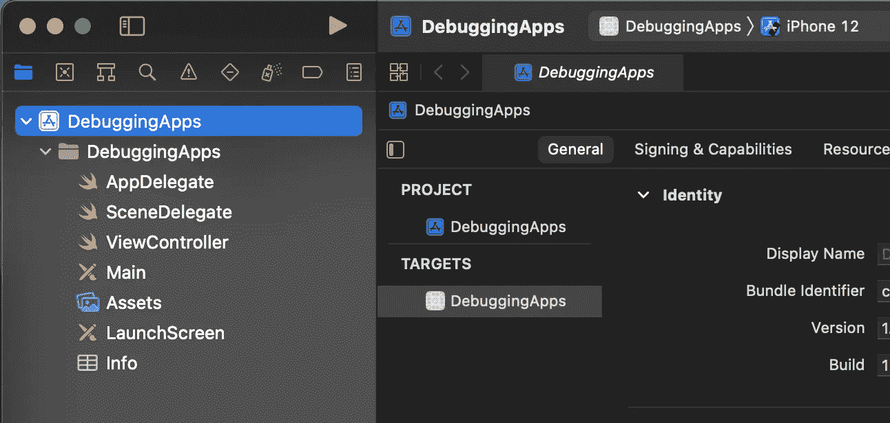

在 Xcode Simulator 或您的设备上，打开苹果地图应用程序:

接下来，转到“调试”选项卡并选择`Attach to Process by PID or Name`:

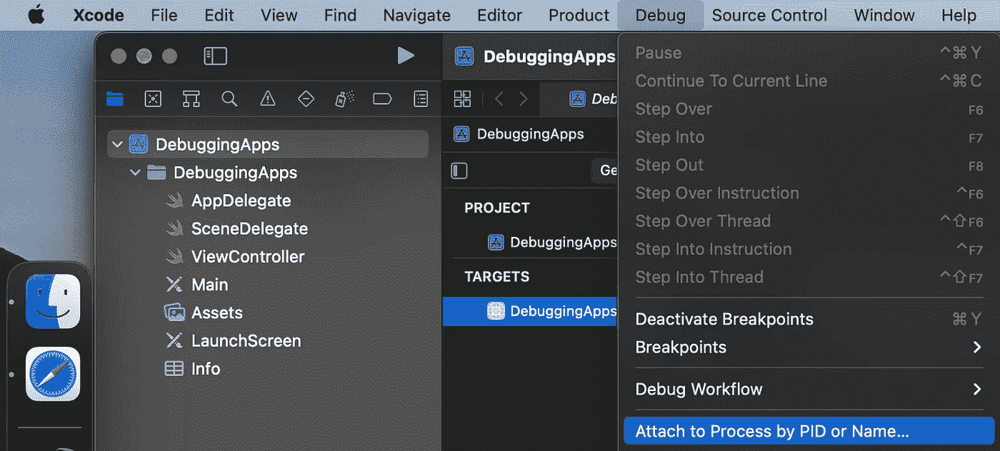

现在，我们可以搜索“地图”流程，然后按“附加”:

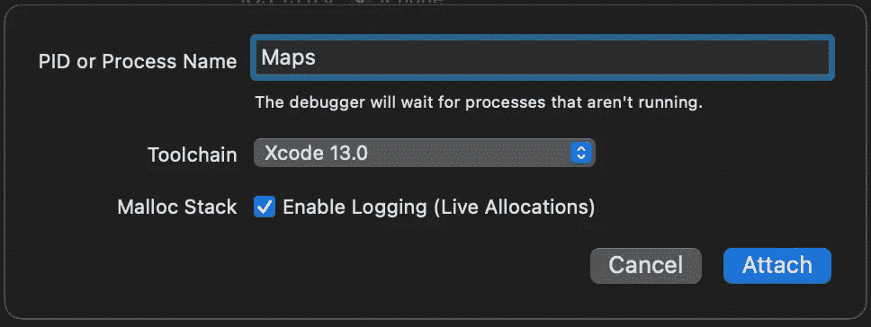

一段时间后，进度将从“连接到地图…”变为“运行地图…”。这意味着调试器已成功连接到应用程序。现在让我们看看我们能做些什么。

# 调试视图层次结构

打开地图并连接调试器后，点击`Debug View Hierarchy`按钮显示用户界面:

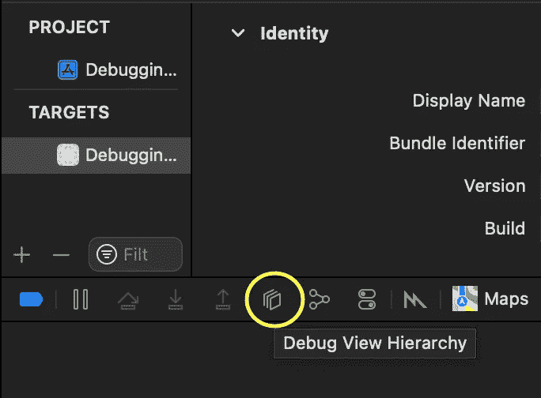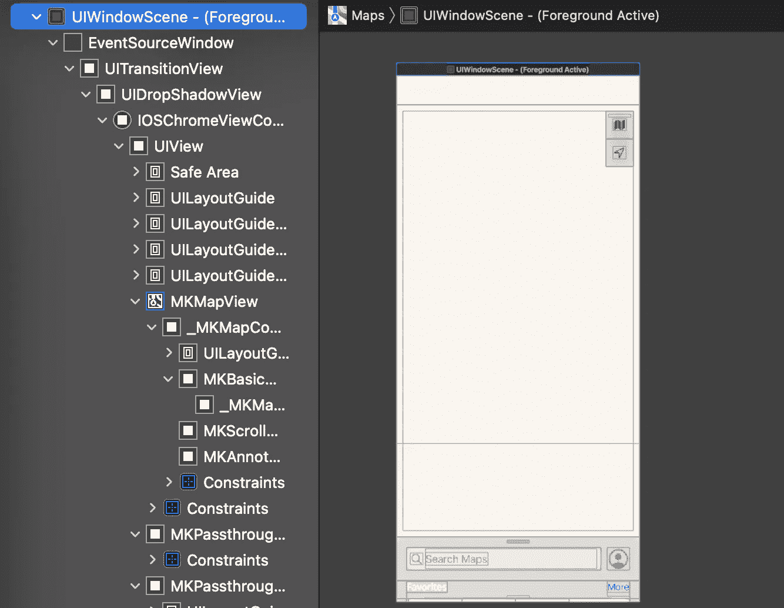

我们很想知道底层是如何构建的，以及 UI 和行为是如何实现的:

让我们揭示 UI 层次结构并展开一些视图:

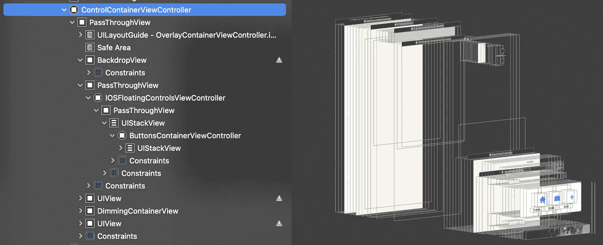

这里我们可以看到苹果使用[容器和子视图控制器](/how-to-create-an-interactive-bottom-sheet-in-swift-5-adadaad79e72)将一个屏幕分成更小的、可重复使用的部分。

此外，我们可以检测自动布局警告，就像我们自己的任何应用程序一样:

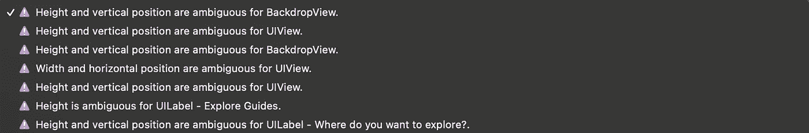

最重要的是，当您加入一个项目并需要在代码库中找到所需的类时，查看每个视图控制器或视图的名称非常有用:

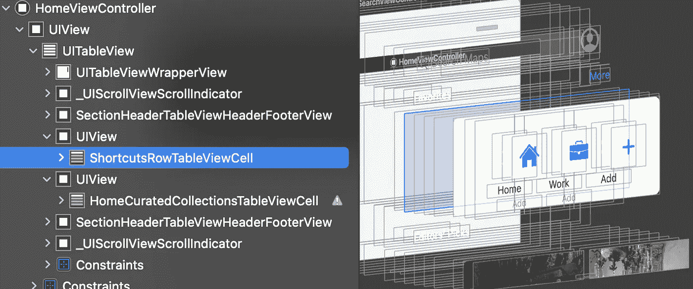

现在让我们看看使用什么 API 来创建前面提到的底部表单行为。我们将通过检查内存图来做到这一点。

# 调试内存图

首先，点击`Debug Memory Graph`按钮:

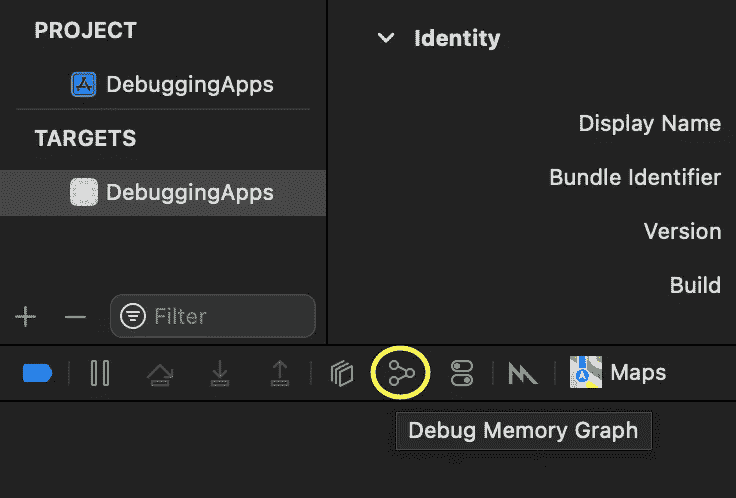

这让我们可以看到当前活着的物体:

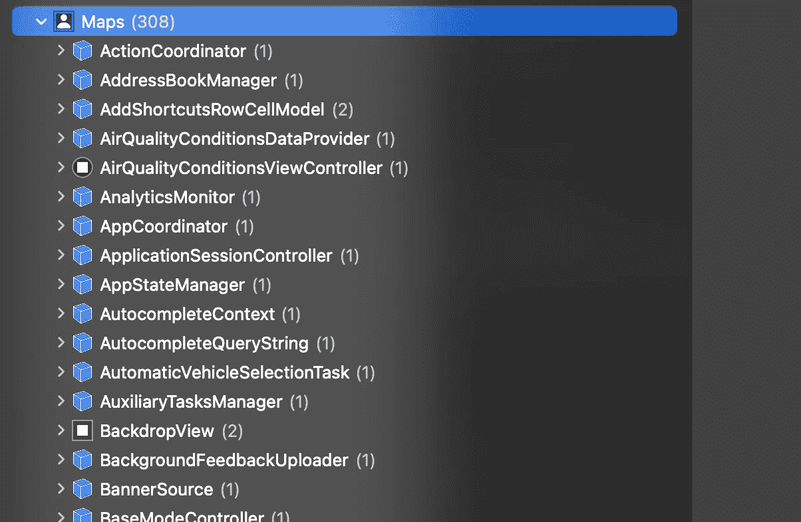

从视图层次结构中，我们发现底部的工作表视图控制器叫做`SearchViewController`。让我们在调试导航器中搜索它:

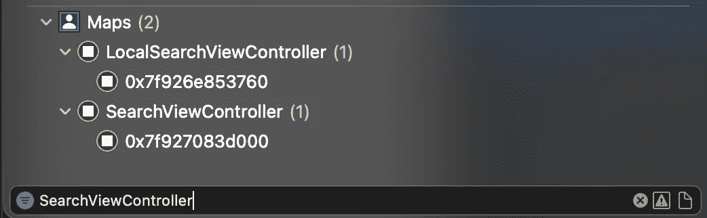

点击之后，我们可以看到右边的依赖关系图:

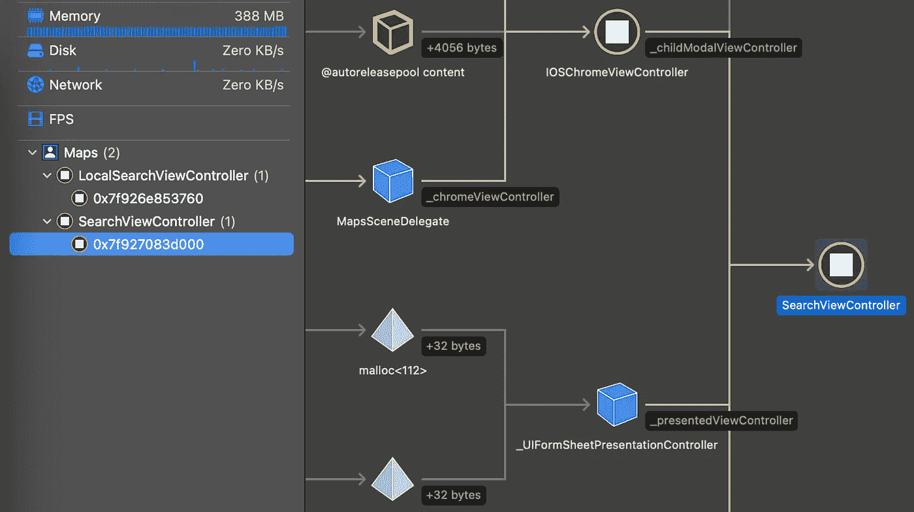

这让我们知道有一个名为`UIFormSheetPresentationController`的类负责底层表单的表示。通过点击它并显示一个`Memory inspector`，我们可以看到详细的层次结构:

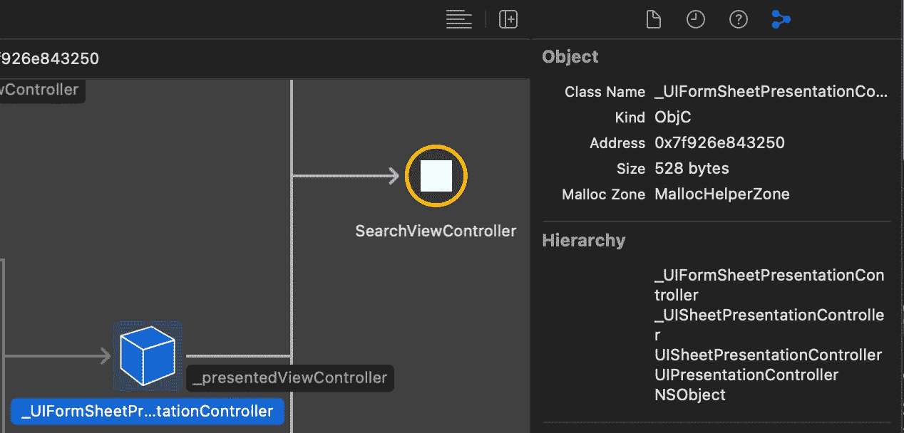

正如我们所看到的，负责底部工作表的对象被称为[UISheetPresentationController](https://developer.apple.com/documentation/uikit/uisheetpresentationcontroller)。这是从 iOS 15.0 和 Swift 5.5 开始增加的 API。通过检查文档，我们发现它使用了`detents`数组来管理底部工作表的大小配置:

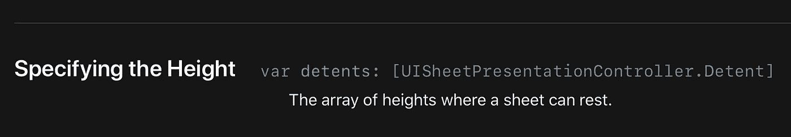

我们还了解到，目前我们只有两种可能的缓和手段，`.large()`和`.medium()`:

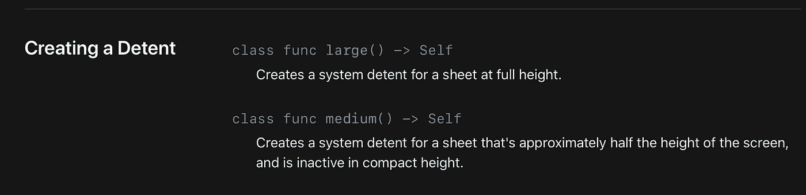

然而，Apple Maps 允许在不同于`.medium`和`.large`的位置放置底部纸张。我们可以看到它可以停留在一个小得多的高度:

这怎么可能呢？让我们找出答案。通过在调试导航器中搜索“Detent”关键字，我们找到了`detents`数组:

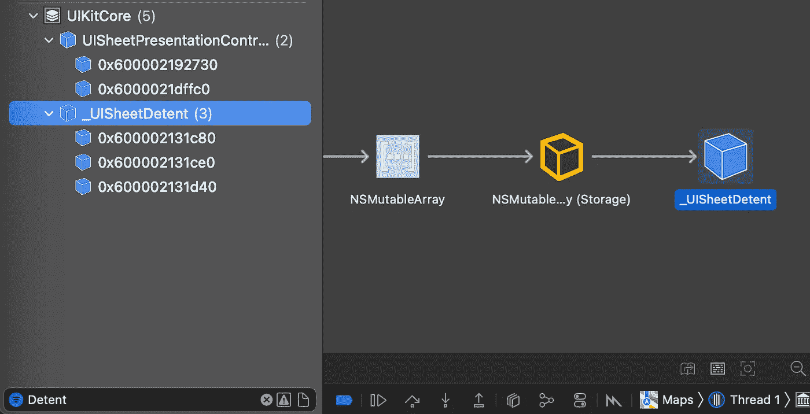

让我们按如下方式打印阵列的描述:

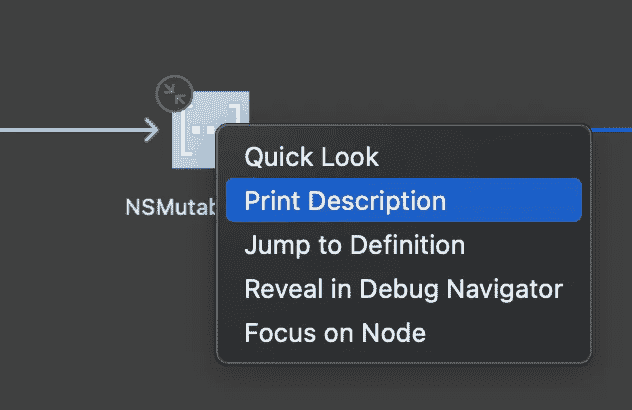

我们可以看到苹果使用了三种`.custom`缓和手段:

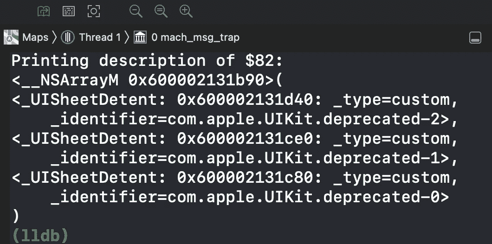

这让我们知道`UISheetPresentationController`的一部分是私有的，开发者还不能使用。然而，希望 API 将很快更新，以允许创建自定义制动器。

我们已经看到了如何使用视图层次结构获取 UI 信息，以及如何使用内存图扩展对象关系。此外，您可以在任何应用程序上使用`Instruments`来监控网络请求、捕捉内存泄漏等等:

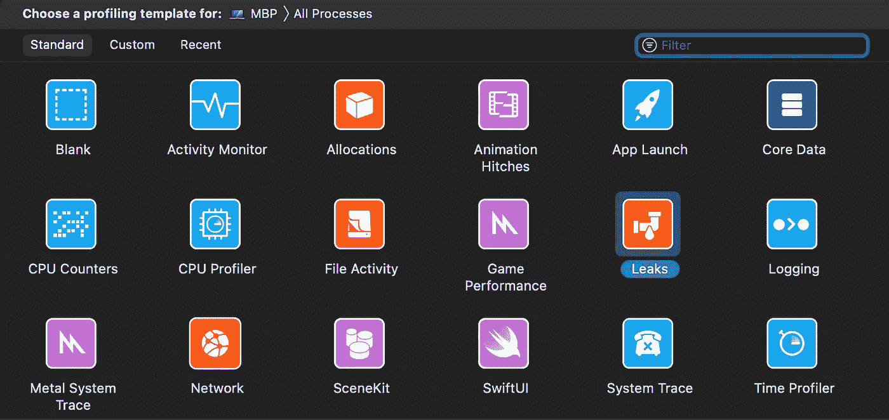

# 包扎

想了解更多关于 iOS 15 中底部表单创建的信息吗？查看我关于[UISheetPresentationController](/how-to-present-customizable-bottom-sheets-in-ios-15-e98e530208b2)的文章。感谢阅读！