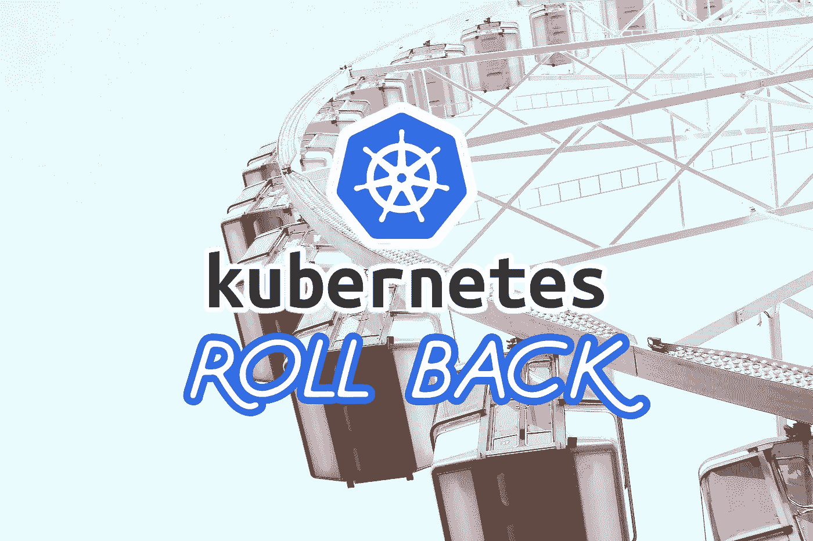

# 如何使用 Kubectl 回滚(撤销)Kubernetes 中的部署

> 原文：<https://betterprogramming.pub/how-to-roll-back-undo-a-deployment-in-kubernetes-with-kubectl-cc20b485adda>

## 有时候有一个 bug，你需要回溯你的代码来修复产品



[Nastya Dulhiier](https://unsplash.com/@dulgier) 在 [Unsplash](https://unsplash.com/photos/fpYbxXvsTb0) 上的原始照片。特里梅因·埃托的文字。

我们都经历过。

也许我们添加了一个不应该添加的环境变量，或者我们用一个不工作的新映像做了一个新的部署。

然而，在库伯内特，这不仅没问题，而且很正常。意料之中，甚至。有一种快速的方法可以修复您在修订中出现的任何问题，而不必重新开始或完全进行新的部署。

它被称为`rollout undo`命令。

# 命令

这个命令很简单，但不太直观。

首先，虽然人们常说我们希望*回滚*部署，但是我们实际上使用了命令`rollout`和`kubectl`。

其次，仅仅在那个点上`rollout`是不够的。相反，我们必须添加一个*子命令*，因此我们还必须键入`undo`。

最后，不要忘记关键字`deploy`(您将得到下面的响应:`Error from server (NotFound): deployments.apps “my-deployment-name” not found`)或`-n <namespace>`标志(如果您忘记了那个，您将得到`error: the server doesn’t have a resource type “my-deployment-name”`)。

## 这是干什么的

这将采用我们的部署，在这个例子中是`my-deployment-name`，然后在它的位置部署它先前的修订。没错:它直接获取当前部署版本之前的版本，并重新部署它。

假设我们正在修订这个部署的`55`。`kubectl`将部署以前的部署版本(`54`)。

输出将如下所示:

```
deployment.apps/my-deployment-name rolled back
```

## 等等，我不止一次想回滚！

让我们再举一个我们正在复习`55`的例子。

原来你真的把事情搞得一团糟，应用了一些更改，做了一些部署，然后才意识到你实际上想一直回到修订版`50`，你*知道*正在工作。没什么大不了的，对吧？

现在我们的工具箱中已经有了`rollout undo`命令，我们只需运行五次(因为`55`减去`50`就是五)就可以回到我们想要的版本！

但令人惊讶的是…那是错的！我们不在工作修订版`50`。

## 发生了什么事？

基本上，即使是一个`rollout undo`也会创建一个新的版本。Kubernetes 称这个命令的每次调用为`Rollback Event`。因此，当您回滚并再次回滚时，您实际上只是回到了原始状态。

把回滚想象成后退一步回到前一步的地方。当你再次回滚*时，你逆转了刚刚所做的，这意味着你向前迈了一步。最终结果是，您又回到了原来的位置。如果你一直这样做，你只会来回振荡。*

*我知道这令人困惑，所以让我们回到我们正在修订`55`的例子。如果我们只回滚一次，那么我们就有效地恢复了版本`54`，但是它实际上创建了一个*新的*版本:`56`。*

*在列表中，`54`消失。Kubernetes 基本上是说我们回滚到它，它现在用`56`来表示。*

```
*deployment.apps/my-deployment-name 
REVISION CHANGE-CAUSE
1 <none>
2 <none>
3 <none>
4 <none>
5 <none>
...
51 <none>
52 <none>
53 <none>
55 <none>
56 <none>*
```

*如果我们再次回滚*，我们将恢复版本`55`(本例中的原始版本)并创建一个新版本:`57`。就像我们上次运行命令一样，列表中的`55`消失了。替换为`57`。实际上，`55`和`57`的部署是相同的，但是根据 Kubernetes，它们是不同的版本。**

**如果我们继续这样做，我们将只是在部署的实际变化之间来回切换。**

## **那么，我如何回到一个以上的修订？**

**如果您知道修订号，则可以在命令中使用标志来指定它，如下例所示:**

## **我怎么知道有多少修订版？**

**别担心。有一种方法可以通过使用`rollout`下不同的子命令来解决这个问题:**

**这将输出基本上所有可用的修订号以及变更原因，如果它曾经在部署中设置过的话。**

# **结论**

**我希望这篇文章是回滚或撤销部署修订的好入门。**

**现在，我建议您在一个虚拟部署上进行尝试，您可以对其进行更改或重新部署以获得真实的感受。这样，您可以放心地回滚。**

**[](https://tremaineeto.medium.com/membership) [## 通过我的推荐链接加入媒体

### 作为一个媒体会员，你的会员费的一部分会给你阅读的作家，你可以完全接触到每一个故事…

tremaineeto.medium.com](https://tremaineeto.medium.com/membership)**