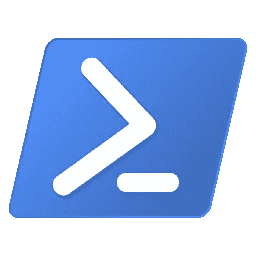

# 如何在终端和 PowerShell 中多次运行命令

> 原文：<https://betterprogramming.pub/how-to-run-a-command-multiple-times-in-terminal-and-powershell-5af76df8d123>

## 测试或改变输入时，节省自己的时间和精力


由[阿吉特](https://unsplash.com/@arget?utm_source=medium&utm_medium=referral)在 [Unsplash](https://unsplash.com?utm_source=medium&utm_medium=referral) 拍摄的照片

如果您使用的是 MacOS 或基于 Linux 的 OS，您可以访问一个强大的终端(使用 Bash 或 Z-Shell)。在 Windows 上，您可以使用 Windows PowerShell 作为等价物。如果你知道如何使用它们，这两者都非常强大。想想那些让开发人员的生活更轻松的伟大 CLI(例如 [Angular CLI](https://cli.angular.io/) )。

有时你想多次重复某个代码。在我的例子中，我想多次运行同一个脚本来验证它是否可靠地工作。在大多数编程语言中，比如 JavaScript、C#或 Java，你通常会为或[创建一个](https://en.wikipedia.org/wiki/While_loop)[而](https://en.wikipedia.org/wiki/For_loop)循环来完成这个任务。

在这篇文章中，我想向您展示如何在 Bash 和 Windows PowerShell 中做到这一点。让我们来看一些使用案例:

*   如果您想要修复[不稳定的测试](https://docs.gitlab.com/ee/development/testing_guide/flaky_tests.html)，您需要连续多次运行您的测试以确保测试可靠地工作
*   使用不同的输入多次运行命令
*   减少重新运行相同命令的手动工作


# 如何在 Bash 中多次运行一个命令

1.  将语句`for i in {1..n}; do *someCommand*; done`换行，其中 *n* 为正数， *someCommand* 为任意命令。
2.  要访问这个变量(我使用 *i* 但是你可以用不同的名字命名它)，你需要像这样包装它:`${*i*}`。
3.  按 Enter 键执行语句。

```
*# Print all the numbers from 1 to 100*
for i in {1..100}; do echo ${i}; done*# Run the "e2e-tests" script 5 times to verify tests work reliably*
for i in {1..5}; do npm run e2e-tests; done*# Run the "deploy-app-1/2/3/..." scripts to deploy the app to different servers* for i in {1..10}; do npm run deploy-app-${i}; done
```

[我在 GitHub 上发布了一个有用的 Bash 函数和其他开发工具。](https://github.com/ali-kamalizade/scripts#execute-a-command-multiple-times)



## 如何在 Windows PowerShell 中多次运行命令

1.  将您的语句放在`for ($i=1; $i -le n; $i++) { *someCommand*}`的花括号内，其中 *n* 是一个正数，而 *someCommand* 是任意命令。
2.  要访问这个变量(我使用 *i* 但是你可以用不同的名字命名它)，你需要这样包装它:`$i`。
3.  按回车键执行语句。

```
*# Print all the numbers from 1 to 10*
for ($i=1; $i -le 10; $i++) {echo $i}
```

# 结论

谢谢你阅读这篇短文。正如您所看到的，在 Bash 和 PowerShell 中连续多次运行一个命令是很容易的。让我知道你在评论中的想法。