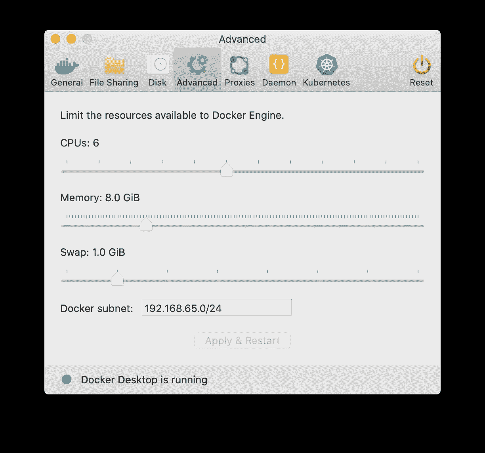
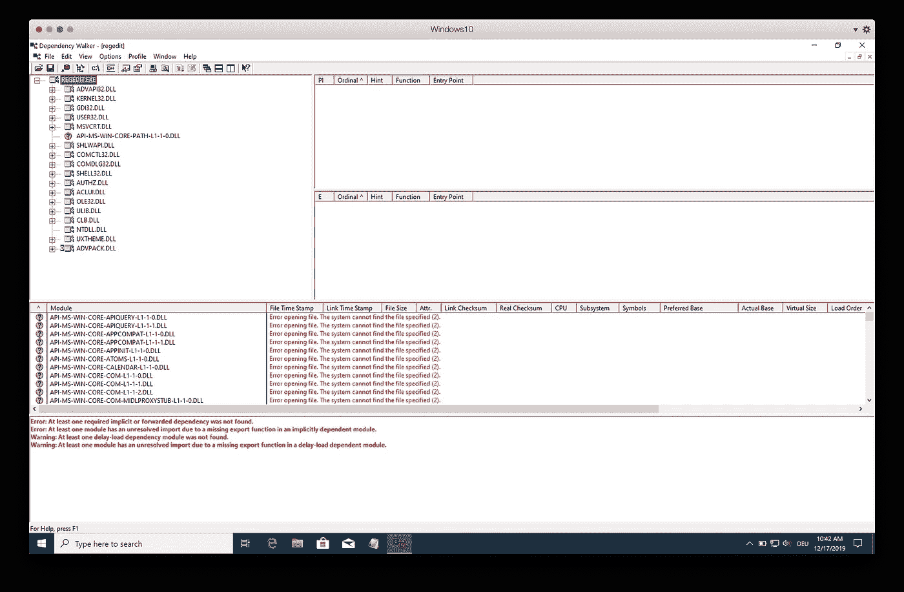
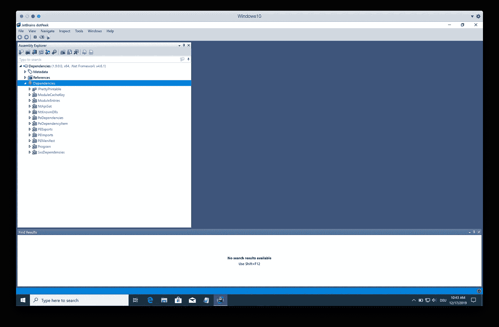
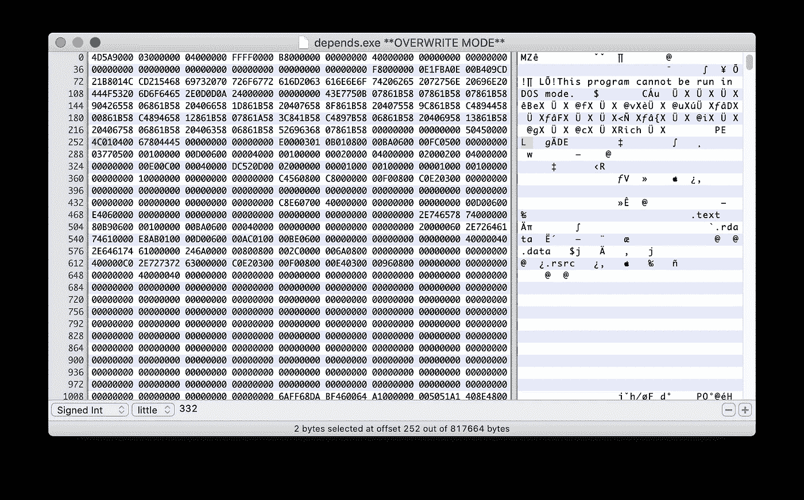
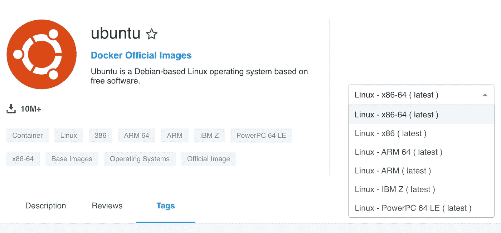
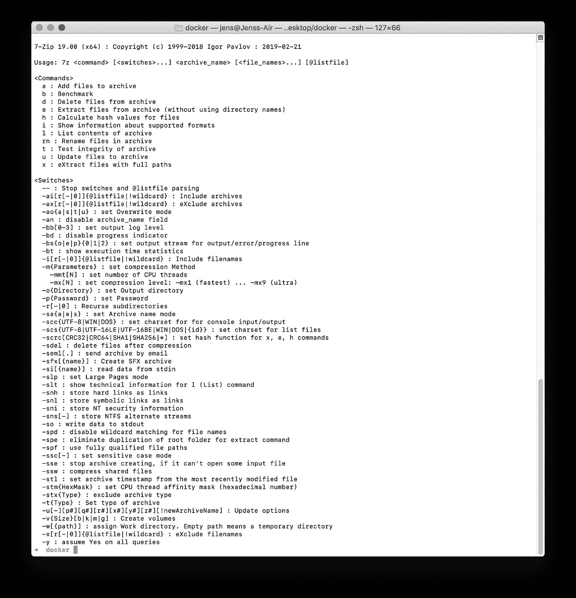
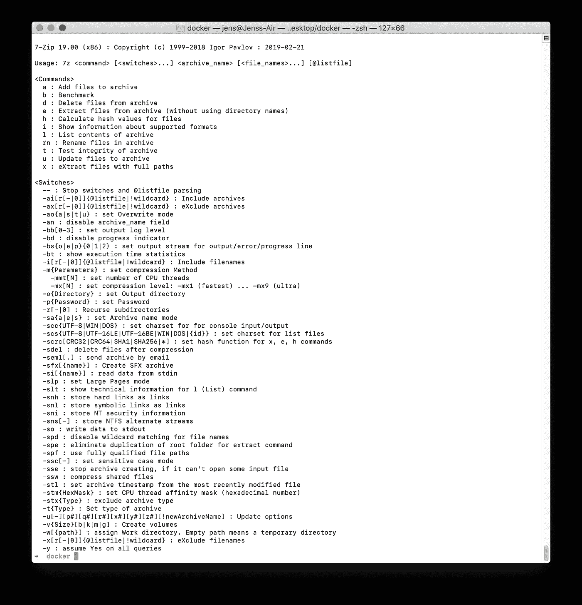

# 如何在 Linux Docker 容器中运行任何 Windows CLI 应用程序

> 原文：<https://betterprogramming.pub/how-to-run-any-windows-cli-app-in-a-linux-docker-container-318cd49bdd25>

## 权威指南

## 使用 Wine、Mono 和 Docker 在云中运行您的传统 Windows 应用程序

由[延斯·梅德](https://www.eyeem.com/u/jensmeder)在 [EyeEm](https://www.eyeem.com/p/150912787)

我已经为此奋斗了很长时间。几天。夜晚。周末。我们有几个 Windows 遗留应用程序需要在我们的 [Kubernetes](https://kubernetes.io/) 集群上运行——无需访问源代码或原始开发人员。

更糟糕的是:

*   所有二进制文件都是 32 位的(x86)。
*   有些需要 visual [C++](http://www.cplusplus.com/) 可再发行的运行时组件。
*   有些需要。NET 运行时。
*   有些需要窗口系统，即使我们只使用命令行界面(CLI)。

最初，我认为我可以对应用程序进行逆向工程，并在 [Kotlin](https://kotlinlang.org/) 中实现功能。我提取出了。NET 源代码借助 [JetBrains dotPeek](https://www.jetbrains.com/decompiler/) 。

不幸的是，这是不够的，因为一些应用程序使用额外的 dll——为本机 Windows 和 visual C++可再发行执行编译。您可能知道，从这样的二进制文件中提取代码几乎是不可能的。

这种认识给我留下了唯一的选择:尝试在 Linux 的 Docker 容器中运行带有 Wine 的应用程序。

# 对你有什么好处？

弄清楚在 Docker 容器中运行我们的应用程序的所有必要步骤花了我相当多的时间。希望通过分享自己一路走来的所学，可以省去你的麻烦。

在这篇文章中，我教你:

*   确定应用的运行时依赖项，包括。NET 和 Visual C++。
*   在 Docker 容器中设置葡萄酒。
*   在同一容器中运行 x86 和 x64 Windows 应用程序。
*   使用虚拟帧缓冲区运行您的应用程序。

# 先决条件

## 码头工人

如果你在 Linux 上运行，你可以通过你平台的软件包管理器安装 [Docker](https://www.docker.com) ，比如在 Ubuntu 上，你可以运行`sudo apt install -y docker.io`。

对于 macOS 和 Windows，你需要有一个 [Docker Hub](https://hub.docker.com) 账号才能下载 Docker Desktop。Docker Desktop 使用运行在 [VirtualBox](https://www.virtualbox.org/) 中的虚拟机来创建和运行你的容器。

因此，您可能需要调整虚拟机的资源约束，以适应应用程序的需求。

例如，如果您的 Windows 应用程序需要至少 8GB 的内存，您需要相应地调整 Docker 桌面配置。否则，Windows 应用程序的执行可能会失败，并出现一个模糊的异常。

macOS 上的 Docker 桌面配置

## 文字编辑器

请确保您手头有一个允许您创建纯文本文档的编辑器。我们需要它来写我们的文档。

任何集成开发环境(IDE)，比如 [JetBrains IntelliJ IDEA](https://www.jetbrains.com/idea/) ，都是优秀的。否则，我建议您安装[微软 Visual Studio 代码](https://code.visualstudio.com/)或 [Atom](https://atom.io) 。

## Windows 应用程序

如果你的应用程序有一个专用的安装程序，你应该准备好了。比起定制解决方案，我更喜欢 MSI 安装程序，因为我们可以使用`msiexec`安装`.msi`文件，而无需用户交互。

如果没有安装程序，您需要确保能够访问所需的依赖项，例如静态和动态链接库。如果您不确定依赖项，我将在下一步向您展示如何确定它们。

# 第一步。确定运行时要求

## 属国

如果您自己构建了 Windows 应用程序，您应该非常清楚所需的依赖项，例如。NET 或第三方 dll。

否则，您必须依靠工具来为您确定依赖关系。使用以下工具来识别*所有*EXE 和 DLL 文件所需的依赖关系。

免费软件 [Dependency Walker](http://www.dependencywalker.com) 扫描 32 位和 64 位二进制文件(如应用程序或 dll)的外部依赖性，并将结果作为分层树列出。

有了这些信息，您就可以确定需要安装的 dll 和包。请注意，这只适用于非托管代码(不需要。NET 运行时)。

依赖行者

如果你的应用需要。NET 中，你必须使用能够遍历和显示托管程序集的依赖树的工具，例如 JetBrains 的免费软件[dotPeek](https://www.jetbrains.com/decompiler/)。

你甚至可以使用`Assembly.GetReferencedAssemblies` API 自己编写一个工具。

JetBrains dotPeek

在您确定了所有的依赖 dll 之后，您必须弄清楚从哪里获得它们。

Microsoft DLLs 是最容易获得的，因为它们附带了诸如。NET 或 Visual C++可再发行版本。在谷歌上快速搜索该 DLL 的名称，会告诉你需要安装的微软软件包。

## 机器类型/CPU

Wine 只运行与 Docker 基本映像兼容的机器类型的可执行文件。

例如，您不能在 64 位 ARM Docker 容器中运行 64 位 Intel/AMD 可执行文件(例如，在 Raspberry PI 上)。如果你在 Intel 或者 AMD 平台上运行 Docker，你只需要担心两种类型:32 位应用的 x86 (i386)和 64 位应用的 x86/x64 (amd64)。

您可以使用下面的 [REPL](https://repl.it/repls/RevolvingFoolhardyQuarks) 来确定您的可执行文件的机器类型。只需执行 REPL，选择你的 EXE 或 DLL，工具会告诉你机器的类型。

REPL 来识别机器类型的 EXE 或 DLL 文件

或者，您可以通过查看所谓的 COFF 文件头来确定机器类型。

为此，你需要一个十六进制编辑器，比如 macOS 上的 [iHex](https://apps.apple.com/us/app/ihex-hex-editor/id909566003?mt=12) 。用十六进制编辑器打开你的 EXE 或 DLL，看看文件的开头。您会注意到每个 EXE 文件都以一个标准化的头开始:

*   MS-DOS 存根(写着:*这个程序不能在 DOS 模式下运行*的部分)。
*   值为 *PE\0\0 的 PE 签名。*
*   COFF 文件头。

COFF 文件头的前两个字节决定了体系结构(或机器类型)。让我们看一个例子。这是我们用 iHex 打开 Dependency Walker 可执行文件时得到的结果:

iHex 中的依赖遍历器

看看“PE”(`50 45 00 00`)签名后的两个字节:`4C 01`。

由于字节序的原因，它们的顺序相反，所以实际值是`01 4C`。根据 [PE 格式规范](https://docs.microsoft.com/en-gb/windows/win32/debug/pe-format?redirectedfrom=MSDN#machine-types)，我们正在寻找一个 32 位的 i386 架构。

# 第二步。选择 Docker 基本图像

现在我们知道了应用程序的运行时需求，我们可以选择一个合适的 Docker 基础映像。

## 分配

一般来说，您可以使用任何 Docker 基础映像，只要它支持 Wine。

我使用 [Ubuntu](https://hub.docker.com/_/ubuntu/) 进行设置，但是如果你喜欢其他发行版，也没关系。只要确保你的发行版有体面的社区支持。否则，你会花很多时间自己去琢磨葡萄酒的古怪之处。

一个警告，如果你选择使用[阿尔卑斯山](https://hub.docker.com/_/alpine)图像:当运行需要 Visual C++可再发行版的 Windows 应用程序时，我偶然发现了这些图像的一个问题。

我已经尝试了几种安装包的方法，但是安装总是失败——无论我尝试了哪个版本。我假设 Alpine 图像缺乏对特定本地库的支持。

即使运行带有详细输出的 Visual C++可再发行安装也不会提供任何有用的调试信息。

## 体系结构

您必须确保您的 Docker 基础映像支持第一步中的机器类型。

如果你选择一个主流的 Docker 基础映像，比如 Ubuntu，这不是问题。如果您不确定，可以通过 Docker Hub 检查 Docker 映像支持的架构。

Docker Hub 上的 Ubuntu 图片

如果你只有 32 位的应用，你也可以选择一个 32 位的基础映像，比如`[i386/ubuntu](https://hub.docker.com/r/i386/ubuntu)`。

这减小了 Docker 映像的大小，因为您只安装了您需要的架构。您可以在 Docker Hub 上的 [i386 用户配置文件](https://hub.docker.com/r/i386/)中找到一些 x86 映像。

# 第三步。装酒

[Wine](https://www.winehq.org/) 即时翻译 Windows API 调用，而不是模拟 Windows 环境。它允许您在 Linux 上运行几乎任何 Windows 应用程序，而无需虚拟化整个 Windows 环境。

## 装置

[Wine](https://www.winehq.org) 为各种 Unix 操作系统提供最新版本的二进制包，包括 macOS、Ubuntu 或 Android。您可以从 [Wine 下载页面](https://wiki.winehq.org/Download)下载它们以及安装说明。

或者，您可以通过平台的软件包管理器安装 Wine。

不幸的是，每个发行版的包名都不一样，所以您必须自己找出包名。请注意软件包管理器的版本可能很旧。

默认情况下，Wine 会记录很多警告，例如，针对缺失 API 的`fixme`警告。您可以通过环境变量`WINEDEBUG`禁用特定的警告。要关闭所有的`fixme`警告，只需将`ENV WINEDEBUG=fixme-all`添加到您的 docker 文件中。

请注意:当您在 64 位 Docker 映像上安装 Wine 时，它只安装 64 位 Wine 包和依赖项。这意味着您必须单独安装 32 位库。实现这一点最简单的方法是将 32 位架构添加到包管理器中。

## 设置葡萄酒前缀

如果你只有一个应用或者一组同类应用，你可以使用一个共享的 Wine 前缀，比如默认前缀`~/.wine`。对于更复杂的场景，例如在同一个容器中运行 x86 和 x64 应用程序，您需要设置 Wine 前缀来分隔配置。

前缀很容易设置:

1.  在 Docker 容器中选择一个目录，但要确保该目录本身不存在。
2.  确定前缀所需的体系结构。
3.  通过`WINEARCH=<architecture> WINEPREFIX=<directory> winecfg`创建前缀，例如`WINEARCH=win32 WINEPREFIX=~/myX86Prefix winecfg`。

安装 WineHQ 并设置 Wine 前缀的 Dockerfile 文件

请注意:如果您在 64 位平台上运行 Wine，默认情况下 Wine 会将架构设置为 64 位。要创建 32 位前缀，必须在创建 Wine 前缀之前设置`WINEARCH=win32`环境变量。

## 安装葡萄酒戏法

[Winetricks](https://github.com/Winetricks/winetricks) 为 Wine 中的常见问题提供解决方案，例如，它修补和调整了微软官方的安装。NET framework 自动运行。

我推荐从[官方 GitHub 库](https://github.com/Winetricks/winetricks)安装最新版本。这样，您就可以访问最新的软件包、补丁和解决方法。

或者，您可以通过平台的软件包管理器安装 Winetricks。请注意软件包管理器的版本可能很旧。

安装 Winetricks 的 Dockerfile 文件

# 第四步。安装 X11 窗口服务器

如果您的应用程序在从 CLI 调用它时显示 GUI，它很可能会崩溃。这是我花了很长时间才弄明白的部分。

Wine 试图将 GUI 调用桥接到相应的 X11 窗口服务器。因为我们的容器运行时没有任何显示 GUI 的方法，所以它崩溃了。幸运的是，有一个简单的解决方案:虚拟帧缓冲区 [Xvfb](https://www.x.org/releases/X11R7.6/doc/man/man1/Xvfb.1.xhtml) 。

Xvfb 提供了一个窗口服务器来模拟显示和输入设备。借助 Xfvb，您可以在没有物理显示器的情况下运行应用程序。您甚至可以通过 VNC 将显示内容转发到您的主机或网络上的任何其他计算机，例如用于调试。

使用 Xfvb 最简单的方法是使用 Xvfb 附带的一个方便的脚本`xvfb-run`。`xvfb-run`设置所需的配置，在后台进程中启动窗口服务器，然后执行您的应用程序。

当你的应用程序退出时，`xvfb-run`终止 X window 服务器，删除所有的配置文件，并返回你的应用程序的退出代码。

安装 Xvfb 的 Dockerfile 文件

# 第五步。安装其他依赖项

## 。网

如果你想执行。NET 代码，需要安装相应的运行时:要么是[官方的微软。净](https://dotnet.microsoft.com)包或[单声道](https://wiki.winehq.org/Mono)。

我发现 Mono 是更舒适的选择，因为 Wine 为它提供了专用的安装程序，安装速度很快，生成的图像大小也不错。据我所知，整体的 API 支持相当全面。

你可以通过 Wine 官方网站或 GitHub 下载 Wine Mono 安装程序。只需下载 MSI 文件，然后运行`msiexec /i WineInstaller.exe`将其安装在您的 Wine 前缀中。

安装葡萄酒单声道的 Dockerfile 文件

如果您的应用程序需要。NET 在 Mono 中不受支持，你必须使用官方的微软。NET 运行时。

我推荐使用 [Winetricks](https://github.com/Winetricks/winetricks) 进行安装，因为它已经即时修复了一些已知问题。请注意，官方还有几个问题。NET 框架:

*   一些微软特有的框架，例如 WPF，在 Wine 中不起作用。
*   与 Mono 相比安装时间更长。
*   与单声道相比，安装尺寸更大。

Dockerfile 来安装微软官方。NET 框架

## Visual C++可再发行版

Visual Studio 知道两种将 C++代码编译成可执行文件或 DLL 的方法:

*   托管 C++
*   Visual C++

托管 C++编译为 Microsoft 中间语言(MSIL ),并在的公共语言运行库(CLR)上运行。NET 框架。对于这个选项，你已经知道该怎么做了:安装 Mono 或者微软。NET 运行时。

另一方面，Visual C++需要 Visual C++可再发行软件包和运行时。如果您已经在步骤 1 中确定了应用程序的依赖项，您应该知道您必须安装哪个版本的 Visual C++可再发行软件包。

您可以通过 Microsoft 网站上的安装程序或使用 Winetricks 来安装 Visual C++可再发行软件。我建议使用 Winetricks，因为它负责下载和安装，因此不会使您的 does 文件膨胀。

安装 Visual C++可再发行版 2008 的 Dockerfile 文件

# 第六步。安装应用程序

## 单独的

如果您的应用程序没有专用的安装程序，您需要自己复制文件。我建议你在你的 Wine 前缀里为每个 app 新建一个目录，防止冲突。

## Msiexec

[Msiexec](https://docs.microsoft.com/en-us/windows-server/administration/windows-commands/msiexec) 安装并配置 MSI 安装包。把你的 app 安装在你的酒前缀里是最方便的选择。只需运行下面的命令，msiexec 就会完成剩下的工作。

`WINEPREFIX=yourprefix msiexec /i yourMsiInstaller.msi`

## 自定义安装程序

带有命令行界面的安装程序应该很简单。只需选择您的葡萄酒前缀，并运行可执行文件。如果安装程序在安装过程中显示一些 GUI 对话框，您可能需要添加`xvfb-run`。

如果安装程序需要通过 GUI 进行用户交互，您必须绕道而行:

1.  使用您选择的 Linux 发行版设置并启动一个虚拟机。
2.  按照前面提到的步骤创建 Docker 容器。
3.  打开一个终端，改变你的葡萄酒前缀。
4.  用 Wine 启动安装程序，例如`wine myInstaller.exe`。
5.  完成安装。
6.  将葡萄酒前缀复制到您的容器中。

如果您在安装应用程序时遇到问题，请在运行安装程序之前尝试运行`wineboot -u`。

# 第七步。配置应用程序

一些应用程序需要在首次启动时进行配置，例如连接参数或注册信息。他们要么创建专用文件，要么将设置存储在 Windows 注册表中。

最好的情况是，您可以通过命令行界面预先提供配置，应用程序负责剩下的工作。

如果配置需要通过 GUI 进行用户交互，您必须绕道而行。您可以通过一个简单的技巧来确定配置位置:

1.  使用您选择的 Linux 发行版设置并启动一个虚拟机。
2.  按照前面提到的步骤创建 Docker 容器。
3.  如果您的 Linux 发行版没有安装`git`,请安装它。
4.  打开一个终端，切换到安装应用程序的 Wine 前缀。
5.  运行`git init`来初始化 Git 存储库。
6.  用葡萄酒启动您的应用程序，例如`wine myApplication.exe`。
7.  通过用户界面配置应用程序。
8.  运行`git status`列出更改的文件。
9.  从虚拟机中复制所有列出的文件，并将它们复制到容器映像中的 Wine 前缀中。

# 例子

## AMD64 Docker 图像:7-Zip (x64)

本例下载了 64 位版本 [7-Zip](https://www.7-zip.org/) 的 MSI 安装程序，在[官方 Ubuntu 64 位容器](https://hub.docker.com/_/ubuntu/)中安装并运行。成功后，您应该会看到以下输出。

7-Zip 19.00 (x64)命令行界面

安装 7-Zip 19.00 (x64)的 Dockerfile 文件

## i386 Docker 映像:7-Zip (x86)

本例从 i386 下载 32 位版本的 [7-Zip](https://www.7-zip.org/) 的 MSI 安装程序，安装并运行在一个 [Ubuntu 32 位容器中。成功后，您应该会看到以下输出。](https://hub.docker.com/r/i386/ubuntu)

7-Zip 19.00 (x86)命令行界面

安装 7-Zip 19.00 (x86)的 Dockerfile 文件

## 。NET framework 4.5.2: C# Hello World

这个例子安装了微软官方的。NET Framework 4.5.2，然后用 C#编译并运行一个简单的“Hello World”。如果成功，它会将 *Hello World* 输出到控制台。

用于编译和执行 HelloWorld.cs 的 Dockerfile。净 4.5.2

## 葡萄酒单声道:C# Hello World

这个例子安装了 Wine Mono 并运行了前面例子中的`HelloWorld.exe`。如果成功，它会将 *Hello World* 输出到控制台。

用葡萄酒单声道执行 HelloWorld.cs 的 Dockerfile

# 最后的想法

我希望这篇教程能帮助你为 Docker 准备好你的传统应用。您可能已经注意到，生成的容器图像可能非常大。每个图像通常有 1-2gb。

因此，我建议只安装您需要的，例如，避免安装。如果您的应用程序运行时没有它。

您也可以通过减少 docker 文件中的层数来减小图像大小。这意味着使用`&&`，例如`RUN apt get update && apt-get install -y wget xvfb`，将所有的`RUN`命令合并成一个命令。

干杯！

# 资源

## 葡萄酒

*   [WineHQ](https://www.winehq.org)
*   (T2) Winetricks (T3)

## 。净得很

*   (T4) 微软。网(T5)
*   [Wine Mono(T7)](https://wiki.winehq.org/Mono)

## 依赖

*   [JetBrains dotPeek](https://www.jetbrains.com/decompiler/)
*   依赖沃克(Dependency Walker)

## 编辑

*   [原子(T13)](https://atom.io)
*   [Microsoft Visual Studio Code(T15)](https://code.visualstudio.com/)
*   [JetBrains IntelliJ IDEA](https://www.jetbrains.com/idea/)

## Docker

*   [Docker(T19)](https://www.docker.com)
*   [Docker Hub(T21)](https://hub.docker.com)
*   [Ubuntu(T23)](https://hub.docker.com/_/ubuntu/)
*   [i386 Ubuntu](https://hub.docker.com/r/i386/ubuntu)
*   阿尔卑斯山(T27)
*   型号: i386 Alpine (T29)

## 工具(Tools)

*   [Xvfb](https://www.x.org/releases/X11R7.6/doc/man/man1/Xvfb.1.xhtml)
*   [机器类型 REPL (T33)](https://repl.it/repls/RevolvingFoolhardyQuarks)
*   [iHex(T35)](https://apps.apple.com/us/app/ihex-hex-editor/id909566003?mt=12)