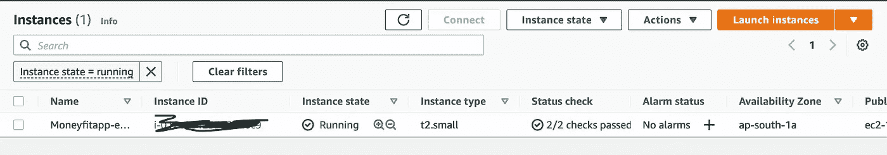
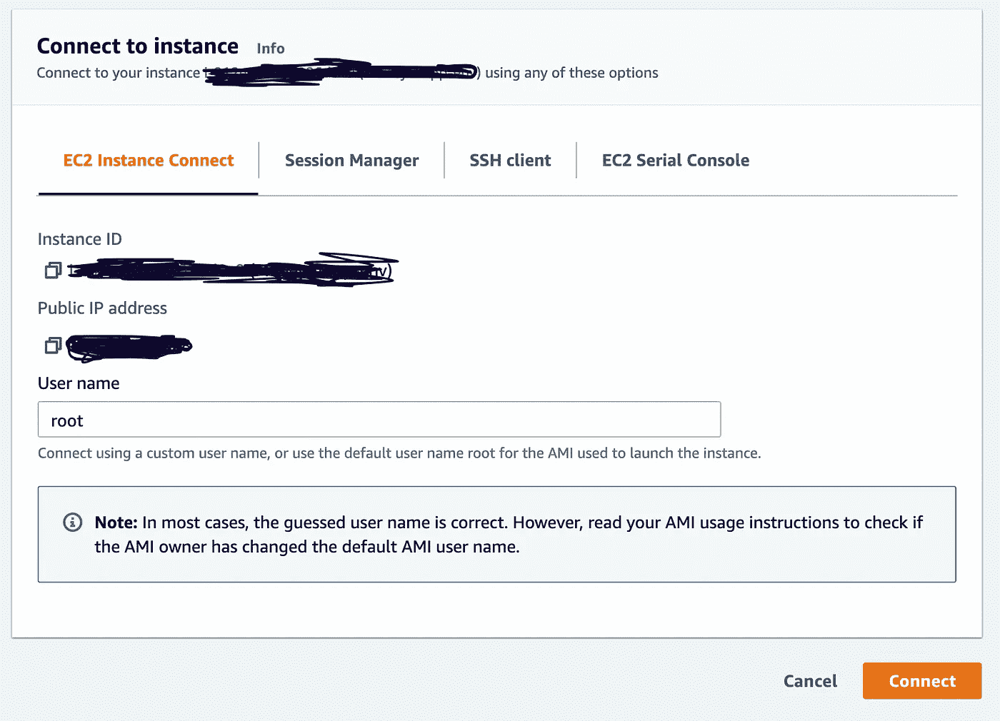
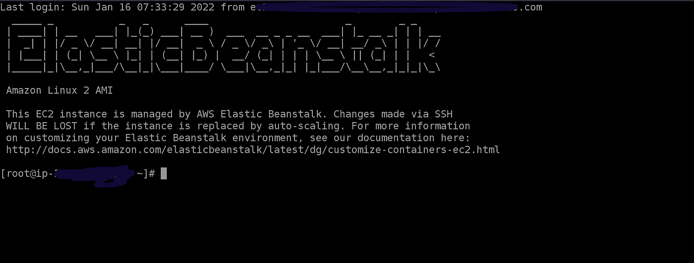
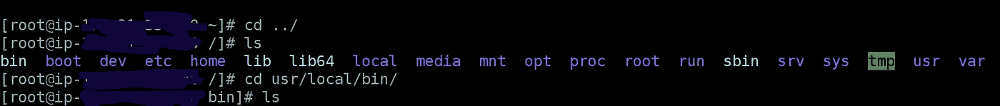

# 如何在 Elastic Beanstalk 和 Django 中运行 Cronjobs

> 原文：<https://betterprogramming.pub/how-to-run-cronjobs-in-elastic-beanstalk-and-django-4feb2a06b657>

## 运行 cron 作业的逐步指南


[Luca J](https://unsplash.com/@lucajns?utm_source=medium&utm_medium=referral) 在 [Unsplash](https://unsplash.com?utm_source=medium&utm_medium=referral) 上拍摄的照片

我在 Heroku 上运行了一个 Django 应用程序，想把它移植到 AWS 上。在 AWS 上运行 Django 应用程序的首选是 Elastic beanstalk。我把我的 Django 应用和 Postgres DB 迁移到了 elastic beanstalk。

> 我将写另一篇文章来一步步解释我如何将 django 生产应用从 heroku 迁移到 AWS 的过程

迁移是成功的，但是在运行 cronjobs 时遇到了问题。我看到了许多文章，许多 StackOverflow 帖子，但都没有用，我一整天都浪费在了在 AWS 上运行 cronjob 上，但最后，我让它工作了，我会写下我的学习和一步一步的过程，这样你就不必经历同样的事情。

Elastic beanstalk 需要项目根目录中的`.ebextensions`目录。我假设您已经为 elastic beanstalk 建立了 Django 项目，所以我将只关注 cronjob 部分。

在`.ebextensions`目录下创建一个名为`my_cron.config`的新文件(你可以给你的文件起任何名字，但是扩展名不能是。配置)

我的`management`中有一个 Django 命令，我想每小时运行一次。在您的`my_cron.config`文件中放入以下代码。

上述文件将创建 2 个文件。第一个是`my_cron_script.sh`将是`content:`的一部分的所有代码，第二个文件`my_cron`将有你的 cronjob 计时，脚本运行的路径。

在第一个文件`my_cron_script.sh`中，这是至关重要的部分，Django 管理命令需要您的应用程序上下文来运行任何`python manage.py command`，让我们一行一行来

第 8 行:

```
export $(cat /opt/elasticbeanstalk/deployment/env | xargs)
```

elastic beanstalk 将您的 env 变量保存在`opt/elasticbeanstalk/deployment`目录中，我们正在做的是，首先导出这些 env 变量。

第 9 行:

```
source $PYTHONPATH/activate
```

现在，在导出 env 变量之后，我们将激活弹性 beanstalk 中的 Python 虚拟环境。注意，我已经使用了`$PYTHONPATH`，所以我们不需要担心硬编码。

第 10 行:

```
python3 /var/app/current/manage.py my_process
```

现在我们只需要运行命令，注意我们给出了`manage.py`文件的确切路径，因为它将在 ec2 机器中从用户的根目录运行。

在第二个文件中，我们有

```
0 * * * * root /usr/local/bin/my_cron_script.sh >> /var/log/my_cron.log 2>&1
```

其中包含 cronjob 的计时、将运行命令的用户、要运行的命令，并将其记录到一些日志文件中。

将此代码部署到 elastic beanstalk(如果您正在部署一个 zip 文件，请仔细检查您的压缩文件中是否有此文件，因为有时当您压缩文件时，它不包括隐藏目录，因为我们的`.ebextentions`以`dot`开头，所以它是一个隐藏目录。

部署之后，让我们检查一下是否在 elastic beanstalk 上安装了 cronjob。我更喜欢使用 AWS 控制台来检查它。

转到您的 AWS EC2 控制台



点击`Connect`



让我们注意一些事情

*   我们的`my_cron_script.sh`文件会在`usr/local/bin`
*   我们的`my_cron`文件会在`etc/cron.d`
*   最后，我们的日志将在`var/log`中

如果您运行`cd ../`，然后运行`ls`，您将会看到根目录下的所有目录。



现在转到`cd etc/cron.d`你应该看到你的文件`my_cron`检查它的内容。另外，在`cd usr/local/bin`中检查您的`my_cron_script.sh`文件

Elastic beanstalk 将您的所有应用程序保存在`var/app`中，在这个目录中，您将看到 2 个目录。`current and venv`。在`/current`中，您将看到您的 Django 应用程序代码。在`/venv`中，你将拥有你的虚拟环境。AWS 一直在更新东西。因此，如果以上方法对您不起作用，那么请检查您在 cronjob 文件中给出的所有路径是否与 ec2 Linux 匹配。

最后一件事。我们还可以通过手动运行来检查命令，以检查是否一切正常。

```
0 * * * * root /usr/local/bin/my_cron_script.sh >> /var/log/my_cron.log 2>&1
```

这是我们的 cronjob，所以让我们尝试运行我们想要每天运行的命令。

```
root /usr/local/bin/my_cron_script.sh
```

在 ec2 终端中转到您的根目录。如果出现权限错误，请运行上面的命令，然后尝试运行该命令

```
sudo su root /usr/local/bin/my_cron_script.sh
```

如果一切正常，那么这个命令也应该从您的 cronjob 中运行。

> 关注我的[元](https://www.instagram.com/manoj_ahi/)

如果你遇到任何问题，请告诉我。我很乐意帮忙。