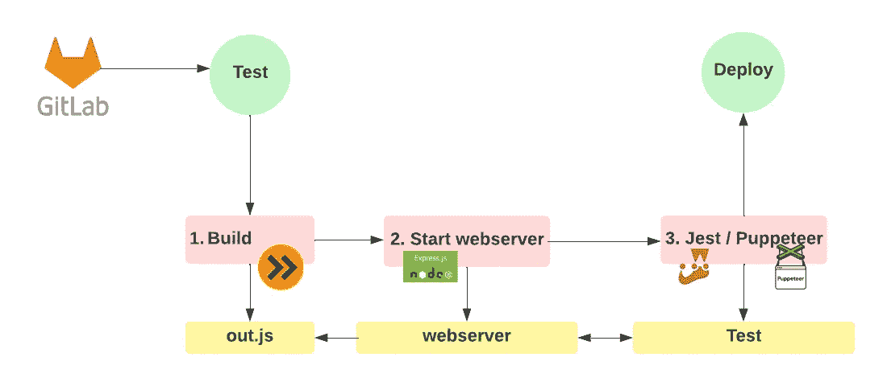

# 如何在我们的 CI/CD 管道中运行 E2E 测试？

> 原文：<https://betterprogramming.pub/how-to-run-e2e-tests-on-gitlab-381f79e90f57>

## 随着时间的推移，它会为您带来巨大的价值！


潘卡杰·帕特尔在 [Unsplash](https://unsplash.com?utm_source=medium&utm_medium=referral) 上的照片

这是我经常面临的问题。事实是，如果有人听说过测试金字塔，那么您可能会放弃运行端到端测试的想法。

你必须记住，与单元测试相比，编写这些测试要花费更多的时间，但是好处可能也是值得的。这不是关于你是否应该选择一种测试而不是另一种的讨论，所以让我们开始吧。

想象一下:你已经决定，你想花时间创建你的第一个 E2E 测试。

首先，您必须考虑您要测试的是什么，并创建一个可靠的 E2E 测试的大致概念。

## 例子

在这个例子中，我们有一个库，我们的客户把它放在他们网站的 head 部分，然后我们的脚本在运行时执行。

这意味着我们的产品是为在浏览器中运行而构建的。

因此，我们将设置一个测试来实现这一点。

我们想准确地模拟我们的脚本在野外是如何被使用的。



基本 CI/CD 概述

所以我们的想法是:

1.  在 Gitlab 上启动网络服务器
2.  创建一些“接近”的网站示例(基本 HTML)来模拟真实世界的使用。在这些虚拟 HTML 页面中，我们包含了我们的构建脚本
3.  断言行为是预期的

为了让这个工作，我们需要一些片段一起玩。

## 构建步骤

这一步很大程度上取决于你的应用。很可能您已经有了一个构建过程。

这个命令将我们所有的 JavaScript 模块构建成一个包

```
"build": "esbuild src/index.js --bundle --outfile=lib/out.js --minify"
```

这是我们指示 Gitlab 做的第一件事，因为输出文件是我们想要执行测试的文件。

## 网络服务器

对于这一步，我使用一个标准的 Express 服务器来处理静态文件。web 服务器的模板可能如下所示。

这是一个简单的 express 服务器，为构建步骤生成的文件(这是我们分发给客户的同一个文件)和放置在 public 文件夹中的任何其他文件提供服务。

# 小丑/木偶师

由于我们的输出 JavaScript 包对 DOM 做了一些工作，所以我们使用 Puppeteer 来编排一个无头 Chromium 浏览器，以模拟真实用户如何访问站点。

E2E 测试的一个例子

# 最后的想法

在我的项目中，我看到了这样一个事实，这条管道很早就被引入了——它意味着全世界。我可以很容易地创建 HTML 页面，模拟我们的客户的页面，并对这些页面进行测试。

值得注意的是，在 CI/CD 管道中，Puppeteer 相当慢，所以在设计测试时必须小心，以避免反馈回路太慢。

您还应该确保在 E2E 测试之前运行任何单元测试，以便在出现关键问题时更快地失败。

保持测试！