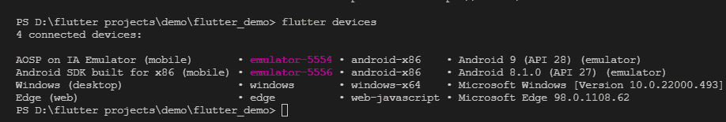
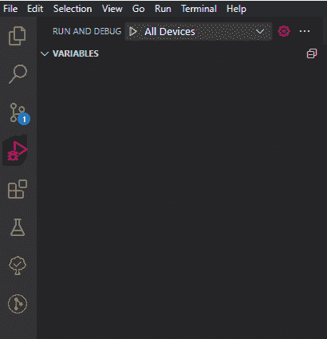
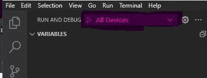

# 如何从 VS 代码同时在多个仿真设备上运行 Flutter 应用程序

> 原文：<https://betterprogramming.pub/how-to-run-flutter-app-on-multiple-emulation-devices-at-the-same-time-in-vs-code-9d0204518a5>

## 通过同时在多个仿真设备中可视化您的应用，提高您的工作效率。


照片由 [Minh Pham](https://unsplash.com/@minhphamdesign?utm_source=medium&utm_medium=referral) 在 [Unsplash](https://unsplash.com?utm_source=medium&utm_medium=referral) 上拍摄

到目前为止，每当我在 flutter 上开发 android 应用程序时。我总是有这样一个问题，我不得不一个接一个地运行不同的模拟器来可视化我的应用程序，我讨厌总是做重复的事情。于是我寻找一种方法，同时运行多个仿真器，运行我的 flutter app。这样我就可以在多种设备上查看我的应用程序的外观。

我们可以看到实时变化是如何同时影响多个仿真设备的，这真是令人惊讶。它可以给出一个完美的想法来即时更改或更新应用程序中的 UI。

因此，我不会向您展示如何设置仿真设备。我假设您已经设置了多个仿真设备。您可以勾选[此链接](https://www.studytonight.com/android/android-virtual-device)来设置仿真设备。

1.首先运行所有你想运行你的应用程序的仿真设备。

2.现在您需要知道这些仿真设备的 ID。您可以在终端上简单地运行以下命令。

```
flutter devices
```



由作者添加

3.现在你应该更新你的 VS 代码的运行和调试配置文件(`launch.json`)。您可以通过单击 VS 代码上的运行和调试按钮，然后单击设置按钮来找到该文件。如下图所示。



由作者添加

4.在将`name`和`deviceId`更新到文件`launch.json`的配置部分后，添加下面一行。如下图所示。请记住，我在这里使用了我的设备的名称和 id，您应该添加您的设备名称和 id。

5.然后你应该在文件中创建一个名为`compounds`的新部分，如上表所示，并在`configuration`部分添加你的设备名称。

如果您正确地输入了所有信息，那么您的`launch.json`文件看起来或多或少会如下所示。

现在，您所要做的就是运行此配置，通过选择运行和调试选项下拉菜单中的“所有设备”选项，在这些设备上运行应用程序。



由作者添加

编码快乐！