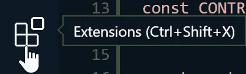
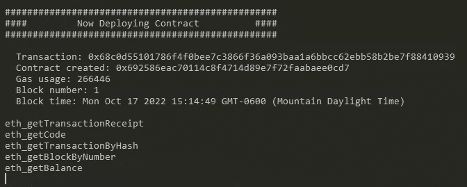
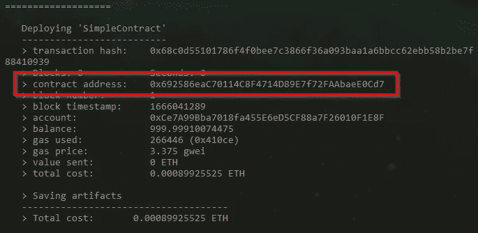
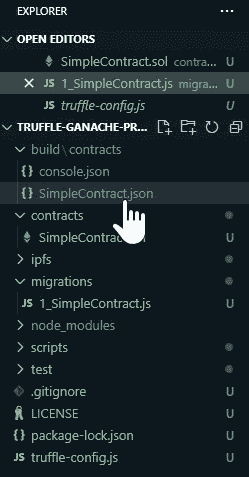
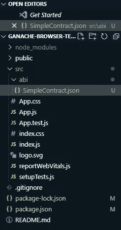
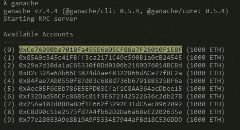
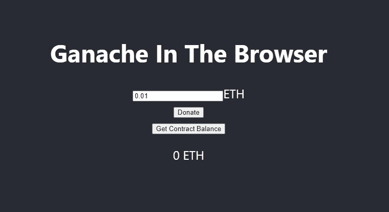
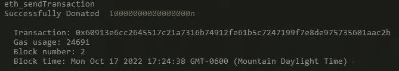
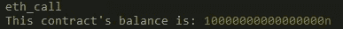

# 如何在浏览器中运行 Ganache

> 原文：<https://betterprogramming.pub/how-to-run-ganache-in-a-browser-399db3eaa22>

## 使用区块链发展网的逐步指南


作者提供的图片

当开发 Web3 项目时，有一个本地的区块链 devnet 进行测试是很有帮助的。Ganache 是以太坊生态系统中最受欢迎的工具之一，也是 T2 松露的一部分。Ganache 允许您使用不同的设置来设置本地区块链，以便在部署之前彻底测试您的智能合约。

在终端中查看本地区块链的输出有助于您了解项目在真实环境中的表现。将输出设置为变量以操作一些前端代码的能力甚至更有用。有些用户可能不知道在浏览器中运行 Ganache 可以做到这一点。

本文探讨了如何在浏览器中运行 Ganache，并强调了三个使开发 Web3 项目变得更容易的新特性。

# 浏览器中的 Ganache

在 Web3 开发过程中，运行一个本地区块链实例来测试您的智能合约是必不可少的。通过以这种方式进行测试，在使用节点服务(比如 [Infura](https://infura.io/) )将合同部署到测试网或主网之前，您可以确认一切正常。这最大限度地降低了增加每日限额的风险，并确保您只需部署一次。Ganache 是一个模拟以太网的优秀工具，它允许开发人员:

*   [分叉任何以太坊网络，无需等待同步](https://trufflesuite.com/blog/introducing-ganache-7/#2-fork-any-ethereum-test-network-without-waiting-for-sync-time)
*   [建立块挖掘规则(即时、按需、间隔)](https://trufflesuite.com/blog/introducing-ganache-7/#5-mine-blocks-instantly-at-interval-or-on-demand)
*   [冒充任何真实账户，无需其私钥](https://trufflesuite.com/blog/introducing-ganache-7/#7-impersonate-any-account)
*   使用以太坊 JSON-RPC 支持进行函数调用

然而，许多使用这个工具的人可能不知道，从 v7.0.0.0 开始，Ganache 也可以在您的浏览器中运行。在浏览器中运行允许您将本地区块链的输出设置为变量，然后您可以使用这些变量来测试您的前端代码。这个可视化的过程有助于你理解你的用户将如何与你的项目交互，也使你能够完全离线测试你的 dApp(当使用一个本地实例时)。

通过首先在浏览器中运行 Ganache 并微调 dApp 的反应方式，一旦一切正常，您就可以轻松地将提供者切换到您的节点服务 API。此外，自从 Ganache 的最新更新(撰写本文时的版本为 7.3.2)以来，您现在可以在浏览器中运行 Ganache 时[分叉以太坊 mainnet。这允许你通过你的前端代码与真实的账户和合同进行交互。](https://trufflesuite.com/blog/three-new-ganache-features-to-improve-your-developer-experience/#zero-config-mainnet-forking-now-available-in-the-browser)

# 该项目

本节将使用 Truffle 及其 VS 代码扩展创建一个基本的智能契约。然后，我们将首先通过命令行将我们的契约部署到 Ganache。之后，我们将创建一个简单的前端，在浏览器中使用 Ganache，并与我们部署的契约进行交互。

## 要求

对于本项目，我们将使用以下内容:

*   [NodeJS / NPM](https://nodejs.org/en/)
*   [松露](https://trufflesuite.com/docs/truffle/getting-started/installation/)松露&松露[松露](https://github.com/trufflesuite/ganache#readme)
*   [VS 代码编辑器](https://code.visualstudio.com/Download)
*   [用于 VS 代码扩展的块菌](https://marketplace.visualstudio.com/items?itemName=trufflesuite-csi.truffle-vscode)

## 步骤 1 —安装

首先，我们可以在我们的终端中运行命令`node --version`来确保 NodeJS 和 NPM 已经[正确地安装在我们的机器上](https://nodejs.org/en/)。

接下来，我们将通过运行以下命令来安装 Truffle 和 Ganache:

```
npm install -g truffle ganache
```

分别用`truffle --version`和`ganache --version`检查 Truffle 和 Ganache 的版本号会告诉我们这两个工具是否安装成功。

下一步是[安装 VS 代码](https://code.visualstudio.com/Download)，然后导航到编辑器中的 Extensions 选项卡并搜索 Truffle for VS 代码。



我们已经准备好开始这个项目的工作，所有的东西都已经安装好了。

## 步骤 2 —设置项目

使用 Truffle for VS 代码扩展，我们可以通过 VS 代码命令面板轻松创建一个新的 Truffle 项目。在编辑器中按下`ctrl + shift + P`打开命令面板，键入`truffle`查看我们可以使用的命令列表。选择 Truffle: New Solidity Project，然后创建一个基本项目，在所需的文件夹中创建一个新项目。


这将创建一个初始化的项目，它具有简单的文件夹结构和示例代码，如果我们愿意，可以使用这些代码。

在我们的智能合约代码中使用`console.log`的能力是 Ganache 最近提供的另一个新特性[。在我们为项目创建智能契约之前，让我们通过安装所需的包来设置它。导航到终端中的项目文件夹，然后键入以下命令:](https://trufflesuite.com/blog/three-new-ganache-features-to-improve-your-developer-experience/#ability-to-use-consolelog-from-solidity)

```
npm install @ganache/console.log
```

## 步骤 3 —撰写智能合同

我们项目的智能合同将是一个基本的，我们可以捐赠一些 ETH，并要求看到平衡。

在`contracts`文件夹中，创建一个新文件，并将其命名为 SimpleContract.sol。接下来，使用以下智能合同代码填充该文件:

我们的智能合约中的代码相对简单。当我们部署智能契约时，它在控制台中显示一条消息，提供捐赠 ETH 和查询余额的功能，并在调用函数时在控制台中打印消息。

## 步骤 4 —部署到 Ganache

在安装了 Truffle for VS 代码扩展之后，我们可以通过右键单击智能契约文件并选择 Deploy Contracts 来轻松地进行部署。然而，如果我们想看到我们的控制台消息，我们将不得不使用我们自己的终端，而不是内置在 VS 代码中的终端。这在将来可能会改变，但是我们必须创建一个简单的迁移脚本来执行部署。

在`migrations`文件夹中，创建一个名为`1_SimpleContract.js`的新脚本，并输入以下代码:

```
const SimpleContract = artifacts.require("SimpleContract");module.exports = function (deployer) {
  deployer.deploy(SimpleContract);
};
```

接下来，打开一个新的终端窗口并启动 Ganache:

```
ganache
```

当控制台消息出现时，我们将在这个终端窗口中看到它们。我们现在打开了两个终端窗口:一个运行 Ganache，另一个在 Truffle 项目的文件夹中打开。

在 Truffle 项目所在位置打开的终端窗口中，键入以下命令来启动部署:

```
truffle migrate --network development
```

如果部署成功，我们可以在终端中看到我们的控制台消息:



太好了！我们的合同在本地 Ganache 实例上生效！我们暂时让 Ganache 运行，这样我们就可以使用浏览器与我们的合同进行交互。在我们开始之前，从我们输入`migrate`命令的终端的输出中复制`contract address`。我们将使用这个地址将我们的前端指向我们的智能合约。



## 步骤 5 —构建前端

**5a。—设置**

对于这个项目的前端，我们将使用 React。导航到一个新的空文件夹，然后键入:

```
npx create-react-app ganache-browser-test
```

接下来，我们将安装 Web3。JS 来轻松地与我们的智能合同进行交互。导航到我们的新项目文件夹并安装 Web3。JS 用这个命令:

```
cd ganache-browser-test
npm install web3
```

新版的 create-react-app 与 Web3 不兼容。JS，所以我们需要安装特定版本的 React 脚本。我们可以用这个命令来实现:

```
npm install --save-exact react-scripts@4.0.3
```

最后，为了在我们的浏览器中使用 Ganache，我们将把它作为一个依赖项直接安装:

```
npm install ganache
```

或者，您可以在 HTML 中添加 CDN 链接，以便从浏览器访问 Ganache:

```
<script src="https://cdn.jsdelivr.net/npm/ganache@7.3.2/dist/web/ganache.min.js"></script>
```

在处理前端代码之前，我们需要创建一个包含合同 ABI 的文件，以便与智能合同进行交互。我们可以直接从我们的松露项目中复制文件。导航到我们松露项目的`build/contracts`文件夹，复制`SimpleContract.json`文件。



接下来，在编辑器中打开我们的前端项目，创建一个名为`abi`的新文件夹。在该文件夹中，粘贴`SimpleContract.json`文件。我们前端的文件结构现在看起来像这样:



**5b。—前端代码**

我们可以开始在我们的前端工作，所有的设置都不碍事。首先，打开`src`文件夹中的`App.js`文件，用以下代码替换样板代码:

确保将`CONTRACT_ADDRESS`更改为我们在第 4 步部署智能合同时收到的地址。同样，`USER_ADDRESS`是将调用这些函数的帐户。我们可以从我们第一次在终端中启动 Ganache 实例时显示的帐户列表中得到这个信息:



这些账户地址都可以。

在我们继续之前，让我们花点时间浏览一下我们编写的代码:

*   我们导入我们的依赖项和`SimpleContract` JSON 文件。
*   设置`ganache`和`Web3`变量。
*   创建一个空的`options`变量，我们用它初始化我们的`provider`实例。
*   **注意**:这个`options`变量是我们设置[我们希望本地区块链实例包含的任何选项](https://github.com/trufflesuite/ganache#documentation)的地方，比如在浏览器中严格运行 Ganache(不在我们的另一个终端窗口中运行)时分叉 Mainnet 或 Goerli。
*   使用我们的`localhost URL`和端口`8545`初始化我们的`web3`对象，其中我们的 Ganache 实例已经在运行。
*   **注意**:此时可以通过使用`provider`变量代替 localhost 在浏览器中严格运行 Ganache。在这种情况下，我们使用`localhost`,因为我们希望与已经部署的智能契约进行交互，并在终端输出中看到我们的`console.log`消息。
*   设置我们的`CONTRACT_ADDRESS`和`USER_ADDRESS`变量。
*   创建一个契约实例，我们可以用它来调用`App`代码中的函数。
*   创建`contractBalance` React 状态变量及其`set`方法。
*   定义我们的`donate`和`getBalance`功能。
*   最后，我们为我们的前端返回`html`。

**5c。—运行项目**

现在，我们可以用`npm start`运行我们的应用程序来显示我们的前端，如下所示:



当我们测试我们的项目时，我们可以在运行 Ganache 的终端窗口上看到结果和我们的`console.log`消息，并且我们前端的 ETH 天平成功地用新的天平进行了更新。



## 步骤 6 —在浏览器中用 Ganache 派生 Goerli 或 Mainnet

既然我们知道我们的项目在本地运行的 Ganache 实例上正常运行，下一步就是在 testnet 和 mainnet 的分叉版本上运行它。在本文中，我们不会介绍这样做的实际过程，但是设置这样做很简单。我们需要做的只是修改几行前端代码。

首先，options 变量需要指定我们希望分叉哪个网络:

```
const options = { fork: { network: 'goerli' } };
```

或者:

```
const options = { fork: { network: 'mainnet' } };
```

然后我们需要更新我们的`web3`变量声明:

```
const web3 = new Web3(options);
```

最后，我们需要确保在我们分叉的网络上用我们的地址更新`CONTRACT_ADDRESS`。我们还需要将`USER_ADDRESS`更新到同一个网络上的一个帐户地址，该地址有足够的资金捐赠给我们的合同。

当分叉 mainnet 时，这部分代码可能看起来像这样:

```
const options = { fork: { network: 'mainnet' } };
const provider = ganache.provider(options);const web3 = new Web3(provider);const CONTRACT_ADDRESS = '0x692586eaC70114C8F4714D89E7f72FAAbaeE0Cd7'  
const USER_ADDRESS = web3.utils.toChecksumAddress('0xCe7A99Bba7018fa455E6eD5CF88a7F26010F1E8F');
```

这样，我们就可以在浏览器中使用 Ganache，用 mainnet 的分叉版本来测试我们的项目。

# 结论

通过创建一个接口来测试项目有助于可视化您的 dApp 是如何运行的，并让您更好地了解它一旦在 mainnet 上为用户执行将会如何。在测试前端代码的同时在浏览器中运行是 Ganache 成为开发工具包中如此强大的工具的一个特性。要了解更多关于与 Ganache 合作或为项目做贡献的信息，[查看他们的 GitHub](https://github.com/trufflesuite/ganache#documentation) 或[文档](https://trufflesuite.com/docs/ganache/quickstart/)。