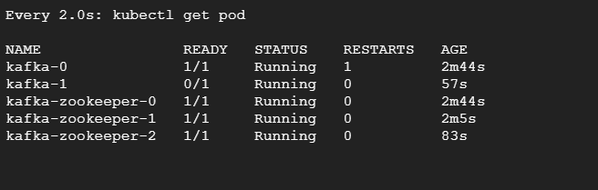
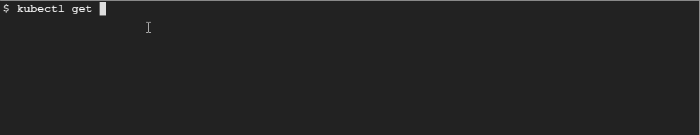

# 如何在 Kubernetes 上运行高可用性 Kafka

> 原文：<https://betterprogramming.pub/how-to-run-highly-available-kafka-on-kubernetes-a1824db8a3e2>

## 借助舵图、状态集和动态预配置


照片由 [Ayaz Lalani](https://unsplash.com/@ayaz_l?utm_source=medium&utm_medium=referral) 在 [Unsplash](https://unsplash.com?utm_source=medium&utm_medium=referral) 拍摄

Apache Kafka 是最流行的基于事件的分布式流媒体平台之一。LinkedIn 首先开发了它，优步、网飞、Slack、Coursera、Spotify 和其他技术领导者目前都在使用它。

尽管 Kafka 非常强大，但它同样复杂，需要一个高度可用的健壮平台来运行。大多数时候，工程师们都在努力为 Kafka 服务器提供食物和水，而维护一台服务器并不容易。

随着微服务的流行和大多数公司采用分布式计算，将 Kafka 作为核心消息传递主干有其优势。 [Kubernetes](https://kubernetes.io/) 是运行基于容器的微服务的流行选择，使用 Kafka 作为事件平台是另一种选择。

如果您在 Kubernetes 中运行您的微服务，那么在 Kubernetes 中运行您的 Kafka 集群以利用其内置的弹性和高可用性将是有意义的。Kubernetes pods 还可以使用内置的 Kubernetes 服务发现功能轻松地与集群内的 Kafka pods 进行交互。

让我们通过动手练习来看看如何在 Kubernetes 上构建一个分布式 Kafka 集群。我们将使用舵图和状态集。Kubernetes 将动态地向云提供商请求持久卷，并使用它们来持久化数据。

# 先决条件

在这个练习中，您将需要一个正在运行的 Kubernetes 集群。我用过 Google Kubernetes 引擎 1.16.13-gke.1。

# 安装舵

Helm 是 Kubernetes 的包经理。它是最受欢迎的工具之一，允许人们版本化和共享他们的清单。Kafka 还包含经过生产测试的 Helm 图表，可以帮助您安装生产就绪的集群。您也可以根据自己的需求定制头盔安装。

Helm v3 不需要 Tiller，因此是一个简单的二进制下载和路径设置。

```
wget [https://get.helm.sh/helm-v3.3.0-linux-amd64.tar.gz](https://get.helm.sh/helm-v3.3.0-linux-amd64.tar.gz)
tar -zxvf helm-v3.3.0-linux-amd64.tar.gz
sudo cp -a linux-amd64/helm /usr/local/bin/helm
chmod +x /usr/local/bin/helm
```

# 安装卡夫卡

我们现在将使用舵图安装卡夫卡。为此，我们将首先添加图表存储库，并使用它来下载 Kafka Helm 图表。

添加孵化器 Helm repo。

```
helm repo add incubator [http://storage.googleapis.com/kubernetes-charts-incubator](http://storage.googleapis.com/kubernetes-charts-incubator)
```

接下来我们将下载`values.yaml`文件。这个文件包含一个配置，我们可以用它来定制我们的安装。我们将使用默认值，并在此基础上创建一个头盔版本，但你可以根据自己的需要随意定制。

```
curl [https://raw.githubusercontent.com/helm/charts/master/incubator/kafka/values.yaml](https://raw.githubusercontent.com/helm/charts/master/incubator/kafka/values.yaml) > values.yaml
helm install kafka incubator/kafka -f values.yaml
```

我们现在会看到卡夫卡正在准备。去拿豆荚，等它们准备好。



这个装置已经旋转了三个动物园管理员舱和三个卡夫卡舱。它们分布在整个集群中，因此这意味着该设计高度可用。

让我们看一下持久卷，以便了解磁盘的来源。


正如我们所看到的，Kubernetes 动态地向云提供商(本例中是 GCP)索取持久卷。如果您尚未为您的集群启用动态预配置，或者您的集群不支持它，您可以随时修改`values.yaml`以使用静态预配置卷，您需要在安装 Helm 之前提供这些卷。

让我们看看 Kubernetes 的服务



正如我们所见，有一个动物园管理员服务叫做`kafka-zookeper`，还有一个卡夫卡服务叫做`kafka`。对于 Kafka 集群管理，我们将与`kafka-zookeper`服务交互，对于从集群发送和接收消息，我们将使用`kafka`服务。

# 安装 Kafka 客户端

随着 Kafka 集群的启动和准备就绪，让我们安装一个 Kafka 客户端，它将帮助我们从主题中放置和获取消息。

```
cat <<EOF | kubectl apply -f -
apiVersion: v1
kind: Pod
metadata:
  name: testclient
spec:
  containers:
  - name: kafka
    image: solsson/kafka:0.11.0.0
    command:
      - sh
      - -c
      - "exec tail -f /dev/null"
EOF
```

# 测试 Kafka 集群

最后，是时候进行一些测试了！让我们用一个分区和复制因子“1”创建一个主题“消息”。

```
kubectl exec -it testclient -- ./bin/kafka-topics.sh --zookeeper kafka-zookeeper:2181 --topic messages --create --partitions 1 --replication-factor 1
```

现在让我们创建一个将消息发布到主题的生成器。

```
kubectl  exec -ti testclient -- ./bin/kafka-console-producer.sh --broker-list kafka:9092 --topic messages
```

在一个单独的窗口中，让我们打开一个消费者会话，这样我们就可以在发送时看到消息。

```
kubectl exec -ti testclient -- ./bin/kafka-console-consumer.sh --bootstrap-server kafka:9092 --topic messages
```

现在开始在生产者端发送消息，您将看到它们几乎立即出现在消费者端。


恭喜你！Kafka 集群工作正常。

# 结论

Kubernetes 集群上的 Kafka 对于那些已经在使用 Kubernetes 处理其容器工作负载并且想要一个分布式事件引擎来促进它们之间的通信的组织来说，听起来是一个很好的提议。

事件流是在您的微服务之间建立异步通信的强大方式，Kafka 是一个健壮的、生产级的、经过实战检验的解决方案。

在 Kubernetes 上运行 Kafka 集群有助于利用它提供的开箱即用的多种弹性和操作能力，这为您简化了许多任务。

感谢阅读！我希望你喜欢这篇文章。