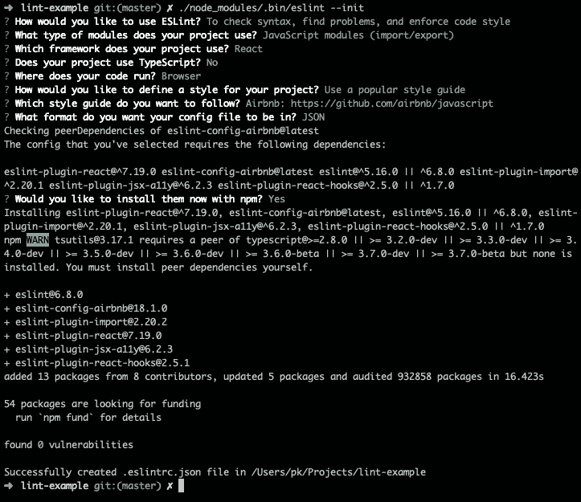
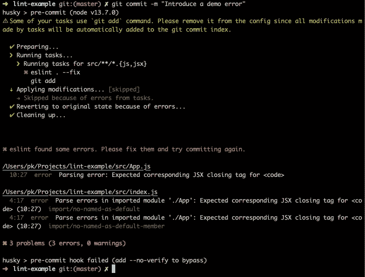
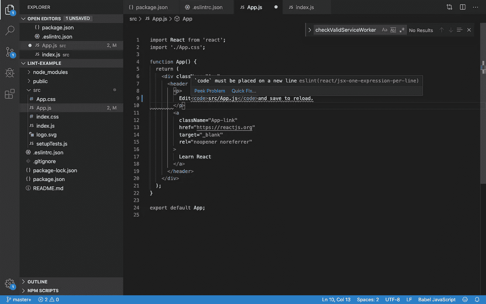
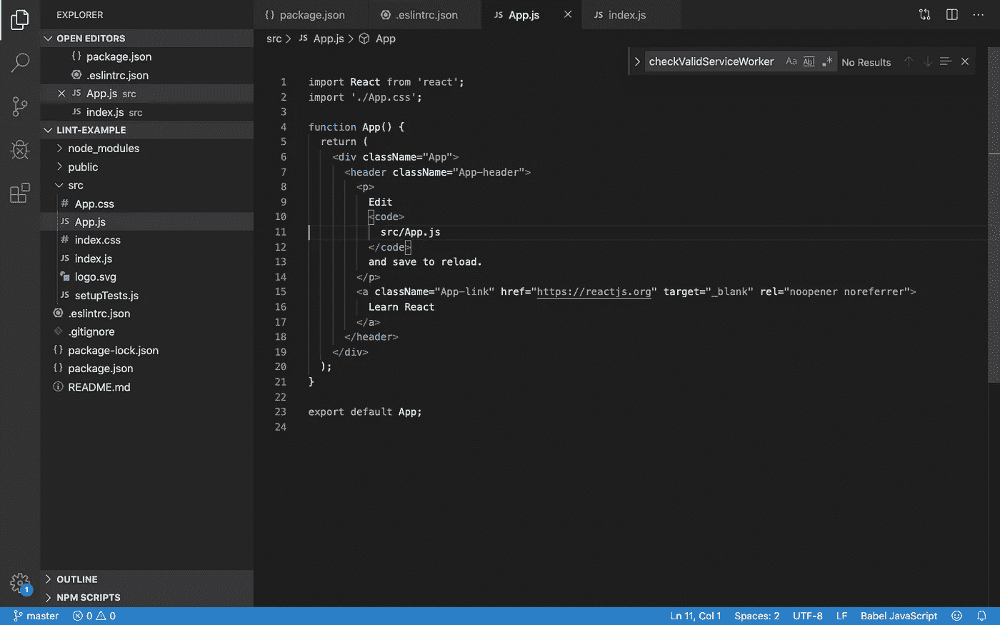

# 如何在提交 React 项目之前运行 Linters

> 原文：<https://betterprogramming.pub/how-to-run-linters-before-committing-in-your-react-project-8c9713fb0d75>

## 使用 Husky、lint-staged 和 ESLint


斯坦尼斯拉夫·康德拉蒂耶夫在 [Unsplash](https://unsplash.com/s/photos/fix?utm_source=unsplash&utm_medium=referral&utm_content=creditCopyText) 上的照片

# 介绍

我们今天将使用几个软件包。让我们一个一个来看:

[Husky](https://www.npmjs.com/package/husky) **:** 它为我们提供了 Git 钩子(参见[支持钩子列表](https://git-scm.com/docs/githooks))。

[lint-staged](https://www.npmjs.com/package/lint-staged) **:** 使用代码质量工具，如[beautiful](https://prettier.io/docs/en/comparison.html)和 [ESLint](https://eslint.org/) ，对 staged 文件运行 linters。

# 项目设置

为了让我们开始，我们将使用一个简单的`create-react-app`，我们将利用`npx`来安装`create-react-app`。成功创建应用程序后，我们将添加开发依赖项，如下所示:

```
npm install lint-staged husky eslint --save-dev
```

您需要创建一个`.eslintrc.json`文件来添加所有的配置。为此，请从目录中运行以下命令:

```
./node_modules/.bin/eslint --init
```

它将是交互式的，会询问您设置配置的所有问题。如果你不确定选择什么选项，继续按回车键；它会完成任务的。它应该是这样的:



现在我们已经安装了依赖项，让我们在`package.json`中做一些改变，使 linters 能够在预提交 Git 挂钩上运行:

下面是`.eslintrc.json`文件:

# 测试

我引入了一个错误，看看它是否能捕捉到它。我在第 10 行犯了一个非常明显的错误:

我准备了变更并尝试提交:



林挺档案

即使在开发中，我也能看到棉绒在工作:



但是我试着这样做，结果是:



它修复了所有 lint 警告。

如果你参与过不同的项目，你就知道其中的痛苦。遵循棉绒的所有规则真的很痛苦。您可以在代码中使用一些特殊的注释来告诉 linters 允许违反规则。我将把那件事留给你。

# 利益

这种设置使您能够开始编写更好的代码，这显然会使您成为更好的开发人员。我列出了一些支持这种设置的要点，但请随时纠正任何问题:

*   与不同背景的团队合作可以简化。
*   有更好的错误处理。
*   如果你有 CI/CD 设置，尽早失败会有所帮助。