# 如何在 Linux 上的虚拟机中运行 macOS

> 原文：<https://betterprogramming.pub/how-to-run-macos-inside-a-virtual-machine-on-linux-4d6ce7cd493e>

## 通过在 Linux 中安装 macOS 开始使用虚拟机


莱纳斯·米米耶茨在 [Unsplash](https://unsplash.com?utm_source=medium&utm_medium=referral) 上的照片

虚拟机为您提供了运行和测试其他操作系统的机会，而无需额外的硬件。

本指南将向您展示如何在 Ubuntu Linux 上安装 macOS，以便您可以测试和运行您的 macOS 本地应用程序。如果您使用的是另一个 Linux 发行版，我在本文底部提供了一个关于如何安装 QEMU/KVM 的链接。

# 安装虚拟机管理器

本指南使用 QEMU/KVM，这是一个轻量级模拟器，也是运行虚拟机的虚拟化器。您可以使用下面的命令安装它。此外，您将安装一些 Python 工具。

```
sudo apt-get install qemu-system qemu-utils python3 python3-pip
```

# 下载 macOS 基础映像和脚本

为了方便入门，本指南将使用 GitHub 上的 macOS-Simple-KVM 开源项目来简化虚拟机的管理。

Cd 到您的**/下载**文件夹，使其成为您当前的工作目录。

```
cd ~/Downloads
```

使用 **wget** 实用程序下载 macOS 基本映像和其他所需的工具。

```
wget https://github.com/foxlet/macOS-Simple-KVM/archive/refs/heads/master.zip
```

使用 **unzip** 命令行实用程序提取下载的包，如下所示。

```
unzip master.zip
```

新解压的文件夹将命名为 **macOS-Simple-KVM-master。**

# 为您的虚拟机创建文件夹

为了简化虚拟机的管理，您可以在主目录中创建一个文件夹，该文件夹将存放虚拟机的所有虚拟磁盘或其他相关内容。

```
mkdir ~/KVM
```

您现在可以从您的**下载**文件夹中移动提取的文件夹，并将其重命名为 macOS，以便使用更短的名称。

```
mv ~/Downloads/macOS-Simple-KVM-master/ ~/KVM/macOS
```

# 创建虚拟磁盘

现在，您将在最近重命名的 macOS 文件夹中创建一个虚拟硬盘。

```
cd ~/KVM/macOS
```

从将托管您的虚拟机的 macOS 文件夹中运行以下脚本。下面给出的命令下载 macOS Catalina 安装映像。

```
./jumpstart
```

有了基础映像，现在可以创建虚拟磁盘映像，在其中安装 macOS。

使用 **qemu-img** 实用程序创建将用于安装操作系统的虚拟硬盘。

```
qemu-img create -f qcow2 mac_os.qcow2 64G
```

上面的命令创建了一个名为 **mac_os.qcow2** 的虚拟磁盘，采用 **qcow2** 格式，估计大小为 64GB。QEMU 将创建一个比您指定的更大的映像，您可以在下面的输出中看到，它创建了一个大约 68GB 的磁盘。

**注**:你甚至可以创建一个小至 34GB 的图像；它不必是 64GB。

# 配置虚拟机

macOS 文件夹中的另一个重要文件是 **basic.sh** 文件，用于配置虚拟机的运行时环境。

在 **basic.sh** 文件的底部添加以下两行并保存。

```
-drive id=SystemDisk,if=none,file=mac_os.qcow2
-device ide-hd,bus=sata.4,drive=SystemDisk
```

**basic.sh** 的最终内容应该如下图所示。上面提到的我添加的行用红色突出显示。

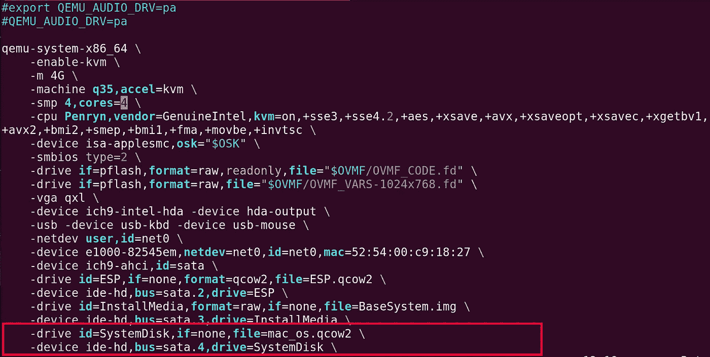

您可以更改的另一个配置是虚拟机将使用的 RAM 数量。以 **-m** 开头的那一行以 GB 为单位指定 RAM 的大小。您可以在以 **-smp** 开头的行中指定虚拟机使用的 CPU 核心数，即**核心数=x** 。

# 在 Ubuntu 上安装 macOS

要开始安装，运行我们刚刚编辑过的 **basic.sh** 脚本文件。

```
./basic.sh
```

运行上面的命令后，您将看到 macOS 操作系统的初始安装屏幕。按下**进入**继续。

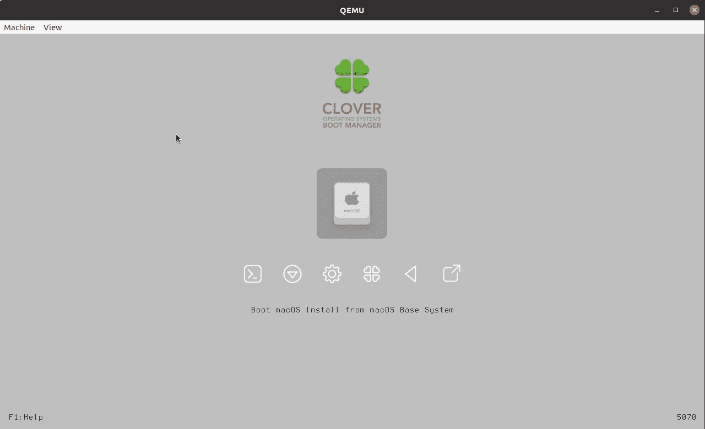

**注意**:您的鼠标目前可能无法正常工作。您可以使用键盘上的箭头键来导航。

使用键盘按键 **Ctrl + Alt + G** 从虚拟机窗口退出鼠标和键盘控制。

确保阅读许可条款，并通过选择**同意**按钮继续安装。

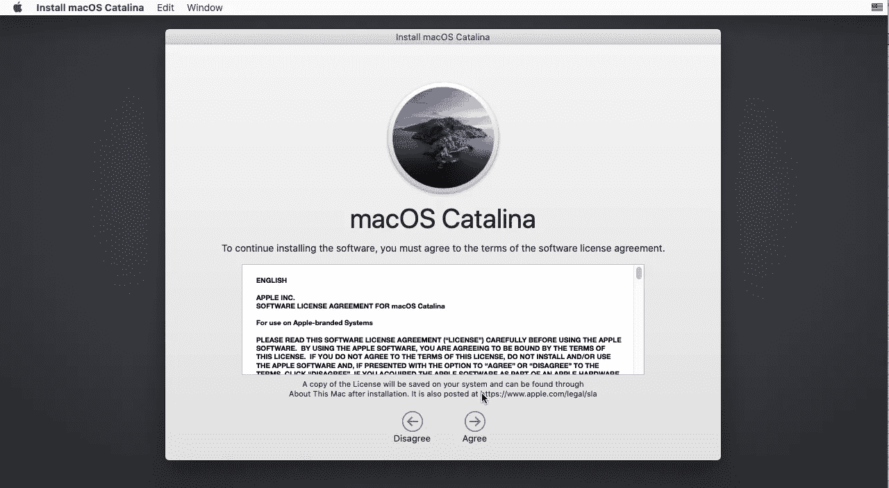

在继续安装之前，请记住使用“磁盘工具”格式化虚拟磁盘。

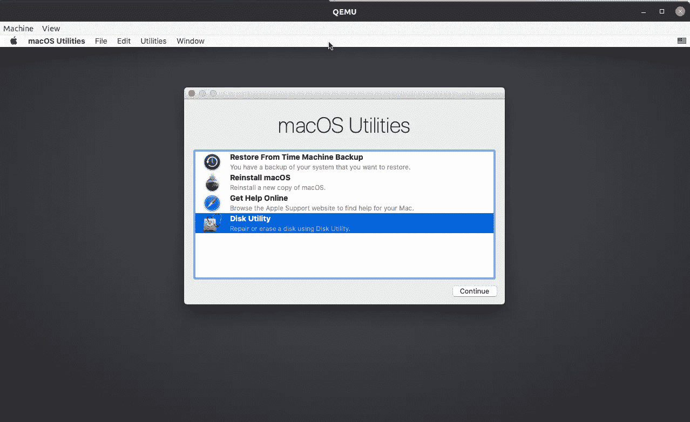

从左侧面板中选择相应的磁盘大小(即您使用 qemu-img 创建的大小),然后单击**擦除**按钮。在磁盘工具中将磁盘重命名为 **MainDisk** 。使用 Apple 文件系统格式(APFS)来格式化磁盘，并使用如下所示的 GUID 分区图方案。

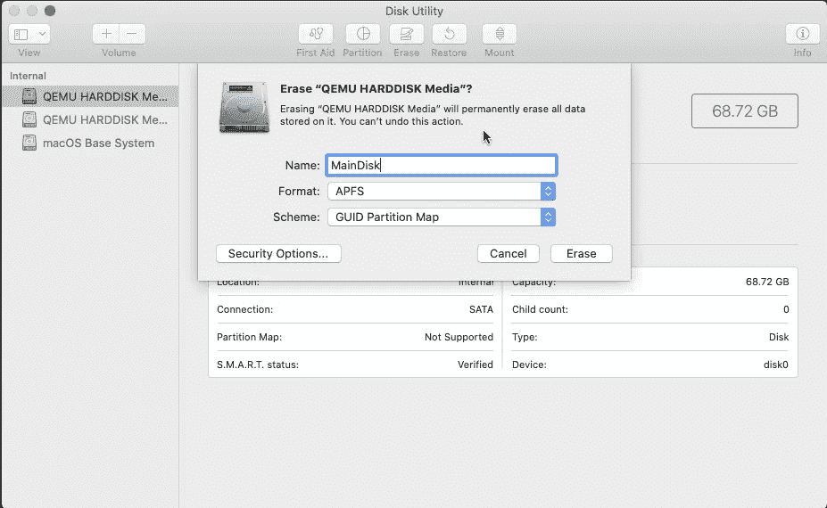

设置好一切后，用左上角的红色按钮关闭“磁盘工具”窗口。然后，系统将引导您进入上一个屏幕。

虚拟硬盘正确格式化后，您现在可以通过选择**重新安装 macOS** 选项继续安装 macOS。

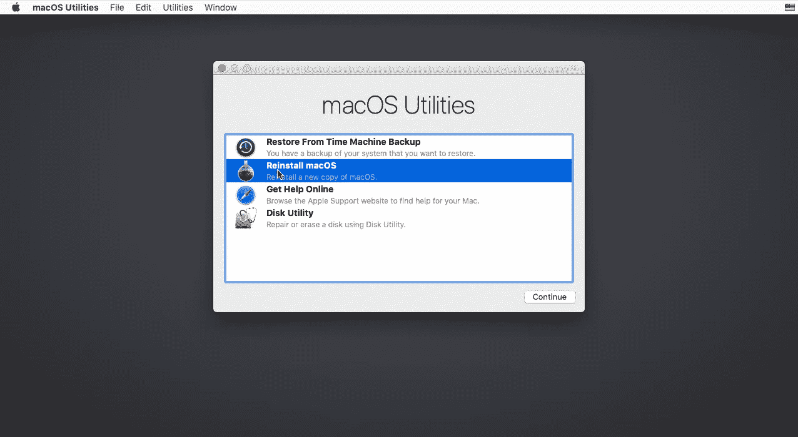

现在选择安装你的 macOS 系统的安装盘。

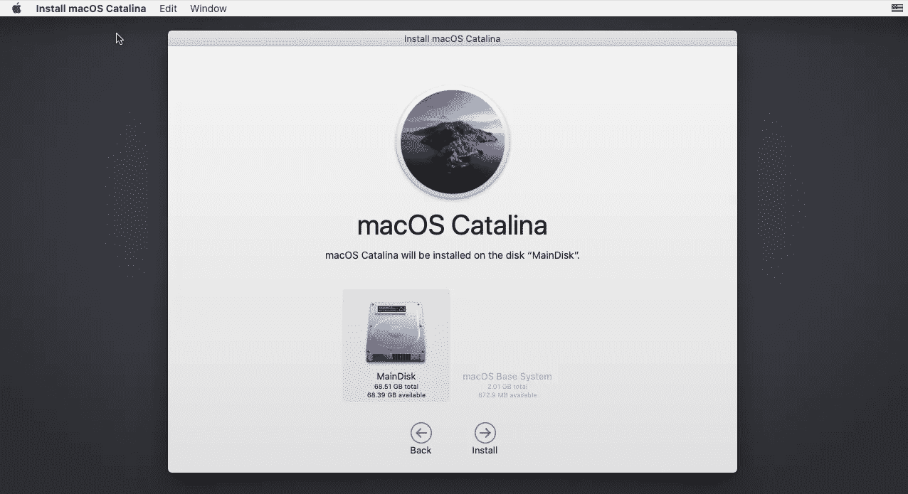

在接下来的下一个屏幕上，您可以点击**继续**继续安装。

安装需要一些时间，你可以从下面的初始估计时间(大约一小时五分钟)中看到，所以喝杯咖啡放松一下吧。

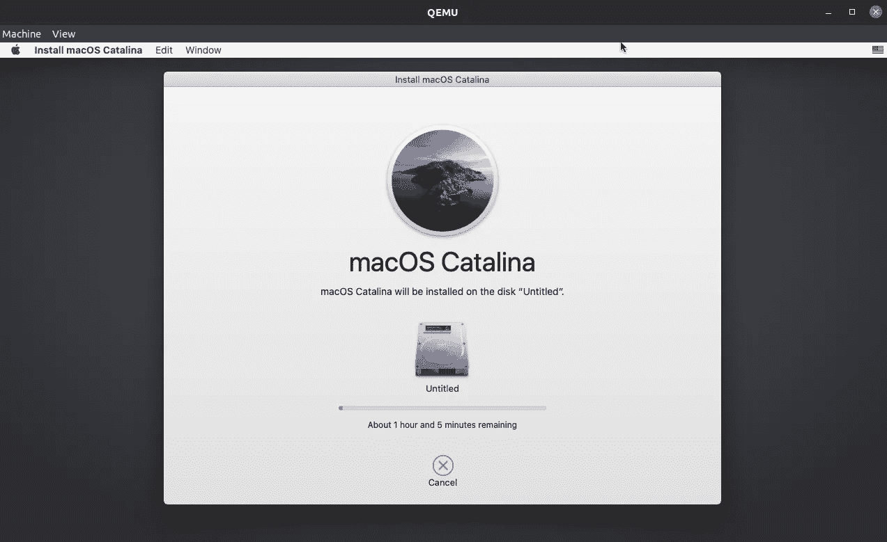

**注意:**在安装过程中，您不需要进行任何其他选择。看到下面的屏幕后，您可以开始配置您的系统。

# 配置您的新操作系统

如果安装已经进行到这一步，是时候配置您的新操作系统了。从选择你居住的国家或地区开始。

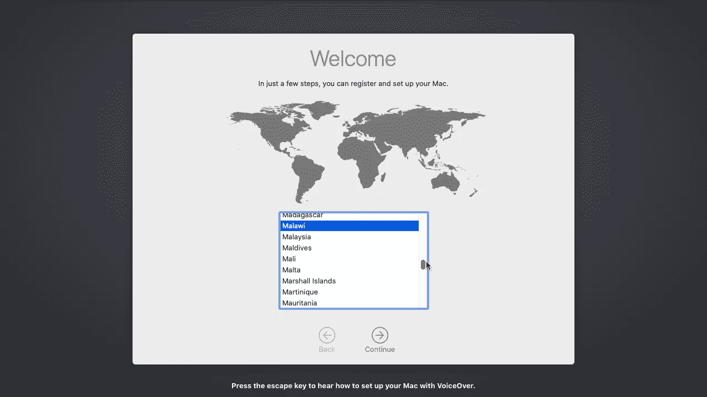

在这之后，你将会看到更多的配置界面来设置你的语言、账户名、Siri 等。根据您的需求配置操作系统。

操作系统配置的最后一页是选择你的主题，如下所示。选择你的主题并点击**继续。**


您的 macOS 桌面现在可以使用了。

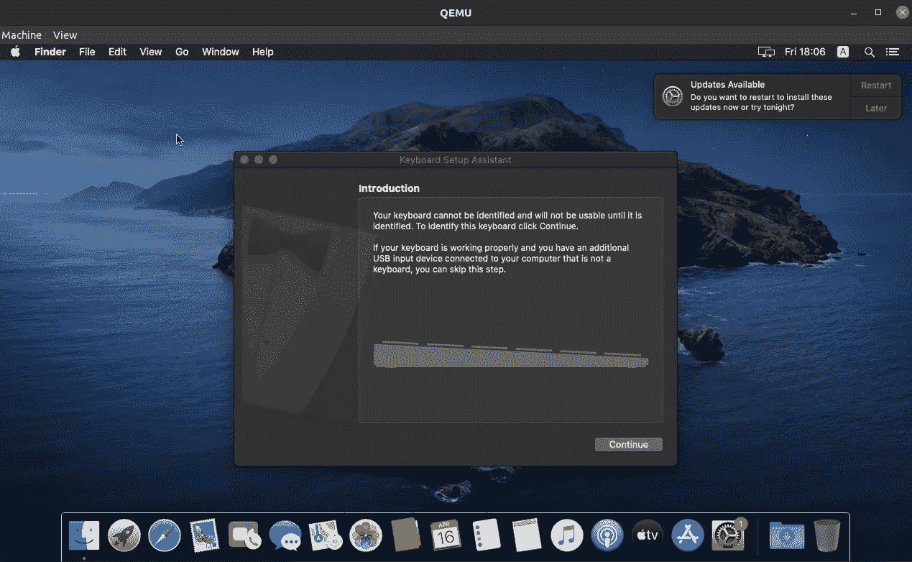

# 启动和停止虚拟机

如果使用完虚拟机，您可以关闭或重新启动 macOS 系统。要停止虚拟机，在用于运行 **basic.sh** 脚本的终端中按 **Ctrl + C** 。

要再次启动虚拟机，只需启动托管虚拟硬盘的 macOS 文件夹中的 **basic.sh** 脚本。

```
./basic.sh
```

然后，您将看到以下启动屏幕。选择显示**从主盘**引导 macOS 的选项。

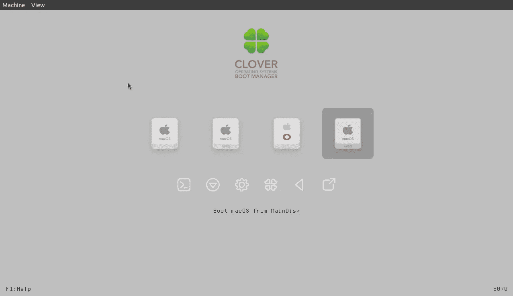

# 最后的想法

虚拟机是软件工程的重要组成部分。使用 QEMU/KVM，您可以轻松地从您的 Linux 机器上运行其他操作系统。

您可以进一步配置您的虚拟机设置，包括屏幕分辨率等。通过查看包含虚拟硬盘的 **macOS** 目录中的 **/docs** 文件夹。

如果你使用的是 Ubuntu Linux 之外的其他 Linux 发行版，那就看看[官方 foxlet GitHub 页面](https://github.com/foxlet/macOS-Simple-KVM)关于如何安装 QEMU/KVM 的内容。