# 如何在 AWS Lambda 中运行 Symfony 控制台命令

> 原文：<https://betterprogramming.pub/how-to-run-symfony-console-command-in-aws-lambda-347d535e97da>

## 将 PHP 控制台应用程序作为微服务运行

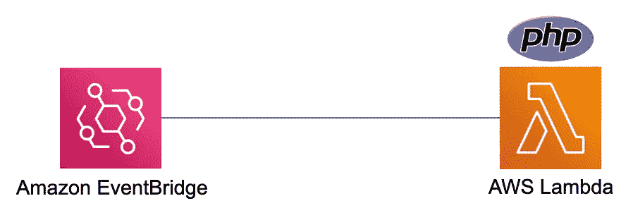

作者图片

在[之前的文章](https://tanvir-ahmad.medium.com/easy-way-to-create-a-symfony-console-application-d173852c01cb)中，我已经使用 [Symfony 控制台组件](https://symfony.com/doc/current/components/console.html)创建了一个简单的“Hello World”控制台应用程序。如果你不知道如何创建 Symfony 控制台应用程序，请务必阅读。

在本文中，我将尝试在 [AWS Lambda](https://docs.aws.amazon.com/lambda/latest/dg/welcome.html) 中部署我的控制台应用程序，作为 Cron job 与 [Amazon EvenBridge](https://aws.amazon.com/eventbridge/) 一起运行。

让我们试着理解 AWS Lambda，看看如何在其中部署 PHP 应用程序。

# 自动气象站λ

这篇文章不是关于 AWS Lambda 的，如果你不知道什么是 AWS Lambda，请去 [AWS Lambda](https://aws.amazon.com/lambda/) 的官方文档阅读。

您需要有一个 AWS 帐户来在 AWS Lambda 中部署您的应用程序。请注册“[https://aws.amazon.com/](https://aws.amazon.com/)”。

现在我可以假设您有一个 AWS 帐户，并且可以访问 AWS lambda 服务。

让我们打开 AWS 控制台，转到 AWS Lambda 服务，然后单击“创建函数”按钮。

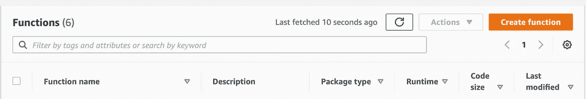

AWS Lambda 创建功能按钮

如果我们在 AWS 控制台中查看，它显示了许多不同语言的[运行时](https://docs.aws.amazon.com/lambda/latest/dg/lambda-runtimes.html?icmpid=docs_lambda_help)，但是 PHP 不在列表中。

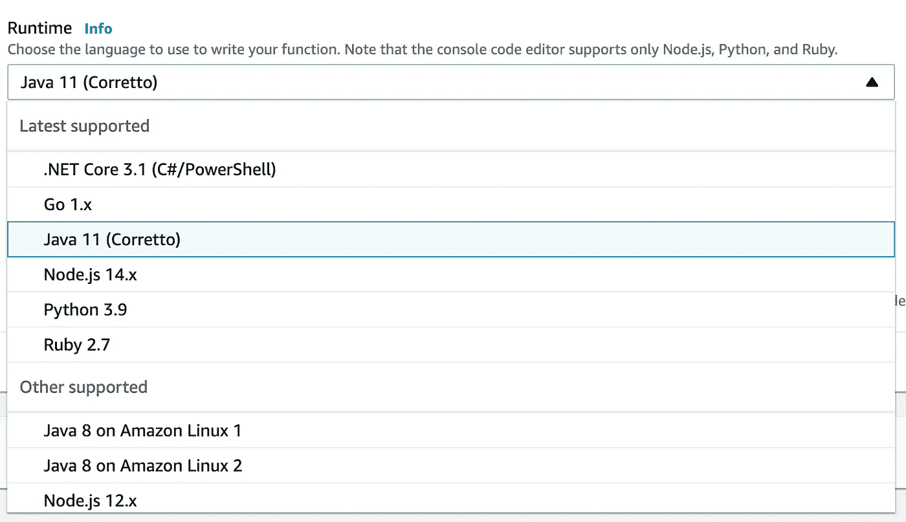

PHP 并不是列表中唯一缺失的语言，因为还有许多其他语言也缺失了，比如 Rust、Erlang 等等。在 2020 年 8 月的[中，AWS 引入了一个定制的运行时](https://aws.amazon.com/about-aws/whats-new/2020/08/aws-lambda-supports-custom-runtimes-amazon-linux-2/)，以支持用户想要在 AWS Lambda 中部署和运行的任何语言。

如果你不知道什么是运行时，请阅读官方文档了解。

[Lambda 运行时](https://docs.aws.amazon.com/lambda/latest/dg/lambda-runtimes.html?icmpid=docs_lambda_help)
[自定义 AWS Lambda 运行时](https://docs.aws.amazon.com/lambda/latest/dg/runtimes-custom.html)

Amazon 为特定的语言提供了默认的运行时，其他语言都需要定制的运行时。

# Bref 插件

PHP 社区为一个[无服务器框架](https://www.serverless.com/)引入了 [Bref](https://bref.sh/) 插件，该插件为不同类型的应用程序提供了 [PHP 定制运行时。](https://bref.sh/docs/runtimes/)

我们将部署控制台应用程序，Bref 为它定制了运行时。你可以在这里找到所有 PHP 定制运行时:[https://runtimes.bref.sh/](https://runtimes.bref.sh/)

## 如何安装 Bref 并在项目中使用它

您需要安装 Bref 并设置一个 AWS 帐户，以遵循 Bref 官方文档中的说明。[https://bref.sh/docs/installation.html](https://bref.sh/docs/installation.html)

现在你可以去你的控制台应用程序或者从 Github 下载我的“Hello World”应用程序来继续这篇文章。

PHP 控制台应用: [Github 库](https://github.com/tanvir/php-console-hello-world-app)

进入项目根目录后，安装 Bref 包。

```
composer require bref/bref
```

现在 Bref 包已经安装好了，可以开始初始化无服务器项目了。

是时候创建一个无服务器的项目结构来在 AWS Lambda 中部署应用程序了。

```
vendor/bin/bref init
```

Bref initialize 命令将要求您创建一个您的应用程序将要使用的 Lambda 函数类型。

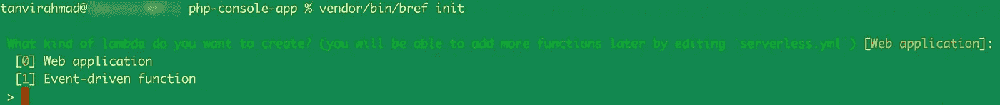

在我们的例子中，我们将创建一个“事件驱动函数”，因为它将被 EventBridge 事件调用。通过在控制台中键入 1 来选择第二个选项。

它将在项目根目录中添加两个新文件。

```
index.php
serverless.yml
```

`Index.php`是 AWS Lambda 的默认处理程序，与 Symfony Web 应用程序公共目录中的`index.php`对 apache 的作用相同。

`serverless.yml`是无服务器框架的文件，在这里我们将告诉 AWS，在哪里以及如何在云中部署我们的应用。

让我们详细看看，并尝试在`serverless.yml`文件中创建我们的基础设施代码。

默认情况下，Bref 将创建以下结构，这是一个好的开始，但不足以将控制台应用程序推向 Lambda。

```
service: app

provider:
    name: aws
    region: us-east-1
    runtime: provided.al2

plugins:
    - ./vendor/bref/bref

functions:
    hello:
        handler: index.php
        description: ''
        layers:
            - ${bref:layer.php-81}

*# Exclude files from deployment* package:
    patterns:
        - '!tests/**'
```

我们需要了解每一个代码块，并根据我们的需要进行更改。

为应用程序命名。

```
service: php-console-app
```

我们将使用相同的提供者，但是将地区从“us-east-1”改为“eu-west-1 ”,因为我们将在爱尔兰地区托管我们的应用程序。

```
provider:
    name: aws
    region: eu-west-1
    runtime: provided.al2
```

一个插件将是相同的，所以没有必要改变任何东西。

```
plugins:
    - ./vendor/bref/bref
```

接下来是最重要的部分，我们将配置 Lambda 函数并部署应用程序。

按照以下说明更改功能块。

```
functions:
    cron:
        handler: bin/console
        description: 'Hello world console command'
        layers:
            - ${bref:layer.php-81}
            - ${bref:layer.console}
```

如您所见，我们已经将调用方法从“hello”改为“cron ”,并将处理程序`index.php`替换为`bin/console`。原因是，当 EventBridge 将调用我们的命令时，我们的应用入口点是`bin/console`而不是`index.php`。

我们在应用程序中不需要`index.php`，所以通过运行以下命令来删除它:

```
rm index.php
```

接下来，我们添加了两个不同的运行时作为层来运行我们的应用程序:

```
functions:
    cron:
        layers:
            - ${bref:layer.php-81}
            - ${bref:layer.console}
```

添加图层后，AWS Lambda 功能就可以投入使用了:

```
#serverless.yml
service: php-console-app

provider:
    name: aws
    region: eu-west-1
    runtime: provided.al2

plugins:
    - ./vendor/bref/bref

functions:
    cron:
        handler: bin/console
        description: 'Hello world console command'
        layers:
            - ${bref:layer.php-81}
            - ${bref:layer.console}

*# Exclude files from deployment* package:
    patterns:
        - '!tests/**'
```

让我们试着部署一下，看看效果如何:

```
serverless deploy
```

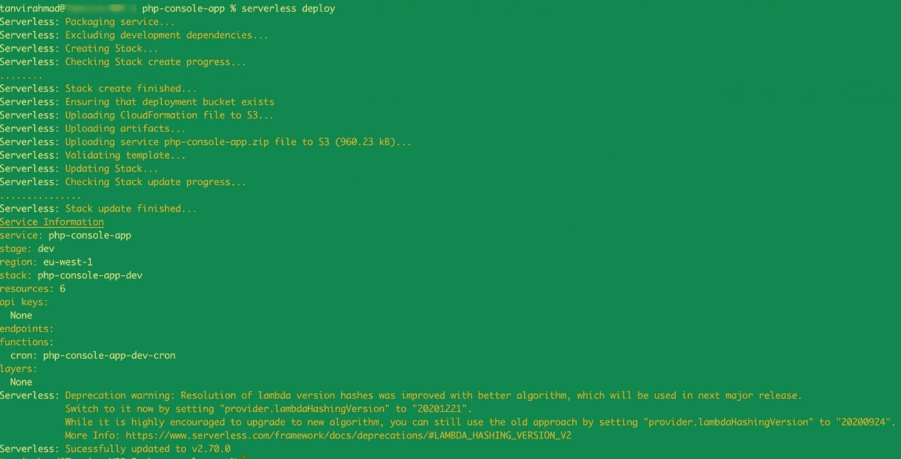

无服务器部署命令概述

如您所见，应用程序已经成功部署。去你的 Lambda 控制台找到函数`php-console-app`。

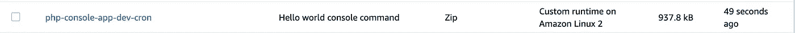

可以看到 Lambda 在函数名的末尾加了`dev`和`cron`。它附加环境(默认为`dev`)并调用函数名的方法名。

单击功能名称并打开它:

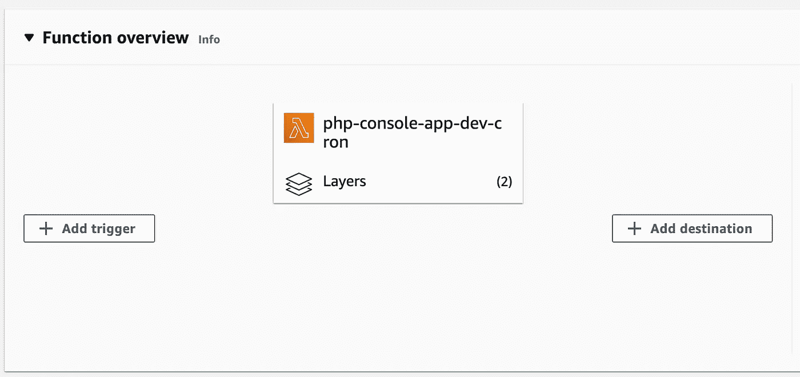

Lambda 函数概述

您可以看到 Lambda 函数已经创建，它有两层，如`serverless.yml`文件中所定义的。

如果您向下滚动，您也应该能够看到您的应用程序代码。

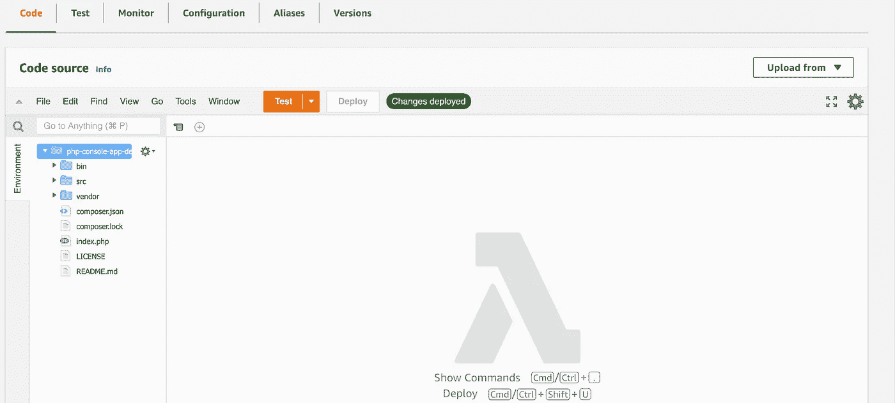

Lambda 运行时中的应用程序代码

如果你看到 Lambda 的概述，它缺少一个调用这个函数的触发器。

有多种方法可以调用 Lambda 函数，但是在我们的例子中，我们将像 Linux 中的 cron 作业一样每分钟调用一次。

## Amazon EventBridge 或正式名称为 Amazon CloudWatch Events

Amazone EventBridge 有两个不同的规则来调用 Lambda 函数。

1.  [创建对事件做出反应的 Amazon EventBridge 规则](https://docs.aws.amazon.com/eventbridge/latest/userguide/eb-create-rule.html)
2.  [创建一个按计划运行的 Amazon EventBridge 规则](https://docs.aws.amazon.com/eventbridge/latest/userguide/eb-create-rule-schedule.html)

我们将使用第二个规则来调度我们的 cron 作业。它有两种安排事件的方式，速率表达式或 cron 表达式。

让我们在 serverless.yml 文件中配置 cron 表达式，如下所示，以便每分钟运行我们的命令:

```
functions:
        {.....} 
        events:
            - schedule:
                  rate: cron(* * * * ? *)
                  input: '"app:hello-world --verbose"'
```

你可以在 EventBridge 的官方[文档](https://docs.aws.amazon.com/eventbridge/latest/userguide/eb-create-rule-schedule.html)页面找到所有的 cron 规则。

我们的`serverless.yml`的最终版本是:

```
*#serverless.yml* service: php-console-app

provider:
    name: aws
    region: eu-west-1
    runtime: provided.al2

plugins:
    - ./vendor/bref/bref

functions:
    cron:
        handler: bin/console
        description: 'Hello world console command'
        layers:
            - ${bref:layer.php-81}
            - ${bref:layer.console}
        events:
            - schedule:
                  rate: cron(* * * * ? *)
                  input: '"app:hello-world --verbose"'

*# Exclude files from deployment* package:
    patterns:
        - '!tests/**'
```

现在再次部署，看看它是否工作:

```
serverless deploy
```

要验证我们的 EventBridge 配置，请在 AWS 控制台中打开您的 Lambda 函数，看看 EventBridge 是否已被添加为触发器。

对我来说，这看起来像是补充:

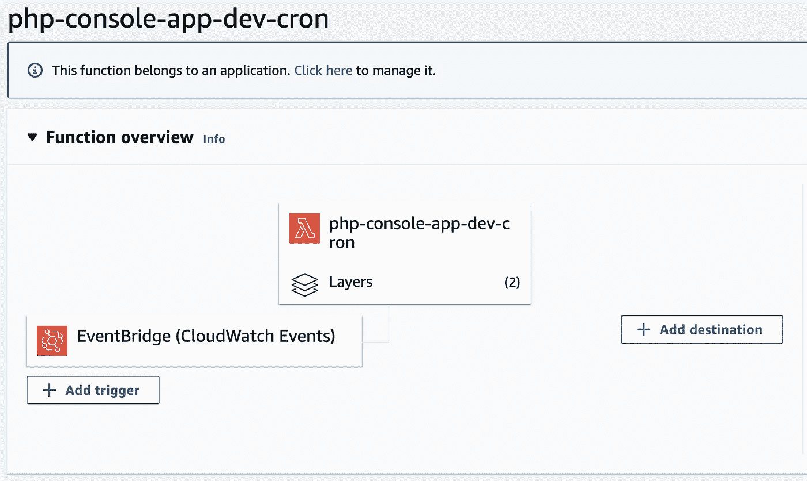

以 EventBridge 为触发器的 Lambda 函数

现在我们需要查看 Lambda 函数的日志，看看它是否每分钟都被调用。

有几种方法可以从 AWS 控制台查看日志。您可以在 Bref 桌面应用程序中或者直接在 Lambda function Monitor 选项卡中查看日志。

来自 AWS 控制台的日志:

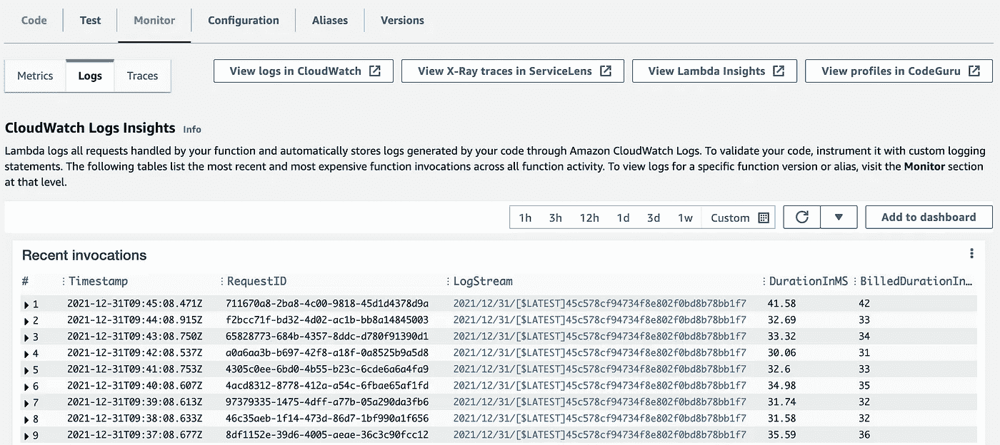

每分钟 Lambda 调用

如果您单击其中一个日志，您应该能够看到应用程序命令的输出。


AWS 控制台的日志视图

或者您可以从 Bref 应用程序中查看相同的日志。打开 Bref 桌面应用，选择 eu-west-1 地区，功能`php-console-app-dev`。

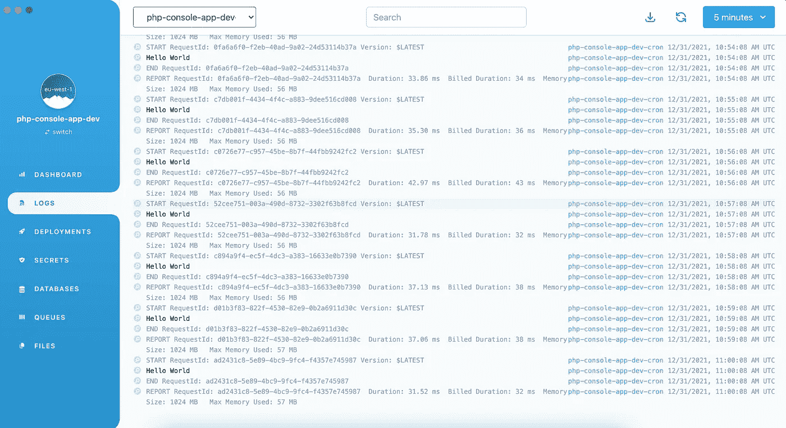

Bref 桌面应用程序的日志视图。

现在 PHP 控制台应用程序每分钟都在运行以执行它的任务。

我希望你从帖子中学到了一些东西，如果你有问题，请随时提问。

你可以从 [GitHub 库](https://github.com/tanvir/php-console-hello-world-app)下载源代码。