# 如何用 JavaScript 运行 TypeScript？

> 原文：<https://betterprogramming.pub/how-to-run-typescript-in-javascript-1545e8a36518>

## 听起来很有趣！

照片由 [Avel Chuklanov](https://unsplash.com/@chuklanov?utm_source=medium&utm_medium=referral) 在 [Unsplash](https://unsplash.com?utm_source=medium&utm_medium=referral) 拍摄

这是一个很有意思的技术问题。虽然我们的常见需求并不要求我们在 JavaScript 中运行 TypeScript，但在一些工程场景中可能是有用的，比如在 Node.js 环境中读取 TypeScript 配置文件等。所以请跟我来看看如何实现！

# 准备测试代码

这里是[到我们准备运行的类型脚本文件的链接](https://stackblitz.com/edit/node-nseqy7?file=test.ts)。

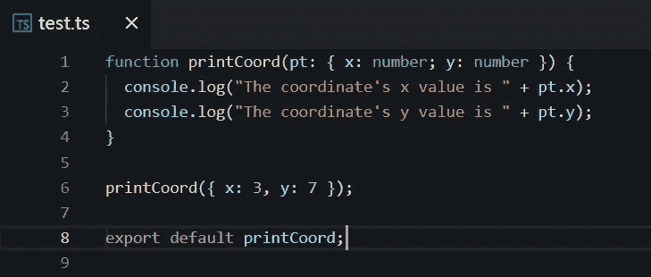

# 第一部分

[ts-node](https://www.npmjs.com/package/ts-node) 是一个可以直接在终端上执行 TypeScript 的工具。我们可以使用它提供的 API 来实现第一个版本。

`part1.js`的[代码链接](https://stackblitz.com/edit/node-nseqy7?file=part1.js)在这里，你可以打开它，直接在终端输入`node part1.js`运行并查看其结果。

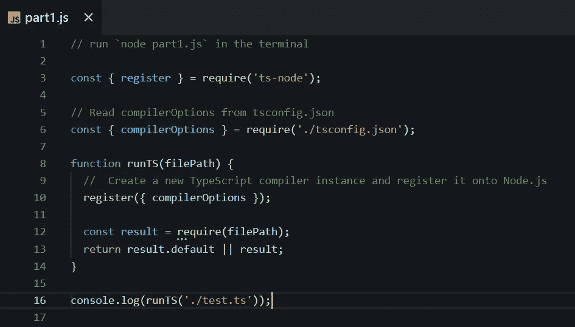

做得好，它工作并输出以下结果。

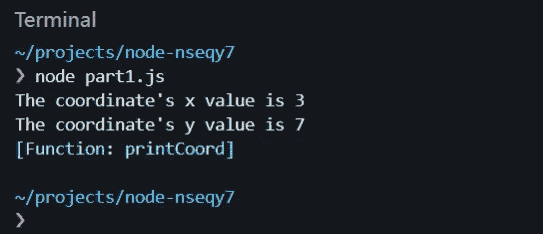

我们在 JavaScript 中运行 TypeScript 的代码，得到在 TypeScript 中导出的对象，即任何用 TypeScript 编写的代码都可以在 JavaScript 中调用。

但实际上是`ts-node`提供的名为`register`的神奇 API 帮助我们完成了主要工作。那么它有什么魔力呢？

# 第二部分

我们可以用调试来探究神奇的根源，如果你对调试不熟悉，可以按照[的链接](https://levelup.gitconnected.com/want-to-become-a-senior-frontend-developer-you-must-master-debugging-f577ee569687)去看我之前贴的调试教程系列，里面总结了很多有用的信息。

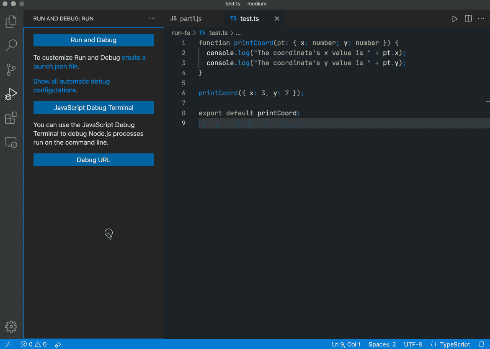

你可以看到我在`test.ts`文件中放了一个断点，这样你就可以看到它是如何在调用栈中被加载和执行的。

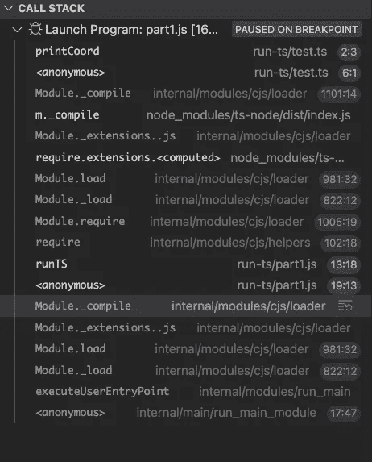

上图是完整的调用栈。我们点击进入下图中函数的调用，可以看到`Module._extensions[extension]`被注册为`.ts`文件扩展名的调用函数。

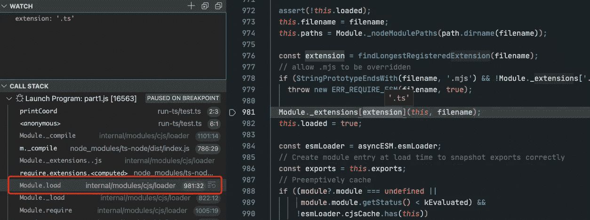

接下来，我们可以看到非常关键的功能`registerExtension`。

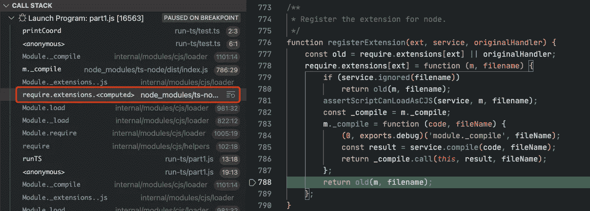

这个`registerExtension`可以称之为魔法的起源，为什么这么说？请跟我来。

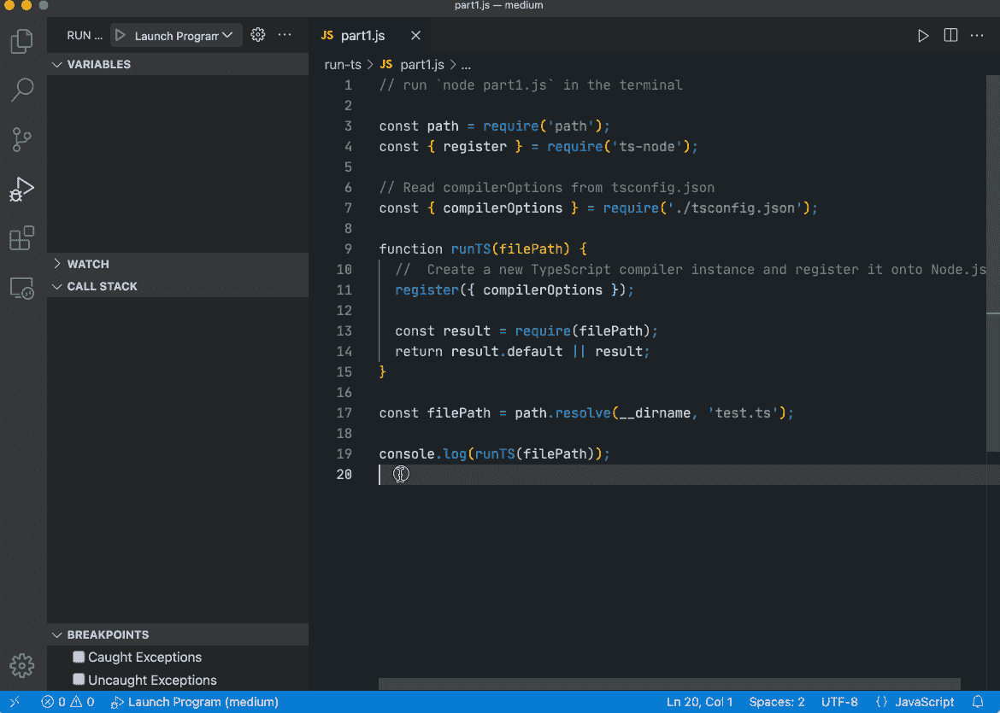

这次，我在`register`函数上设置了断点。通过调试可以看到，它以`.ts`为参数调用`registerExtension`，在`registerExtension`内部可以看到表达式`require.extensions[ext]`，其效果等同于`Module._extensions[extension]`。联系以上，我们可以得出结论，当传入文件扩展名为`.ts`时，实际上相当于调用了这里的绑定函数。

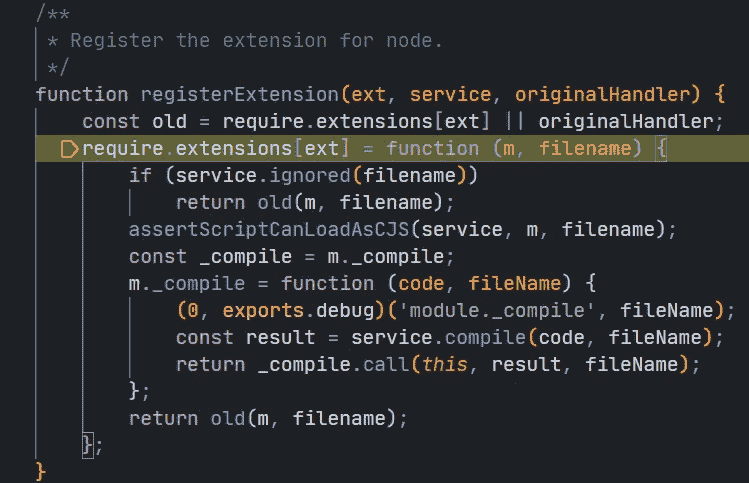

所以理解这个函数的逻辑就能揭示其中的神奇。通过链接上下文，我们可以编写一个简单的模仿版本。

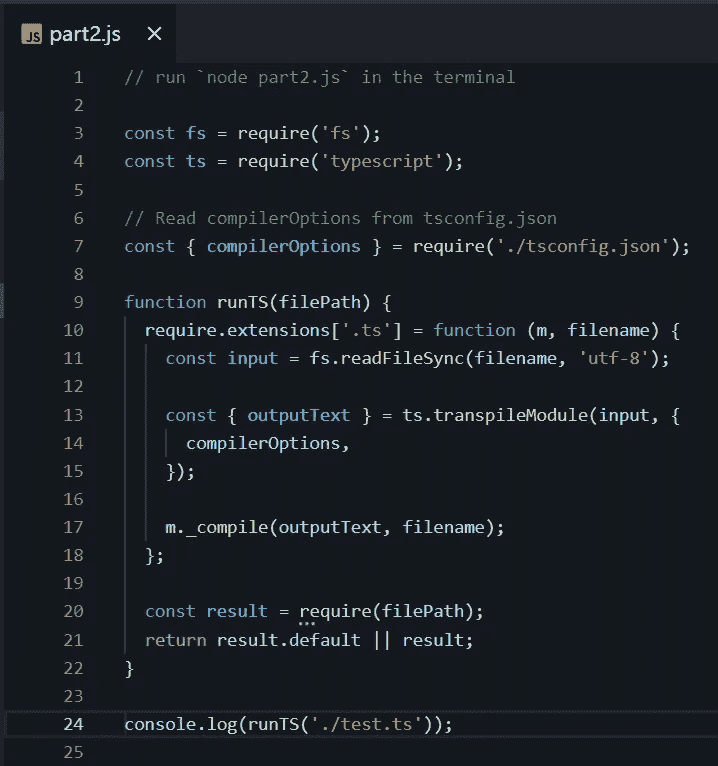

[代码链接](https://stackblitz.com/edit/node-nseqy7?file=part2.js) `part2.js`在这里，你可以打开它，直接在终端输入`node part2.js`运行并查看其结果。

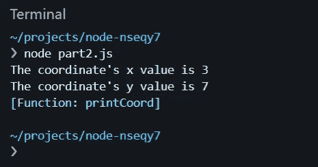

你可以看到它像预期的那样工作。在真实的生产环境中，我们可能更喜欢使用第 1 部分中的代码，因为它考虑了更多的边界条件，但这并不妨碍我们理解底层的原理，所以让我详细解释一下上面的代码。

首先我们了解到，在调用 Node.js 提供的原生 API `require`时，会依次调用`Module.require`、`Module._load`、`Module.load`等方法。在`Module.load`中，会根据文件的扩展名调用相应的方法，所以我们可以直接在`require.extensions['.ts']`上绑定一个调用方法，这样当需要一个 TS 文件的时候，就会进入我们的方法。

接下来就是按照`registerExtension`的逻辑。首先读取 TS 的文件内容并使用`typescript`模块提供的`[transpileModule](https://github.com/microsoft/TypeScript/wiki/Using-the-Compiler-API#a-simple-transform-function)`方法将 TS 代码编译成 js 代码，得到`outputText`的 JS 代码串，最后使用 Node.js 提供的 native API `Module.prototype._compile`编译执行 JS 代码串。

哇，太酷了，不是吗？我们用 JavaScript 实现了运行 TypeScript，在某些特定场景下非常有用，希望有帮助。

今天到此为止。我是 Zachary，我将继续输出与 web 开发相关的故事，如果你喜欢这样的故事，别忘了关注我。