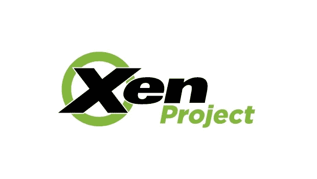
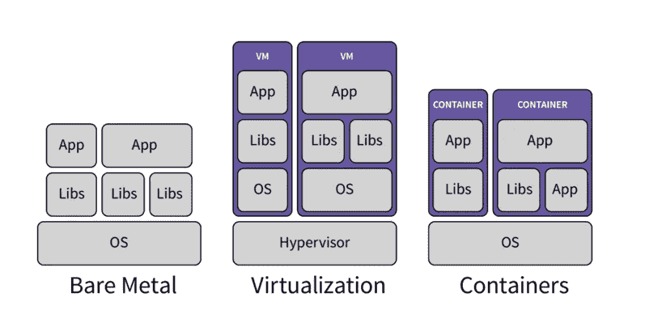
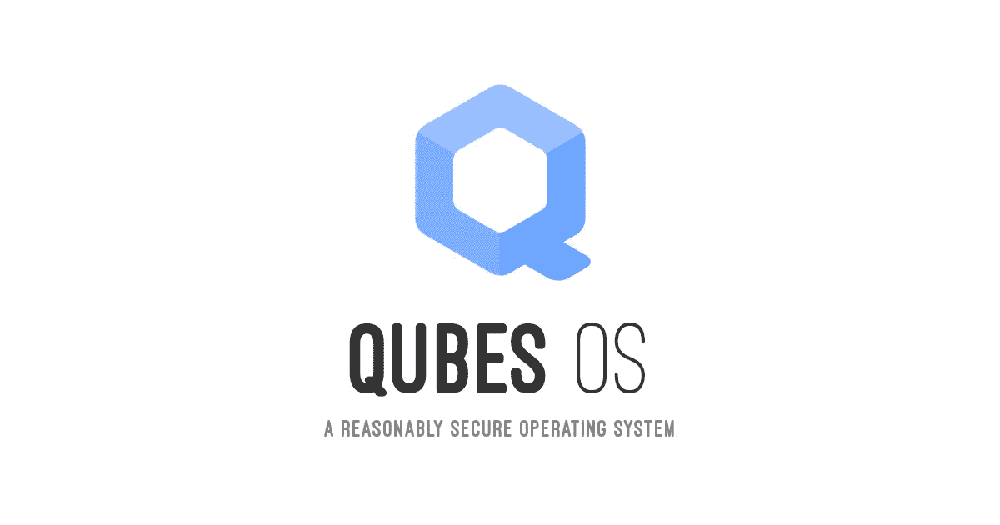

# 如何使用 Xen 在 Linux 上运行 Windows

> 原文：<https://betterprogramming.pub/how-to-run-windows-on-linux-using-xen-12e046f86348>

## 比双引导更好


Xen 熊猫

警告 : 我绝不是这方面的专家。我只是顽固不化，顽固到足以成功地让这样的设置为自己工作。

这是一个涉及到真正挖掘你的硬盘驱动器的底层，并有可能真正破坏东西的话题。

我写这篇文章是因为我真的找不到任何关于这方面的可靠文档，我认为这是双引导的一个很好的替代方案，比一般的虚拟机设置好得多。继续进行，后果自负！

# 介绍

假设你刚刚得到一台崭新的笔记本电脑。恭喜你！你需要摆脱那个老怪物，并期待着你的新机器有一个光明的未来。

现在，如果你正在读这篇标题的文章，你的新机器可能装有视窗系统，或者根本没有操作系统。你知道你真的想在你的机器上运行 Linux，因为你非常酷(因为它不太容易监视你或感染病毒，因为如果你是一名开发人员，一旦你习惯了它，就很难回头，但现在让我们坚持完全酷)。

然而，你不确定你已经准备好完全摆脱 Windows。可能有一些程序在 Linux 上很难运行。([葡萄酒](https://www.winehq.org/)可以涵盖其中一些，但正如他们的数据库显示，肯定不是全部。)

也许是怀旧，安慰，或者是未确诊的受虐狂。无论如何，让我们谈谈你的选择:

*   独立的 Linux 和 Windows 机器。
*   Linux 和 Windows 的双重引导。
*   在虚拟机中运行 Windows。

即使你买得起第一个，我也不确定。你将被分成两台机器。你打算每天都带着它们去上班，插上电源，把它们放在办公桌上，然后在键盘之间切换吗？如果你想的话，当然可以，但是我们继续找吧。

从很多方面来说，双引导都是经典的答案。对于那些不知道的人来说，这意味着计算机可以识别两种不同的操作系统，并在启动时让你选择使用哪一种。

一般来说，有一个是优先的，如果五到十秒钟后没有选择，计算机将默认为优先。您可以从您的计算机 BIOS/UEFI 菜单中选择哪个具有优先级，您可以在启动时通过按 enter、F1、F2 或某些其他按钮(取决于您的计算机制造商)来输入。

在这里，你可以在同一台机器上运行 Windows 和 Linux，一切似乎都很好，对吗？不过，我想我们还是可以期待更好的结果。

首先，这两个操作系统根本不能相互通信。例如，如果你想把一个文件从 Windows 转移到 Linux，在我看来，最简单的方法是启动到任何一个有这个文件的操作系统，把它复制到一个 USB 上，或者通过邮件/信息发给你自己，然后重新启动到另一个操作系统，然后把它从 USB 上拉回来或者下载它。

此外，似乎还有一个与操作系统更新有关的问题。当你对双引导进行分区时，本质上你告诉每个操作系统:“嘿，你不能占用这台计算机上的所有空间，只能占用这两个地址之间的空间，”然后把地址分发给每个操作系统，这样它们就不会互相覆盖。

当操作系统更新(尤其是 Linux GRUB 更新)时，它似乎有时会忘记您的初始请求，并开始越过它应该能够访问的地址向磁盘写入数据。这可能会开始覆盖 Windows 的随机部分。坏消息。

我有一次双开机，过了某个点就再也登录不了 Windows 了。它会识别正确的密码，然后把我直接转到登录屏幕上。GRUB 意外覆盖 Windows 可能是罪魁祸首。

如果你仍然真的想进行双引导，请继续阅读。我认为 Xen 也可能有助于缓解这个问题。

如果我们可以在需要的时候启动 Linux 并简单地打开它上面的 Windows，那不是很好吗？这就是虚拟机试图解决的问题。

虚拟机是一个巧妙的小魔术。它们是一个程序，可以对操作系统说:“嘿，对你来说我看起来像一台硬件计算机，对吗？”并且在你的计算机上的程序中运行操作系统。

这些工具已经变得非常好了，你应该能够拖放文件，还有其他功能。

不过，这也有不好的一面。假设你保留 Windows 的主要原因是你最喜欢的图形渲染器或 AAA 游戏。你已经有了强大的内存和专用的 GPU。

记住，虚拟机是一个程序，并不真正访问你的硬件。你会运行这些程序，就好像你根本没有这些程序一样。(说实话，你也许可以给你的 VM 分配 RAM，但我不认为大多数常见的 VM 选项允许 GPU 通过。)

如果有一个像虚拟机一样工作的东西，允许我们在 Linux 上随意启动它，但允许访问计算机上的底层硬件，这不是很好吗？

# 输入 Xen

裸机虚拟机管理程序。



我认为每篇文章中都有一个必不可少的图表，看起来像这样:



图表来自 [GitLab，](https://about.gitlab.com/blog/2017/11/30/containers-kubernetes-basics/)，经知识共享许可协议许可，在此复制

它证明了这正是 Xen 努力要做的。如果当你看到“1 型管理程序”这样的短语时，你的眼睛开始流泪，不要担心。第 1 类虚拟机管理程序是一种“裸机”虚拟机管理程序，我们将解释这意味着什么。

*裸机*意味着您创建的虚拟机将在您的硬件上运行，而*虚拟机管理程序*(在本例中)意味着它通过在引导过程中添加一个步骤来实现这一点。您的计算机不是直接引导到 Linux，而是首先引导到 Xen，然后 Xen 启动您的主操作系统(当然是 Linux)。

我之前说过，如果你有一个双引导设置，我认为 Xen 甚至可能是一个帮助。这就是虚拟机管理程序的原因。如果你有一个双引导并且在 Linux 上安装了 Xen，它也会识别 Windows 引导加载程序。(屡试不爽。)

本质上，你不仅仅是告诉这两个操作系统应该坐在内存地址表的哪一边，你甚至雇佣了 Xen 来确保它们友好地工作。

我不能保证这是对操作系统更新覆盖他们不幸室友的完整解决方案，但它是合理的。

# 本教程的目标

我们假设你有一台 Windows 电脑，你想把它变成一台 [Debian](https://www.debian.org/) 机器，可以使用 Xen 随意启动 Windows。

我们现在列出基本步骤。如果你不理解这些术语，不要担心。我们将尽可能清晰地浏览所有内容。他们在这里:

*   在 Windows 中，提取产品密钥并对大部分硬盘进行分区。
*   安装 Debian(你需要一个新的/一次性的 USB 驱动器)。
*   从 Windows 或 Debian 中分离出另一个块。
*   在 Linux 上安装 LVM，并使用它创建一个卷组。
*   安装 Xen 并下载或提取 Windows 映像。
*   使用 Xen 启动 Windows。
*   一旦 Xen 工作，扩展 Windows 分区来使用所有旧的 Windows 安装。

需要明确的是，如果你有一个 GPU，你将需要工作一个 passthrough out 以便在 VM 内部利用这个卡。这个*可以*实现的事实非常酷，但是我不打算在这里讨论它，因为我自己还没有尝试过这样做，而且看起来这是一个高级的话题。

# 几个注意事项

首先，此过程将覆盖您的原始 Windows 安装。如果你在 Windows 中有程序、文件、链接等等，在线或外部备份它们。否则，它们将被覆盖。

接下来，这就有点流程了。我当然不会认为这是一个容易的项目，即使它是一个可怕的项目。很可能你会在某个地方卡住。不幸的是，Xen 的文档在这一点上很难导航。很难说什么是过时的，什么将解决具体问题。

你的两个最佳选择很可能是 Xen IRC 或者 T2 Xen subreddit。我们经历所有这些步骤的原因之一是，你应该始终拥有一个正常运行的 Windows 版本，以防中途出现问题。

最后，本教程是根据我使用英特尔芯片的计算机的经验编写的，我怀疑下面的内容不适用于运行 AMD CPUs 的计算机(不过 AMD GPUs 应该没问题)。

Xen 的文档谈到了在英特尔和 AMD 上运行的一些差异，但不幸的是，我对此没有任何经验。

# 千伏计（kilovoltmeter 的缩写）


BY o . t . s . u .——【https://commons.wikimedia.org/w/index.php?curid=24109871】http://openvirtualizationalliance . org/downloads/KVM-logo _ 300 dpi . png，CC BY-SA 3.0，[](https://commons.wikimedia.org/w/index.php?curid=24109871)

除了 Xen 之外的另一个选择是 KVM。我没有技术上的理由选择 Xen 而不是 KVM。我只是碰巧先发现了 Xen。

如果你有兴趣尝试使用 KVM，一个简单的[搜索](https://duckduckgo.com/?q=kvm+windows+10+vm&t=ffab&ia=web)会出现大量结果。我想特别提一下我在这个网站上找到的一篇文章，这篇文章深入介绍了如何在 KVM [上进行 GPU 直通。](https://heiko-sieger.info/running-windows-10-on-linux-using-kvm-with-vga-passthrough/)

# Qubes



如果我没有提到 Qubes OS，我会感到失职。Qubes 是一个 Linux 发行版(一个 Linux 操作系统),基于基于 Xen 集成的 Fedora。安装它为使用 Xen 提供了一个很好的界面，他们有很好的文档，他们的 IRC 也很活跃。

我在他们的社区中接触过的大多数人都非常乐于助人。如果你对在 Qubes 上运行 Windows 感兴趣，那就想尽一切办法。

你所需要做的就是从 Windows 获得产品密钥(下面详细介绍)，制作一个安装 USB(下面详细介绍 Debian，只需使用 Qubes 的安装说明)，然后覆盖整个磁盘。之后，按照 Qubes 自己的教程设置一个 Windows HVM。

出于几个原因，我在本教程中没有使用量子。一个是 Debian(和 Ubuntu，它是 Debian 的一个分支)是非常受欢迎的发行版，我不认为仅仅因为我这么说或者因为他们可以在上面运行 Windows 就假设 Debian 或 Ubuntu 的粉丝会安装一个基于 Fedora 的发行版是合理的。

的确，一旦你玩了一点 Qubes，你就会明白你真的不需要花时间在 Dom0 上，它是系统中唯一必须是 Fedora 的部分，你可以花所有的时间在 Debian VMs 上，但我觉得谈论 Debian 更主流。

另一个原因与性能有关。Qubes 的目标是增强隐私和安全性。因此，将 GPU 连接到虚拟机非常困难。如果你想在 Linux 上获得最佳性能的 Windows，那么 Qubes 可能不适合你。

好吧！介绍到此为止！

# 我们去兔子洞！

## 部门窗口

定期引导进入 Windows。打开*开始*菜单，输入“分区”这个词。搜索应该会给你提供一个叫做“分区工具”的选项。点击它。

这将打开 Windows 的分区管理器。分区基本上是硬盘的保留部分。硬盘中的内存有地址，分区表基本上是这样写的:“嘿，Windows，你在分区表中的位置在地址`0x00000001`和`0x2fffffff`之间”。

如果你按下*开始*按钮并输入“分区”，你将得到打开分区管理器的选项。你应该会看到`C/:`分区几乎占据了整个电脑，还剩下一点给默认的 Windows 恢复驱动器。

如果你右击它，应该有一个选项来调整它的大小。

**警告**:本教程假设这是全新安装。如果您已经使用此安装有一段时间了，您可能会因调整大小而丢失数据，因此请确保您首先备份所有内容。

为 Windows 留出足够的空间来运行您需要它运行的内容。现在很可能没有必要吝啬给 Windows 留出空间，我们应该能够在本教程的末尾为将在 Xen 上运行的新 Windows 安装收回所有空间。

您可能希望在此基础上再留出 50GB 左右的空间，我们稍后将在新的 Windows 安装中使用它。或者，在 Debian 安装过程中，您可以选择不占用所有可用空间，保留 50GB 不分区，或者稍后从 Debian 内部进行分区。

我建议现在不要这样做，稍后再从 Debian 内部将它分割出来，尽管这看起来比一开始就不分配要多得多。这是我将详细介绍的唯一选项。

您需要做的另一件事是提取您的 Windows 产品密钥。稍后您将需要它来注册新安装的 Windows。

**警告**:我假设这是合法的，Windows 安装似乎也暗示了这一点。你有一个合法运行的 Windows，只是以不同的方式运行相同的软件，甚至是在同一台机器上。如果有任何问题，请联系我。

以管理员身份打开命令提示符。您可以通过右键单击*开始菜单*图标，或按下`Windows Key + X`并选择它来完成此操作。(我好像记得 PowerShell 和 admin 的工作方式完全一样。)类型:

```
wmic path SoftwareLicensingService get OA3xOriginalProductKey
```

记下输出。

好了，现在 Windows 就到此为止。但是不要关闭。我们仍然需要下载 Debian 来安装它。

## 安装 Debian

安装操作系统的一般方法包括创建一个可从启动的 USB 驱动器(“活动 USB”)。我们将下载一个工具，然后您将创建一个 Debian 驱动器。

**当心**！这将删除闪存盘上的所有内容。不仅如此，它很可能会使驱动器无法(可靠地)存储任何东西。这应该被视为你的拇指驱动器的单程旅行，永远降级为 Debian 安装介质。

之后，您也许可以对该驱动器进行重新分区，但即使这样做，它也很有可能不稳定。

我推荐用鲁弗斯。去[他们的网站](https://rufus.ie/)下载程序。

现在是时候下载 Debian 的图像了。Debian 网站在不同的页面上提供了许多不同的下载选项。我推荐[这个页面](https://www.debian.org/CD/live/)，它会给你两个选项来下载一个实时安装的镜像(我一会儿会解释的):torrent 和 regular。

如果你熟悉 torrenting，这可能是最好的选择，因为它是一个大的安装，如果它停止了，你将能够恢复。无论哪种方式，你最有可能是在寻找图像的 amd64 版本。

尽管如此，还是有许多不同的选择(由于不同的桌面环境)；我们将在这里使用 GNOME 的选项。您正在寻找一个以扩展名`.iso`结尾的文件。

例如，Debian 10.3(带 Gnome)的 amd64 实时图像的 HTTP 下载是`[https://cdimage.debian.org/debian-cd/current-live/amd64/iso-hybrid/debian-live-10.3.0-amd64-gnome.iso](https://cdimage.debian.org/debian-cd/current-live/amd64/iso-hybrid/debian-live-10.3.0-amd64-gnome.iso)`。

什么是实时安装映像？基本上，这意味着你实际上可以从写有操作系统的 USB 驱动器上启动操作系统。这只是一个额外的小好处，这意味着如果安装中出现问题，您可以从活动 USB 启动并尝试排除故障。

下载完图像后，使用 Rufus 将其写入 USB。同样，这个 USB 将永远是一个安装 USB。即使您删除了安装媒体(并对其重新分区)，它也很有可能会出现故障。

一旦你把 Debian 写到 USB 上，你可以把它留在里面。你马上就能启动它了。

太好了！我们现在准备重启并安装 Debian。这是不用说的，但是以防万一:如果你在你将要关闭的窗口中阅读这篇文章，确保你在不同的屏幕中打开它，打印它，或者确保你知道下一步该做什么。

你需要用 USB 重启。有些计算机会自动完成这项工作。其他人可能会给你一个引导选择菜单；一个应该是类似“Debian live media installation”的东西。其他的可能会让你进入 BIOS/UEFI 菜单。

当电脑启动时，你需要在通常很短的时间内按下某个按钮。许多打开的屏幕都很友好地告诉你是哪个按钮(称之为“高级选项”、“引导选项”、“正常设置中断”或类似的东西)。`F1`、`F2`、`Esc`、`Enter`都是常见选项。

如果你真的卡住了，你可能可以在网上查一下——只要搜索你的电脑品牌，然后“进入 BIOS”，我想你会找到的。

一旦你进入，应该会有一个启动优先级的菜单或者类似的东西。应该有一个类似“Debian live media”的选项，确保它是顶部的选项，然后确保保存更改(通常在退出 BIOS 菜单时完成)。这将引导你进入 USB，并启动 Debian 安装程序。

Debian 的安装非常简单，所以我不打算详述。我要指出的唯一一点是，你会看到选择占用所有空闲内存(通常是默认的)，覆盖整个磁盘，或者指定你希望 Debian 安装占用多少空间。

我不推荐它，但是因为我们稍后将需要 50GB 来安装 Xen Windows，如果你愿意的话，现在你可以在任何东西上免费安装 Debian 减去 50GB。

或者，你可以以后把它从旧的 Windows 上刮下来，或者从 Debian 中分离出来。我推荐最后一个选项，只是在所有空闲空间安装，这是我将详细解释的选项。

如果您选择在整个磁盘上安装，它将覆盖 Windows。如果我没弄错的话，你可能仍然可以引导到 Windows，但是它的一部分可以在任何时候被 Debian 任意改写，所以如果你仍然对使用旧的 Windows 系统感兴趣的话，现在不推荐这样做。

安装完成后，系统应该会重新启动。当它打开时，你应该拔出 u 盘。如果你的电脑自动启动到实时 USB，它会重新加载 Debian 安装程序，如果你不这样做。

重启时你可能需要在 Debian 和 Windows 之间做出选择，Windows 可能是默认的。

如果您在旧的 Windows 中留下了额外的 50GB，现在是启动到 Windows 并再分区 50GB 的好时机。之后，启动 Debian。

## 在 Debian 上设置 Xen

(我打算掩饰一下 Debian 的设置。如果你对 Debian 完全陌生，你应该知道默认情况下它没有默认用户的`sudo`。

关于如何将你的用户添加到`sudo`中，网上有很多好的指南(如下)，我们假设你已经这样做了。最坏的情况是，你可以输入`su`进入超级用户模式，这就像在每个命令前输入`sudo`。)

*   [如何在 Debian 上给 Sudoers 添加用户](https://linoxide.com/linux-how-to/add-user-to-sudoers-on-debian/)
*   [如何在 Debian 中添加用户到 Sudoers](https://linuxize.com/post/how-to-add-user-to-sudoers-in-debian/)
*   [如何在 Debian 10 Buster 上给 Sudoers 添加用户](https://devconnected.com/how-to-add-a-user-to-sudoers-on-debian-10-buster/)
*   [如何在 Debian VPS 上添加、删除和授予用户 Sudo 权限](https://www.digitalocean.com/community/tutorials/how-to-add-delete-and-grant-sudo-privileges-to-users-on-a-debian-vps)

我们现在需要在 Debian 上做一些分区工作。如果你没有剩下 50GB，我们需要把它从 Debian 中分离出来。不管怎样，我们都要将这 50GB 变成一个*卷组*。

(我真希望我做这个的时候笔记做得更好。我正在尽力重建它。)

```
sudo apt install lvm2
```

(可能已经安装了。)

用`sudo fdisk -l`列出电脑上的各个分区。注意哪一个安装了 Debian。在本教程中我们称之为`/dev/sda4`。不管是什么，前面都应该有`/dev/`。

**如果您没有 50GB 的未分配空间**

`sudo fdisk /dev/sda4`应该会把你带入一个特殊的`fdisk`菜单。键入`n`创建一个新的分区。您正在寻找一个主分区，我强烈建议您使用默认分区，除非您真的知道自己在做什么。

要使这个分区为 50GB，在出现提示的地方输入`+50G`，可能是在`Last sector`行。当您回到`fdisk`命令行时，键入`p`进行打印，您应该会看到一个新的 50GB 分区。

记住它在哪里，我们在这里用`sda6`。在`fdisk`命令行上，键入`w`。您所做的一切都不会被保存(当然也不会被执行)，直到您用`w`将更改写到磁盘，这也应该会让您退出到常规命令行。(如果需要不保存退出，使用`q`。)

**如果您有 50GB 的未分配空间**

我不打算详细讨论这个，但是你需要一个像`parted`或`cfdisk`这样的资源来对它进行分区。从现在开始，我们将这个新分区称为`sda6`，尽管它在您的系统中可能有不同的名称。

不管怎样，一旦有了新的分区:

```
sudo pvcreate /dev/sda6
```

(其中`sda6`是新的分区。)

```
sudo vgcreate vg0 /dev/sda6
```

这将创建一个名为`vg0`的卷组。(如果你愿意，你可以用你喜欢的任何名字来代替。)接下来，使用 LVM 创建一个逻辑卷:

```
sudo lvcreate -n win -L 49G vg0
```

这意味着在`vg0`上创建一个名为`win`的逻辑卷，大小为 49GB。

(我认为使用全部 50GB 是不明智的，尽管我并不确定。你也许可以把它刮得更小:当你谈论空闲空间时，1GB 是一个很大的空间。)

## 设置 Windows HVM

Xen 中有不同种类的虚拟机。

对于 Windows，我们将需要一个 HVM(硬件虚拟机)，不仅仅是因为它将让我们像 GPU 一样访问硬件，还因为 Windows 与众不同，其他类型的虚拟机无法与 Windows 一起工作(至少据我所知)。

首先，从微软下载一个 Windows 映像。这可能需要一段时间，因为下载量很大。(我找了一下，没有找到一个官方的种子，我对使用其他未经验证的种子非常谨慎，这是由于合法性和额外的恶意软件的机会。)

或者，有一种方法可以从现有的 Windows 安装中生成映像。你需要一个 USB 来移动它。在 Windows 中，打开*设置*，进入“系统和安全”，点击“文件历史”。

应该有一个名为“系统映像备份”的选项，它将允许您使用当前安装创建一个`.iso`。这甚至应该能够保存用户和其他信息，虽然我没有尝试过这一点，不能告诉你到底保存了什么和如何保存，所以请不要依赖我，做你自己的研究。

你需要把它转移到 USB 上，这样你就可以把它转移到你的 Debian(或其他)安装上。

如果你只需要 Windows 来测试应用开发、安全研究之类的，微软其实有限时限量的 Windows 下载可以免费使用。

如果我没记错的话，它三个月后就过期了，而且没有 Windows 的全部功能，但如果它符合你的目的，那就去买吧。

将 Windows 安装放在您的主目录中。你可能也想给它起个更方便的名字。下面将从*下载*中取出文件，放在您的主目录中，并将其重命名为`win.iso`。

```
mv ~/Downloads/<something like Win10_1909_English_x64.iso> ~/win.iso
```

我们需要为 Xen 创建一个配置文件。

打开一个终端，输入`nano xenwin.cfg`。如果没有 [Nano](https://www.nano-editor.org/) ( `bash: command nano not recognized`，可以用`sudo apt install nano`安装。您也可以使用任何您喜欢的文本编辑器——我只是建议将 Nano 作为一个简单的选项。

我要坦白一件事。这个配置文件中有很多我不知道的东西。我写这篇文章的原因之一是因为我在寻找可靠的、最新的信息时遇到了极大的困难，并且我认为这将是通用的，即使我并不完全理解。

我将尽力解释一下，这样您可能会知道如何进行故障诊断，但不幸的是，我自己并不完全了解，甚至可能有些东西需要进行不同的配置。顾客小心上当。键入以下内容:

```
builder=’hvm’memory=4096vcpus=4name=”win”vif=[‘bridge=xenbr0’]disk=[‘phy:/dev/vg0/win,hda,rw’, ‘[file:~/win.iso,hdc:cdrom,r](/~/win.iso,hdc:cdrom,r)’]boot=”d”sdl=0serial=’pty’vnc=1vnclisten=”0.0.0.0”vncpasswd=”foo”
```

如果你在 Nano 上，按`CTRL+X`保存并退出。(保存到当前缓冲区意味着保存文件。)

如果您在 Windows 虚拟机中的目标分辨率大于 800x600，您可能需要添加:

```
videoram=16
```

如果它大于 1280x1024，则保持不变，但还要加上:

```
stdvga=1
```

(再次，`CTRL + X`在 Nano 中调出保存并退出。)

这是详细情况，至少我认为我知道的是这样。

指定 Xen 应该构建什么样的虚拟机。有几个不同的选项，但是对于 Windows，你需要一个 HVM，而且以我微薄的理解，这可能是你想要的。

`memory`是应该给虚拟机分配多少内存。我指定了 4GB，我不认为您应该低于这个数字，但是如果您有一台强大的机器，请随意增加这个数字(作为快速参考，8192 和 16384 是 2 的下两个幂)。

`vcpus`是虚拟 CPU 的数量，4 是一个猜测。有人警告我，最好从低开始，然后添加。您也可以在安装后增加内存和 VCPUs 的数量；就像升级你的硬件一样。

`name`是您的虚拟机的名称。我选择了`win`，但是你可以根据自己的喜好定制。

`vif`与网络有关，稍后我们会详细介绍。

`disk`解释了`.iso`应该安装到哪里(以及从哪里运行)，以及安装文件在哪里。再细分一下，`'phy:/dev/vg0/win,hda,rw'`说虚拟机的物理位置应该在`/dev/vg0/win`。

如果我理解正确的话，`hda`指的是 VM 的内部架构，入口挂载点在哪里。我知道如果`hda`不起作用，你可以试试`xvda`(在`file:`部分用`xvdc`代替`hdc`)。

`rw`表示读写，即 Xen 也可以写修改。我觉得这是默认，但是明确写出来也无妨。

`'file:~/win.iso,hdc:cdrom,r'`表示安装文件在您的主目录中(`~`是`/home/your-username`的快捷方式)，它应该出现在虚拟机中标有`hdc`的虚拟驱动器上，该驱动器应该像 cd 驱动器一样工作，并且是只读的。

最后三个条目是关于 VNC 的。您将需要一个 VNC 播放器来“播放”您正在运行的 VM，以便在屏幕上看到它并与之交互。您可能不需要设置密码，但是如果我不设置，就会遇到问题。您可以将密码设置为您喜欢的任何值。

## 运行 Windows

我们之前提到过 VNC 球员。任何 VNC 播放器都可以，但是，在玩了一会儿之后，我将使用内置的远程桌面查看器( [Vinagre](https://github.com/GNOME/vinagre) )，如果你在 Debian 上使用 GNOME，你应该已经有了。

这是我们期待已久的时刻:

```
sudo xl create xenwin.cfg
```

如果一切顺利，Windows 应该会启动。尽管你看不到它。进入应用程序菜单(窗口或超级按钮)，并搜索远程桌面。

你应该有一个名为“远程桌面浏览器”的选项。打开它。单击“连接”，并选择 VNC 作为协议。键入`localhost`作为主机，然后点击连接。

如果您在配置文件中列出了密码(上面的模板使用了“foo”)，请键入您的密码，然后按 enter 键。如果一切进展顺利，您应该有一个窗口显示 Windows 启动和开始安装。

请注意，您还没有运行到虚拟机的互联网连接，因此在安装期间选择不连接到网络。(我在安装之前亲自设置了网络连接，所以如果这导致了生成 VM 的问题，请跳到下面关于网络的部分。)

只需注意:当您启动 Vinagre 时，您的光标(鼠标、指针等)现在是 VM 中的光标。如果你想离开 VM，回到 Debian-land，按下`CTRL+ALT`。

厉害！

当然，一些调整是可能的；很有可能这在第一次运行时不起作用。您可能会发现一个有用的命令是`sudo xl dmesg`，它会将日志从 Xen 输出到终端。仅仅阅读错误信息就可以让你知道问题出在哪里。

我想强调的一个特殊问题经常出现在配有英特尔集成显卡的计算机上。

如果你有这个问题，你的`xl dmesg`日志将会充满关于`IOMMU`的错误。虽然我怀疑有更优雅的解决方案也能提供更好的图形，但有一种方法可以解决这个问题:

首先，找到你的`xen.cfg`文件。它可能在`/etc/default/grub.d/xen.cfg`中，但如果不是，您可以:

```
sudo find / -name xen.cfg
```

用你最喜欢的编辑器打开`xen.cfg`。应该有一个注释掉的行以`#GRUB_CMDLINE_XEN_DEFAULT=""`开始。删除注释掉该行的`#`，并在引号中写上`iommu=no-igfx`。

您需要运行`sudo update-grub`以使更改生效，然后重启。(仅仅重启是不够的——你必须告诉 Linux 更新 GRUB。)

如果一切看起来都应该正常工作，但事实并非如此，那么您的`.iso`可能已经损坏。你可以尝试获得一个干净的副本(我知道，下载需要很长时间)。

您应该能够使用旧 Windows 安装中的密钥注册新的 Xen Windows 安装。如果你没有旧的 Windows 系统，可以在网上购买。

如果你只需要这个 Windows 进行 app 开发，我上面提到微软有一个免费限时的 Windows 下载专门针对这个。如果这是您使用的 Windows 映像，它应该不需要注册。

# 后续步骤(联网，VNC)

## *联网*

目前，Windows 没有任何网络连接。我假设你希望你的窗户有互联网连接，所以让我们来解决这个问题。在命令行中键入`ip a`。您将得到一个输出，其中列出了连接到互联网的设备。

第一个大概是`lo`。忽略那个。接下来的两个可能是你的以太网卡和 WiFi，如果你有的话。复制以太网设备的设备名，应该以`e`开头。这里我用`enp4s0`。

```
sudo apt install bridge-utils
sudo nano /etc/network/interfaces
```

默认情况下，该文件可能如下所示(忽略注释):

```
auto loiface lo inet loopback
```

直接在下面添加以下内容:

```
enp4s0 inet manualauto xenbr0 iface xenbr0 inet dhcp bridge_ports enp4s0
```

`Ctrl+X`和`enter`保存。我们需要重新启动网络服务以使更改生效。

```
sudo systemctl restart networking
```

此设置仅连接电脑的以太网(有线连接)。添加无线网卡(无论是`ip a`还是`sudo iwconfig`都会告诉你它叫什么)需要更多技巧。

我还没能让它工作，不过如果你想做自己的研究，只需搜索“Debian wireless bridge”。这些问题围绕着如何通过网桥与虚拟机建立无线连接。

## *VNC*

我在获得屏幕尺寸和光标时遇到了一些问题。你可能也想尝试一些其他的程序。

Debian 自带`gvncviewer`，而 [TigerVNC](https://tigervnc.org/) 似乎很受欢迎。要运行前者，键入`gvncviewer localhost`，Tiger 有一个贵由可以从菜单中启动。你可能需要在它们之间轮换一段时间，直到找到适合你的设置。

# 接下来呢？

我想做的还有很多。Windows 仍然有点滞后，我想再摆弄一下屏幕。我也希望互联网可以在无线网络上工作。

我个人的下一步研究可能是看看我是否正确配置了我的 CPU，无论是在 Xen 还是在 Windows VM 中。

这里有很多可以探究的东西，但是我们已经触及了我个人经验的边缘。我只想先报道一件事…

## 覆盖旧的 Windows 安装

Windows 目前只有 50GB，这对 Windows 来说真的不算多。不过，我们仍然有一个结实的旧 Windows 分区，我们可以覆盖它，为新的、更酷的 Windows 腾出空间。

您应该能够使用`fdisk`(例如:`sudo fdisk /dev/sda3`)来完成这个任务，并键入`d`来删除那个分区。

如果您有兴趣删除其他 Windows 分区，您可以通过再次按下`d`并选择正确的分区来实现，尽管这样做的回报有限，因为其他分区(如 recovery)可能连一个 GB 都没有。

记下您要删除的分区。**不要删除你的 EFI 分区**。

可能有一些方法可以扩展您现有的分区来消耗这个新的空闲空间，这在分区行话中被称为，但是我们可以利用我们已经创建的 LVM 设置来创建一个新的 LVM 分区，并将其添加到我们的 Windows 卷组中。

在`fdisk`中输入`n`，默认设置会提示您在刚刚释放的空间中创建一个新的分区。它将询问您要创建的分区的类型，您在这里寻找 Linux LVM 作为您的选择。

在我的机器上，它是选项 31，但你应该检查列表，而不是盲目地使用这个数字——`L`应该列出你的选项，`spacebar`将逐页浏览它们。

一旦你删除了旧的分区，并在其位置上创建了新的 LVM，点击`w`保存并退出`fdisk`。此时您可能需要重新启动，所以如果下面的方法不起作用，假设您需要重新启动。

我们已经准备好使用类似的命令，就像我们第一次为 Windows 虚拟机准备卷组时一样。在我们的例子中，我们将假设新的 LVM 分区是`/dev/sda3`，尽管在您的机器上可能会有所不同。

```
sudo pvcreate /dev/sda3sudo vgextend vg0 /dev/sda3
```

这应该会将旧的 Windows 空间添加到卷组中。您仍然需要将其添加到虚拟机使用的逻辑卷中:

```
sudo lvextend -L +<amount of hard drive to add> /dev/vg0/win
```

在加号后面，输入您添加的大小，使用后缀`g`表示千兆字节(或`t`表示兆兆字节)。例如，如果您要向`win` LVM 添加 750GB:

```
sudo lvextend -L +750g /dev/vg0/win
```

因此，现在卷组中应该有了更多的空间，可供 Windows 虚拟机使用。

## GPU 直通

Xen 的一个论点是，即使通过虚拟机运行 Windows，也能保持强大的图形设置(读:GPU)。不过，默认情况下这不会发生。

这是一个有点高深的话题，我自己还没有尝试过。可以在网上搜索“Xen GPU passthrough”。将来我可能会鼓起勇气。

如果你喜欢这篇文章，并且对在 GPU passthrough 上看到另一篇文章很感兴趣，请告诉我。这肯定会激励我更多地去尝试。

# 结论

那里！你做到了！(我希望。)现在，您拥有了在同一台机器上运行 Linux 和 Windows 的最酷的设置。

当然，现在您可能已经掌握了在 Xen 中设置虚拟机的诀窍。如果你想尝试一个新的发行版，或者 OSX，或者其他什么，你可以像设置你的 Windows 虚拟机一样设置它们。

(你可能不需要/不想为此获得 HVM 奖，但我会把它留给你自己研究。)

如果你已经走了这么远，你可能已经意识到了这一点，或者即使你没有，但这被认为是一个相当困难的任务，这使你无论走了多远都非常棒。

我希望教程使它更容易，我希望你喜欢这个可怕的新设置！