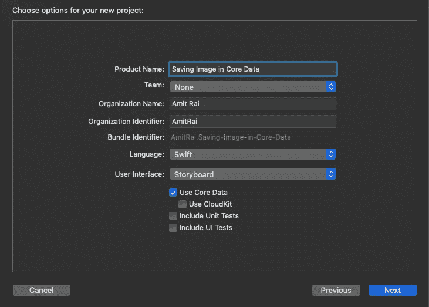
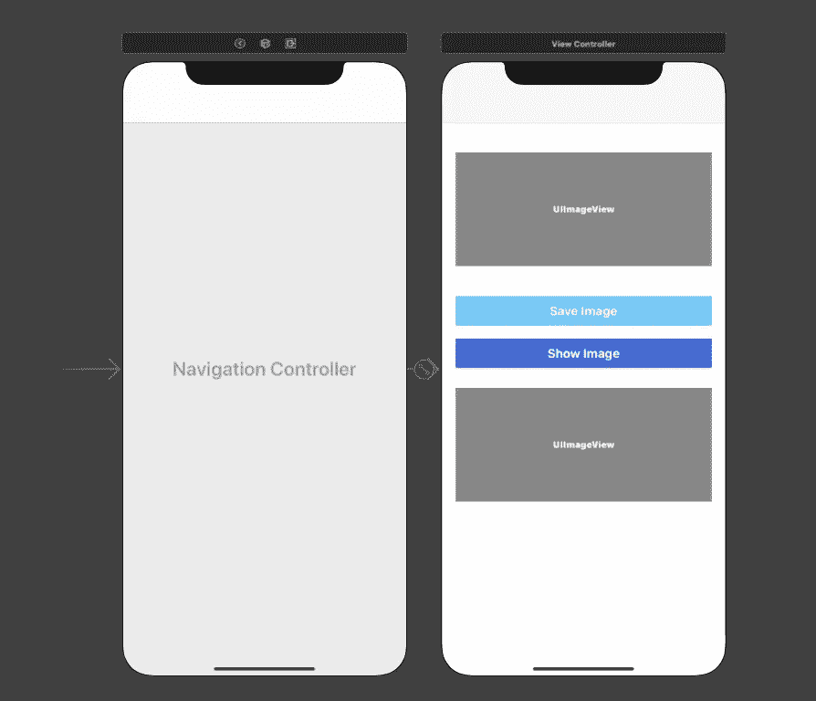
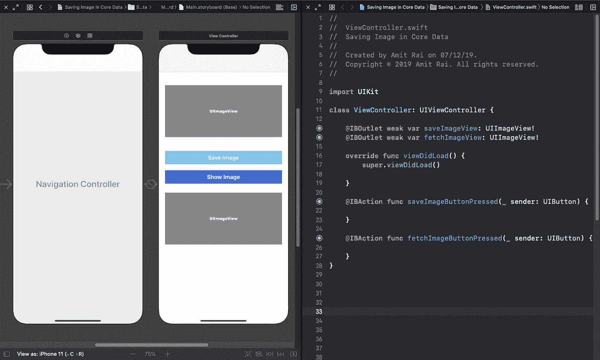
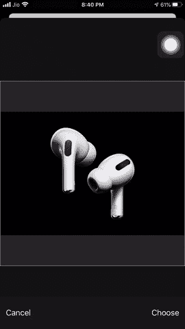
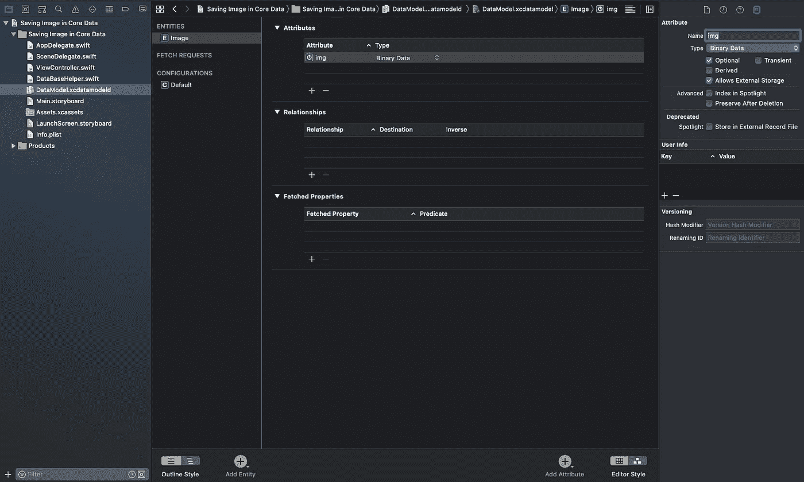
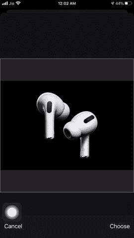

# 如何使用 Swift 将图像保存到核心数据

> 原文：<https://betterprogramming.pub/how-to-save-an-image-to-core-data-with-swift-a1105ae2cf04>

## 保存图像，简化


弗兰基·查马基在 [Unsplash](https://unsplash.com/s/photos/data?utm_source=unsplash&utm_medium=referral&utm_content=creditCopyText) 上拍摄的照片

这段代码的目的是将用户选择的图像转换成二进制数据，并将该图像保存在核心数据中。此外，我们将获取保存的图像。

我们将在示例 iOS 应用程序中实现这个特性。

> ***如果你正在准备你的技术编码面试，或者你想学习递归来提高你解决问题的技能，那么你应该查看这个 udemy 课程*** [**递归大师班，从 C++**](https://www.udemy.com/course/master-the-recursion-from-beginner-to-advance-level/?referralCode=75F57675BDABF6D104C0) ***的初级到高级水平，或者你可以在***[***Skillshare***](https://skl.sh/3PTOCns)***上查看这个递归课程。***
> 
> **如果你想从初学者到专家水平学习 ARKit 3，然后点击** [**这里**](https://www.udemy.com/course/ios-13-swift-5-the-complete-arkit-3-course/?couponCode=FORCREATOR) **获得课程，你还将获得 97%的折扣。**
> 
> **如果你对学习 iOS 移动开发充满热情，并希望将你的 iOS 开发技能提升到一个新的水平，那么使用 CloudKit framework 的核心数据应该是你的首选。点击** [**此处**](https://www.udemy.com/course/mastering-coredata-with-cloudkit-in-swift-5-for-ios/?couponCode=FORDEVS) **获取课程，还可享受 97 折优惠。**
> 
> **从头开始学习 SwiftUI 点击** [**此处**](https://www.udemy.com/course/swiftui-the-complete-course-building-real-world-apps/?couponCode=FORCODERS) **获取课程，因为在本课程中，我们将使用 SwiftUI 构建许多应用，如脸书克隆、新闻应用、笔记应用等等。**

# 开始使用示例 iOS 应用程序

打开 Xcode 并创建一个新的 Xcode 项目。在 iOS 模板部分选择*单视图应用*，点击*下一步*。


输入您的产品名称，确保选中*使用核心数据*框，然后点击*下一个*并在您的桌面上创建它。



# 设计界面

跳到`Main.storyboard`，将`ViewController`嵌入`NavigationController`，取两个`UIImageView`和`UIButton`。拖到画布上，并根据需要对其进行约束。



Main.storyboard 看起来像这样

现在，打开助理编辑器，为两个按钮创建`IBAction`。调用第一个按钮`saveImageButtonPressed`，调用第二个按钮`fetchImageButtonPressed`。

还要为`UIImageView`创建一个`IBOutlet`。调用第一个`saveImageView`和第二个`fetchImageView.`



助理编辑长这样

# 在 NavigationItem 中实现按钮

```
navigationItem.rightBarButtonItem = UIBarButtonItem(barButtonSystemItem: .camera, target: **self**, action: **#selector**(cameraButtonPressed))
```

# 展示 UIImagePickerController

```
**@objc** **func** cameraButtonPressed() {**let** picker = UIImagePickerController()
picker.delegate = **self** picker.allowsEditing = **true** picker.sourceType = .photoLibrary
present(picker, animated: **true**)}**func** imagePickerController(**_** picker: UIImagePickerController, didFinishPickingMediaWithInfo info: [UIImagePickerController.InfoKey : **Any**]) {**guard** **let** userPickedImage = info[.editedImage] **as**? UIImage **else** { **return** }saveImageView.image = userPickedImage
picker.dismiss(animated: **true**)}
```

在上面的代码中，我们给出了`UIImagePickerController`，让用户能够从`photoLibrary`中选择图像。

然后我们采用`UIImagePickerControllerDelegate`的委托方法将`UIImageView`赋给`userPicked` `UIImageView`。

# 构建并运行



结果看起来像这样

# 创建模型

接下来，转到`.xcdatamodelId`文件并创建一个`entity`。`entity`作`Image`之名。在那个`entity`中，创建一个`attribute`。将其命名为`img`并确保`attribute`类型为*二进制数据*，然后点击`img` `attribute`并进入*数据模型检查器*。

勾选*框允许外部存储*。通过勾选此框，*核心数据*保存一个数据参考，这将有助于更快的访问。



`.xcdatamodelId looks like this`

# 将图像保存在核心数据中

```
**class** DataBaseHelper {**static** **let** shareInstance = DataBaseHelper()**let** context = (UIApplication.shared.delegate **as**! AppDelegate).persistentContainer.viewContext**func** saveImage(data: Data) {**let** imageInstance = Image(context: context)
imageInstance.img = data**do** {**try** context.save()
print("Image is saved")} **catch** {
print(error.localizedDescription) } }}
```

我们创建了一个新文件`DataBaseHelper`，因为在这个文件中，我们将执行所有操作，如`saveImage`和`fetchImage`。

在文件中，我们已经创建了一个`class`、`DataBaseHelper`，然后我们有一个类`DataBaseHelper`的单体来访问这个类的属性和方法。

接下来，我们使用`UIApplication`创建`context`，然后我们有一个方法`saveImage()`来保存用户选择的图像。通过这种方法，我们使用`context`保存图像。

跳转到`ViewController.swift`文件。去你的`fetchImageButtonPressed` `IBAction`。

# IBAction 看起来像这样

```
**@IBAction** **func** saveImageButtonPressed(**_** sender: UIButton) {**if** **let** imageData = saveImageView.image?.pngData() {DataBaseHelper.shareInstance.saveImage(data: imageData) }}
```

在上面的`saveImageButtonPressed` `IBAction`中，我们已经将`UIImageView`转换为`pngData()`，因为要以二进制数据的形式保存`UIImageView`，首先我们必须转换它，然后我们使用我们的`saveImage()`方法保存`UIImageView`。

现在，如果您运行应用程序，从`photoLibrary`中选择图像，并点击*保存图像*按钮，您的图像将会保存。

如果你想知道图像是否被保存，首先在`AppDelegate`文件中打印文档目录的路径并复制该路径。前往*查找器前往*前往*文件夹*并打印该路径。

按回车键，然后打开你的数据库应用程序，在那里你可以看到你的图像是否保存。

# 打印路径

```
**func** application(**_** application: UIApplication, didFinishLaunchingWithOptions launchOptions: [UIApplication.LaunchOptionsKey: **Any**]?) -> Bool {print(FileManager.default.urls(for: .documentDirectory, in: .userDomainMask).first ?? "Not Found")**return** **true**}
```

# 检索图像

```
**func** fetchImage() -> [Image] {**var** fetchingImage = [Image]()**let** fetchRequest = NSFetchRequest<NSFetchRequestResult>(entityName: "Image")**do** {fetchingImage = **try** context.fetch(fetchRequest) **as**! [Image]} **catch** {print("Error while fetching the image")}**return** fetchingImage}
```

在上面的方法中，我们使用`NSFetchRequest`和`context`获取用户选择的图像。

`NSFetchRequest`是一个泛型类。它描述了用于从持久性存储中检索数据的搜索标准，最后，我们返回了`fetchingImage`。

跳转到`ViewController.swift`文件，到你的`fetchImageButtonPressed` `IBAction`。

# IBAction 看起来像这样

```
**@IBAction** **func** fetchImageButtonPressed(**_** sender: UIButton) {**let** arr = DataBaseHelper.shareInstance.fetchImage()fetchImageView.image = UIImage(data: arr[0].img!)}
```

在上面的`fetchImageButtonPressed` `IBAction`中，我们使用`fetchImage()`方法在`fetchImageView`中获取用户选择的图像。

# 构建并运行



最终结果看起来像这样

# 结论

这一块就到此为止！我希望你喜欢这篇文章，并学会了如何在核心数据中保存图像。

你可以在 [GitHub](https://github.com/Amitrai011/Saving-Image-in-Core-Data) 上找到完整的项目。

> ***如果你正在准备你的技术编码面试，或者你想学习递归来提高你解决问题的技能，那么你应该查看这个 udemy 课程*** [**递归大师班，从 C++**](https://www.udemy.com/course/master-the-recursion-from-beginner-to-advance-level/?referralCode=75F57675BDABF6D104C0) ***的初级到高级水平，或者你可以在***[***Skillshare***](https://skl.sh/3PTOCns)***上查看这个递归课程。***

# 额外资源

> **如果你想从初学者到专家级别学习 ARKit 3，那么点击** [**这里**](https://www.udemy.com/course/ios-13-swift-5-the-complete-arkit-3-course/?couponCode=FORCREATOR) **获得课程，并且你将获得 97%的折扣。**
> 
> **如果你对学习 iOS 移动开发充满热情，并希望将你的 iOS 开发技能提升到一个新的水平，那么使用 CloudKit framework 的核心数据应该是你的首选。点击** [**此处**](https://www.udemy.com/course/mastering-coredata-with-cloudkit-in-swift-5-for-ios/?couponCode=FORDEVS) **获取课程，还可享受 97 折优惠。**
> 
> **从头开始学习 SwiftUI 点击** [**此处**](https://www.udemy.com/course/swiftui-the-complete-course-building-real-world-apps/?couponCode=FORCODERS) **获取课程，因为在本课程中，我们将使用 SwiftUI 构建许多应用，如脸书克隆、新闻应用、笔记应用等等。**