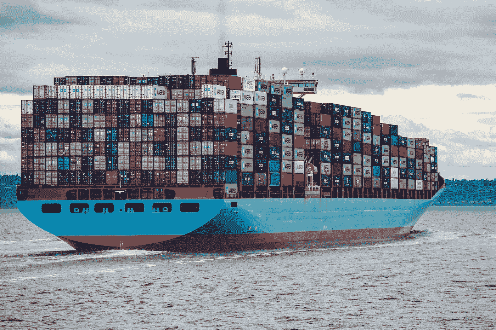

# 如何保存和移动 Docker 图像

> 原文：<https://betterprogramming.pub/how-to-save-and-move-docker-images-9c43a3d47225>

## 搬家并不总是很难



照片由[伊恩·泰勒](https://unsplash.com/@carrier_lost?utm_source=unsplash&utm_medium=referral&utm_content=creditCopyText)在 [Unsplash](https://unsplash.com/s/photos/docker?utm_source=unsplash&utm_medium=referral&utm_content=creditCopyText) 上拍摄

阅读完这篇文章后，您将学习如何打包 Docker 映像，并将它们部署到本地的其他机器上。对于大多数开发人员来说，复制 Docker 映像的过程可能会令人困惑，因为 Docker 提供了不同的保存/加载和导出/导入命令。这些命令不同，不能互换使用。

如果您希望保存现有的 Docker 映像并将其作为 Docker 映像加载到另一台机器上，您应该使用以下命令:

*   `save` —将一个或多个图像保存到 tar 存档
*   `load` —从 tar 存档或标准输入中加载图像

如果您希望导出现有的 Docker 容器，并将其作为 Docker 文件系统映像加载到另一台机器上，您应该使用以下命令:

*   `export` —将容器的文件系统导出为 tar 归档文件
*   `import` —从 tarball 导入内容以创建文件系统映像

根据您的用例，这两种场景有不同的用途。如果您想在不同的机器上部署相同的 Docker 映像，第一个场景是理想的。所有加载的映像在部署时将具有相同的功能。如果你不确定你的用例，你应该先从`save/load`命令开始，然后再尝试`export/import`命令。

另一方面，`export/import`命令意味着在没有 Docker 指令的情况下保留容器的文件系统。在导入文件系统映像时，您可以指定所需的 Docker 指令。

> 请注意，`export`命令不会导出与容器相关联的卷的内容。它将仅导出底层目录的内容，而不是已装载的卷。

如果您有两个具有相同文件系统的项目，这是非常有用的。不用构建两个 Docker 映像，您只需:

*   为第一个项目构建 Docker 映像
*   使用新构建的映像运行 Docker 容器
*   将容器导出为文件系统映像
*   使用自定义 Docker 指令导入文件系统映像

继续下面关于设置和实现的章节。

# 设置(可选)

如果您已经有一个 Docker 图像的现有项目，请跳到实现部分。本节将介绍创建所有必要的文件和文件夹，作为 Docker 映像的构建块。

确保您的根目录包含以下文件夹结构:

```
|- app (project files)
|   |- main.py (Python script)
|- Dockerfile
|- requirements.txt
```

`main.py`文件是模拟 FastAPI 服务器的主脚本。基本内容如下:

```
from fastapi import FastAPIapp = FastAPI()@app.get("/")
async def root():
    return {"message": "Hello World"}
```

同时，`requirements.txt`文件包含了项目所需的所有 Python 依赖项。例如:

```
anyio==3.6.1
click==8.1.3
fastapi==0.79.0
h11==0.13.0
idna==3.3
pydantic==1.9.1
sniffio==1.2.0
starlette==0.19.1
typing_extensions==4.3.0
uvicorn==0.18.2
```

`Dockerfile`应该包含构建和运行 FastAPI 服务器的最基本的指令:

```
FROM python:3.8WORKDIR /appCOPY ./requirements.txt requirements.txtRUN python -m pip install --upgrade pip && pip install --no-cache-dir -r requirements.txtCOPY ./app /appCMD ["uvicorn", "main:app", "--host", "0.0.0.0", "--port", "8000"]
```

完成后，您可以使用以下语法构建 Docker 映像:

```
docker build -t <tag:version> -f <Dockerfile> .
```

例如:

```
docker build -t project:latest -f Dockerfile .
```

您可以通过运行以下命令轻松验证构建过程是否成功

```
docker image ls
```

您应该会在控制台上看到类似的条目:

```
cc33718e90f3   project:latest   "uvicorn main:app --…"   11 seconds ago   Up 10 seconds   5111/tcp, 0.0.0.0:8000->8000/tcp, :::8000->8000/tcp   project
```

然后，您可以使用以下语法启动 Docker 容器:

```
docker run -p <hostport>:<dockerport> --rm --name <containername> <imagename>
```

例如:

```
docker run -p 8000:8000 --rm --name project project:latest
```

> `rm`标志用于在容器退出时自动移除容器。

# 履行

## 将 Docker 图像保存为 tar 归档

假设您的机器中已经有一个 Docker 映像。将其保存到 tar 归档文件的语法如下:

```
docker save <imagename> -o <outputfile> <tag>:<version>
```

例如:

```
docker save project -o projectimg.tar project:latest
```

## 加载一个 tar 归档文件作为 Docker 映像

之后，只需将它移动/传输到另一台机器上，并运行以下命令将其作为 Docker 映像加载:

```
docker load --input projectimg.tar
```

Docker 将尝试一部分一部分地构建这些层:

```
178f558940e6: Loading layer [==================================================>]   2.56kB/2.56kB
dfcca0eb0fc0: Loading layer [==================================================>]   68.4MB/68.4MB
0b9452996b52: Loading layer [==================================================>]   2.56kB/2.56kB
```

完成后，您现在可以像往常一样执行`docker run`命令来启动一个新的容器。

## 将容器导出为 tar 存档

docker 导出命令需要一个正在运行的容器。执行以下命令在后台启动一个新容器:

```
docker run -d -p 8000:8000 --rm --name project project:latest
```

> `-d`标志代表 detach，用于在后台运行容器。

您可以通过以下命令检查机器中的所有活动容器:

```
docker container ls
```

将现有容器导出为 tar 归档文件的语法如下:

```
docker export --output="<outputname>" <containername>
```

例如:

```
docker export --output="projectcont.tar" project
```

## 将 tar 归档文件作为文件系统映像导入

当将 tar 归档文件作为文件系统映像导入时，它不会包含任何 Docker 指令。您需要通过`--change`标志指定您想要的指令。它接受一个字符串列表。例如，您可以使用以下指令来复制与我们之前所做的相同的容器:

```
docker import projectcont.tar --change 'WORKDIR /app' --change 'CMD ["uvicorn", "main:app", "--host", "0.0.0.0", "--port", "8000"]' project:latest
```

`WORKDIR /app`命令确保 app 是基本工作目录，而后续运行意味着运行 FastAPI 服务器。

`--change`标志支持以下 Docker 指令:

*   煤矿管理局
*   入口点
*   包封/包围（动词 envelop 的简写）
*   揭露
*   ONBUILD
*   用户
*   卷
*   工作方向

如果您在启动 Docker 容器时遇到错误，请仔细检查您在`docker import`中使用的指令。

# 结论

总之，您可以通过`docker save`和`docker load`命令轻松保存和加载 Docker 图像。

或者，您可以使用`docker export`将现有的 Docker 容器导出为 tar 归档文件，并通过`docker import`命令将其导入为文件系统映像。

请随意查看我的另一篇文章，关于在编写 Python 应用程序时需要掌握的 [6 个概念](/6-concepts-to-master-when-dockerizing-python-applications-e5f5a6a87845)，以获得更多关于编写 Python 应用程序的信息。

感谢阅读这篇文章。祝你有美好的一天！

# 参考

1.  [Docker 命令行— docker 保存](https://docs.docker.com/engine/reference/commandline/save/)
2.  [Docker 命令行— docker 加载](https://docs.docker.com/engine/reference/commandline/load/)
3.  [Docker 命令行— docker 导出](https://docs.docker.com/engine/reference/commandline/export/)
4.  [Docker 命令行— docker 导入](https://docs.docker.com/engine/reference/commandline/import/)
5.  [Docker 命令行— docker 运行](https://docs.docker.com/engine/reference/commandline/run/)