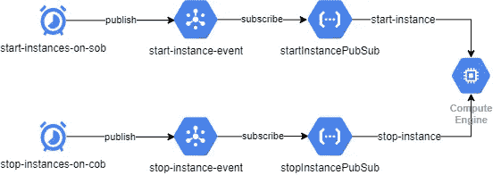

# 如何在谷歌云平台上省钱

> 原文：<https://betterprogramming.pub/how-to-save-money-on-google-cloud-platform-22bf4c302d32>

## 使用云调度程序自动启动和停止计算引擎实例


照片由[米切尔罗](https://unsplash.com/@mitchel3uo?utm_source=unsplash&utm_medium=referral&utm_content=creditCopyText)在 [Unsplash](https://unsplash.com/s/photos/google-cloud?utm_source=unsplash&utm_medium=referral&utm_content=creditCopyText)

谷歌云平台是增长最快的云平台之一，在 AWS 和 Azure 之后，保持着第三的稳定地位。它为自己的网络质量和在数据科学与工程方面的优势而自豪。

其 Kubernetes 引擎是市场上最成熟的引擎之一。因为 Kubernetes 是谷歌的宝贝，它比 Azure 的 AKS 或 AWS 的 ECS 更通用。

计算实例是谷歌云提供的最具竞争力的 IaaS 解决方案之一。由于持续使用折扣，它最适合运行现收现付实例的公司，而不是其他云提供商。

当你使用专用实例时，Azure 在 IaaS 领域更便宜，但这造成了供应商锁定，这是大多数组织避免的。多云模式是最合适的策略——大多数公司都在适应这个时代，在这个时代，成本节约和优化是重中之重。

一个公司一半以上的实例是开发和测试机器。虽然有些设备确实需要连续运行，但大多数不需要在办公时间以外运行，有些甚至只在需要时运行。大多数企业都教导员工如何经济高效地使用云，而且有很多方法可以在不影响性能的情况下节省成本。

节省成本的一些方法有:

*   尽可能使用较小的实例。
*   努力优化网络流量，使流量不会在不同地区之间移动。大多数云提供商向你收取出口流量费用。
*   完成工作后，关闭或停止计算实例。

这些都是很好的建议——但是必须有一种方法在组织层面上执行这些指导方针。可能会有这样的情况，开发人员忘记关闭他们的虚拟机，因为他们忙于一个紧急会议。成本节约不应该仅仅由开发人员和管理员来管理。

管理这一成本的一种方法是在业务结束时自动停止所有开发实例，以避免成本失控。这确保了你在组织层面上被覆盖，并且不需要依赖开发者在他们忘记的情况下关闭他们的实例。

Google Cloud 提供了一个云调度服务，帮助您运行 cron 作业，这些作业可以触发特定的端点，例如云功能或发布-订阅主题。

让我们使用云调度器、Google 发布/订阅和云功能来调度开发实例的自动关闭和启动。该流程在此架构图中进行了说明:



我们可以使用调度程序直接触发云功能，但是发布-订阅在两者之间提供了一个缓冲层——当我们有很多启动和关闭事件时，这很有帮助。

# 创建计算实例

让我们首先创建一个具有以下属性的开发计算实例:

*   名称:`instance-1`
*   操作系统: `Ubuntu 18.04LTS`
*   区域:`europe-west2-c`
*   标签: `env=dev`

# 创建服务帐户

接下来，我们需要一个有权启动和停止虚拟机实例的服务帐户。让我们创建一个名为`compute-instance-admin-sa`的服务帐户:

```
$ gcloud iam service-accounts create compute-instance-admin-sa \
  --description="Service account with computeinstanceadmin role" \
  --display-name="compute-instance-admin-sa"
Created service account [compute-instance-admin-sa].
```

将`computeInstanceAdmin`角色分配给服务帐户:

```
$ gcloud projects add-iam-policy-binding <project-id>  
  --role roles/compute.instanceAdmin \
  --member serviceAccount:compute-instance-admin-sa@<project-id>.iam.gserviceaccount.com
Updated IAM policy for project [<project-id>].
```

# 创建发布/订阅主题

现在让我们创建发布/订阅主题，以便调度程序可以向它们发布启动和停止事件。

```
$ gcloud pubsub topics create start-instance-event
Created topic [projects/<project-id>/topics/start-instance-event].
$ gcloud pubsub topics create stop-instance-event
Created topic [projects/<project-id>/topics/stop-instance-event].
```

# 创建云函数

下一步是创建云函数，该函数监听来自云发布/订阅主题的启动和关闭事件，并启动和关闭在事件中具有所提供标签的实例。

让我们为预先编写的 NodeJS 云函数克隆这个存储库:

```
$ git clone [https://github.com/bharatmicrosystems/gcloud-schedule-stop-start-instance.git](https://github.com/bharatmicrosystems/gcloud-schedule-stop-start-instance.git)
$ cd gcloud-schedule-stop-start-instance
```

展开`Start Cloud`功能

创建`Stop Cloud`函数

让我们直接触发云功能，看看它们是否正常工作。

将 JSON 输入转换为 base64 令牌，这样就可以将它发送到 Cloud Pub/Sub 主题。

```
$ echo '{"label":"env=dev"}' **|** base64
eyJsYWJlbCI6ImVudj1kZXYifQo=
```

将 base64 字符串发送到`stopInstancePubSub`主题:

```
$ gcloud functions call stopInstancePubSub \
     --data '{"data":"eyJsYWJlbCI6ImVudj1kZXYifQo="}'
executionId: vrbf8d7o66d6
result: Successfully stopped instance(s)
```

检查实例状态，查看实例是否已终止。可能需要几分钟才能完成:

```
$ gcloud compute instances describe instance-1 \
     --zone europe-west2-c  | grep status
status: TERMINATED
```

现在让我们用同样的消息调用`startInstancePubSub`函数来启动实例:

```
$ gcloud functions call startInstancePubSub \
     --data '{"data":"eyJsYWJlbCI6ImVudj1kZXYifQo="}'
executionId: erfr8d6o66d6
result: Successfully started instance(s)
```

检查实例状态，它现在应该正在运行。

```
$ gcloud compute instances describe instance-1 \
     --zone europe-west2-c  | grep status
status: RUNNING
```

# 设置云调度程序

让我们通过设置云调度器作业来完成这个链。

这需要启用 app engine API，并将其设置为部署云功能的同一区域。

创建`start`作业:

```
gcloud scheduler jobs create pubsub start-instances-on-sob \
    --schedule '0 9 * * 1-5' \
    --topic start-instance-event \
    --message-body '{"label":"env=dev"}' \
    --time-zone 'Europe/London'
```

创建`stop`作业:

```
gcloud scheduler jobs create pubsub stop-instances-on-cob \
    --schedule '0 18 * * 1-5' \
    --topic stop-instance-event \
    --message-body '{"label":"env=dev"}' \
    --time-zone 'Europe/London'
```

手动触发该任务，查看它是否能够端到端地工作。

首先停止实例:

```
$ gcloud scheduler jobs run stop-instances-on-cob
```

检查实例状态，查看实例是否已终止。可能需要几分钟才能完成:

```
gcloud compute instances describe instance-1 \
    --zone europe-west2-c  | grep status
status: TERMINATED
```

现在，让我们通过手动触发调度程序作业来启动虚拟机:

```
gcloud scheduler jobs run start-instances-on-sob
```

检查实例状态，查看实例是否已启动。可能需要几分钟才能完成:

```
$ gcloud compute instances describe instance-1 \
    --zone europe-west2-c  | grep status
status: RUNNING
```

恭喜你！您已经配置了两个调度任务，在业务结束时自动停止您的 dev 实例，并在业务开始时启动它们。

这可以帮助你节省大量空闲时间可能损失的钱。

# 结论

虽然有很多省钱的方法，但是在任何组织中，当你不需要开发实例时，关闭它们是一个明智的方法。

在营业结束时自动安排停止事件是防止成本失控和确保事情保持在预算内的实用方法。

感谢阅读！我希望你喜欢这篇文章！