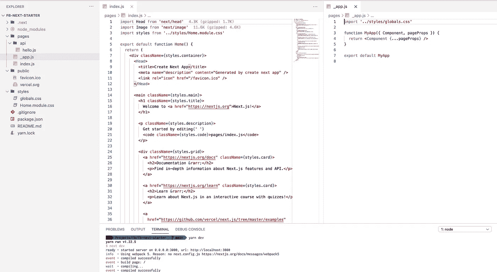
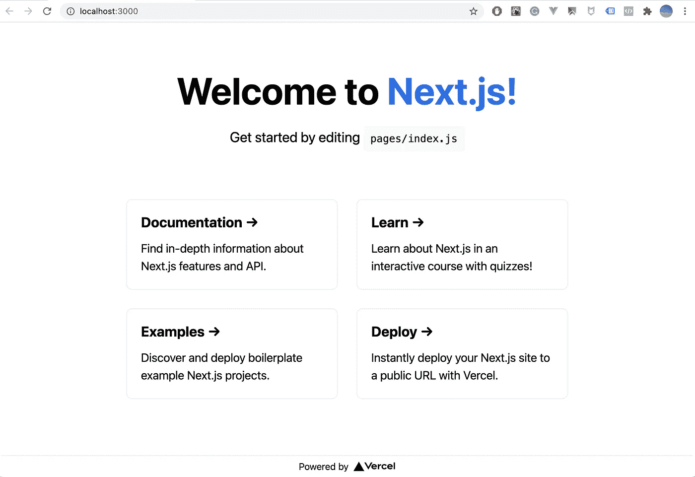
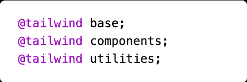
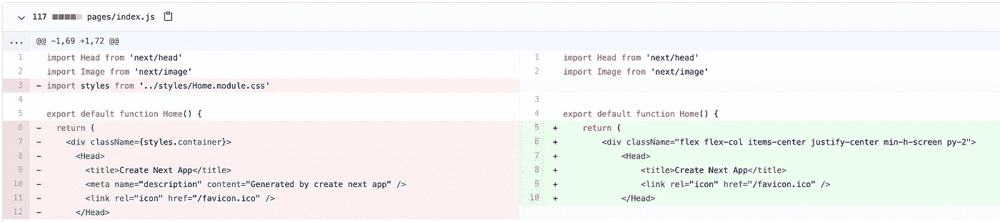
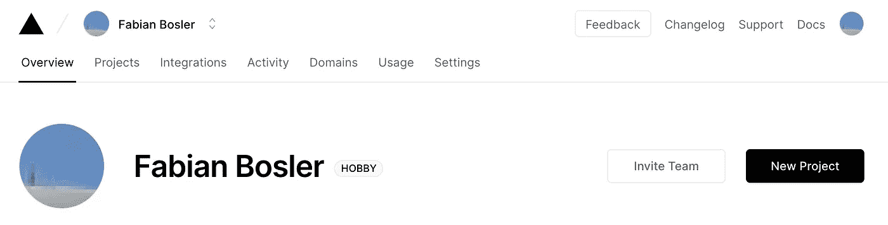
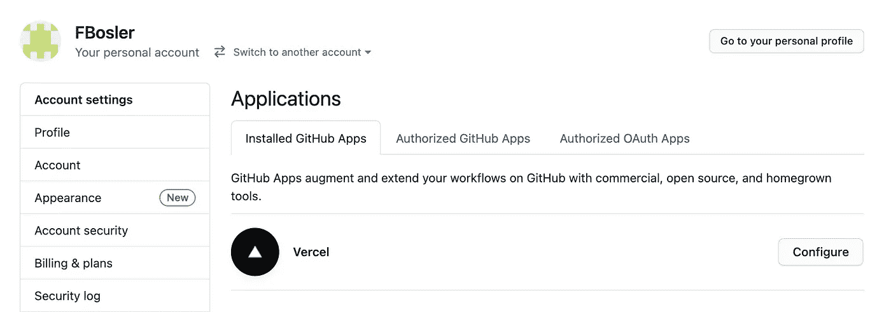
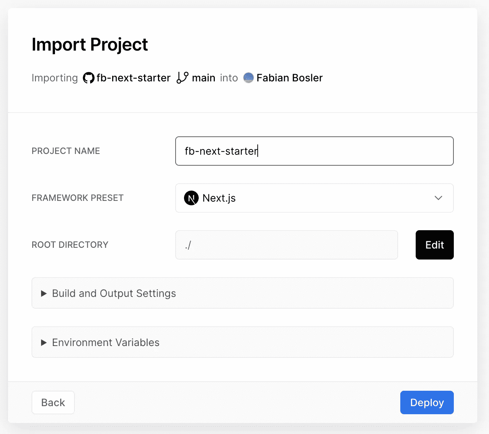
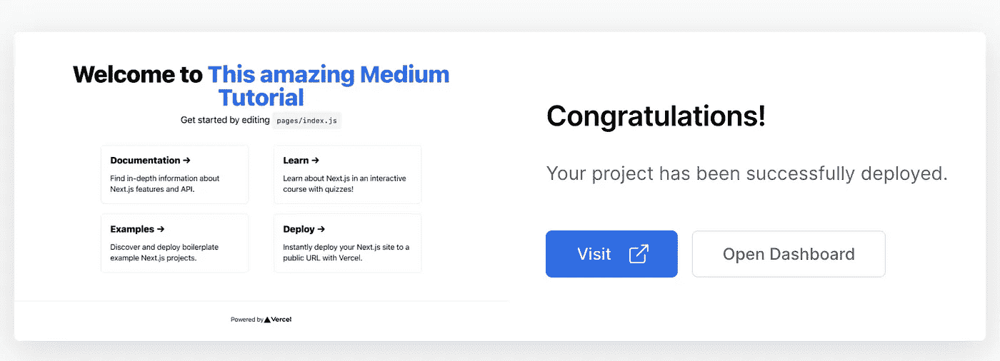
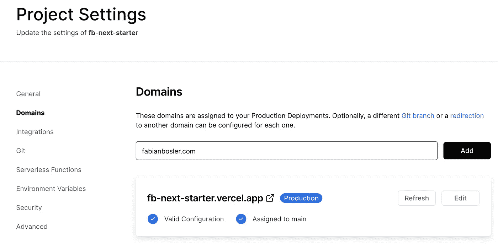
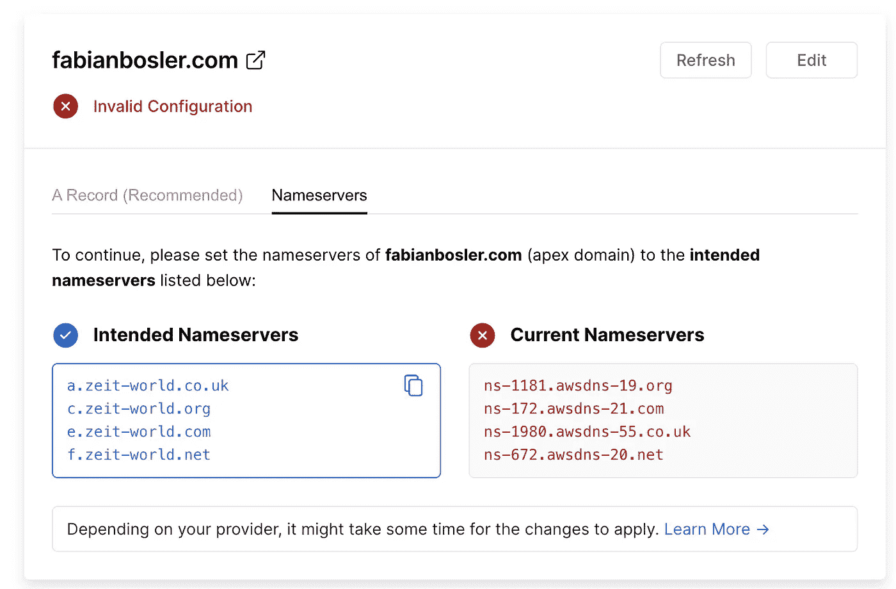

# 如何用 Tailwind CSS 和 TypeScript 搭建和部署 Next.js 应用程序

> 原文：<https://betterprogramming.pub/how-to-scaffold-and-deploy-a-next-js-app-with-tailwind-css-and-typescript-faab9a274ae7>

## 让您的应用投入生产


由[德里克·汤姆森](https://unsplash.com/@derekthomson?utm_source=unsplash&utm_medium=referral&utm_content=creditCopyText)在 [Unsplash](https://unsplash.com/?utm_source=unsplash&utm_medium=referral&utm_content=creditCopyText) 上拍摄的照片

第一次看到你构建的东西在生产中运行是一种难以置信的感觉。跟着教程走，在本地编写一些练习，与实际部署任何东西相比，这两者之间的效果差别不会被夸大。正如本杰明·富兰克林(据说)所说:

> **“告诉我，我就忘了。教我，我可能会记得。让我参与，我学习。”**

# 序幕

这篇文章将是许多文章中的第一篇。在这个系列中，我们将不断构建一个小型 web 应用程序。我并不确定最终的应用程序本身，但它肯定会包括:

*   动画片
*   证明
*   简历部分
*   买一些数码产品

我们将要使用的所有工具和技术都不花一分钱。但是，我假设您对 JavaScript、TypeScript、GitHub 和 React 有所了解。理想情况下，您还会使用 Visual Studio 代码。

在今天的文章中，我们将讨论以下主题:

1.  [讨论堆栈](#c7d0)
2.  [创建 Next.js 应用](#1aa0)
3.  [添加顺风 CSS](#92e2)
4.  [添加 TypeScript 和 ESLint](#21b0)
5.  [在 Vercel 上部署应用](#7d25)
6.  [添加自定义域](#9c77)

我将为每个部分创建一个分支，这样你也可以简单地浏览[回购](https://github.com/FBosler/fb-next-starter)！

# 1.堆

对于手头的 app，我们将使用 [Next.js](https://nextjs.org/) ，TypeScript，以及 [Tailwind CSS](https://tailwindcss.com/) 。

## **Next.js**

Next.js 是 React 之上的一个框架，它负责构建和部署应用程序的许多令人讨厌的方面。对我来说，Next.js 相对于 plain `create react-app`的主要优势是:

*   集成的和基于页面的路由(即愚蠢的简单导航)。只需在`pages`文件夹中创建一个文件，就会创建一个相应的可访问页面。
*   api-routes(即在`pages/api/xyz.js`中创建的文件暴露了相应的端点)。不需要设置 Express.js 和相关的中间件。
*   静态站点生成、服务器端渲染或客户端渲染的混搭，真正让你针对各自的用例优化应用的所有部分。

## 以打字打的文件

TypeScript 为 JavaScript 提供了类型安全。对我来说，TypeScript 有两个主要好处:

*   提供了一种描述对象形状的方法，提供了更好的文档(并迫使开发人员更多地考虑命名变量)。
*   在构建时捕捉错误有助于保持理智，并使您的压力水平更易于管理。

## 顺风 CSS

我尝试了许多不同的样式化方法、手段和库，从 inline-css 到 BEM 和样式化组件。我总是发现他们缺乏某种方式，通常最终会编写自定义的 CSS。Tailwind 有许多实用程序类，加上适当的林挺支持，让设计代码变得轻而易举。

## Visual Studio 代码扩展(可选)

我正在使用 Visual Studio 代码和一些扩展，这让我的工作效率大大提高。按重要性排序:

*   [更漂亮的](https://marketplace.visualstudio.com/items?itemName=esbenp.prettier-vscode) // [链接到默认配置](https://gist.github.com/FBosler/9becaac8fd94488d3d8d2ca5c6c04fa2)
*   [ESLint](https://eslint.org/) // [链接到默认配置](https://gist.github.com/FBosler/edd20d651c5ed69368f6ff060d8eae2c)(最终，最重要的是团队中的所有人都使用相同的配置)
*   [文件图标](https://marketplace.visualstudio.com/items?itemName=file-icons.file-icons)
*   [顺风 CSS 智能感知](https://marketplace.visualstudio.com/items?itemName=bradlc.vscode-tailwindcss)

# 2.创建 Next.js 应用程序

有几种不同的方法来搭建你的第一个 Next.js 应用。我发现最简单的方法就是运行`yarn create next-app <NAME>`。这需要你安装`yarn`和`node.js`。就我而言，我跑了`yarn create next-app fb-next-starter`。导航到创建的文件夹应该会产生以下文件夹结构:



yarn 创建的 Next.js 应用程序创建下一个应用程序

然后，我们可以通过简单地输入`yarn dev`来启动一个开发服务器，它将在端口 3000 上运行示例应用程序。



也可以在 GitHub 上运行`yarn create next-app` [后找到代码。](https://github.com/FBosler/fb-next-starter/tree/step-0-create-next-js-app)

# 3.添加顺风 CSS

默认情况下，通过`create next-app`创建的应用程序使用全局(`global.css`)样式和模块级范围样式(`Home.module.css`)。Next.js 支持盒子的模块级作用域样式[。要添加顺风，我们必须设置一些东西。](https://nextjs.org/docs/basic-features/built-in-css-support)

## 安装开发依赖项

即`tailwind`、`postcss`和`autoprefixer`(考虑供应商的具体情况)，如下所示:

```
yarn add -D tailwindcss@latest postcss@latest autoprefixer@latest
```

## 设置配置文件

一旦我们做到了这一点，我们还必须添加一个`tailwind.config.js`和`postcss.config.js`，就像这样:

```
npx tailwindcss init -p
```

在文档中了解更多关于可能配置的信息[。](https://tailwindcss.com/docs/configuration)

## 更改代码

在我们的项目中使用 Tailwind 格式的最快方法是删除`styles/globals.css`的所有内容，并替换为:



更新的 styles/globals.css

接下来，我们必须修改我们的`index.js`来使用 Tailwind 类名。这些变化更加实质性，这就是为什么参考 GitHub 比较可能更有帮助。查看[这个完整的并排比较](https://github.com/FBosler/fb-next-starter/compare/step-0-create-next-js-app...step-1-add-tailwind?diff=split)。



部分前后并列比较

我们现在已经完成了基本的配置，可以开始根据我们的需求定制样式了。请随意查看[顺风文档](https://tailwindcss.com/docs)。我真的认为他们在那里做了出色的工作。添加顺风后找到这个 r [epo。](https://github.com/FBosler/fb-next-starter/tree/step-1-add-tailwind)

# 4.添加 TypeScript 和 ESLint(和更漂亮的)

我是林挺强制执行编码标准和强加某种一致性的忠实粉丝。有趣的是，ESLint 和 TypeScript 的目的有些相似，所以要让两者都发挥作用，需要我们使用 typescript-eslint。

## 添加类型脚本

首先，让我们像这样添加类型脚本:

```
yarn add —-dev typescript @types/react 
```

下一步，我们必须在项目根文件夹中创建一个`tsconfig.json`,如下所示:

```
touch tsconfig.json
```

一旦我们通过再次运行`yarn dev`重启我们的开发服务器，`tsconfig.json`将会被合理的默认值填充。不过我喜欢把`strict`改成`true`，把目标改成`esnext`。

现在是时候成立 ESLint 了。

## 添加 ESLint 和插件

```
yarn add -D eslint @typescript-eslint/parser @typescript-eslint/eslint-plugin
```

由于 ESLint 是以模块化结构建立的，我们现在也必须安装一些规则/插件:

```
yarn add -D eslint-plugin-jsx-a11y eslint-plugin-react eslint-plugin-react-hooks eslint-plugin-tailwind
```

这些插件负责可访问性、React 最佳实践、React 挂钩规则和特定于顺风的林挺(如类名排序)。

## **添加更漂亮的包(可选)**

[更漂亮](https://prettier.io/)是一个固执己见的代码格式化程序。它通过解析您的代码并根据自己的规则(考虑到最大行长度，必要时换行)重新打印代码来强制执行一致的风格。这显然可能会与 ESLint 冲突，所以我们必须确保它们不会互相妨碍。我们需要以下两个包:

```
yarn add -D eslint-plugin-prettier eslint-config-prettier
```

## 设置. eslintrc.js

请在 GitHub 上找到我用的[的`.eslintrc.js`。但是，如果您自己的配置更适合您，请随意使用。我不打算在这里深入探讨。但是`.eslintrc.js`所做的是定义哪些插件(即规则)用于哪种文件以及如何处理违规。例如，`'@typescript-eslint/no-unued-vars': ['error']`会直观地标记一个未使用的变量，告诉你要么去掉这个变量，要么使用它。](https://gist.github.com/FBosler/edd20d651c5ed69368f6ff060d8eae2c)

在[本回购](https://github.com/FBosler/fb-next-starter/tree/step-2-add-typescript)中找到相应的步骤。

# 5.部署到 Vercel

要在 [Vercel](https://vercel.com/) 上部署 Next.js 应用，我们只需要一个帐户。让我们去创建一个(例如通过 GitHub)。

登录后，点击“新建项目”按钮:



Vercel 仪表板

接下来，您必须配置您的 [GitHub Vercel 集成](https://github.com/settings/installations)，以便 Vercel 可以访问您的项目。



GitHub 个人仪表板

配置完成后，我们可以从列表中选择存储库，并将其导入到 Vercel。然后，我们还可以设置一个名称并配置环境变量(这将在后面的教程中进行)。让我们点击“部署”:



通过 Vercel 部署项目的最后一步

一旦我们点击“Deploy”，Vercel 就会克隆 repo，构建 Next.js 应用程序，并部署它。



瞧啊！我们完了。点击“访问”将带我们进入我们的应用程序。

# 6.添加自定义域

该应用程序目前部署在 Vercel 域上，这很好。但最终，我们显然希望让它在我们自己的领域运行。为此，我们必须前往我们的 Vercel 帐户的“设置”部分，并导航到“域”输入你的域名，点击“添加”



点击“添加”后，我们只需更改名称服务器:



更改名称服务器

我通过 AWS 域名服务购买了我的域名。更改域名服务器后，该域名在几秒钟内就可用了。因此，请在我的网站上查看我们的最终基础应用[。](https://www.fabianbosler.com/)

# 概述

在本文中，您了解了如何将带有 TypeScript 和 Tailwind CSS 的现代 Next.js 应用程序快速部署到您自己的域中——而且不花一分钱。

敬请关注后续。