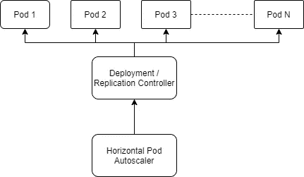
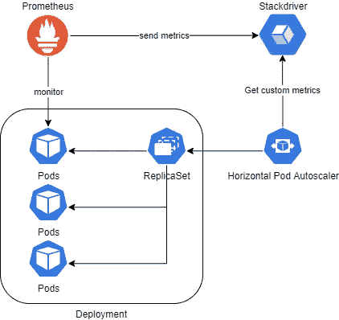
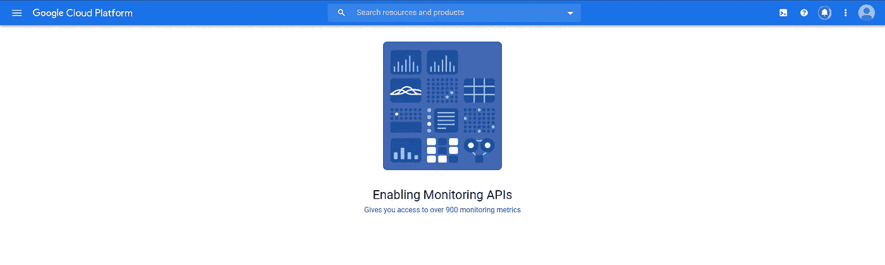
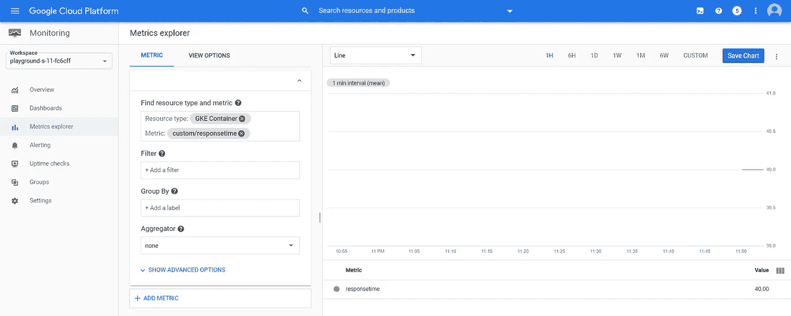
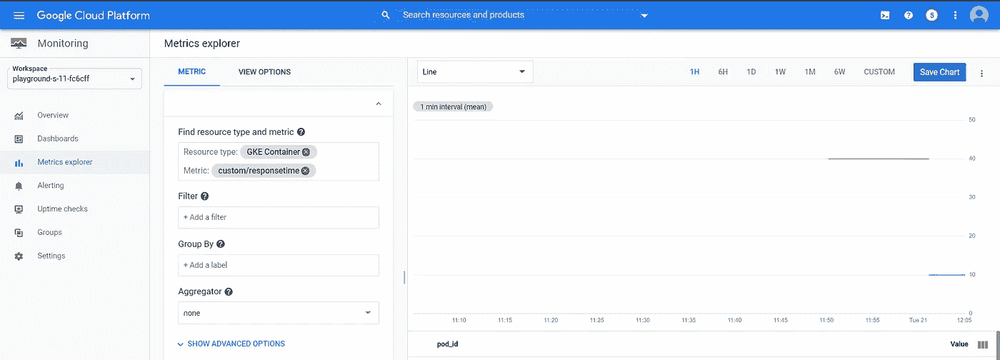

# 如何使用自定义指标扩展 Kubernetes 应用程序

> 原文：<https://betterprogramming.pub/how-to-scale-kubernetes-applications-using-custom-metrics-6cf02571c5e4>

## 使用对您的业务非常重要的定制 Stackdriver 指标来扩展您的容器


由 [Carlos Muza](https://unsplash.com/@kmuza?utm_source=medium&utm_medium=referral) 在 [Unsplash](https://unsplash.com?utm_source=medium&utm_medium=referral) 上拍摄的照片。

如果你看看 Kubernetes 最受欢迎的特性，自动缩放很可能会名列榜首。Kubernetes 提供了一个名为“HorizontalPodAutoscaler”的资源，这是一个内置的功能，可以根据多种因素来扩展容器，如资源利用率(CPU 和内存)、网络利用率或容器内的流量。如果您的集群接近资源限制，并且您需要在集群中添加更多节点，那么托管的 Kubernetes 服务(如 GKE)会提供现成的 Kubernetes 集群自动伸缩功能。

想象一下，你已经开发了一个应用程序，你很自然地从小规模开始，因为你没有预期到太多的需求。然而，一个社交媒体帖子让你的申请像病毒一样传播开来，人们突然意识到这有多酷。现在每个人都想使用你的应用程序，流量激增！您会担心，因为您不知道您的应用程序是否能够承担额外的负载。

令人欣慰的是，您意识到您已经设计了在 Kubernetes 上运行的应用程序，并将其部署在 Google Kubernetes 引擎上。由于谷歌云提供了近乎无限的扩展能力，该应用程序可以根据需求无缝扩展。

# 水平 Pod 自动缩放器的工作原理

水平 Pod 自动缩放器广泛使用三类现成的指标:

*   资源指标—这些指标包括 CPU 和内存利用率。
*   Pod 指标—这些是特定于 pod 的指标，如网络利用率和流量(如每秒数据包数)。
*   对象指标—这些是特定类型对象的指标。例如，如果您使用 Ingress，您可以使用每秒请求数来扩展您的容器。



您可以通过使用如下所示的`HorizontalPodAutoscaler`清单来实现这一切:

水平 Pod 自动缩放清单

如果您应用上面的清单，它将根据以下条件在 1 到 10 个副本之间自动缩放 Nginx 部署:

*   资源指标—平均 CPU 利用率低于 50%。
*   Pod 度量—每秒 1K 数据包的平均 pod 流量。
*   对象度量-所有 pod 上每秒 10K 请求的流量。

对象指标可以选择使用值和平均值。举例来说，入口部分中使用的对象度量`requests-per-second`将描述去往由入口资源管理的所有 pod 的总流量。如果我们使用平均值，它会将该值除以荚数，然后与目标值进行比较。

请记住，随着吊舱数量的增加，负载分布的百分比会降低。例如，如果您运行单个 pod，而您旋转了另一个 pod，则新的 pod 将承担您负载的 50%。但如果旋转第三个，就要 33%。十分之一只会带走你 10%的负荷。因此，请始终计划最大数量的 pod，同时记住您需要多少容量，并始终为您的群集过量供应一些容量，以处理一些突发容量。将 Kubernetes 集群自动缩放器与水平 Pod 自动缩放器一起使用是一个好主意。

# 使用外部指标

基于 Kubernetes 对象度量的伸缩性非常好。然而，它并没有推动客户体验。CPU 利用率、内存利用率和网络吞吐量等指标对工程师来说是有意义的。尽管如此，对于使用您的应用程序的客户来说，关键的性能指标是诸如响应时间之类的指标。客户不关心您如何运行您的应用程序。他们所关心的只是获得无缝的用户体验——一个小故障就会让你失去一个潜在客户。

幸运的是，Kubernetes 提供了一种使用外部指标来扩展容器的方法。让我们举一个在 Google Kubernetes 引擎上使用自定义指标的例子。Google 使用 Stackdriver 作为其默认的监控解决方案，您可以从您的应用程序向它发送定制的指标。您还可以部署一个监控解决方案，比如 Prometheus，它可以跟踪定制的指标，比如响应时间，并将其发布到 Stackdriver 上。然后，您可以使用 Kubernetes 的定制度量 Stackdriver 适配器来读取 Stackdriver 度量，以自动缩放您的应用程序容器。



自定义指标

因此，事不宜迟，让我们来看看如何实现这一目标。

## 在 Google Cloud 上启用 Stackdriver

如果您尚未在 Google Cloud 上启用 Stackdriver，请转到您的 Google Cloud 控制台->监控。这将为您创建一个新的工作区，如下所示:



## 部署自定义指标堆栈驱动程序适配器

Google Kubernetes 需要[自定义指标 Stackdriver 适配器](https://github.com/GoogleCloudPlatform/k8s-stackdriver/tree/master/custom-metrics-stackdriver-adapter)来允许水平 Pod 自动缩放器从 Stackdriver 查询自定义指标。登录到您的 GKE 集群，首先授予当前用户集群管理员角色，以便他们可以部署适配器:

```
$ kubectl create clusterrolebinding cluster-admin-binding \
    --clusterrole cluster-admin --user "$(gcloud config get-value account)"
```

然后运行下面的命令来部署适配器:

```
$ kubectl create -f [https://raw.githubusercontent.com/GoogleCloudPlatform/k8s-stackdriver/master/custom-metrics-stackdriver-adapter/deploy/production/adapter.yaml](https://raw.githubusercontent.com/GoogleCloudPlatform/k8s-stackdriver/master/custom-metrics-stackdriver-adapter/deploy/production/adapter.yaml)
```

## 从您的应用程序中导出自定义指标

然后，您需要部署一个应用程序来将指标导出到 Stackdriver。您可以使用 Prometheus 这样的监控工具(另一篇文章的主题)或向 Stackdriver 发送指标的定制应用程序，我们现在将讨论这一点。

您可以预先定义一个自定义指标，或者使用 Stackdriver 的自定义指标自动创建特性来完成。您需要确保满足以下要求:

*   公制种类应为`GAUGE`。
*   度量类型可以是`INT64`或`DOUBLE`。
*   您应该用`custom.googleapis.com/`作为度量名称的前缀。
*   资源类型必须是`"gke_container"`。
*   资源标签应该有一个`pod_id`和一个可选的`container_name = ""`。
*   `project_id`、`zone`和`cluster_name`是强制值，可以使用 Google Cloud 的计算元数据客户端从[元数据服务器](https://cloud.google.com/compute/docs/storing-retrieving-metadata)获取。
*   您可以将`namespace_id` 和`instance_id`设置为任意值。

自定义指标发货人

上面的清单定义了一个名为`responsetime`的定制指标，并每五秒发送一次配置的响应时间。当然，以上只是为了测试。实际上，您需要有一个监控解决方案，能够捕获这些指标并将其发送给 Stackdriver。

Google 提供了一个示例存储库来演示如何将指标发送到 Stackdriver，我们将明确地使用[这个](https://github.com/GoogleCloudPlatform/kubernetes-engine-samples/tree/master/custom-metrics-autoscaling/direct-to-sd)。让我们开始吧:

```
$ git clone [https://github.com/GoogleCloudPlatform/kubernetes-engine-samples.git](https://github.com/GoogleCloudPlatform/kubernetes-engine-samples.git)
$ cd kubernetes-engine-samples/custom-metrics-autoscaling/direct-to-sd/
$ sed -i 's/foo/responsetime/g' custom-metrics-sd.yaml
$ kubectl apply -f custom-metrics-sd.yaml
$ kubectl get pod
NAME                               READY   STATUS    RESTARTS   AGE
custom-metric-sd-b6d766db9-96fd4   1/1     Running   0          7s
$ kubectl logs custom-metric-sd-b6d766db9-96fd4
2020/04/20 22:49:32 Failed to write time series data: googleapi: Error 500: One or more TimeSeries could not be written: An internal error occurred.: timeSeries[0], backendError
2020/04/20 22:49:37 Failed to write time series data: googleapi: Error 500: One or more TimeSeries could not be written: An internal error occurred.: timeSeries[0], backendError
2020/04/20 22:49:42 Finished writing time series with value: 0xc420015290
2020/04/20 22:49:47 Finished writing time series with value: 0xc420015290
2020/04/20 22:49:52 Finished writing time series with value: 0xc420015290
2020/04/20 22:49:57 Finished writing time series with value: 0xc420015290
2020/04/20 22:50:02 Finished writing time series with value: 0xc420015290
2020/04/20 22:50:07 Finished writing time series with value: 0xc420015290
2020/04/20 22:50:12 Finished writing time series with value: 0xc420015290
```

好的，现在我们已经运行了 pod 并将自定义指标发送到 Stackdriver。让我们检查一下参数是否反映在 Stackdriver 上。

进入谷歌云控制台->监控->指标浏览器。

在公制选项卡上，键入`gke_container`并选择`custom/responsetime`公制。



Stackdriver 上的自定义指标

如您所见，显示`responsetime` 参数，当前值为 40。我们已经成功地将自定义指标从 Google Kubernetes 引擎导出到 Stackdriver。

## 展开水平吊舱自动缩放器

因为我们已经部署了指标导出器，所以让我们实现一个 HorizontalPodAutoscaler，它可以根据上面的指标进行扩展:

基于自定义指标的水平窗格自动缩放

```
$ sed -i 's/foo/responsetime/g' custom-metrics-sd-hpa.yaml
$ kubectl apply -f custom-metrics-sd-hpa.yaml
$ kubectl get hpa
NAME               REFERENCE                     TARGETS   MINPODS   MAXPODS   REPLICAS   AGE
custom-metric-sd   Deployment/custom-metric-sd   40/20     1         5         1          17s
$ kubectl get pods
NAME                               READY   STATUS    RESTARTS   AGE
custom-metric-sd-b6d766db9-96fd4   1/1     Running   0          10m
custom-metric-sd-b6d766db9-lbxnr   1/1     Running   0          97s
custom-metric-sd-b6d766db9-n9tfv   1/1     Running   0          113s
custom-metric-sd-b6d766db9-qdtgp   1/1     Running   0          97s
custom-metric-sd-b6d766db9-xxhrt   1/1     Running   0          82s
```

正如您所看到的，pod 已经快速攀升到五个副本，因为参数超过了预期的平均值 20。

让我们将平均响应时间修改为 10，然后再试一次:

```
$ sed -i 's/40/10/g' custom-metrics-sd.yaml
$ kubectl apply -f custom-metrics-sd.yaml
$ kubectl get pods
NAME                               READY   STATUS        RESTARTS   AGE
custom-metric-sd-b6d766db9-lbxnr   0/1     Terminating   0          2m37s
custom-metric-sd-b6d766db9-n9tfv   0/1     Terminating   0          2m53s
custom-metric-sd-b6d766db9-qdtgp   0/1     Terminating   0          2m37s
custom-metric-sd-b6d766db9-xxhrt   0/1     Terminating   0          2m22s
custom-metric-sd-f6b4cc784-qbmqx   1/1     Running       0          2m20s
$ kubectl get pod
NAME                                READY   STATUS    RESTARTS   AGE
custom-metric-sd-6ff96cfbf8-nrzb5   1/1     Running   0          4m5s
```

如您所见，HPA 正在终止 pod 以缩小副本集。

如果我们现在回头看一下 Stackdriver 控制面板，我们会看到这样的情况:



自定义指标

恭喜你！您已经基于 Google Kubernetes 引擎上的自定义 Stackdriver 指标成功配置了一个水平 Pod 自动缩放器。

# 结论

感谢阅读！我希望你喜欢这篇文章。请记住，根据您的使用案例，有许多方法可以扩展您的工作负载。然而，基于客户体验度量来扩展容器肯定会帮助您的业务走得更远，让您的客户高兴！