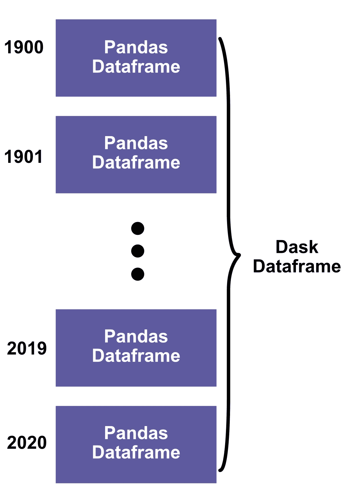
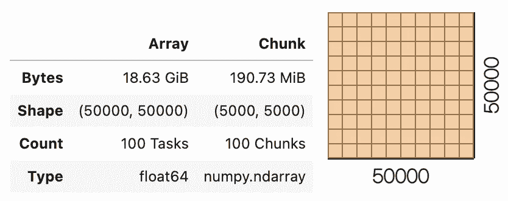
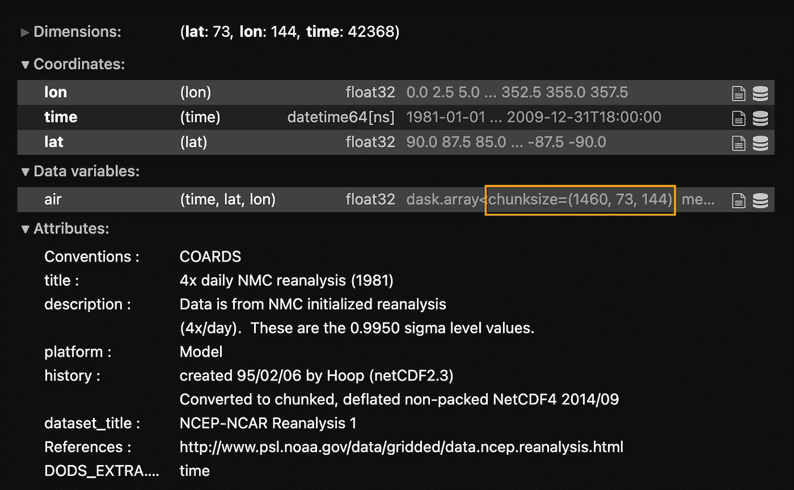

# 如何在 Python 中缩放您的分析以处理非常大的数据集

> 原文：<https://betterprogramming.pub/how-to-scale-your-analysis-to-handle-very-large-datasets-in-python-5ab4a84a52dc>

## 熊猫、NumPy、Xarray 和 lists 的例子


[Unsplash](https://unsplash.com?utm_source=medium&utm_medium=referral) 上的[杰米街](https://unsplash.com/@jamie452?utm_source=medium&utm_medium=referral)拍照。

我经常处理太大而不适合内存的数据，如果您需要所有数据来计算平均值，这可能是一个问题。我在处理大型集合模型时经常遇到这个问题，这些模型可能有几十甚至几百千兆字节的数据。有一个工具极大地提高了我的工作效率，让我能够高效地使用 Python 处理如此大的数据集，这就是 Dask。

本文旨在展示如何通过在分析数据之前“分块”数据来使用 Dask 提高可伸缩性。我将提供常用数据类型的例子。

## 目录

*   [安装](#0a94)
*   [熊猫数据框](#8852)
*   [NumPy 数组](#8640)
*   [Xarray 数据集](#c94e)
*   [Dask 包](#9637)
*   [最终想法](#49e0)

# 装置

Dask 可以通过`pip`、`conda`安装或从源头安装[。如果你使用`conda`，Dask 和](https://docs.dask.org/en/latest/install.html) [conda-forge](https://conda-forge.org/) 一样保持在默认频道。

```
conda install dask
```

这将安装 Dask 及其任何依赖项。

# 熊猫数据框

我们中的许多人都乐于和熊猫一起工作。然而，当数据变得非常大时，熊猫就崩溃了。Dask 提供了一种处理这种情况的方法，只需对现有代码做最小的改动。

下面是 Dask 如何扩展传统`DataFrames`的一个小例子，用一个小`DataFrame`来说明这个概念。

在这个例子中，我从用合成数据填充`DataFrame`开始。然后我使用`from_pandas()`函数将它转换成一个[Dask](https://docs.dask.org/en/latest/dataframe.html)。Dask `DataFrame`不是一个新的数据类型，只是一群小熊猫`DataFrames`。这些较小的帧中的每一个都被称为“组块”，其数量由`npartitions`决定。在这里，我选择了块的数量，以便每个较小的帧是一个独特的年份。



Dask 数据帧示意图(图片由作者提供)

然后我进行分析，就像我在熊猫身上做的那样。然而，Dask 懒洋洋地命令[](https://towardsdatascience.com/what-is-lazy-evaluation-in-python-9efb1d3bfed0)*，这意味着在调用`compute()`函数之前，实际上不进行任何计算。尽管数据被分割成块，Dask 会处理与计算相关的所有开销。*

## *组块并不总是有用的*

*上面的例子足够小，可以很容易地加载到内存中，而不需要分块。在这种情况下，Dask 可能会对我们造成伤害，并降低我们的计算速度，因为大部分时间可能都花在了阅读每个小的`DataFrame`上。真正的增强发生在 pandas 崩溃的情况下，例如对于无法放入内存的非常大的数据集。在这种情况下，一个大块的 Dask `DataFrame`可能是个不错的选择。*

*关于 Dask `DataFrames`的更多信息可以在[文档](https://docs.dask.org/en/latest/dataframe.html)中找到。*

# *数字阵列*

*一个 [Dask 阵列](https://docs.dask.org/en/latest/array.html)由许多小 NumPy 阵列组成，类似于一个 Dask `DataFrame`由许多小熊猫`DataFrames`组成。*

**

*作者图片*

*在本例中，我创建了一个 50000 x 50000 的大型随机值 Dask 数组。该数组被分成 100 个较小的 NumPy 数组，每个数组的尺寸为 5000 x 5000。*

*然后，我在第一维上取平均值(即*轴 0* )，使用与 NumPy 相同的语法。记住，在调用`compute()`之前，不做任何工作。*

# *Xarray 数据集*

*如果你使用多维数据集或者分析大量地球系统数据，那么你很可能熟悉[Xarray](https://xarray.pydata.org/en/stable/)和`DataSets`。Dask 被集成到 Xarray 中，将 Xarray 数据类型转换成 Dask 数据类型几乎不需要做任何工作。例如，当调用`open_mfdataset()`时，Xarray 会将数据集作为 Dask 数组加载(假设安装了 Dask)。*

**

*作者图片*

*如果您检查上面的输出并将块大小与维度形状进行比较，您会注意到变量是随时间分块的，每个块代表不同的年份。您可以使用`[chunk()](https://xarray.pydata.org/en/stable/generated/xarray.Dataset.chunk.html)`随意更改块大小。*

*这是一个根据 [NCEP 再分析](https://psl.noaa.gov/data/gridded/data.ncep.reanalysis2.html)计算气温长期平均值的例子。我直接从 THREDDS 服务器上读取数据。*

*在这个例子中，我首先用 1981 年至 2009 年的四倍每日数据加载气温。每年是包含 1460 个时间点的单个文件( *365*4=1460* )。然后，我将所有数据作为多文件数据集加载。因为 Dask 被集成到 Xarray 中，所以它会自动将数据作为 Dask 数组加载。现在，您只需像使用 Xarray 一样执行计算，但是当您想要完成实际工作时，不要忘记调用`compute()`。*

# *Dask 包*

*[Dask Bag](https://docs.dask.org/en/latest/bag.html) 在通用 Python 对象集合上实现类似`map()`、`filter()`和`groupby()`的操作，比如 lists。下面的代码将一系列数据放入一个包中，然后应用三个函数:*

*这里的列表使用`npartitions`参数分成三个块。这个列表很小，仅仅是为了说明这个概念。你可以用包做很多事情。参见[文档](https://docs.dask.org/en/latest/bag.html)。*

# *最后的想法*

*Dask 是提高可伸缩性的好方法。在本文中，我简要地讨论了根据所使用的数据类型来提高可伸缩性的方法。从本地分析转移到使用 Dask 分析只需要很少的改变。这是因为 Dask 通过允许您将数据分块来扩展这些数据类型。记住，命令是缓慢运行的，所以您需要调用`compute()`来执行实际的计算。*

*本文并不全面，只是介绍了 Dask 提高可伸缩性的几种方法。我希望这能帮助你分析你可能遇到的任何大数据。*

## *如何将数据分块*

*需要记住的一件事是如何对数据进行分块，这会影响性能。块的大小应该足够大，这样 Dask 就不必考虑太多的块了——这会影响开销——但也要足够小，这样就可以一次将太多的块放入内存。查看 Dask 关于分块的文档和[一些最佳实践](https://docs.dask.org/en/latest/array-best-practices.html)。*

## *相关文章*

*[](/how-to-speed-up-your-day-to-day-work-in-python-213762cd56b1) [## 如何加快 Python 中的日常工作

### 使用所有可用的计算能力

better 编程. pub](/how-to-speed-up-your-day-to-day-work-in-python-213762cd56b1)* 

*我很乐意帮助解决您可能遇到的任何问题。*

**感谢阅读和支持媒体作者**

*[](https://lukegloege.medium.com/membership) [## 通过我的推荐链接加入 Medium—Luke Gloege 博士

### 作为一个媒体会员，你的会员费的一部分会给你阅读的作家，你可以完全接触到每一个故事…

lukegloege.medium.com](https://lukegloege.medium.com/membership)*