# 如何为意外流量或模型训练封装和扩展您的应用程序

> 原文：<https://betterprogramming.pub/how-to-scale-your-application-for-unexpected-traffic-or-model-training-a8b0a0c44d80>

## 关于可伸缩性的实用分步指南，包含有趣的故事。


图片来自[pix abay](https://pixabay.com/)Alexas _ Fotos

有没有想过学集装箱化？您是否希望您的应用程序能够针对更高的负载或培训进行扩展？您是一名拥有统计学学位，但没有计算机工程背景，并且饱受可扩展性问题困扰的数据科学家吗？

扩展应用程序应该就像在工作中添加更多的爪牙一样简单。

在本文中，我们将:

1.  浏览应用程序的扩展设计。
2.  提供有趣的现实生活中的故事让你理解。
3.  在您的本地机器上提供易于遵循的逐步指南。
4.  解决所有的棘手问题并增强开发过程。

在本系列教程结束时，我们将实现如下可扩展设计:

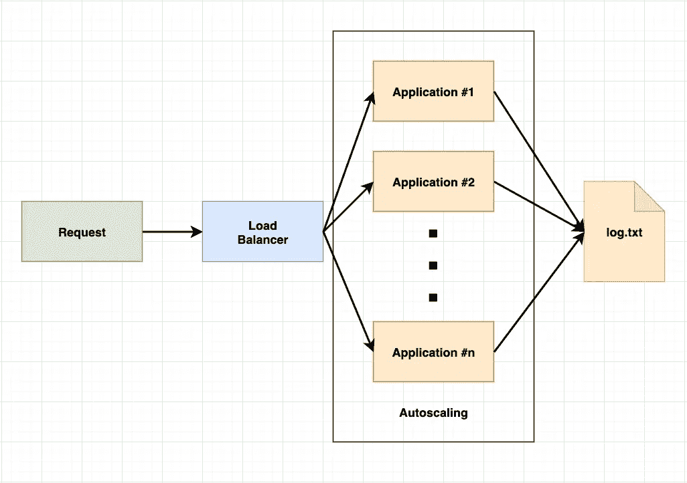

图片鸣谢:作者。

1.  `Request`发送到负载均衡器，而不是直接调用每个应用程序。
2.  `Application`是计算公式，并坚持使用主机名的`log.txt`。
3.  `Autoscaler`监控每个应用程序的计算能力，并相应地扩展应用程序。
4.  `log.txt`作为一个输出/持久层，你可以根据你的应用用任何数据库替换它。

事不宜迟，让我们开始吧。

# 1.可扩展设计

一个可伸缩的应用程序可以同时处理大量的任务或请求，同时有效地处理这些任务或请求，并为将来增加的任务或请求做好准备。

当应用程序不再能有效地处理额外的请求时，它的可伸缩性就到了极限。有两种缩放类型，水平缩放和垂直缩放。

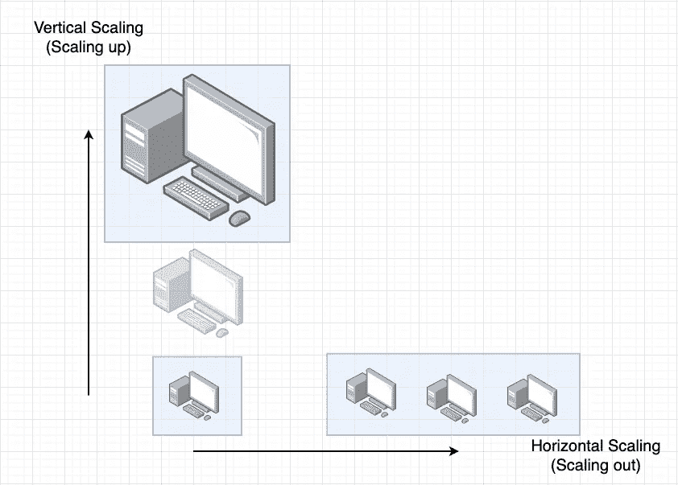

垂直缩放与水平缩放。作者图片

垂直扩展是指向现有机器添加额外的能力(CPU、内存)(也称为“纵向扩展”)。水平扩展是指向您的资源池添加更多机器的过程(也称为“向外扩展”)。

由于水平扩展的优势，我们在本文中只讨论它:

*   性能提升。
*   从硬件角度来看，扩展更容易。
*   停机时间缩短了，因为我们有更多的节点在运行。
*   提高弹性和容错能力。

要横向扩展应用程序，应用程序必须是可横向扩展的。一个理想的可伸缩应用应该具有这两个属性:

1.  服务于单一的责任。
2.  无国籍。无状态的应用程序或进程产生每一个事务，就好像是第一次从零开始。它不存储过去交易的知识或参考。

## **Storytime —单一责任和无状态**

假设你是一家餐馆的老板，你有一家餐馆，衡量标准如下:

```
+-----------------------------------------+---------+--------------+
|                  Item                   | Metric  |   Resouce    |
+-----------------------------------------+---------+--------------+
| 1\. Seat capacity filled at peak hour    |  70%    |  Real estate |
| 2\. Customer's request acknowledged time |  6s     |  Waiter/ress |
| **3\. Average food serving throughput      |  35mins |  Chef**        |
| 4\. Payment service completion           |  15s    |  Cashier     |
+-----------------------------------------+---------+--------------+
```

你会做些什么来提高餐厅的效率？开另一家餐馆？招聘一名身兼服务员、厨师和收银员多重职责的超级员工？

开另一家餐馆或雇用另一名员工来执行与服务员、厨师、收银员相同的职能是没有意义的，这样做会损害你的钱包！

我们实际上需要的是多雇一名厨师来帮助提高上菜量。这就是单一责任的美妙之处。

除了单一责任之外，让我们讨论一下为什么无状态在伸缩中很重要。

让我们想象 A 桌和 B 桌由贾斯汀服务，C 桌和 D 桌由约瑟芬服务。只有这些男女服务员知道每张桌子上提出的要求。

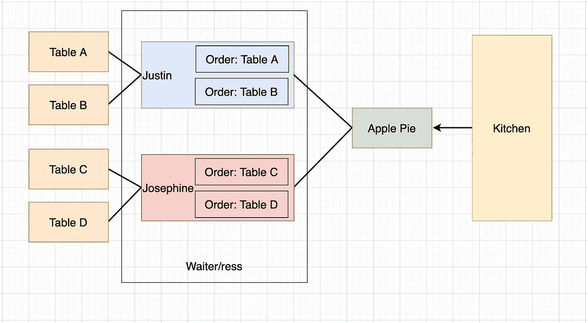

有状态的等待者/ress。作者图片

现在食物(苹果派)已经在厨房的洞里准备好了，只有约瑟芬知道如何处理它，因为 C 桌的状态只有她自己知道。因此，无状态应用程序更适合扩展。

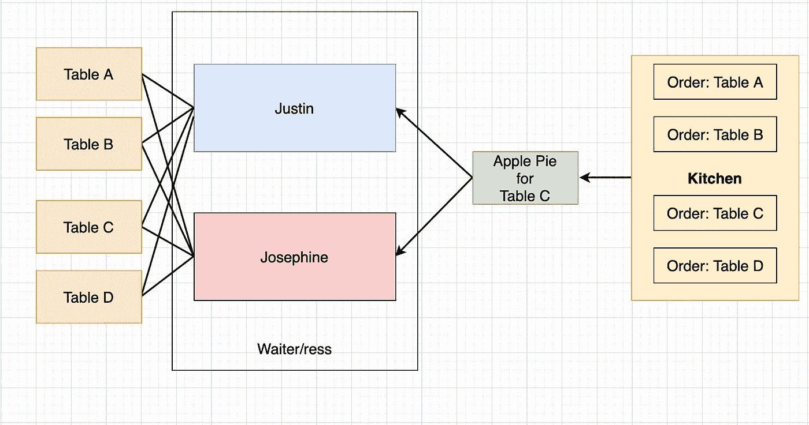

无国籍服务员/女服务员。作者图片

存储餐桌状态的订单管理系统(不打算扩展)允许服务员/ress 扩展他们的服务，而不是一直保存这些信息。因此，任何服务员都可以把食物送到正确的桌子上，而不是约瑟芬必须知道把苹果派送到 c 桌。

汤姆、迪克或哈利(任何一个奴才)都可以把苹果派端上桌 c .无状态为尺度。

希望梦想成为餐馆老板能让我们体会到**单一责任**和**无国籍**帮助扩大规模的好处。

回到我们的编码世界，让我们想象我们有一个支付系统，一个登录系统，和一个列表系统捆绑到一个应用程序中(也称为单片应用程序)。

如果我们的支付系统过载，影响了用户体验，我们就不想创建另一个电子商务平台。过度杀戮通常意味着资源的浪费。

我们对这个过度问题的解决方案是将每个系统/服务容器化，根据需求将功能和环境分开。

# 2.集装箱化和码头工人

我们需要将软件代码打包成一个可执行文件及其所有依赖项，以便在任何基础设施上统一、一致地扩展和运行。

我们将使用集装箱技术和 docker 软件工具。在我们看到魔法之前，一切都没有意义，稍后会有解释。

在本节中，我们将讨论这三个项目。

实验 1.1 将开发一个监听端口 3000 的 web 服务器，并附加一个带有主机名的日志行。

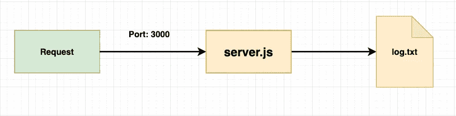

LAB1.1 申请流程图.图片鸣谢:作者

实验室 1.2 容器化应用程序。

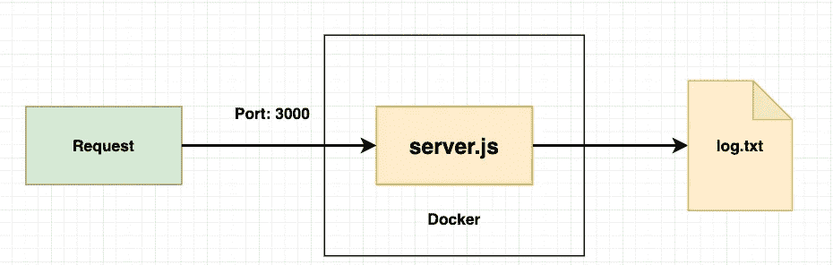

实验 1.2 的容器化应用程序流程图。图片来源:作者。

LAB1.3 为它再秤一次。

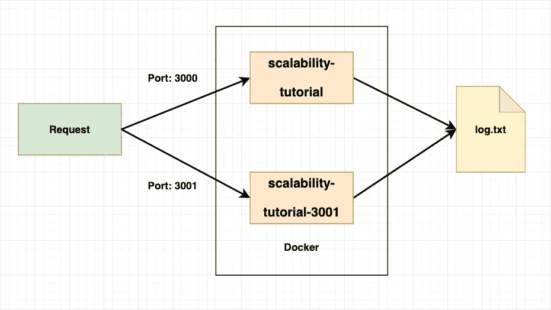

实验 1.3 的两个集装箱应用程序的流程图。图片来源:作者

每个实验环节的最后都附有一个 [GitHub repo](https://github.com/Onewayteo/medium-scalability) 链接，供您交叉检查。

## 实验 1.1:开发 web 服务器

为了从头开始理解设计和开发，让我们从头开始开发一个 web 服务器，然后在 LAB1.2 中将其容器化。

以“$”开头的代码块是我们在实验过程中需要键入终端的输入。如果您遇到任何问题，请随时发表评论。

为了简单起见，在您的主目录下创建一个新目录。

```
$cd ~
$mkdir medium-scalability
$cd medium-scalability
```

在本次实验 1 结束时，我们应该有一个如下所示的文件夹结构:

```
medium-scalibility
├── .dockerignore #Created in LAB1.2 
├── Dockerfile    #Created in LAB1.2
├── log
│   └── log.txt   #Created in LAB1.1
├── package.json  #Created in LAB1.1
└── server.js     #Created in LAB1.1
```

首先，创建一个监听端口 3000 的`server.js`,我们有意不使用 python 来学习如何自己封装一个应用程序，因为这才是最重要的。

*   第 8–13 行定义了 route /的过程
*   第 15–24 行在`~/log/log.txt`添加一行当前日期时间和主机名
*   第 26–31 行有一个平方根的计算循环。
*   第 33–36 行指定端口并打印到日志中。

使用 Python Django 也可以达到同样的效果。

创建`package.json`并传递下面的代码:

*   第 7 行定义了我们在执行`npm start`时运行的脚本

在计算机上安装 NodeJS

[](https://nodejs.org/en/download/) [## 下载| Node.js

### Node.js 是基于 Chrome 的 V8 JavaScript 引擎构建的 JavaScript 运行时。

nodejs.org](https://nodejs.org/en/download/) 

安装后，请运行与`python pip`相同的`$npm -v`并遵循以下命令进行验证:

```
$npm install                                                                                                    added 50 packages, and audited 51 packages in 3s
found 0 vulnerabilities
```

让我们创建一个新目录和`log.txt`，然后启动 web 服务器。

```
$mkdir ./log
$touch ./log/log.txt
$npm start
> medium-scalability@1.0.0 start
> node server.jsListening at [http://localhost:3000](http://localhost:3000)
Running On:  undefined
```

尝试`curl locahost:3000`或使用您最喜欢的浏览器，地址为 localhost:3000，我们应该看到`Request received at undefined, and`忽略了现在的主机名`undefined`。

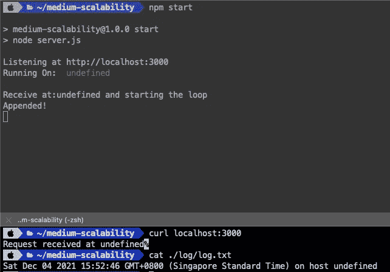

应用程序的预期输出


应用程序的流程图。图片来源:作者

这是我们已经完成的，设置应用程序时会遇到哪些限制？

*   这个应用程序是在 macOS 上开发的，如果我们的服务器运行 Ubuntu/Window 或 Redhat 会发生什么，我们可以复制相同的吗？
*   我们将主机名设为`undefined`，这是一个主机/系统依赖项。
*   npm 已安装，并且手动创建了文件路径和 log.txt。如果我们必须在 100 台主机上安装它们会怎么样？我们是否愿意一个一个地安装它们？
*   如果我们有另一个需要不同版本的 NodeJS/software 的应用程序，您想仅仅为了运行不同的应用程序而删除并安装它吗？

为了解决上述问题，我们将它们装箱。在此之前，让我们通过在终端中键入`Control + C`来停止本地主机上的 web 服务器。

如果你遇到任何问题，你可以在 GitHub 上找到 [LAB1.1 的代码。](https://github.com/Onewayteo/medium-scalability/tree/lab2.1_develop_web_server)

## 实验 1.2:应用的容器化

Docker vs 图像 vs 容器

1.  Docker 是一个开源的容器化平台/工具。
2.  Image 是我们将要构建的容器的规范。
3.  容器是一个实现的形象。容器化的思想是包含软件代码及其所有依赖项，以便它可以在任何孤立的基础设施上统一和一致地运行。

## story time—Docker vs Image vs Container

码头装卸和集装箱化经常被人们混淆。码头和集装箱化的区别就像 Google.com 和搜索引擎的区别一样。

Google.com 和 Docker 是软件工具，我们有雅虎或必应作为搜索引擎的替代品。相比较而言，容器化是一种类似于搜索引擎的技术。

是什么形象？假设:

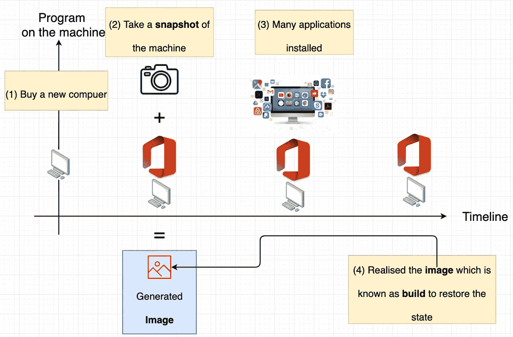

图像的解释。图片鸣谢:作者。

1.  我们买了一台预装了 Windows 操作系统的新电脑，一切从头开始，然后我们安装了 Microsoft Office。
2.  在这个特定的时间点，我们希望拍摄应用程序及其虚拟环境的快照。快照就是图像。
3.  大约 7 个月后，我们安装了一些有用的应用程序和许多无用的应用程序。
4.  我们希望我们的机器像时光机一样，回到只有 Window 操作系统和 Microsoft Office 的那个时间点，我们只是简单地实现或构建我们拥有快照的映像。

容器是什么？容器是我们构建映像所基于的独立虚拟环境和应用程序。

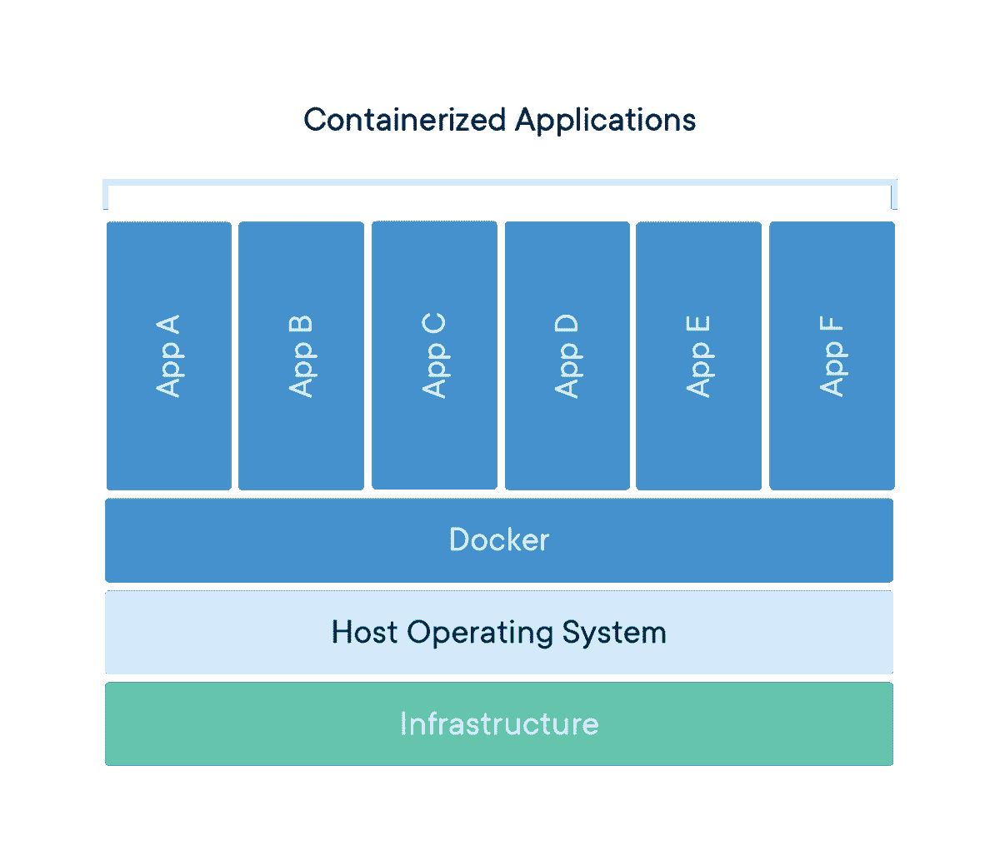

来源于[docker.com](https://www.docker.com/resources/what-container)

通过在主机上安装 Docker，我们可以在单个主机上实现或构建多个映像到容器中。他们每个人都有一个孤立的虚拟环境。

如果你看过电影《[蝴蝶效应](https://www.imdb.com/title/tt0289879/)》的话，埃文阅读日志(影像)并旅行回到(建立影像)那个时间点是一个类似的概念。

学习这种超能力来实现我们定义的形象是不是很兴奋？Docker 是魔术。

根据您的操作系统安装 docker 引擎，然后验证 Docker 版本。

[](https://docs.docker.com/engine/install/) [## 安装 Docker 引擎

### Docker Desktop for Linux Docker Desktop 帮助您在 Mac 和 Windows 上轻松构建、共享和运行容器，就像您做…

docs.docker.com](https://docs.docker.com/engine/install/) 

```
$docker -v
Docker version 20.10.10, build b485636
```

创建一个新的文本文件名`Dockerfile`，这是容器的配置。

Dockerfile 文件

*   `FROM node:alpine` 表示我们要从**镜像** `node:alpine`构建一个容器，它基本上是一个安装了 node 的 alpine 操作系统。
*   `WORKDIR /app`将容器中的工作目录设置为/app(与`mkdir -p /app && cd /app`相同)，类似于我们之前在`~/medium-scalability`所做的。
*   `COPY package.json .`将我们的本地主机 package.json 带到主机`/app/package.json`。
*   `RUN npm install`根据我们带过来的/app/package.json 运行命令 npm install at /app。同`pip install -r requirements.txt`。
*   `RUN mkdir -p /app/log`在容器中创建文件夹/app/log。
*   `COPY . .`复制当前 localhost 目录下除`.dockerignore`文件中提到的文件以外的其余文件。
*   `CMD ["npm", "start"]`指定初始化容器将执行的命令。

创建一个新文件名`.dockerignore`，它将忽略 docker 操作之外的那些文件。

。dockerignore

将第 17 行的`[server.js](https://gist.github.com/Onewayteo/094399289dec03ac8ad0f4bac8adefa3)`修改为`/app/log/log.txt`

基于配置`Dockerfile` 构建我们的 docker `image`，名称标记为`-t`为`medium-scalability`

```
$docker build -t medium-scalability .
```

我们应该会看到如下输出:

```
[internal] load build context
=> transferring context: 32.87kB
=> [2/6] WORKDIR /app
=> [3/6] COPY package.json
=> [4/6] RUN nom install
=> [5/6] RUN mkdir -0 /app/log
=> [6/6] COPY . .
=> exporting to image
=>=> exporting layers
=>=> writing image sha256: 1be65ac6e17e4b5a93498626c1a765d11a1043545b4c2ed39abeeec615ddb039
=>=> naming to docker.10/Library/medium-scalability
```

它将经历`Dockerfile`中定义的每一步，并创建图像层。

通过执行以下命令启动我们的容器:

```
$docker run \
--name scalability-tutorial \
-dp 3000:3000 \
--mount type=bind,source="$(pwd)"/log,target=/app/log \
medium-scalability
```

*   `--name`给这个容器命名为`scalability-tutorial`
*   `-d`在“分离”模式下运行新容器(在后台)
*   `-p`将主机的端口 3000 映射到容器的端口 3000。如果没有端口映射，我们将无法访问应用程序。
*   `--mount`是捆绑坐骑。*主机*上的文件或目录被装入一个容器中。我们正在尝试同步`log.txt`的日志目录

要列出正在运行的容器:

```
$docker ps
```

我们应该看到一个包含容器 ID、图像、命令、已创建、状态、端口、名称的条目。

让我们测试一下这个应用程序，或者使用`curl`或者使用地址为`localhost:3000`的浏览器

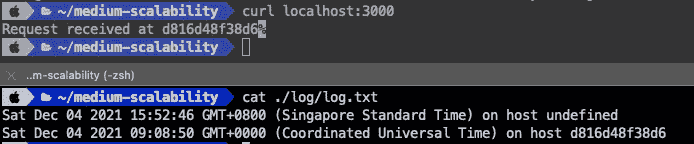

容器的预期输出

如您所见，我们在日志文件中有另一个额外的日志行，主机名为`d816d48f38d6`。为什么？

为了简单起见，一个新的运行容器相当于一个新的主机在运行应用程序，这个容器/主机有在系统或`node:alpine`中定义的主机名。

用于本地构建映像的常用 docker 命令:

*   `docker inspect [CONTAINER_NAME or CONTAINER_ID]`返回 Docker 对象的底层信息。
*   `docker logs CONTAINER_ID`取集装箱的原木。

我们已经封装了一个在端口 3000 监听的 web 服务器，它将在文件 log.txt 上附加一个日志行，其中包含处理时间和主机名。


集装箱应用程序的流程图。图片来源:作者

这还不够，我们需要横向扩展另一个，但我们不能让它们在同一个端口 3000 上工作。

如果遇到任何问题，可以在 GitHub 上找到 [LAB1.2 的代码。](https://github.com/Onewayteo/medium-scalability/tree/lab2.2_containerize)

## 实验 1.3:秤

将`[server.js](https://gist.github.com/Onewayteo/094399289dec03ac8ad0f4bac8adefa3)`第 5 行修改为 3001，并运行以下命令:

```
$docker build -t **medium-scalability-3001** .
$docker run \
--name **scalability-tutorial-3001** \
-dp **3001:3001** \
--mount type=bind,source="$(pwd)"/log,target=/app/log \
**medium-scalability-3001**
```

注意下面的输出已经“缓存”了，这是 [Dockerfile 最佳实践](https://docs.docker.com/develop/develop-images/dockerfile_best-practices/)之一，因为我们[利用了构建缓存](https://docs.docker.com/develop/develop-images/dockerfile_best-practices/#leverage-build-cache)。因为我们在构建了之前的容器后修改了文件`server.js`。

`package.json`和`node_modules`没有变化，因此将`COPY . .`作为 Dockerfile 中的步骤 6 有助于节省我们的时间和资源，而无需为步骤 1 至 5 构建图像层。

```
=> CACHED [2/6] WORKDIR /app
=> CACHED [3/6] COPY package.json
=> CACHED [4/6] RUN npm install
=> CACHED (5/6] RUN mkdir -p /app/log
=> [6/6] COPY. .
=> exporting to image
=> => exporting layers
=> => writing image sha256:18d772e70317c96001e2393a8ab99ca139b766c7c6211ab3b56677630066fc49
=> => naming to docker. io/library/medium-scalability-3001
```

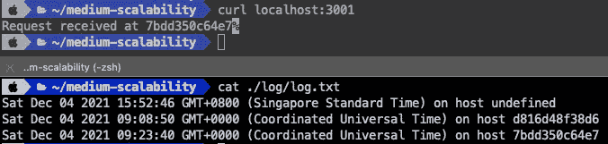

恭喜你！您已经在端口 3001 上扩展了另一个应用程序，我们应该得到如下所示的东西:


两个集装箱应用程序的流程图。图片来源:作者

*如果遇到任何问题，可以在 GitHub* *上找到* [*LAB1.3 的代码。*](https://github.com/Onewayteo/medium-scalability/tree/lab2.3_scale_out_port_3001)

到目前为止，我们已经将一个应用程序容器化，并使用不同的端口向外扩展另一个应用程序，那么向外扩展另外 30 个应用程序的潜在问题是什么？

*   我们需要修改不友好端口的`server.js`。
*   我们需要用不同的容器名构建容器并维护它们，这并不明智。
*   `request`需要确切地知道调用哪个端点、`localhost:3000`和`localhost:3001`，最终是同一个服务。我们期望调用者知道同一服务的端点吗？
*   我们如何用一个命令来缩放容器呢？
*   我们如何自动缩放容器？

为了突破这些限制，我们将在下一篇文章中讨论负载平衡、容器编排和自动伸缩。请跟随我，让我为你增加更多的价值。

# 关键要点

我们已经容器化了一个理想的可伸缩的应用程序，它服务于单一的职责并且是无状态的。

容器将软件代码打包成一个可执行文件及其所有依赖项，以便我们在任何基础设施上统一、一致地扩展和运行。

为了支持上述优势，我们

*   在 macOS(或者你的 PC 的 OS)上开发了由于主机依赖性而不能打印主机名的代码，但是现在我们可以了，因为容器化允许我们在新的容器中复制相同的输出，而不管主机的操作系统。
*   手动安装 NodeJS/NPM，但这已经由 Docker 自动完成。
*   构建了一个开发沙箱，提供了一个隔离的环境，让我们可以开发应用程序，而不必让本地主机应用程序崩溃。应用程序 A 有 NodeJS 版本 14，应用程序 B 在 docker 容器中的 NodeJS 版本 16 上运行。

这篇文章的目的是给你更多的信心，帮助你开始使用集装箱化和 Docker。有关更多信息，请参见 Docker 文档。

例如，如何停止正在运行的容器？

[](https://docs.docker.com/) [## 码头文件

### Docker 文档的主页

docs.docker.com](https://docs.docker.com/) 

第 2 部分于 2021 年 12 月 27 日发布:[使用 Kubernetes](/autoscale-your-application-for-unexpected-traffic-using-kubernetes-ff5ee7d9f22) 针对意外流量自动调整您的应用

## 放弃

这不是一篇供您深化技能组合的科学论文或深入的技术文章，而是一个有趣而实用的系列，供您构建第一个可伸缩的应用程序，并为您提供另一个理解的角度。

# 参考

1.  [https://docs.docker.com/](https://docs.docker.com/)
2.  https://www.docker.com/resources/what-container
3.  【https://www.ibm.com/sg-en/cloud/learn/containerization 

```
**Want to Connect With the Author?**I enjoy making friends around the world, let’s connect on [Linkedin](https://www.linkedin.com/in/teowangwei/).
```