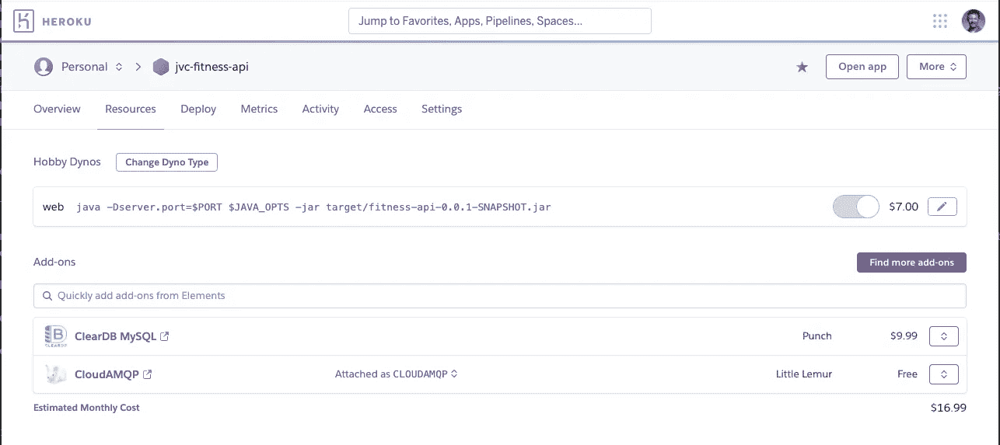
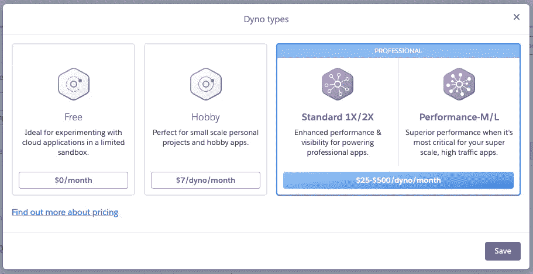
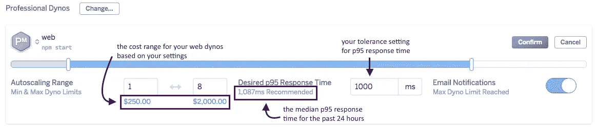
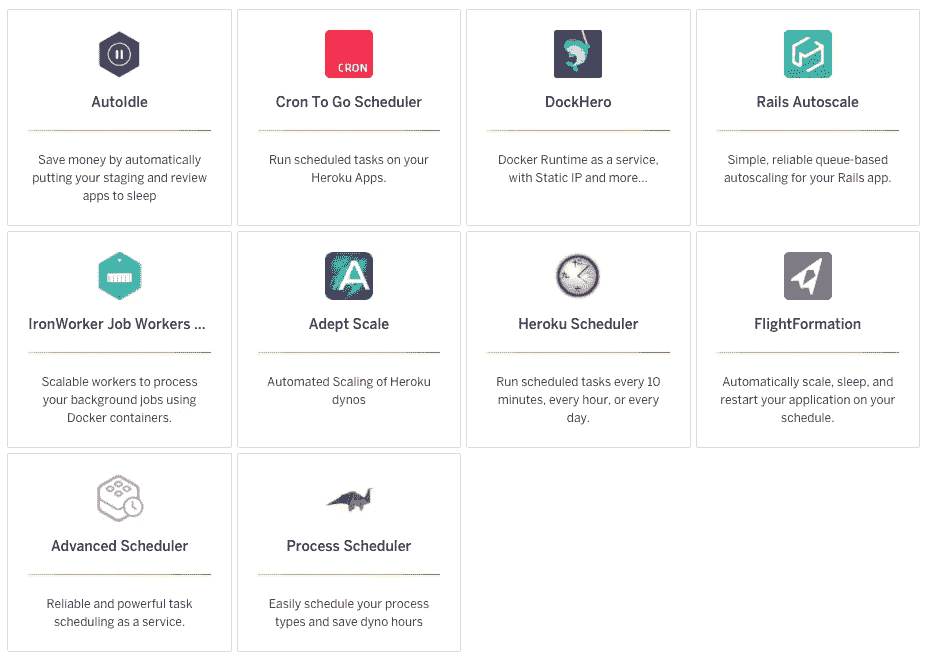
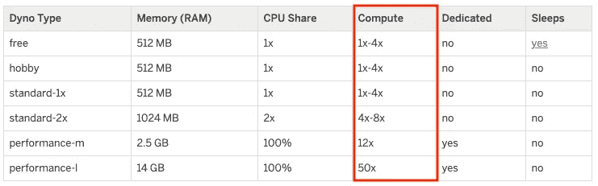

# 如何使用 Heroku Dynos 像老板一样扩展您的 Web 应用程序

> 原文：<https://betterprogramming.pub/how-to-scale-your-web-apps-like-a-boss-with-heroku-dynos-22300cf498b5>

## 探索 Heroku 提供的扩展选项


布鲁克·拉克在 [Unsplash](https://unsplash.com?utm_source=medium&utm_medium=referral) 拍摄的照片

在技术领域找到自己的位置令人兴奋，同时也令人满足。当您的应用程序或服务提供给客户时，您会感受到完成某种程度的教育、赢得一场游戏或创作一些艺术珍品供他人欣赏的同样兴奋。

但是客户太爱你的创作怎么办？

在[的这个视频](https://www.youtube.com/watch?v=8zfH-1gD9sg)中，Vertabiz 提供的产品立刻获得了成功。一开始，这很棒！但几秒钟后，他们意识到他们缺乏满足客户需求的能力。

虽然上面链接中的商业广告与运输和物流有关，但在服务层面也存在同样的问题。知道何时扩大规模(和缩小规模)以领先于需求不仅可以改善客户体验，还可以带来财务回报。

在这篇文章中，我将探索 Heroku 生态系统中的扩展选项。

# 我如何知道何时需要扩展？

在 Vertabiz 视频中(见上图)，当看到订单数量超出预期时，团队意识到需要扩大产能。为了获得流畅的 web 应用程序客户体验，应该在现有服务达到 100%利用率之前增加容量。

知道“何时扩展”的概念与构建可扩展的架构一样重要。毕竟，过快的扩展会消耗比所需更多的成本，而事后的扩展会影响性能并可能失去客户。当需求减少且不需要使用额外的容量时，同样会出现成本高昂的情况。

Heroku 提供了以下选项，有助于深入了解您的应用或服务何时需要改变容量:

*   参考 Heroku 仪表板中的 Metrics 选项卡，可以提供应用程序历史需求的图形表示，这可以证明对当前容量的更改是合理的
*   使用 [loader.io](https://elements.heroku.com/addons/loaderio) 插件，它可以帮助了解您的应用程序需要额外的容量
*   使用 Heroku 产品市场的[监视器](https://elements.heroku.com/addons#monitoring)附件来监视性能

# 垂直缩放与水平缩放

根据应用的设计，可以通过两种不同的方式来满足消费者的需求:

*   **垂直缩放** —增加到更大的动态类型。可以把这看作是升级到一个更强大的系统来处理请求。
*   **水平缩放** —增加相同类型的测功器的数量。

在大多数情况下，简单地水平添加实例并不能解决问题；也就是说，除非应用程序架构是为那个场景准备的，如[十二因素应用](https://12factor.net/)的[过程](https://12factor.net/processes)方面所述。这就是负载平衡器或 API 网关经常被引入的地方。

对于 Heroku，请求路由是生态系统的一部分 *—* 这是 Heroku 节省时间和资源的另一种方式。你可以在这里阅读更多关于这个[的内容](https://devcenter.heroku.com/articles/http-routing#request-distribution)。

# 使用 Heroku 手动缩放

使用 Heroku 进行自动扩展的手动方法只是意味着有人将利用 Heroku 仪表板或 Heroku 命令行界面(CLI)来解决给定应用程序或服务的需求相关需求。

## 使用 Heroku Web 仪表板

在上面的例子中，如果我想为我在 Heroku 上运行的一个服务增加一个 Dyno 配置的处理能力(纵向扩展),可以使用以下步骤:

1.  导航至 Heroku 仪表板上的资源选项卡:



2.单击“更改动态类型”按钮并进行适当的选择。



按照屏幕上任何剩余的指示，保存请求，Heroku 将为您处理其余的事情。

如果我想使用相同的用户界面水平扩展我现有的 Heroku(专业)应用程序，第一步中的铅笔图标将被选中。接下来的屏幕将允许根据需要增加测功器的数量。

## 使用 Heroku CLI

使用 CLI 是手动扩展 Heroku 应用程序或服务的另一种选择。然而，这种选择依赖于你对预期结果的了解。

例如，要增加 Dyno 实例的数量，可以执行以下 CLI:

```
heroku ps:scale web=3
```

要更改 Dyno 类型，可以执行以下 CLI:

```
heroku ps:type worker=standard-2x
```

请记住，对 Dyno 类型的更改不会改变实例的数量。

当然，精明的 DevOps 工程师可以使用外部进程来执行 Heroku CLI，通过让一个预定的进程执行 CLI 命令来自动执行 Heroku 中的 Dyno 扩展。

# 使用 Heroku 自动缩放

如果您在性能层运行 Heroku，或者让 Dynos 在私有空间(在隔离网络上运行的专用环境)中运行，则自动扩展内置于 Heroku 提供的服务级别中。

在这些情况下，Heroku Desktop 中的“资源”选项卡包括一个“启用自动缩放”按钮，它会出现以下对话框:



由于这一特性仅限于 Heroku 生态系统中更高级的层，[本文](https://devcenter.heroku.com/articles/scaling#autoscaling)提供了关于自动缩放特性的优秀文档。

# 其他自动缩放选项

对于在 Heroku 其他层上运行的应用程序， [Heroku Marketplace](https://elements.heroku.com/addons#dynos) 提供了几种附加产品:



我使用过一些这样的附加组件，这些附加组件分为以下自动缩放类别:

*   **预定模式** —基于预定的自动缩放
*   **智能模式** —基于请求/响应时间的自动缩放

# 预定自动缩放模式

在自动缩放的预定模式中，支持应用或服务的工程团队知道在 Heroku 中运行的 Dynos 数量的变化。该方法有两个子类别:

*   **用户界面** —附加模块利用专用用户界面来扩展 Dynos
*   **调度器** —插件利用 CLI 实现自动缩放

## 用户界面

“用户界面”子类别包含 Heroku Marketplace 附加组件，主要用于为 Heroku 上运行的应用程序或服务设置时间表。这些选项包括一个目的驱动的用户界面，以使最终用户的工作更容易。

以下附加组件允许 Dynos 按计划自动缩放:

*   [自动倾斜](https://elements.heroku.com/addons/autoidle)
*   [飞行编队](https://elements.heroku.com/addons/flightformation)

值得注意的是，AutoIdle 只是一个“缩减至零”选项，建议用于非生产环境。主要目标是为目前没有使用的非生产 Dynos 省钱。

## 调度程序

基于调度程序的附加组件可用于传递 CLI 命令，并可用于根据需要扩大和缩小规模。

这种方法利用了以下 Heroku CLI 命令(在上面的使用 Heroku CLI 一节中提到):

```
heroku ps:scale web=3
heroku ps:type worker=standard-2x
```

以下附加产品允许按计划执行 CLI 命令:

*   [Cron To Go 调度器](https://elements.heroku.com/addons/crontogo)
*   [Heroku 调度器](https://elements.heroku.com/addons/scheduler)
*   [进程调度器](https://elements.heroku.com/addons/process-scheduler)

这些解决方案通常依赖于运行在 Heroku 生态系统底层系统上的基本 Cron 功能。

# 智能自动缩放模式

预定自动缩放模式的局限性在于应用或服务的需求模式是完全已知的。也就是说，更高和更低的需求水平是可以预测的。这可能并不总是为人所知 *—* 简介中的 Vertabiz 视频是一个示例场景。

自动伸缩的智能模式根据应用程序或服务中实现的当前请求/响应时间来改变 Dynos 的数量。以下附加产品提供此功能:

*   [内行秤](https://elements.heroku.com/addons/adept-scale)
*   [轨道自动缩放](https://elements.heroku.com/addons/rails-autoscale)(仅限于 Ruby)

使用智能自动缩放选项可确保在没有任何人工干预的情况下处理需求中的意外变化。这有助于解决需求超过本文档迄今所述选项的任何预期水平的情况。

# 结论

在我的出版物中，我引用了我提供给所有 IT 专业人员的以下使命声明:

> *“将您的时间集中在提供扩展您知识产权价值的特性/功能上。将框架、产品和服务用于其他一切。”
> -j·维斯特*

当您的应用程序或服务达到需要扩大和缩小容量以保持积极的消费者满意度时，就需要利用自动扩展解决方案。在我从事 IT 行业 30 多年的时间里，我目睹了美妙的解决方案是如何因为负面的性能现实而失去吸引力的。

目前，Heroku 中的每个 Dyno 类型都有以下实例计数范围:



虽然自动缩放会产生成本，但正确实现的级别将会抵消手动缩放应用程序或服务所带来的总体节省。利用上面的选项，一路上流失客户的概率大大降低。

祝您愉快！