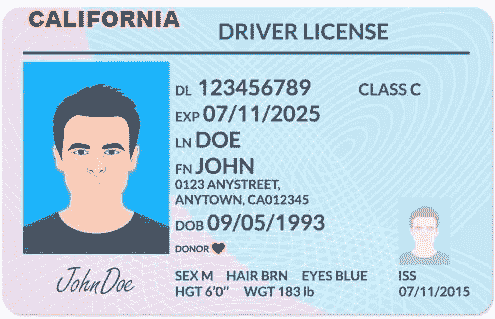
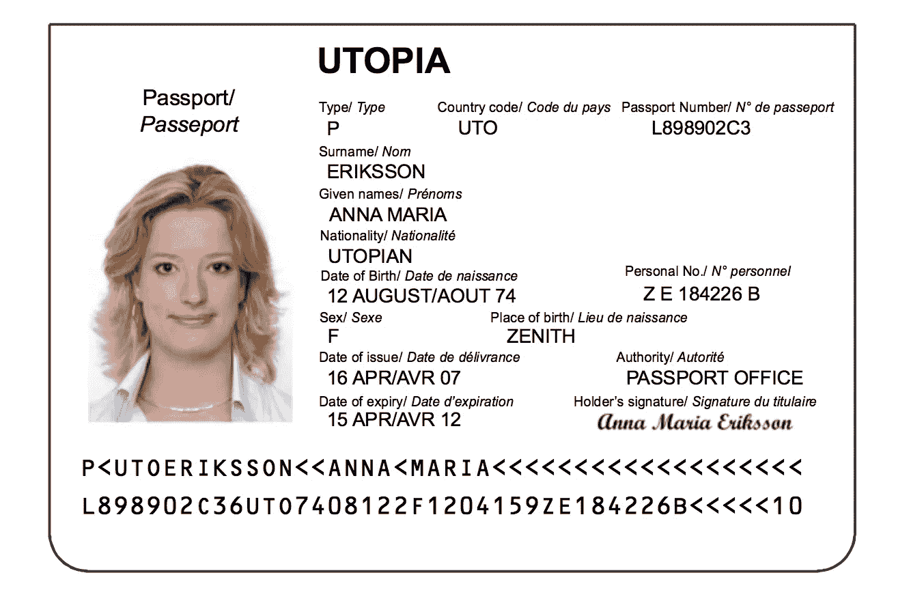

# 如何用 Pixlab 的“docs can”API 扫描美国驾照和护照

> 原文：<https://betterprogramming.pub/how-to-scan-us-drivers-license-and-passport-using-ai-361fc3e0803d>

## 在你的 JavaScript 网络应用中使用人工智能


利瓦伊·文图拉在 [Unsplash](https://unsplash.com?utm_source=medium&utm_medium=referral) 上拍摄的照片

如果你经营的企业需要检查和保存美国驾照和护照的记录，那么在你的系统中手工输入他们的详细信息是非常繁琐的。这项任务需要大量的人力和金钱。

如果我告诉你，有一种人工智能服务可以用来自动扫描那些驾驶执照文件，并在几分之一秒内提取细节，会怎么样？是的，你没听错。在 AI 和机器学习的时代，你不应该再做体力劳动，把整个重复的过程自动化。

这种文档扫描功能不仅仅限于驾驶执照，还扩展到许多其他类型的文档，包括电子 KYC、人脸提取等。

# 你将从这个博客中学到什么

在这篇博客中，我将一步一步地向你解释如何扫描和提取美国驾照上的信息。

让我把一件事说得非常清楚，在内部制造这样一个人工智能系统来满足你的需求是可能的。但是这在金钱和时间上都是极其昂贵的。因此，我建议你从第一天开始就使用人工智能服务来使用这些高级功能。

在这篇文章中，我将使用 [Pixlab](https://pixlab.io/) 扫描驾驶执照。Pixlab 是一个软件即服务(SaaS)，为个人和企业提供非常易用的人工智能服务。

确保获得一个 [Pixlab API 密匙](https://pixlab.io/pricing)以便跟进。

这里我将使用 Node.js 服务器，并制作一个简单的 rest API 来与 [Pixlab API 端点](https://pixlab.io/cmdls)通信。由于 CORS 限制，无法从您的网络浏览器环境访问 Pixlab APIs。因此，使用 Postman 或简单地从您的终端发出 curl 请求来测试 Pixlab 的任何特性。

如果你对 Node.js 不是很熟悉，那么也不用担心。我将使用非常简单的 Node.js 函数。如果你有任何语言的后端开发经验，你可以很容易理解后端代码。

向用户公开您的 API 密钥也是不明智的。在这种情况下，他们可能会误用或过度使用 API，而你必须承担这些用户的负担。因此，总是从服务器环境调用 Pixlab API。

# 使用 Pixlab 扫描美国驾照

通过在空目录中运行“npm init”命令创建一个新的 Node.js 应用程序。然后填写它询问你的关于你的项目的所有提示。如果你不想回答所有这些问题，你可以简单地运行“npm run -y”来接受所有的提示并搭建你的项目。

现在我安装了 3 个必需的包，express、Axios 和 nodemon。我使用 Expressjs 来制作 Node.js 服务器。Nodemon 是一个依赖于开发人员的工具，当我们的应用程序发生变化时，它会重启我们的服务器。而 Axios 简化了我们从服务器发出的 HTTP 请求。

```
npm i express axios
npm i -D nodemon
```

现在在您喜欢的代码编辑器中打开这个目录。让我们搭建 Node.js 应用程序，并在端口 3000 上运行它。

```
const express = require("express");
const app = express();
app.use(express.json());
app.get("/", (req, res) => {
 res.json({ msg: "Hello" });
});
app.listen("3000", () => {
 console.log("server started");
});
```

## 从您的服务器调用 Pixlab API

在开始本节之前，请确保从 Pixlab 获得一个 API 密匙。

建议总是从服务器调用 Pixlab API。否则，您的 API 密钥可能会暴露给用户。即使您尝试从浏览器调用 Pixlab API，也会出现 CORS 错误。

在本教程中，我使用这张图片作为驾驶执照的演示，从中提取我们需要的所有细节。这是保存在 AWS 存储器中的图像。因此，你只需要提供图像的 URL，就可以让 Pixlab AI 处理它。



现在在 Node.js 项目中导入 Axios 库，并向 Pixlab 的 [Docscan API 端点](https://pixlab.io/cmd?id=docscan)发出 get 请求。该端点支持 GET 和 POST 请求。

如果您有驾驶执照的在线 URL，则使用 GET 请求。相反，如果您想直接从本地服务器存储上传映像，可以使用 POST request。

## 向 Pixlab Docscan API 发出 GET 请求

让我们看一个如何在 Node.js 服务器中使用 Axios 构建 GET 请求的例子。

```
const getRequestToDocscanAPI = async () => {
  try {
    let response = await axios.get("https://api.pixlab.io/docscan", {
      params: {
        img: "https://s3.us-east-1.amazonaws.com/pics.pixlab.xyz/sample-udl.jpg",
        type: "usdl",
        key: "PIXLAB_API_KEY",
      },
    });
    return response;
  } catch (error) {
    console.log(error);
  }
};
```

在这个例子中，您可以看到我添加了图像 URL 作为请求参数。在类型参数中，我使用“usdl ”,因为这是美国驾驶执照，最后，我提供了 Pixlab API 密钥。

在您发出请求后，Pixlab API 处理您的图像，并向您发送一个 JSON 响应，其中包括驾驶执照中的所有细节。来自 API 的演示响应如下所示。

```
{
  "type": "US Driving License",
  "face_url": https://..amazonaws.comfinedia.pixiab.xyz
  "fields":{
    "country": "USA",
    "issuingState": "California",
    "issuingStateCode": "CA",
    "licenseNumber": "123456780",
    "fullName": "DOE JOHN", 
    "address": "0123 ANYSTRECT, ANYTOWN, CA 01234",
    "dateOfBirth": "1993-04-05",
    "issuingDate": "2015-07-11",
    "expiryDate": "2025-07-11",
    "gender": "male",
  }
  status: 200,
}
```

## 向 Pixlab Docscan API 发出 POST 请求

根据 Pixlab 的 Docscan API 文档，如果你想直接上传你的本地图像，你必须使用一个[多部分/形式数据](https://developer.mozilla.org/en-US/docs/Web/API/FormData/Using_FormData_Objects)内容类型。

要发出多部分/表单数据请求，请从 npm 安装表单数据包。这个包为您提供了一个类似的浏览器 FormData API，使您的工作更加轻松。

```
npm i form-data
```

现在让我们看看如何使用这个表单数据包向 Pixlab Docscan API 发出多部分/表单数据请求。

```
const form = new FormData();
    form.append("file", image.data, image.name);
    form.append("key", process.env.PIXLAB_KEY);
    form.submit(
      {
        protocol: "https:",
        host: "api.pixlab.io",
        path: "/docscan",
        method: "POST",
        headers: {
          "Content-Type": `multipart/form-data; boundary=${form.getBoundary()}`,
        },
      },
      (err, resp) => {
        if (err) {
          res.status(503).send("File server is currently unavailable");
        }
        resp.pipe(res);
      }
    );
```

在上面的代码示例中，首先实例化一个“FormData”对象。然后通过将请求数据附加到此“FormData”对象来添加请求数据。主要是我添加了两个参数。一个是图像本身，另一个是 Pixlab API 密钥。

然后使用“form.submit()”函数将 POST 请求发送到 Pixlab 服务器。在“提交”功能中，提及协议、方法、主机路径等，以便您的请求到达目的服务器，并携带处理请求所需的最重要信息。

## 将用户图像直接上传到 Pixlab 服务器

在上面的例子中，您已经看到了如何通过 POST 请求向 Docscan API 发送图像。但是在 Pixlab 中有更好的处理图片上传的方法。

Pixlab 有一个 store API，可以将用户图像直接存储在一个云桶中。因此，您可以接受用户上传的图像，然后将它们转发到 Pixlab 商店。在响应中，您将获得图像的 URL。现在您可以使用这个 URL 在 Pixlab 中进行所有类型的处理。

商店 API 接受 POST 请求。请求的主体应该是包含用户上传的图像和 API 密钥的多部分/格式数据。如果请求成功，API 会获取您的图像并将其上传到在线存储桶，并提供该图像的链接。

在我们的服务器中，我们采用`/upload '路径输入用户文件。我们使用 express-fileupload 包访问用户上传的图像。将这个包作为中间件添加后，我们可以使用 req.files 方法访问用户上传文件。要安装此软件包，请运行以下命令。

```
npm i express-fileupload;
```

然后，我们使用我前面提到的表单数据包来构造我们的多部分/表单数据请求。在表单数据中附加用户上传的图像和 API 密钥。您可以在这里使用 dotenv 包来隐藏您的 API 键，并将其作为环境变量来访问。

在构建了多部分/表单数据之后，我们将请求提交给 Pixlab API。然后不管我们得到什么响应，如果是 200，我们就把它作为对用户的响应。

```
app.post("/upload", (req, res) => {
  try {
    if (!req.files || Object.keys(req.files).length === 0) {
      return res.status(400).send("No files were uploaded.");
    }
    let image = req.files.image;
    const form = new FormData();
    form.append("file", image.data, image.name);
    form.append("key", process.env.PIXLAB_KEY);form.submit(
      {
        protocol: "https:",
        host: "api.pixlab.io",
        path: "/store",
        method: "POST",
        headers: {
          "Content-Type": `multipart/form-data; boundary=${form.getBoundary()}`,
        },
      },
      (err, resp) => {
        if (err) {
          res.status(503).send("File server is currently unavailable");
        }
        resp.pipe(res);
      }
    );
  } catch (error) {
    res.status(500).send(error);
  }
});
```

# 引擎盖下发生了什么

你想知道，当你使用 Docscan API 扫描驾照时会发生什么吗？让我们一步一步来理解这个过程。我在这里总结了这一点，但是你可以在他们的官方文档中读到更多。

1.首先，使用[面部检测 API](https://pixlab.io/cmd?id=facedetect) 检测用户面部。

2.得到人脸坐标后，你可以使用 Pixlab 的[图像处理 API](https://pixlab.io/cmd?id=crop) 来裁剪和提取图像。

3.然后使用 Docscan API，Pixlab 提取关于用户的信息。

4.处理完成后，图像将从服务器中删除。Pixlab 不会存储任何图像以供将来参考。这是一个非常好的隐私之举。

5.在引擎盖下，Pixlab 使用 PP-OCR，这是一个实用的超轻量级 OCR 系统，主要由三部分组成:文本检测，包围盒隔离和文本识别。因此，Pixlab 可以通过扫描驾照生成准确的结果。

# 使用 Pixlab 扫描护照

Pixlab 的 Docscan API 并不局限于扫描美国驾照。它也能够从护照中提取数据。

将 passport 上传到 Docscan API 后，首先它会使用 facedetect API 提取用户图像。然后，它将二进制数据(如护照机器可读区(MRZ))转换为文本有效负载流。这包括全名、签发国家、文件编号、失效日期等。最后，它用一个简单易用的 JSON 字符串作为响应，供您的应用程序使用。

让我们在代码中看看如何使用 Pixlab API 扫描护照。我将制作一个简单的 Node.js 服务器，并调用 Docscan API。我已经在这篇博客的前一部分描述了如何设置 Node.js 应用程序。请遵循这些步骤，因为过程非常相似。

```
const express = require("express");

const app = express();

app.use(express.json());

app.get("/", (req, res) => {
  res.json({ msg: "Hello" });
});

app.listen("3000", () => {
  console.log("server started");
});
```

这是一个演示护照图像。我们将使用此图像通过 Pixlab Docscan API 提取数据。



现在让我们在 Node.js 环境中使用 Axios 库发出请求。

```
const getRequestToDocscanAPI = async () => {
  try {
    let response = await axios.get("https://api.pixlab.io/docscan", {
      params: {
        img: "https://s3.us-east-1.amazonaws.com/pics.pixlab.xyz/sample-udl.jpg",
        type: "passport",
        key: "PIXLAB_API_KEY",
      },
    });
    return response;
  } catch (error) {
    console.log(error);
  }
};
```

在上面的代码片段中，我向 Pixlab Docscan API 发出 GET 请求。在请求参数中，我已经添加了图像 URL 以及图像类型 passport 和 Pixlab API 密钥。

如果请求成功，它将返回一个 JSON 对象，包含从 passport 中提取的所有信息。

```
{
  type: “PASSPORT”,
  face_url: “nttps://s3.amazonaws.com/media.pixlab. xyz/24p5ba822a00df7F. png",
  mrz_img_url: “nttps://s3.amazonaws.com/media.pixlab. xyz/24p5ba822a1e426d. png",
  mrz_raw_text: “P<UTOERIKSSON< <ANNAXMARIAK << <<< <<< <<< <<< << <\NLB98982C36UTO 7468122F 12641592 E 184226B<<<<<16",
  fields: {
    issuingCountry: “UTO",
    fullName: “ERIKSSON ANNA MARIA”,
    documentNumber : “L898962C3",
    checkDigit: "6/2/9/1",
    nationality: “UTO",
    dateOfBirth: “1974-08-12”,
    sex: “F",
    dateOfExpiry: "2012-04-15",
    personalNumber : “ZE184226B",
    finalcheckDigit: "9",
  },
  status: 260,
}
```

# 奖励:使用 Pixlab 扫描阿联酋居留卡

Pixlab 还能够使用其 Docscan API 端点扫描身份证。和前面的例子一样，Docscan API 可以从 ID 卡中提取用户图像，并提取所有需要的信息。然后，它处理所有这些信息，并用一个简单的普通 JSON 对象进行响应，以便在您的应用程序中使用。

从您的服务器调用 API 来扫描 ID 卡的过程与前面的过程类似。但是在类型参数中，使用“idcard”作为值。这是使用 Pixlab API 扫描 ID 卡的 GET 请求示例。

```
const getRequestToDocscanAPI = async () => {
  try {
    let response = await axios.get("https://api.pixlab.io/docscan", {
      params: {
        img: "https://s3.us-east-1.amazonaws.com/pics.pixlab.xyz/sample-udl.jpg",
        type: "idcard",
        key: "PIXLAB_API_KEY",
      },
    });
    return response;
  } catch (error) {
    console.log(error);
  }
};
```

# 结论

在本教程中，您已经学习了如何使用 Pixlab 的 Docscan API 扫描和提取官方文档中的信息。如果您正在处理 PDF 而不是图像，您可以使用[pdftimage](https://pixlab.io/cmd?id=pdftoimg)API 首先将您的 PDF 转换为图像，然后应用我在文章中提到的步骤。

首先，你已经学会了如何扫描美国驾照。我已经演示了如何通过直接将本地图像上传到 API 来发出 GET 和 POST 请求。然后我们进行护照扫描，最后简单谈一下身份证扫描。如果你喜欢这个博客，一定要和你的同龄人分享。如果你有任何问题，你可以在推特上找到我，地址是[@ hrishkshpathak](http://twitter.com/hrishikshpathak)。