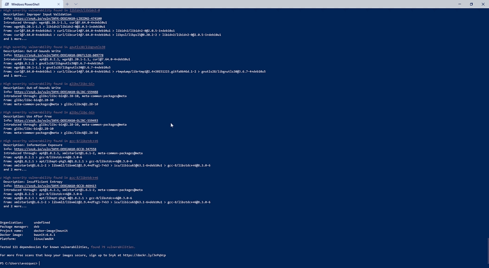
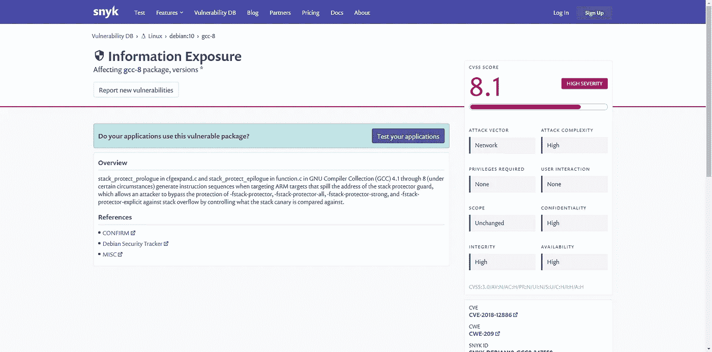
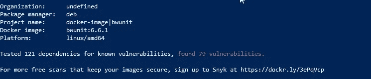

# 如何在本地机器上扫描 Docker 图像

> 原文：<https://betterprogramming.pub/how-to-scan-your-docker-images-in-your-local-machine-fba2f8d53c3d>

## 了解如何在 Docker 引擎安装中利用 Snyk


Alberto Restifo 在 [Unsplash](https://unsplash.com?utm_source=medium&utm_medium=referral) 上拍摄的照片。

安全性是现代建筑中最相关的话题。它需要从所有不同的角度来处理。让一个团队审计我们构建的平台和开发是不够的。

DevSecOps 作为新标准的引入，包括作为开发过程的一部分的安全团队和策略，以避免安全成为创新的阻碍，并确保我们部署的工件是安全的，已经清楚地表明了这一点。

Docker 图像扫描是我们可以讨论的关于容器图像的最重要的主题之一，以了解作为图像一部分的所有内部组件都没有漏洞。我们通常依靠一些系统来做到这一点。

我给[写了一篇文章](https://medium.com/dev-genius/how-to-use-harbor-to-increase-security-on-your-platform-a6e57b518fe2)，是关于使用开源世界中最相关的选项之一(Harbor)来完成这项工作的。

从今年开始，像 Amazon ECR 这样的云提供商的不同 Docker 存储库也在这么做。但是，为什么我们需要等到将图像推送到外部 Docker 注册中心呢？为什么不能在我们当地的环境下做呢？

现在我们可以了。Docker 引擎的 2.5.0.1 版本还包括直接从命令行检查 Docker 图像所需的 Snyk 组件:

[](https://www.docker.com/blog/combining-snyk-scans-in-docker-desktop-and-docker-hub-to-deploy-secure-containers/) [## 在 Docker 桌面和 Docker Hub 中结合 Snyk 扫描部署安全容器——Docker 博客

### 上周，我们宣布 Docker 桌面稳定版包括漏洞扫描，这是…

www.docker.com](https://www.docker.com/blog/combining-snyk-scans-in-docker-desktop-and-docker-hub-to-deploy-secure-containers/) 

# 扫描您的本地图像

那么，我们开始吧。让我们打开一个新的终端，键入以下命令:

```
docker scan <image-name>
```

我们一输入这个命令，它就会告诉我们这个扫描过程将使用 Snyk 来完成，我们需要授权访问这些服务来完成扫描过程。

之后，我们会得到一份检测到的所有漏洞的列表，如下图所示:



使用本地 Docker 客户端进行漏洞扫描

对于每个漏洞，您可以看到以下数据:


为检测到的每个漏洞提供的详细信息

我们获得了包含漏洞、严重性级别和简短描述的库。如果您需要更多详细信息，也可以查看提供的链接到该漏洞描述页面的 URL:



snyk 的漏洞详细页面

最后，它还提供了在您的映像中介绍这个库的源代码，因此可以快速解决这个问题。

它还提供了整个图像的高级视图，正如您在这里看到的:



概述您的 Docker 映像以及检测到的所有漏洞

因此，现在您没有任何借口在将所有图像推送到本地存储库之前不保证它们的安全。我们开始吧！