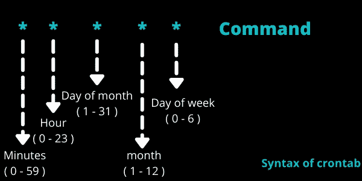
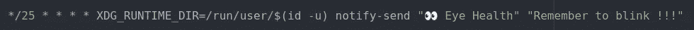
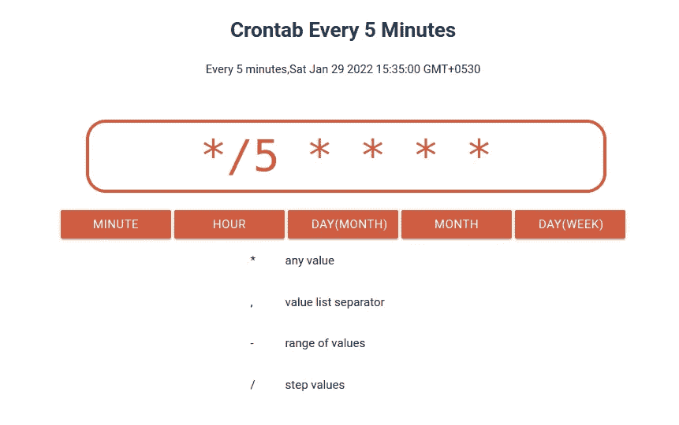
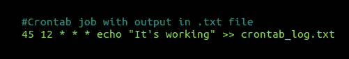
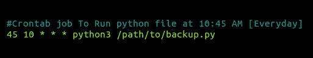
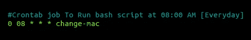
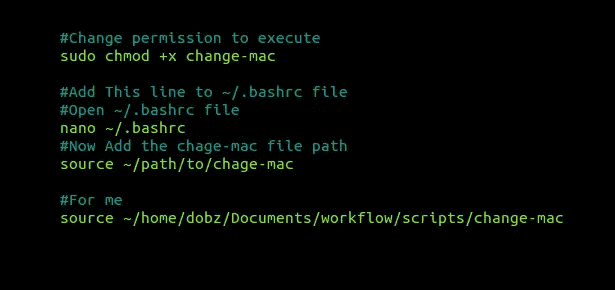
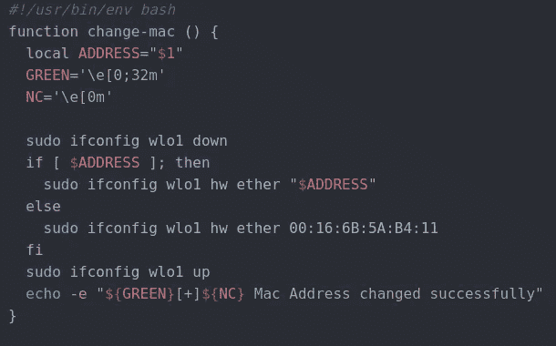

# 在 Linux 中调度 Cron 任务

> 原文：<https://betterprogramming.pub/how-to-schedule-cron-tasks-in-linux-fc605bf4911e>

## 编辑、列出所有任务和删除


现在你不能一个人做所有的事情，如果你想从你的一天中得到更多，自动化你每天做的事情，这样你就不用做了。

重要数据、系统日志、运行特定脚本的备份。

您可以使用 crontab 在 [*Linux*](https://blog.devgenius.io/6-essential-commands-to-get-better-at-linux-system-you-should-know-d1a85b175fde) 中调度作业，crontab 是每个类 UNIX 操作系统中都有的软件实用程序，用于在特定时间调度任务。

Cron 以希腊单词“Chronos”命名，意思是时间。它是按照特定计划执行任务的命令列表。

crontab 是您想要调度的任务列表的编辑器。

# **crontab 的语法**

```
* * * * * command* * * * * /path/to/script.sh
```

这里星号(* * * * *)用于匹配*分钟*、*小时*、*一月中的日子*、*一年中的月份*、*一周中的日子*。



该命令可以是您希望在特定时间执行的脚本。

让我们看看在 crontab 中编辑、列出和删除作业的命令。

# 在 crontab 中编辑

```
crontab -u <your_username> -e
```

或者

```
crontab -e
```

第一次，它会要求你选择一个编辑器，你可以选择 nano，它非常容易使用，每个 Linux 系统都有。

**示例 1 :** 我想发送一个 Linux 通知，提醒我在大部分时间里用笔记本电脑工作时眨眼——科学表明，你在屏幕上工作时经常忘记眨眼——这是真的。

假设我想每 25 分钟发送一次通知。

命令将是:



这是对 Linux 的通知，与 crontab 无关。
`Notify-send`将期待两个论点:

1.  通知的标题
2.  2.通知正文

所以”👀眼睛健康”是`Title`和“记得眨眼！！!"是`Body`

`XDG_RUNTIME_DIR=/run/user/$(id -u)` —这里的`XDG_RUNTIME_DIR`是一个环境变量，在你登录时自动设置。当你从 crontab 运行`notify-send`命令时，你必须指定这个变量——因为它允许程序在用户目录中存储临时文件。但是当你给出任何不需要与显示器交互的脚本或命令时，你不需要指定它。

`* * * * *` —这将在每分钟、每小时、每天、每月、每年执行。

但是您希望每 25 分钟执行一次该命令。所以你可以用 25 分钟匹配来计算。它将是:

```
*/25 * * * */ →for step value
- → for range vaule
, → for seprating value
```

如果你想对这种搭配有更深的了解，可以看看下面的网站。

你可以从这里找到(* * * * *)的值【https://crontab.tech/ 



来源:https://crontab.tech/

所以这将每 25 分钟发送一次通知。


**例 2:** 可以将 crontab 的输出或任何运行时错误保存在 txt 文件中。



在 crontab 文件中，注意:# is 注释将被忽略

所以 crontab 将在每天 12:45 运行，并在`crontab_log.txt`文件中发送 echo 命令输出

记住:
> → single 表示如果不存在将创建一个新文件并覆盖输出。(overwrite)
>>→double 表示如果不存在将创建一个新文件并追加输出。(附加)

# 在 crontab 中列出所有任务

这将列出 crontab 中为该特定用户写入的所有作业，如果没有指定，它将为活动的登录用户运行。

```
crontab -u <your_username> -l
```

或者

```
crontab -l
```

# 删除 crontab 作业

这将删除整个任务列表。

```
crontab -r
```

## crontab 中有一些内置的字符串。

```
@hourly → command →will run command every hour ( 0 * * * * )
@midnight → ( 0 0 * * *)
@daily → ( 0 0 * * *) same as midnight
@weekly → ( 0 0 * * 0)
@monthly →( 0 0 1 * *)
@yearly →(0 0 1 1 *)
@reboot →run cron job at every reboot
```

**示例 3:** 使用 crontab 运行 python 脚本



在 crontab 文件中，crontab 使用 24 小时制，因此下午 2:45 意味着 14:45

这将在每天上午 10:45 运行`backup.py` python 文件

**示例 4:** 使用 crontab 运行 bash 脚本

让我们看看如何在 Linux 中自动更改 mac 地址



在 crontab 文件中

这里我配置了 change-mac 命令来运行我的更改 mac 地址 bash 脚本。

现在遵循这一系列命令



现在，这些命令将从命令行运行



在 Linux 中改变 mac 地址的 bash 脚本

# **总结**

```
→ cron is used to schedule jobs in Linux OS
→ crontab is used to edit , list , remove crontab in Linux for cron.
→ crontab -e → for edit
→ crontab -l → for listing jobs
→ crontab -r → fro removing crontab
→ Some predefined strings like @daily ( 0 0 * * * )
```

# 资源

1.  更改 mac 地址的 Shell 脚本代码:[https://github.com/techdobz/scripts](https://github.com/techdobz/scripts)

2.查找值(* * * *) Crontab 语法:[https://crontab.tech/](https://crontab.tech/)