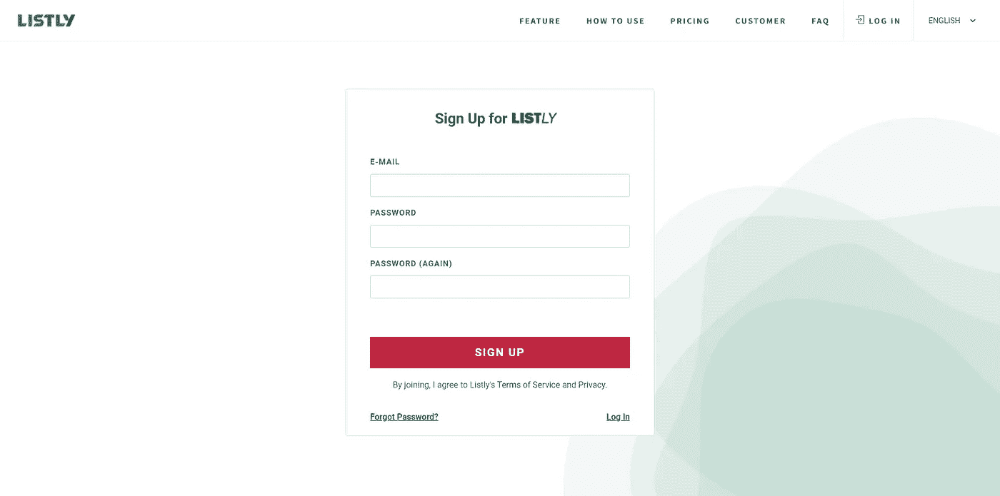
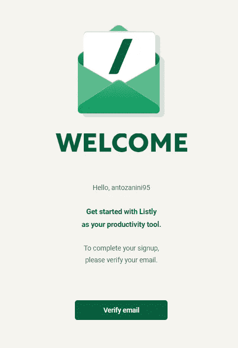
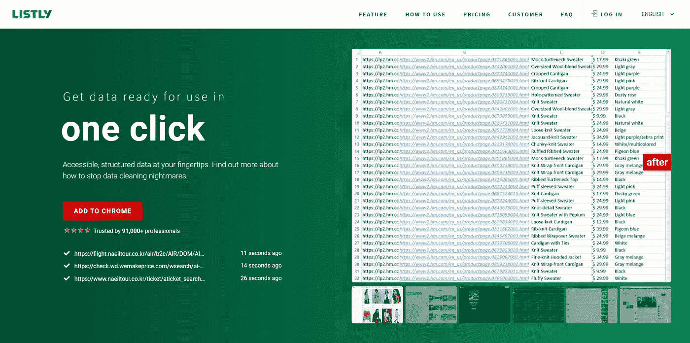
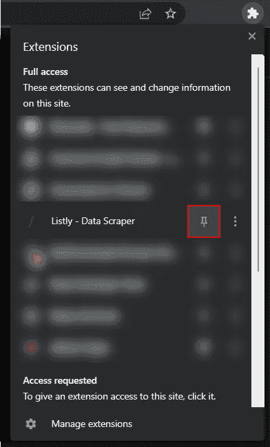
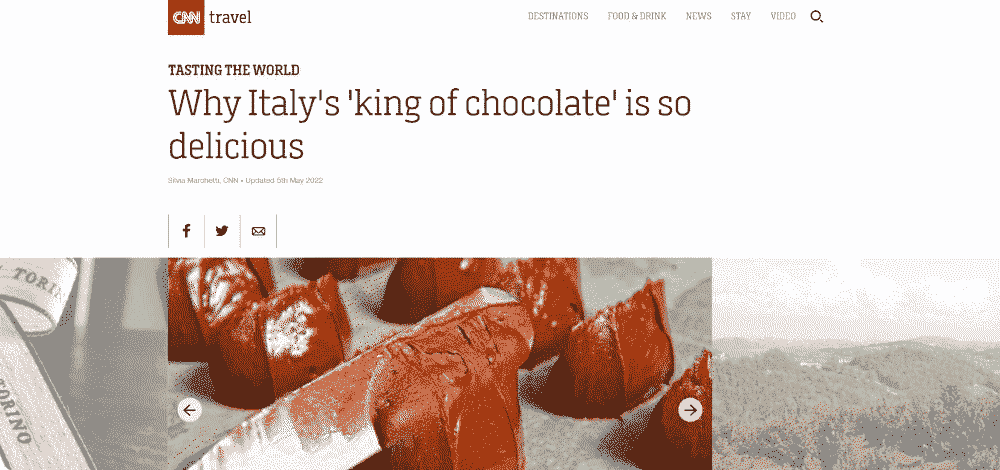
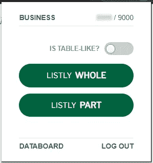
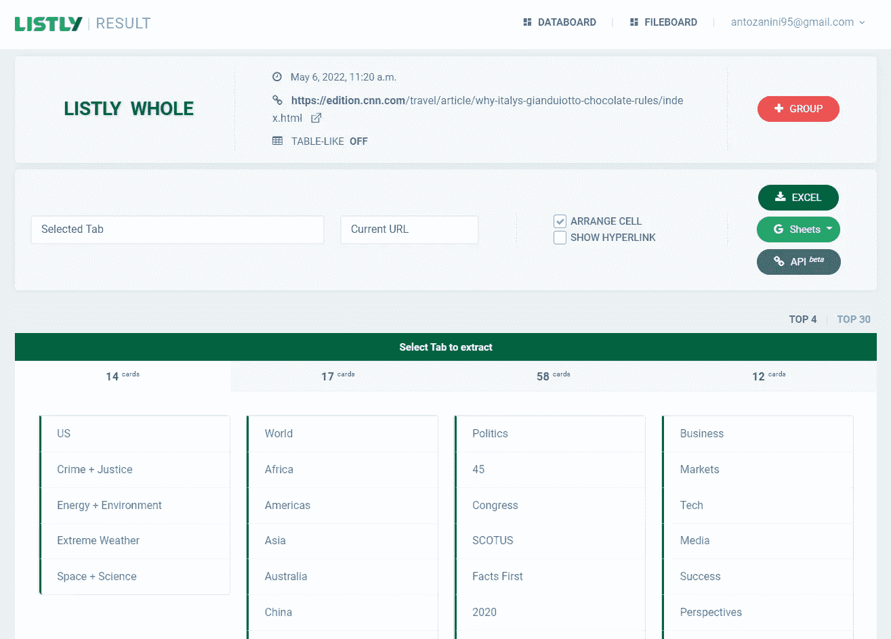
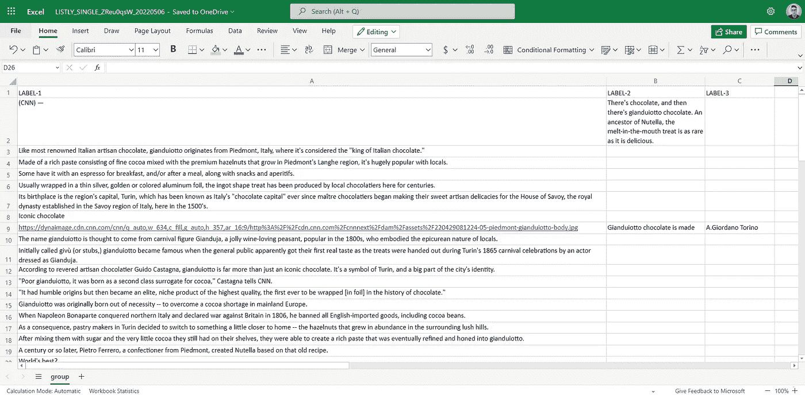

# 如何只需点击几下鼠标就能找到媒体文章

> 原文：<https://betterprogramming.pub/how-to-scrape-media-articles-in-just-a-few-clicks-7d9ba52c2bde>

## 通过网络抓取浏览器扩展节省时间和金钱


由[路](https://unsplash.com?utm_source=medium&utm_medium=referral)上[车头](https://unsplash.com/@headwayio?utm_source=medium&utm_medium=referral)拍摄

抓取网页是从网上检索数据的最有效的方法之一。另一方面，每个 web 页面都是不同的，以编程方式从中提取数据需要一个包含自定义逻辑的抓取脚本。

构建这样一个脚本需要花费时间和金钱。幸运的是，最近开发出了许多抓取服务，只需点击几下就可以抓取网页。因此，您不再需要编写代码来实现您的数据提取目标！

在这里，您将学习如何使用 Listly 从媒体文章中提取数据，Listly 是一家抓取服务公司，它联系我测试他们的产品并诚实地对其进行评论。让我们直接进入文章吧！

# 从媒体文章中收集什么数据，为什么

媒体文章通常包括:

*   一个标题
*   可选的 TL；([博士太久了；没看](https://en.wikipedia.org/wiki/Wikipedia:Too_long;_didn%27t_read) *)* 章节
*   一个或多个字幕
*   段落列表
*   一些图像

毫不奇怪，这里最重要的信息是文章的文本，但图像和视频也很重要。特别是，当处理多媒体文件时，你必须考虑到它们可能受版权保护。如果你想避免问题，你可能会被要求指出多媒体文件的来源。因此，检索图像或视频的来源和作者信息至关重要。

然后，您可以使用所有这些信息来创建新闻聚合应用程序，在您的网站或应用程序中添加新闻部分，研究媒体文章如何因营销目的而随时间变化，为您的机器学习算法创建数据源以研究语言如何工作，或者只是与您的朋友分享文章。

现在，让我们深入研究从媒体文章中收集数据的工具。

# 什么是 Listly？

> “Listly 是一项网络抓取服务，面向从非技术营销人员到高级开发人员的所有人。它可以在几秒钟内将网页转换成 Excel 电子表格。提取的数据用于零售、研究、大数据和其他与数据相关的工作。”— [常见问题解答— Listly.io](https://www.listly.io/faq)

Listly 的推荐使用方式是通过官方的 Chrome 扩展，已经有超过 60k 的用户下载了。

但是，让我们不要再浪费时间，学习如何使用 Listly 从媒体文章中收集数据。

# 用 Listly 从 CNN 抓取文章

让我们通过一步一步的图像教程来学习如何使用 Listly 从媒体文章中收集数据。

## 1.Listly 入门

首先，你需要一个列表帐户。访问[这个](https://www.listly.io/signup/)页面，填写表格，然后点击“注册”。



列表注册页面

您将在收件箱中收到以下电子邮件，以验证您的电子邮件地址:



列表验证电子邮件

点击“验证电子邮件”,你现在应该有一个有效的 Listly 帐户。

现在，你需要安装 Listly Chrome 扩展。你所要做的就是访问[列表](https://www.listly.io/r/9m0yj)网站，点击“添加到 CHROME”。



Listly.io 主页

请记住，您可以免费测试 Listly，但是免费计划有一些限制。这意味着，如果你想要一个完整的体验，你需要一个付费的计划。

幸运的是，Listly 给我提供了一个推荐链接，保证给你 10%的折扣。因此，如果您计划在业务中使用 Listly 或希望避免任何限制，请考虑激活付费计划并通过以下链接下载:

```
[https://www.listly.io/r/9m0yj](https://www.listly.io/r/9m0yj)
```

享受您的九折优惠！

现在，你已经拥有了从网站上收集数据所需的一切。但在开始使用它之前，我建议通过点击以下按钮将 Listly 固定在 Chrome 扩展工具栏中:



锁定 Listly Chrome 扩展

## 2.选择要刮除的物品

现在，访问一个媒体网站，选择你想刮的文章。在本教程中，你将看到如何从 [CNN](https://edition.cnn.com/) 网站上刮出 [*“为什么意大利的‘巧克力之王’这么好吃”*](https://edition.cnn.com/travel/article/why-italys-gianduiotto-chocolate-rules/index.html) 的文章。

文章看起来是这样的:



所选媒体文章的完整视图

如你所见，这是一篇又长又详细的文章，有几张图片。抓取媒体文章的主要挑战是它们通常由几个文本块组成。此外，它们之间可能有许多广告、图像和嵌入内容。因此，开发一个抓取脚本来检索您感兴趣的数据可能会涉及复杂的逻辑。但是你可以用 Listly 避免这一切！

现在，让我们看看 Listly 是如何让您只需点击几下鼠标，无需代码就能抓取这样一个页面的。

## 3.用 Listly 点击几下就能抓取 CNN 的文章

访问你选择的文章的页面，点击 Chrome 扩展工具栏中的 Listly 图标。

Listly 扩展中显示的弹出窗口如下所示:



列表扩展弹出窗口

由于一篇媒体文章不是表格式的，并且您想要抓取整篇文章，请单击“完整列表”。

等待 Listly 施展它的魔法，你应该会被重定向到下面的页面:



列表数据板页面

这是数据板页面，您可以在这里决定哪些数据要删除，哪些要忽略。请注意 Listly 如何自动为您抓取和组织在源网页上找到的所有卡片。

通过研究 Listly 界面为您提供的数据，您应该会注意到包含 58 张卡片的选项卡就是您正在寻找的内容。但是 58 张卡片中只有一部分是真正有趣的。要仅选择相关的卡片，请在“所选卡片”输入栏中选择“选择标签”。

这是您的列表数据板页面现在应该看起来的样子:


启用了“选择卡片”选项的列表数据板页面

现在，每张卡都有一个复选单选按钮，您可以使用它来选择或取消选择它。在最终的数据提取过程中，只会考虑您标记为选中的卡。

选择感兴趣的卡片后，单击“Excel”按钮将提取的数据导出到 EXCEL 文件中。将自动下载一个`LISTLY_SINGLE_XXXXXX_YYYYY.xlsx`文件。

打开 Excel 文件，您应该会看到从您手动选择的 CNN 文章中抓取的数据，这些数据组织在单元格中，如下图所示:



从 LISTLY 导出的 list ly _ SINGLE _ zreu 0 qsw _ 20220506 . xlsx 文件

如您所见，`LABEL-1`列包含了所有的段落、图像 URL 和字幕。`LABEL-2`列存储了[TD；博士](https://en.wikipedia.org/wiki/Wikipedia:Too_long;_didn%27t_read)部分和图像说明文字。而`LABEL-3`列具有图像作者和版权信息。

基本上，在这三栏中，有你能从媒体文章中检索到的所有最重要的数据。

瞧啊！只需点击几下，您就可以抓取包含异构和结构化内容的网页。所有这些，无需编写一行代码。

# 诚实的评论

既然是 Listly 联系我来测试他们的产品，我觉得有必要和你分享我对它的真实想法。总体体验肯定是积极的，但现在让我们根据我迄今为止对 Listly 的体验，深入探讨最相关的利弊。

## 赞成的意见

*   **易于使用**:Listly 用户界面直观，引导您完成数据提取过程。
*   **快速**:从媒体文章中抓取数据只需要几秒钟。
*   **功能齐全** : Listly 让您能够安排每日提取、接收电子邮件通知、将多个页面导出到数据板页面上的 Excel 电子表格、上传。html 文件到文件板页面，再现鼠标/键盘动作以加载更多数据，重复单击以加载更多数据，重复滚动以加载更多数据，滚动时自动保存，选择代理服务器以更改 IP 地址，检测 iframe，从 iframe 中提取数据，提取内容上的超链接，等等。

## 骗局

*   **电子表格仅导出**:在撰写本文时，您只能将您的数据提取到电子表格中，或者使用 Beta API 程序提取到 JSON 和 CSV 中。有能力将数据导出到 Word、Google Docs、PDF 文档和其他格式将非常好。
*   **数据选择过程有点浅**:你可以选择哪些数据要考虑，哪些数据要忽略的数据板页面没有提供太多选项。有可能预先格式化感兴趣的数据，自动包括或避免包含特定字符串的卡片，或者选择如何聚集或分割卡片将是很好的功能。

# 结论

在本文中，我们研究了应该从媒体文章中获取什么数据，为什么，以及如何在不编写一行代码的情况下做到这一点。这一切之所以成为可能，要感谢 Listly，这是一种网络抓取服务，它具有强大、易用、快速的浏览器扩展功能，使您能够抓取任何网站。如图所示，Listly 有一些小缺陷，但总体来说我的体验还是不错的。

感谢阅读！我希望这篇文章对你有所帮助。如果有任何问题、意见或建议，请随时联系我。