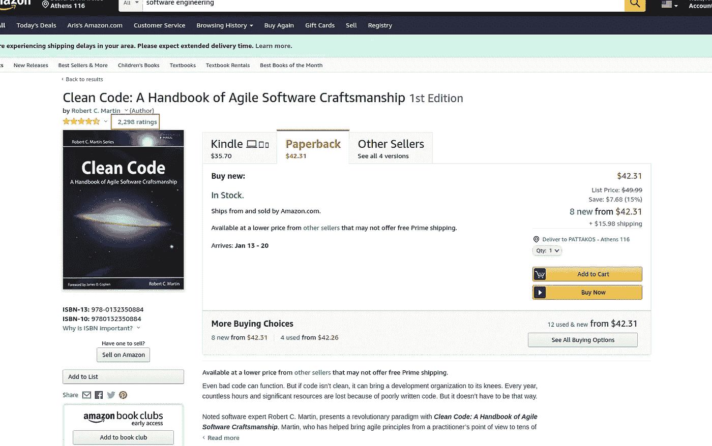
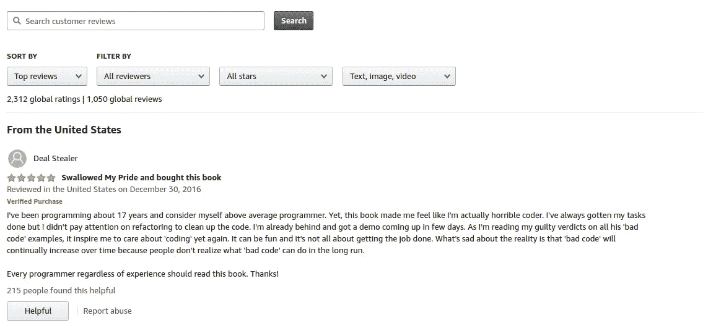
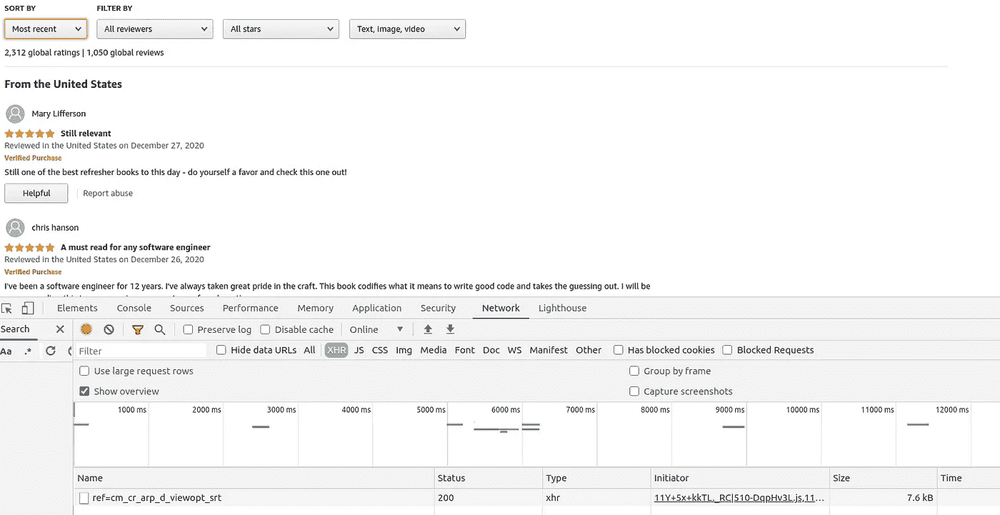
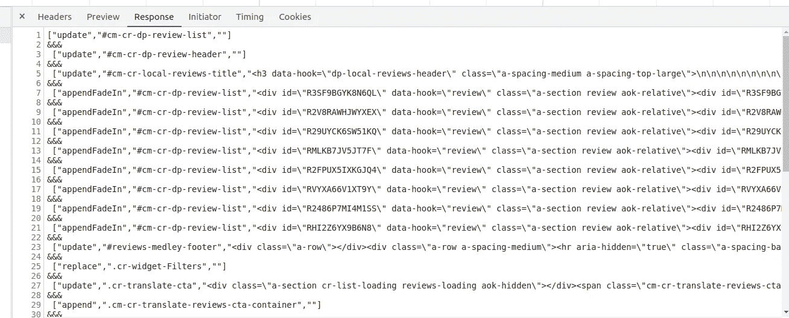
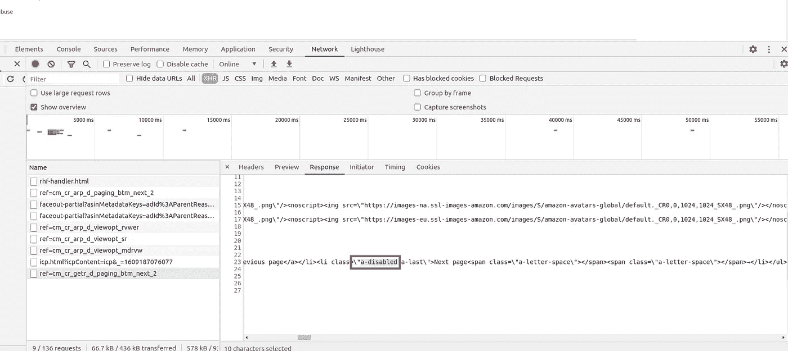

# 如何在没有无头浏览器的情况下抓取现代网站

> 原文：<https://betterprogramming.pub/how-to-scrape-modern-websites-without-headless-browsers-d871bbd1119e>

## 使用 Python 和常识


克里斯托夫·高尔在 [Unsplash](https://unsplash.com/s/photos/technology?utm_source=unsplash&utm_medium=referral&utm_content=creditCopyText) 上拍摄的照片

许多开发人员认为 web 抓取很难、太慢或者难以扩展——尤其是在使用无头浏览器的时候。根据我的经验，你甚至不用无头浏览器就可以浏览现代网站。它简单、快速且高度可扩展。

我们不使用 Selenium、Puppeteer 或任何其他无头浏览器解决方案，而是使用 Python 请求来展示它是如何工作的。我将解释如何从大多数现代网站在其前端使用的公共 API 中获取信息。

在传统的 web 页面中，您的目标是解析 HTML 并提取相关信息。在现代网站中，前端可能不会包含很多 HTML，因为数据是在第一次请求后异步获取的。出于这个原因，大多数人使用无头浏览器——无头浏览器可以执行 JavaScript，发出进一步的请求，然后您可以解析整个页面。

但是还有一种方法你可以经常使用。

# 抓取公共 API

让我们看看如何使用网站用来带来数据的 API。我会刮亚马逊产品评论，并显示你如何做同样的事情。如果你遵循我概述的过程，你可能会惊讶它是多么容易建立。

目标是提取特定产品的所有产品评论。要了解[，请点击此处](https://www.amazon.com/Clean-Code-Handbook-Software-Craftsmanship/dp/0132350882/)，或寻找其他产品。



[产品](https://www.amazon.com/Clean-Code-Handbook-Software-Craftsmanship/dp/0132350882/)截图。

我们的目标是尽可能多地提取评论信息。请记住，无论何时你在搜集数据，贪婪是有代价的。如果您不提取一些信息，那么您将不得不再次运行整个过程，只是为了添加更多的数据。因为抓取的主要部分是 HTTP 请求，所以处理不会花很长时间，但是您应该尽量减少请求的数量。

转到产品页面后，点击评分，然后转到“查看所有评论”，这是我们看到的内容:



产品的[评论页面](https://www.amazon.com/Clean-Code-Handbook-Software-Craftsmanship/product-reviews/0132350882/ref=cm_cr_dp_d_show_all_btm?ie=UTF8&reviewerType=all_reviews)

这些是个人评论。我们的目标是从页面中提取信息，而不使用无头浏览器来呈现页面。

这个过程很简单，需要我的浏览器开发工具。我需要触发评论中的更新，以找到带来评论的请求。当您打开开发工具时，大多数浏览器都会跟踪网络请求，所以在您触发更新之前，请确保它们是打开的。

在这种情况下，我将排序从“热门评论”改为“最近”查看我的网络选项卡，它只显示了一个新请求，这意味着评论来自该请求。

有时，由于页面上运行的跟踪和分析代码，每次点击可能会有多个事件，但是如果您对它们进行排序，您将能够找到带来实际信息的请求。



下一步是查看“回复”选项卡，了解评论是以什么格式出现的。

通常，您会有可读的 JSON 格式的数据，可以很容易地转换和存储。

其他时候，正如您将在本例中看到的那样，会稍微困难一点，但并非不可能处理。



这种格式看起来不像 HTML、JavaScript 或 JSON，但它有一种易于理解的模式。稍后，我将展示我们如何使用 Python 代码来解析它，即使格式很奇怪。

在我们最初的准备之后，是时候进入代码了。您可以很容易地用您选择的编程语言为请求编写代码。


为了节省时间，我喜欢使用一个方便的卷曲转换器。首先，我将请求复制为 cURL，方法是双击它并选择“复制为 cURL ”,正如您在前面的截图中看到的。然后我将[转换器](https://curl.trillworks.com/)粘贴进去，得到 Python 代码。

注 1:有很多方法可以完成这个过程，我只是觉得这个更容易。如果您只是用所使用的头和属性创建一个请求，那就没问题了。

注 2 **:** 每当我想试验请求时，我会在 Postman 中导入 cURL 命令，这样我就可以试验请求并理解端点是如何工作的。但是在本指南中，我将用代码做所有的事情。

让我们来分析一下我在做什么。我从浏览器的请求中提取了标题和文章正文。我删除了不需要的头部，保留了使请求看起来真实的头部。永远不要忘记的最重要的标题是`User-Agent`。没有了`User-Agent`，你可以期待被屏蔽很多次。

在我们传递给 post 请求的数据中，我们传递语言、产品 ID、首选排序和一些其他参数，我在这里就不解释了。通过在实际页面中摆弄过滤器并观察请求如何变化，很容易理解要传递什么样的排序。分页很简单，因为它定义了一个`pageSize`和`pageNumber`，这是不言自明的。每当分页不是自解释的时候，您可以试验一下页面，看看请求是如何变化的。

在 post 数据中，我们按原样传递大多数参数。其中一些比较重要的是:

*   `pageNumber`:当前页码
*   `pageSize`:每页结果数
*   `asin`:产品 ID
*   `sortBy`:主动排序

`pageNumber`和`pageSize`参数不言自明。至于排序，我们通过更改实际页面上的排序并查看请求在 Network 选项卡中的变化来了解它是如何工作的。最后是 ID ( `asin`)，如果我们查看页面链接，我们会注意到它在这里(以粗体显示):

```
[https://www.amazon.com/Clean-Code-Handbook-Software-Craftsmanship/dp/**0132350882**/#customerReviews](https://www.amazon.com/Clean-Code-Handbook-Software-Craftsmanship/dp/0132350882/#customerReviews)
```

为了理解每个参数在未记录的 API 中的作用，您需要更新页面以查看每个参数是如何变化的。

关于`pageSize`的一个重要注意事项是，它可以帮助我们减少获取我们想要的信息所需的请求数量。但是通常没有 API 会让您输入任何想要的页面大小。这就是为什么我从 10 岁开始，一直到 20 岁，结果停止增长。所以最大页面大小是 20，我们将使用它。

**注意:**当你使用非默认的页面尺寸时，你会让目标网站更容易阻止你，所以应该小心。

下一步是理解分页是如何工作的，并循环请求。处理分页有三种主要方式:

*   **页码:**即在每个请求中传递一个页码，`1`表示第一页，`2`表示第二页，依此类推。
*   **偏置**:偏置也很常见。如果每页有十个结果，那么第二页的偏移量为十，第三页的偏移量为二十，直到到达结果的末尾。
*   **游标**:处理分页的另一种常见方式是使用游标。第一页没有，但是第一个请求的响应将为您提供下一个请求的光标，直到您到达末尾。

在我们的例子中，API 使用一个页码来遍历端点中的页面。我们需要弄清楚是什么指示了请求的结束，这样我们就可以在循环中使用它。

为此，我们需要翻到最后一页，看看会发生什么。在我们的例子中，一个简单的指标是“下一页”按钮被禁用，正如您在下面的截图中看到的。我们会记住这一点——在编写代码时打破循环。



现在，让我们浏览所有页面并收集一些信息。我还将向您展示如何使用 Beautiful Soup 4 解析 HTML 片段。

让我们分解这段代码，看看它做了什么:

```
# We set the new page each time
post_data['pageNumber'] = page
# ...
# And at the end of the loop we increase the page counter
page += 1
```

所以，我们必须拆分这些行，这样我们才能解析它们。通过查看 API 的响应，每一行要么是一个数组，要么是一个包含`&&&`的字符串。我采取了一种“请求原谅，而不是允许”的方法，将每个`json.loads`包装在一个 try/except 块中。这将忽略`&&&`行，并关注那些实际上是 JSON 数组的行。

然后一个接一个，我们处理每一行。有些行是顶部和底部的，不包含实际的评论，所以我们可以安全地忽略这些。最后，我们必须从实际审查中提取相关数据:

```
# We load the line as JSON
payload = json.loads(line)
# And we parse the HTML using Beautiful Soup
html = Soup(payload[2], features="lxml")# Stop scraping once we reach the last page
if html.select_one('.a-disabled.a-last'):
  breakreview = html.select_one('.a-section.review')
# When the review section is not found we move to the next line
if not review:
  continue
```

现在是我解释如何从 HTML 中解析文本的时候了，这需要 CSS 选择器和一些基本处理的知识。

```
reviews.append({**# To get the stars we split the text that says 1.0 out of 5 for example, and just keep the first number**
'stars': float(review.select_one('.review-rating').text.split(' out of ')[0]),**# For the text we extract it easily but we need to remove the surrounding new lines and whitespace** 'text': review.select_one('.review-text.review-text-content').text.replace("\n\n", "").strip(),**# The date takes some simple splitting once more** 'date': review.select_one('.review-date').text.split(' on ')[1],**# And the profile name is just a simple selector** 'profile_name': review.select_one('.a-profile-name').text
})
```

我没有深入细节——我的目的是解释这个过程，而不是我使用的漂亮的 Soup 或 Python 工具。这是任何编程语言都可以遵循的过程。

当前版本的代码遍历页面，从每个评论中提取星星、概要名称、日期和评论。每个审核都存储在一个列表中，您可以保存或进一步处理该列表。因为抓取随时都可能失败，所以经常保存数据并确保您可以轻松地从失败的地方重新启动抓取器非常重要。

如果这是一个现实生活中的例子，你会想做更多的事情:

*   使用更强大的抓取解决方案(例如 scrapy ),支持并发请求、代理、处理和保存数据的管道等。
*   解析日期，这样就可以有一个标准的格式。
*   尽可能提取所有的数据。
*   创建一个系统来运行更新和刷新数据。

无头浏览器对于从网站提取信息来说很棒，但是它们真的很重。它们比访问未记录的 API 更可靠，更不容易出错，但有时访问这些公共 API 会更快，也更有意义，例如:

*   API 不会经常改变
*   你只需要得到一次数据
*   速度至关重要
*   API 提供了比页面本身更多的信息

使用 API 进行 web 抓取有很多合理的理由。你甚至可以说它更尊重服务器，因为它接受的请求更少，并且不需要加载静态资产。

请记住，通过增加请求之间的延迟，将对同一个域的并发请求保持在最低限度，来达到节省的目的。web 抓取的目标是访问和分析信息，并从中创造有用的东西，而不是给服务器带来问题或减慢速度。

感谢阅读！