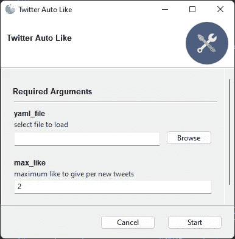

# 如何抓取推文并自动喜欢使用 Python

> 原文：<https://betterprogramming.pub/how-to-scrape-tweets-and-automatically-like-using-python-faed9d97470b>

## 使用 [tweepy](https://tweepy.readthedocs.io/) 和 [snscrape](https://github.com/JustAnotherArchivist/snscrape/tree/master/snscrape) 从 twitter 用户名列表中获取推文，并自动喜欢这些推文。



黏糊糊的 GUI

# 我学到了什么

1.  如何使用 [gooey](https://github.com/chriskiehl/Gooey) 将 Python 脚本变成 GUI。
2.  使用 [tinydb](https://tinydb.readthedocs.io/en/latest/getting-started.html) 用 JSON 存储数据。
3.  如何用 [pyYAML](https://pypi.org/project/PyYAML/) 读取 YAML 文件？
4.  如何使用 [snscrape](https://github.com/JustAnotherArchivist/snscrape) 搜索推文？
5.  如何使用 [tweepy](https://tweepy.readthedocs.io/) 喜欢推文

# 安装软件包

```
pip install goeey tweepy tinydb snscrape
```

# 1:胶粘和 tinydb

*   第 1 行:Gooey decorator 轻松地将脚本转换成 GUI
*   第 10 行:初始化`tinydb`并查询对象以备后用

# 3:加载 YAML

YAML 文件示例:

# 4: Tweepy 客户端

*   第 2 行:Tweepy 客户端
*   第 3–6 行:来自 YAML 文件的 Twitter API 密钥

# 5:循环动作

*   第 4 行:遍历每个用户名
*   第 9 行:为 Twitter 构建一个搜索查询
*   第 9 行:按用户名过滤，排除转发和回复

# 6:搜索推文

*   第 2 行:使用搜索查询搜索 tweets
*   第 4 行:当达到最大点赞数时，停止搜索推文
*   第 8 行:如果已经有人喜欢了，跳过推文

# 7:喜欢推特

*   第二行:喜欢推特
*   第 5 行:将 tweet ID 添加到`tweets = []`
*   第 8 行:将 tweet ID 保存到`tinydb`

# 资源

[](https://github.com/sagowtf/twitter-auto-liker) [## GitHub-sago wtf/twitter-auto-liker:使用 tweepy 和 snscrape 从 Twitter 列表中获取推文…

### 使用 tweepy 和 snscrape 从 twitter 用户名列表中获取推文，并自动喜欢这些推文。- GitHub …

github.com](https://github.com/sagowtf/twitter-auto-liker)