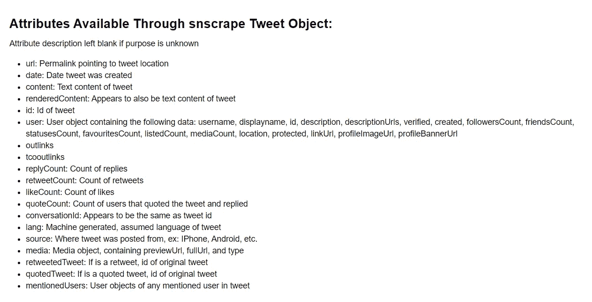

# 如何用 snscrape 抓取推文

> 原文：<https://betterprogramming.pub/how-to-scrape-tweets-with-snscrape-90124ed006af>

## Twitter API 最近更新后抓取推文的快速指南

由[约书亚·赫内](https://unsplash.com/@mrthetrain?utm_source=unsplash&utm_medium=referral&utm_content=creditCopyText)在 [Unsplash](https://unsplash.com/?utm_source=unsplash&utm_medium=referral&utm_content=creditCopyText) 拍摄的照片

# 概观

Twitter 对其 API 进行了修改，使得各种 tweet 抓取库变得过时。一个是 [GetOldTweets3](https://github.com/Mottl/GetOldTweets3/issues/98) ，我之前写过。幸运的是 [snscrape](https://github.com/JustAnotherArchivist/snscrape) 已经脱颖而出，作为一个库，它允许人们在没有 [Tweepy](https://www.tweepy.org/) 限制的情况下抓取推文。

由于未记录的 Python 包装器和对其开发版本的误解，围绕这个库仍然有许多混乱，正如在各种 GitHub 问题线程中看到的那样。在本教程中，我展示了一些例子，希望它们能简化本库的使用，减少混乱。

# 设置 snscrape

## 下载 snscrape 前

Snscrape 至少需要 [Python 3.8 或更高](https://www.python.org/downloads/)。我不会介绍如何升级你的 Python，因为网上有很多教程。

## 下载 snscrape

当你有了正确的 Python 版本，你现在可以安装 snscrape 了。

**一个简单的 pip 安装就足够了**，所以在您的终端中运行命令

`pip install snscrape`

## 使用 snscrape

下载 snscrape 后，您将能够以几种不同的方式使用它。最直接的方法是在命令提示符/终端中通过命令行界面(CLI)命令。如果您不习惯使用终端，可以使用 Python 来执行 CLI 命令。

否则，snscrape 确实有一个官方的 Python 包装器。但是，它目前还没有文档，并且缺乏 CLI 命令的简单性。使用 Python 包装器的好处是，在抓取之后，您可以轻松地与数据和 tweet 对象进行交互。

不管你用什么方法，我都在下面介绍。在本教程中，您将通过文本搜索抓取用户的推文和历史推文。

最后一点:我见过有人使用 Tweepy 和 snscrape 来访问推文中的数据。这是低效的，因为你要刮两次。除非您只能访问 Tweepy id 或 URL，或者您需要粒度，否则您不应该使用 Tweepy。snscrape 的 tweet 对象已经有了很多可用的信息。下图显示了您可以使用 snscrape 访问的数据。图像中的属性应该准确地映射到它们在实际对象中的存储方式。

snscrape tweet 对象中可用的属性(图片来源:作者)

太好了，现在我们已经弄清楚了一切，让我们开始实际使用 snscrape 吧！

如果你想提前检查我的代码或者有什么要跟着做的话，[我的资料可以在 GitHub](https://github.com/MartinKBeck/TwitterScraper/tree/master/snscrape) 上找到。将有 Python 脚本和 Jupyter 笔记本可用于带 CLI 命令的 Python 和 Python wrapper。终端中没有可用于 CLI 命令的文件，因为您直接在终端中键入它们。

# 使用命令行界面

无论您是直接在终端中运行命令，还是通过 Python 运行命令，都是一个两步过程，您将数据抓取到一个 JSON 文件中，然后将数据转换成 Python 中可用的数据。本节将介绍使用 CLI 命令进行抓取，然后使用 Pandas 读取 JSON 文件。

## 使用命令提示符、终端等。

**抓取特定 Twitter 用户的推文:**

在下面的例子中，我们从 Twitter 用户@jack 那里收集了 100 条推文。代码在命令提示符/终端中输入。该代码使用了几个可选参数，如下所述。

*   `--jsonl`以 JSON 格式输出数据，允许您访问 tweet 信息。否则，你只会收到推文的直接链接。
*   `--progress`允许我们从 CLI 获取更新，让我们了解抓取的进度。它每 100 条推文更新一次。在使用 Python 和 CLI 时似乎不起作用。
*   `--max-results #`对抓取的推文数量设置上限。

**从文本搜索查询中抓取历史推文:**

在下面的例子中，我们收集了 2020 年 6 月 1 日至 2020 年 7 月 31 日之间的 500 条推文，文本查询为“它是大象”下面的代码有两个新参数。

*   `--since`设置查询的日期下限
*   `“until:”`设置查询的日期上限

这里需要注意的是，`--since`是可以使用的可选参数，但是`until:`是在`twitter-search`查询中使用的操作符。是的，这可能看起来很奇怪，但它给我的结果比将两个参数都放在查询中更一致，如下所示。

你可以尝试这两种方法，看看哪一种能给你更好的结果。然而，我使用`--since`的第一个方法对我来说更一致，也是我现在使用的。查看下面的转换 JSON 部分，了解如何在抓取后与 JSON 文件进行交互。

## 在 Python 中使用 CLI

如果你不喜欢直接在终端中工作，Python 的 OS 库允许我们用 Python 执行 CLI 命令。它本质上只是运行与上面完全相同的命令，但用的是 Python。

我的带有 Python [Jupyter 笔记本](https://jupyter.org/)和 Python 脚本的 CLI 命令可在 [GitHub](https://github.com/MartinKBeck/TwitterScraper/tree/master/snscrape/cli-with-python) 上获得。

**抓取特定 twitter 用户的推文:**

**从文本搜索查询中抓取历史推文:**

如果您发现上面的代码由于“and”错误而无法运行，这可能是由于您的操作系统处理双/单引号的方式。上面的代码可以在我的 Windows 操作系统上运行。如果你发现上面的代码提供了错误，希望下面一个用户提出的解决方案能帮助你。

## 将 JSON 文件转换为可用于 Python

太好了，我们的数据可以在 JSON 文件中获得，但是我们如何与它交互呢？下面的代码展示了我们如何使用 [Pandas](https://pandas.pydata.org/) 库将 JSON 文件转换成数据帧，这样我们就可以用 Python 与它进行交互。

真的就这么简单。既然 JSON 数据被存储为 Pandas 数据框，那么您可以以任何方式与它进行交互。您可以将其导出为 CSV 文件或 Excel 文件，或者修改熊猫数据框中的数据。看你的了！

# 使用 Python 包装器

Python 包装器使得在抓取后直接与数据交互变得容易，而不是像上面 CLI 命令一节中看到的那样经历两步过程。正如他们的 GitHub 自述文件中提到的，Python 包装器目前还没有文档记录。下面的例子来自合作努力和反复试验。

以下方法遵循由 [HuifangYeo](https://github.com/HuifangYeo) 在 GetOldTweets3 问题线程中提出的解决方案。

我的 Python 包装器 Jupyter 笔记本和 Python 脚本可以在 [GitHub](https://github.com/MartinKBeck/TwitterScraper/tree/master/snscrape/python-wrapper) 上获得。

**抓取特定 twitter 用户的推文:**

在下面的例子中，我们从 Twitter 用户@jack 那里收集了 100 条推文。然后，我从 tweet 对象中拉出`DateTime`、`tweet id`、`text`和`username`。

**从文本搜索查询中抓取推文:**

在下面的例子中，我们收集了 2020 年 6 月 1 日至 2020 年 7 月 31 日之间的 500 条推文，文本查询为“它是大象”然后我从 tweet 对象中拉出`DateTime`、`tweet id`、`text`和`username`。

# 参考

包含本教程抓取文件的 GitHub:[https://GitHub . com/martink beck/TwitterScraper/tree/master/sn scrape/](https://github.com/MartinKBeck/TwitterScraper/tree/master/snscrape/)

关于如何使用 snscrape 的参考文章:[https://medium . com/@ jcldinco/downloading-historical-tweets-using-tweet-ids-via-snscrape-and-tweepy-5 F4 ecbf 19032](https://medium.com/@jcldinco/downloading-historical-tweets-using-tweet-ids-via-snscrape-and-tweepy-5f4ecbf19032)

snscreag GitHub:[https://github.com/JustAnotherArchivist/snscrape](https://github.com/JustAnotherArchivist/snscrape)