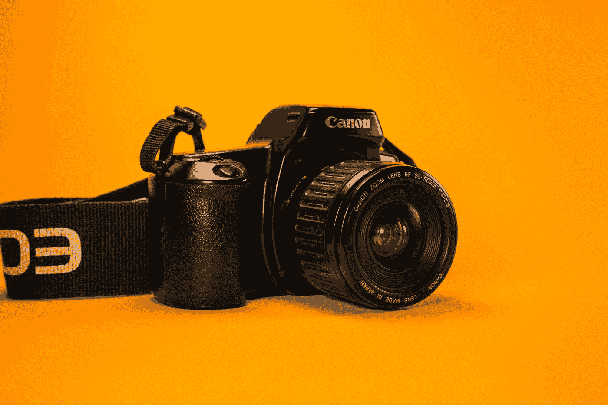
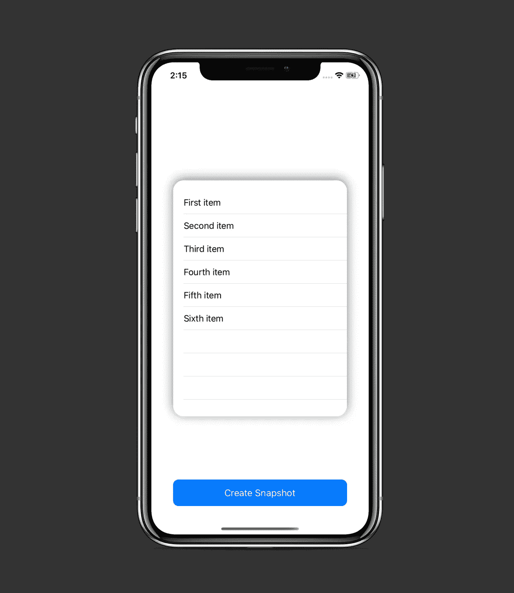
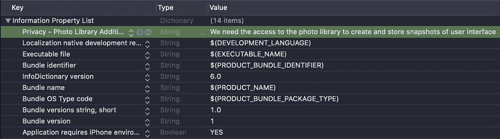
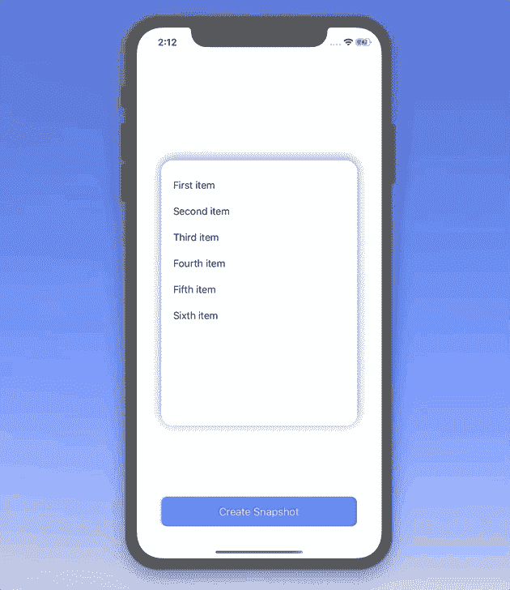

# 如何在 Swift 中截屏您的 iOS 应用程序的用户界面

> 原文：<https://betterprogramming.pub/how-to-screenshot-your-ios-apps-ui-in-swift-5c054a9226a5>

## 并将生成的图像保存到照片库中

保罗·高迪奥在 [Unsplash](https://unsplash.com?utm_source=medium&utm_medium=referral) 上拍摄的照片

今天，我们将学习如何在您的 Swift 应用程序中创建任意视图*的屏幕截图，并将生成的图像保存到照片库中。*

该项目的源代码可以在文章的底部找到。

# 我们开始吧

假设我们有以下屏幕:

我们想要的是拍摄项目列表的快照，将其转换成一个`UIImage`，然后将图像保存在照片库中。

所以在我们的`ViewController`中有如下的初始结构:

为了开始响应按钮点击，让我们用新的动作更新`actionButton`属性:

现在让我们在`Actions`标记下添加实际的截屏逻辑:

正如我们所看到的，在`takeScreenshot(of:)`方法中，我们执行了以下操作:

*   根据`view`参数的大小开始创建图像上下文。
*   将层`view`渲染到上下文中。
*   从上下文中获取实际图像。
*   结束图像上下文。
*   将生成的图像写入保存的相册。

`UIImageWriteToSavedPhotosAlbum`操作需要访问照片库的权限，因此我们必须向`Info.plist`添加以下内容:

在该操作中，我们传入一个名为`imageWasSaved`选择器，我们用它来执行照片写入的特定操作:

如果我们在过程中有任何错误，我们只需打印出来。否则，我们打开*照片*应用程序来查看我们全新的截图。

因此，我们有以下工作流程:

# 资源

这个项目的源代码可以在 GitHub 上找到:

 [## zafarivaev/SnapshotUI

### 展示如何在应用程序中创建用户界面截图的应用程序- zafarivaev/SnapshotUI

github.com](https://github.com/zafarivaev/SnapshotUI) 

# 包扎

有关上述`UIGraphics`操作的更多信息，请参见 Apple 官方文档:

 [## UIGraphicsBeginImageContextWithOptions(_:_:_:)

### 新位图上下文的大小(以磅为单位)。这表示由…返回的图像的大小

developer.apple.com](https://developer.apple.com/documentation/uikit/1623912-uigraphicsbeginimagecontextwitho)  [## UIGraphicsGetImageFromCurrentImageContext()

### 包含当前位图图形上下文内容的 image 对象。您应该仅在以下情况下调用此函数…

developer.apple.com](https://developer.apple.com/documentation/uikit/1623924-uigraphicsgetimagefromcurrentima)  [## UIGraphicsEndImageContext()

### 您使用此函数来清理由 UIGraphicsBeginImageContext(_:)函数放置的绘图环境…

developer.apple.com](https://developer.apple.com/documentation/uikit/1623933-uigraphicsendimagecontext) 

感谢阅读！