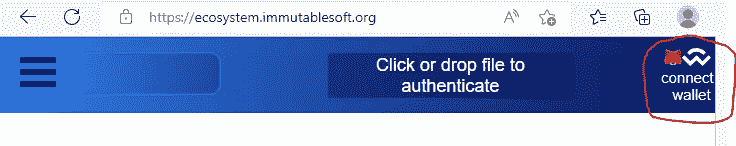
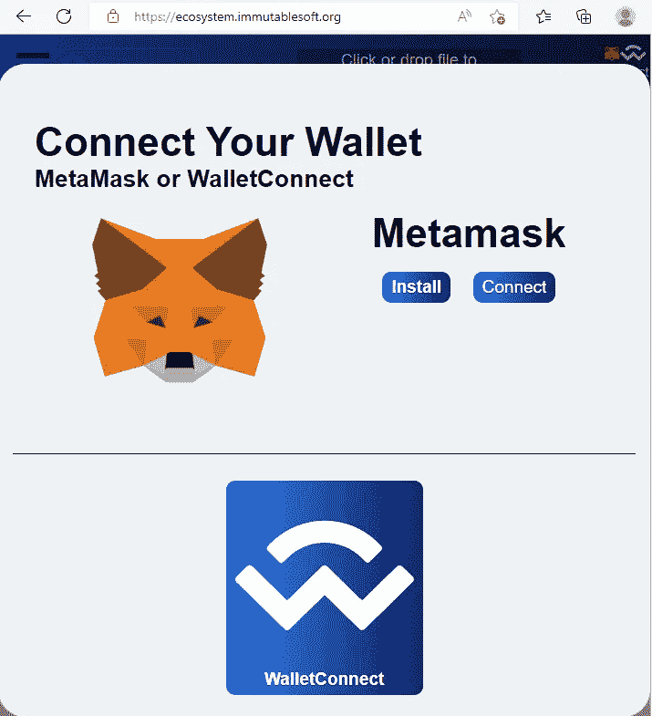
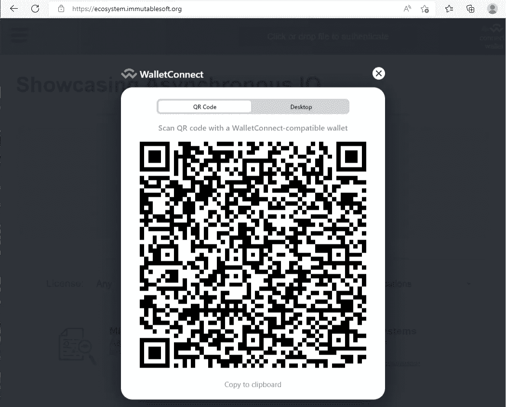

# 如何无缝支持 React.js 中的 Web3 连接选项

> 原文：<https://betterprogramming.pub/how-to-seamlessly-support-web3-connectivity-options-in-react-js-fd461cc44550>

## dApps 的钱包互操作性

提供无缝选择来吸引用户并连接任何 web3 钱包。图片由 Freepik 上的 [WangXiNa](https://www.freepik.com/free-vector/padlock-polygonal-wireframe-mesh-looks-dark-blue-background-cyber-security-safe-privacy-other-concept-vector-illustration_24058557.htm) 提供。

对于分散式应用程序(即 dApps)的用户界面(UI)创建者来说，一个持续的挑战是连接用户的钱包以读取所有权状态并与其底层的智能合约进行交易。在分散安全的世界中，用户的钱包是用户选择的关键，它一直是一个持续的 UI 和安全挑战。钱包连接要求是采用 web3 技术的一个明显障碍。

支撑核心问题的是 dApp 需要用户连接钱包。此外，如果 UI 在不需要钱包连接的只读模式下可以提供信息和直观，那么强烈建议默认支持这种模式。这个小故事描述了 [ImmutableSoft](https://immutablesoft.org/) 将更多钱包选择整合到他们的 dApp 中的过程。

[MetaMask](https://metamask.io/) 通过服务器 API 检测并请求钱包连接，启动了与 web3 连接的钱包体验。现在 [WalletConnect](https://walletconnect.com/) 技术在新钱包中开始流行，越来越多的用户提出要求。WalletConnect 与 MetaMask 的核心区别在于 wallet 如何连接到底层区块链以及如何建立这种连接。

MetaMask 是一款集区块链网络提供商和钱包于一体的浏览器插件。该插件持有你的钱包的密钥，并通过配置的区块链网络提供商(默认 Infura 节点)使用它们。

私有钱包密钥保存在浏览器插件和服务器 UI (ReactJS 等)中。)可以直接请求连接到这个钱包。WalletConnect 根本不是一个插件，而是一个网络管道。如果 web3 dApp 需要钱包连接，则必须生成一次性管道(即伪装成 QR 码的 URI 链接)并显示在 UI 上。

该 QR 码(即，一次性 URI)是对安装在用户移动电话上的钱包应用程序的连接请求，并由该钱包应用程序扫描。

WalletConnect 还可以连接到 Ledger 设备等桌面钱包。用户请求与您的钱包应用程序(LedgerLive 等)建立本地网络连接。)而不是二维码。WalletConnect 将钱包密钥从可能更易受攻击的网络浏览器(插件)中取出，并直接交给钱包应用程序，从而允许任何数量的安全创新和用户选择。

随着 MetaMask 和 WalletConnect 成为 web3 钱包集成的领导者，本文将探讨在需要连接到用户的 web3 钱包时，如何轻松直观地支持这两种技术。我们还探讨了如何确保您的 dApp 在只读模式下正常工作，同时鼓励用户在进行某些操作之前连接他们的钱包，例如在交易之前。

通常一个 dApp 在第一次打开时会显示连接选项，比如两个按钮，“用 MetaMask 打开”和“用 WalletConnect 打开”。然而，这让那些不熟悉 web3 或不愿意分享钱包的人感到困惑或疏远。这篇文章提出了建立连接优先级的解决方案，并默认了什么是可用的以及何时提供连接选项。每个 dApp 都有不同的需求，第一步是确定这些需求——也许两个按钮是最好的选择，但通常不是这样。

不变的生态系统用户界面被设计成一个应用商店——一个由创造者授权的数字产品的市场。我们相信向每个访问者展示市场产品，包括搜索引擎爬虫，是很重要的。为了支持这个无钱包的用例，我们引入了 Infura 作为第三方提供商。还支持公共端点和其他提供者，如 Alchemy。

服务器配置的无钱包提供者在没有任何连接的钱包的情况下加载 dApp 市场产品。总之，我们需要支持三(3)种不同的连接选项，即只读提供者(Infura)、元掩码和 WalletConnect 技术。

现在重要的是优先考虑 dApp 选择的连接技术。因为我们的目标是无缝的钱包连接集成，并且 MetaMask 支持它，所以我们选择首先尝试检测插件。通过优先使用元掩码，我们当前的用户群没有中断。如果没有安装/检测到(或者用户不允许连接)，JavaScript 将使用 Infura 加载 dApp marketplace，同时显示一个突出的按钮来连接用户的钱包(在通常显示钱包余额的地方)。

请注意，具有元掩码插件的明智用户可以通过拒绝元掩码连接请求来进入这种状态。这可以允许在具有保持未连接的元掩码插件的浏览器中使用 WalletConnect 而不是元掩码进行 dApp 会话。

当按下右上角的“连接钱包”时，会出现一个弹出窗口，提供安装 MetaMask 插件或使用 WalletConnect 的选项。如果选择 WalletConnect，dApp 将显示一个 QR 码(或直接应用程序连接到 LedgerLive 等。).二维码旨在由包含用户钱包的移动设备扫描。这个二维码是一个 URI，它在你的钱包和 dApp 之间建立了一个临时的网络管道。

出于安全考虑，要知道 dApp 的所有区块链通信(从加载市场到交易)都是通过这个管道进行的，而不是通过 web 浏览器。成功连接后，marketplace 智能合约和数据将通过 WalletConnect 重新加载，看起来应该与使用 Infura 加载的初始版本相同，但用户现在可以使用连接的 wallet 签署交易。

为了安全起见，WalletConnect 连接是暂时的(它不会持续)，因此不需要由 dApp 保存额外的状态来允许用户选择用户体验的连续性。每个浏览器会话都必须建立一个新的 WalletConnect 连接，这是所期望的。但是，由于 MetaMask 具有 WalletConnect 所不具备的面向服务器的连接功能，因此在为 dApp 页面提供服务时，通过检查这一点来无缝区分用户选择可能是一个重要的设计选择。

让我们回顾一下配置 web3 连接所需的 JavaScript 代码，以便更好地理解如何直观地尝试这些选项，而无需用户进行不必要的交互。在第一次 dApp 页面加载时，MetaMask 或 Infura(谢谢，Consensys！)是第一和第二优先。首先，开始我们的`getWeb3()`实现。

现在我们完成了`getWalletConnect()`的实现。

对于加载了 Infura 的 dApp，提供了与 WalletConnect 连接的突出选项，但不会自动选择，即，在没有用户请求/点击的情况下，不会显示 WalletConnect 的 QR 码。这种行为符合 WalletConnect 风格的意图，即配置一种一次性的、非持久的方式将 dApp 连接到用户的钱包。

这种带有 WalletConnect 回退的元掩码自动检测允许用户轻松完成连接过程，或者完全避免临时应用商店下载程序检查其安装的有效性。那些没有 web3 钱包的人不再被锁在 dApp 之外，而是出现在其中，并体验何时连接钱包的清晰界限。

为 MetaMask ( `getWeb3()`)和 WalletConnect ( `getWalletConnect()`)创建的 web3 实例之间的互操作逻辑如下，参数`type` 用于区分要实例化的实例。实例化后，`web3`变量对于 MetaMask 或 WalletConnect 是不同的，但是两者都有相同的公共接口，dApp 使用相同的服务器端 API 加载和处理智能合约和数据。

使用上面概述的基于二叉树的优先级方案来选择用户的钱包，避免了 UI 仅在连接钱包之后才显示 dApp 的需要。安装了 Metamask 的用户可能会希望使用它，而没有安装的用户可能会希望使用 WalletConnect 或者完全不熟悉钱包。

请帮助我们让新用户更容易理解 web3。如果你喜欢这篇文章，请关注我，在未来会有更多精彩的阅读。并且不要忘记 posito pressionibus(利用假设)！