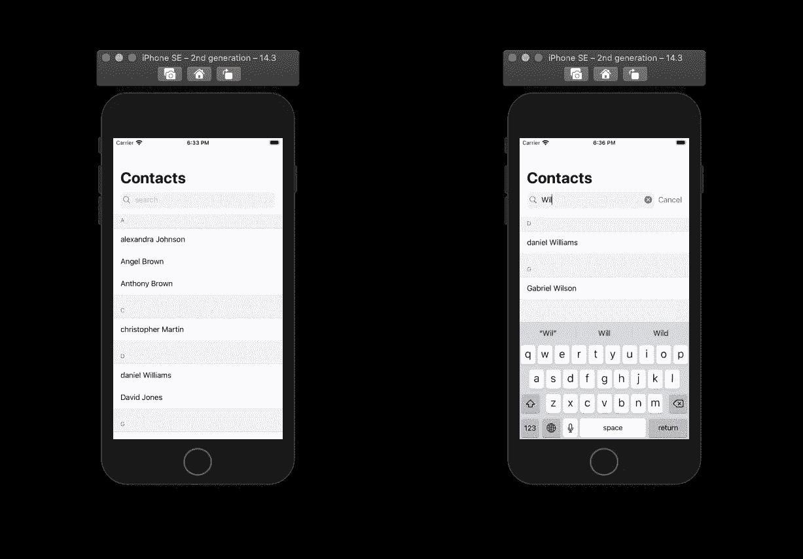
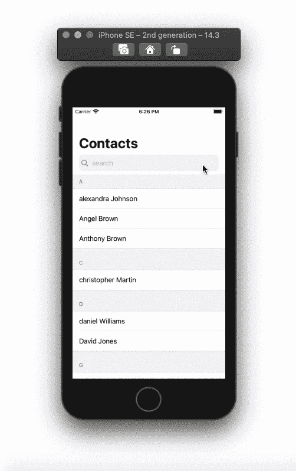

# 如何在 SwiftUI 中按字母顺序划分列表

> 原文：<https://betterprogramming.pub/how-to-section-lists-alphabetically-in-swiftui-e841f35993f>

## 如何对联系人列表进行分组、搜索和筛选

# 接触

为我们的联系人创建一个可识别的结构，存储名字、姓氏和电话号码。添加 UUID 类型的 ID 以符合可识别协议。

要获取您手机的联系人列表，您需要遵循以下文章中的步骤:

 [## 如何在 SwiftUI 中获取联系人列表并创建搜索栏

### 如何让你的用户获取和搜索他们自己的联系人列表

medium.com](https://medium.com/better-programming/how-to-fetch-contact-lists-and-create-a-searchbar-in-swiftui-35713daaf25a) 

# 搜索栏

要创建一个搜索栏，我们需要水平堆叠一个放大镜、`TextField`、X 按钮和一个取消按钮的图像。当用户开始编辑`TextField`时，取消按钮将可见。

查看此[关于堆栈溢出的回答](https://stackoverflow.com/a/58473985)以供参考。

# 联系人模型

创建一个`ObservableObject`类，并向其中添加两个变量(`contactData`和`sectionDictionary`)。`contactData`将存储我们获取的联系人列表。在本教程中，我将在`init()`函数中手动添加随机联系人。`sectionDictionary`正在使用一个`getSectionedDictionary`函数，我们接下来将解释这个函数。

下面的函数将返回一个类型为`<String, [Contact]>`的字典。这本词典是按每个名字的第一个字母分类的。键将是在我们的`contactData`中找到的每个名字的第一个字母，值是以第一个字母开始的联系人。

# 内容视图

在我们的`ContentView`中，为搜索词插入一个`ContactsModel`类型的`StateObject`和一个`String State`变量。

在主体里面，添加我们的搜索栏在一个`VStack`里面。要给视图加标题，将`VStack`嵌入到`NavigationView`中，然后将`navigationTitle`修改器添加到`VStack`中。

# 分段列表

在搜索栏下面，添加一个列表，并通过`sectionDictionary`键遍历部分标题文本。在循环中，使用我们的搜索词过滤该部分。如果没有使用搜索词检索的联系人，则不要显示部分标题及其联系人。

在每个创建的部分中，遍历联系人并使用文本视图显示名字和姓氏。

全部完成！感谢您的阅读。