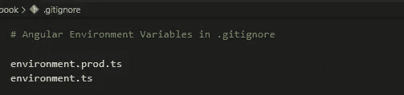
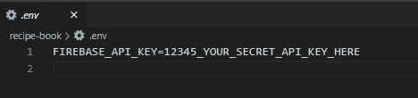
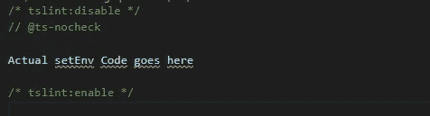
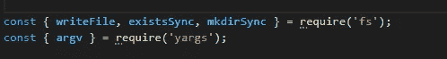
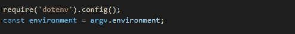
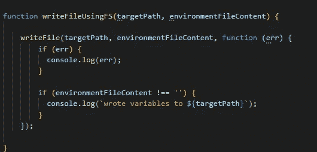
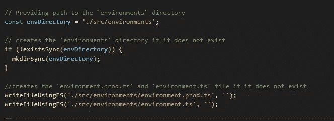
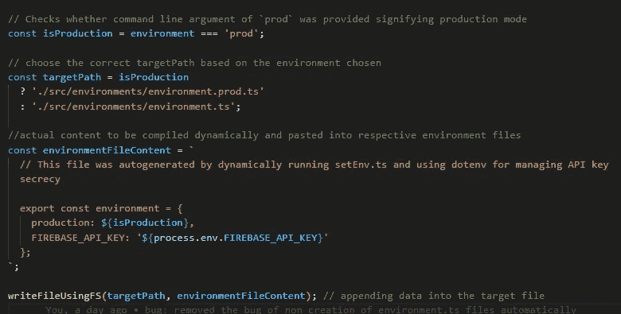
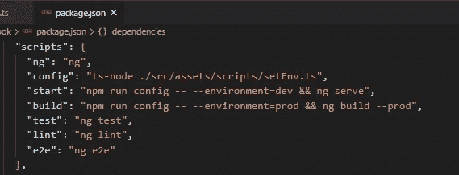

# 如何保护 GitHub 动作中使用的角度环境变量

> 原文：<https://betterprogramming.pub/how-to-secure-angular-environment-variables-for-use-in-github-actions-39c07587d590>

## 通过公共存储库保护 Angular 项目中的机密 API 密钥，并为自动化工作流设置它们


在 GitHub 操作中使用 dotenv 保护角度环境变量。作者照片。

在花了一个月的时间浏览了 GitHub 的各种新特性之后——尤其是 GitHub 动作——是时候在我的一个开源 Angular 项目中使用它了。然而，一个关键的问题是隐藏我用来将它部署到 Firebase 中的 API 密钥。我要求应用程序在我的本地环境中正常工作，同时设置它在代码签入 GitHub 后持续部署。所有这些都不会损害 API 密钥。通常，在将您的代码放入任何公共存储库之前，保护这些机密信息被认为是一种安全的做法。

在谷歌上搜索这一设置导致了一篇关于这一主题的极好的文章。这个信息丰富的指南帮助我设置了在本地工作的基本配置，但不幸的是，我无法使用 GitHub Actions 让它为自动化工作流工作。当然，我最终还是成功了！因此，让我们详细检查一下解决方案。

# 目标

保护 Angular 项目的`environments`目录中的机密 API 密钥，以便在 GitHub 操作中使用。

# 步伐

## 1.设置. gitignore 文件

确保`environments`目录的内容是`.gitignore`文件的一部分(在项目根目录下),这样它们就不会是被推到公共存储库中的代码的一部分。



## 2.安装 Node.js 包

我们需要安装`yargs`来解析命令行参数，安装`dotenv`来将环境变量从`.env`文件加载到`process.env`。此外，我们将使用本机`fs`包(无需安装)来处理文件系统。

```
npm i -D yargs dotenv
```

## 3.设置一个`.env`文件

应该在项目根文件夹中创建`.env`文件。它允许我们安全地定义秘密 API 密钥(例如`FIREBASE_API_KEY`)。您可以根据需要向该文件添加任意数量的密钥或访问令牌。



## 4.设置 setEnv.ts 文件

有人可能想知道为什么我们不在 Angular 项目中使用默认提供的`environment.ts`和`environment.prod.ts`文件。这是因为 Angular 默认情况下认为这些文件是静态的，因此它们不会被编译。

因此，我们有必要找到一种在编译过程中动态生成这些文件的方法。这就是`setEnv.ts`文件出现的地方。我们在哪里添加这个文件？让我们在`src\assets`中创建一个`scripts`目录来保存这个文件(`src\assets\setEnv.ts`)。

*   为了取消 TypeScript lint 建议，我们将代码放在:



*   我们使用以下方式导入要使用的方法:



*   我们将配置`dotenv`将所有环境变量从`.env`文件传递到`process.env`。此外，我们将使用`yargs`来读取调用该文件时传递的命令行参数(`— environment=prod`或`— environment=dev`)。



*   我们将创建一个助手函数，允许我们将动态生成的环境变量复制到它们各自的文件中。如果文件不存在，它将在给定的路径下创建一个新文件。



*   由于我们将`environment.ts`和`environment.prod.ts`添加到了`.gitignore`文件中，这些文件和`environments`目录将不会出现在 GitHub 的公共存储库中。因此，每次触发新的自动化工作流时，都会动态地创建这些工作流。



*   最后，我们动态生成特定于所选环境的环境变量，其中包含秘密的 API 密钥。对于本地开发(`npm run serve`)，环境变量将被添加到`environment.ts`，而对于生产环境( `npm run build`)，它们将被添加到`environment.prod.ts`文件。



完整的`.setEnv`文件如下所示:

## 5.更新`package.json`

为了用特定的命令行参数调用`setEnv.ts`，我们需要更新`package.json`:

*   我们将创建一个执行`setEnv.ts`的`config`脚本。
*   对于本地开发，`npm run start`将运行`config` 脚本和`dev`参数。
*   对于生产，`npm run build`将运行`config` 脚本和`prod`的参数。



# GitHub 操作中的自动化工作流

现在可以使用 GitHub Actions 自动测试、构建项目，并将其部署到任何主机提供商(Firebase、Netlify、Heroku 等)中。).尽管环境变量不存在于公共存储库中，但是每次触发工作流时，都会动态生成这些变量。

# 结论

我们能够在`.env`文件中指定机密的 API 密钥，根据所选的环境，将环境变量动态生成到 Angular 项目中的`environment.ts`和`environment.prod.ts`中。

此外，由于这些文件都没有签入 GitHub，我们不仅设法保护了它，还允许 GitHub Actions 中的任何 CI 或 CD 工作流独立执行。