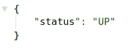
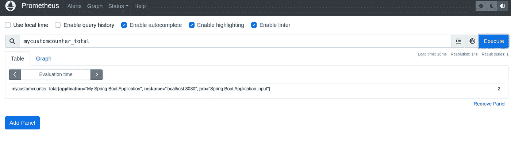
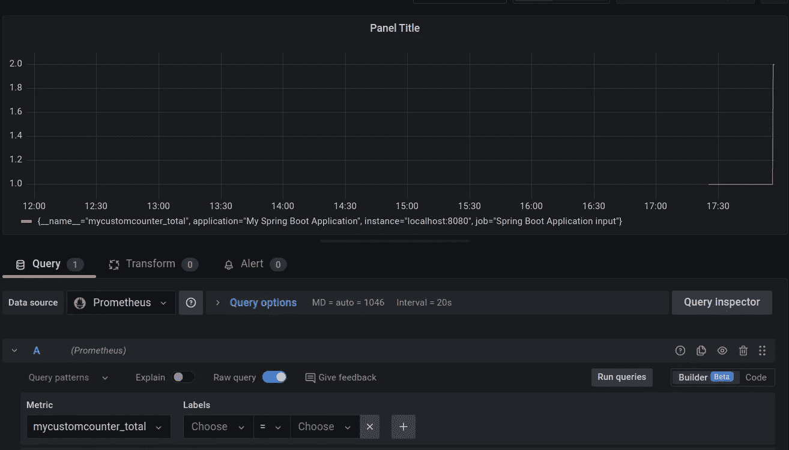

# 如何保护定制 Spring Boot 执行器端点并添加普罗米修斯指标

> 原文：<https://betterprogramming.pub/how-to-secure-custom-spring-boot-actuator-endpoints-and-add-prometheus-metrics-18bf010f56fb>

## 提高安全性的指南


照片由[飞:D](https://unsplash.com/@flyd2069?utm_source=medium&utm_medium=referral) 上[的 Unsplash](https://unsplash.com?utm_source=medium&utm_medium=referral)

Spring Boot 执行器端点暴露了我们的应用程序的敏感信息，如 Beans、测量值等。因此，增加安全性以限制访问至关重要。

尽管 Actuator 提供了许多现成的端点，但有时配置我们自己的端点会很有用。例如，如果我们想要检索特定于我们的应用程序的信息。

类似地，我们可能希望添加 Prometheus 指标来监控默认解决方案中不包含的功能。例如，统计对 URL 的访问次数、并发请求等。

本教程结束时，您将知道如何:

*   使用 Spring Security 保护 Spring Boot 端点。
*   创建自定义 Spring Boot 执行器端点。
*   注册指标并在 Prometheus 和 Grafana 中查看。

本教程与我的前一篇关于监控 Spring Boot 应用程序的文章有关。如果你想了解如何设置 Prometheus 和 Grafana 来监控你的应用程序，请查看。但是不要担心，您仍然可以关注这篇文章，因为我们现在将关注不同的主题。

我们开始吧！

# 将 Spring 安全性添加到项目中

我将重用之前演示的[源代码](https://github.com/kirshiyin89/springboot-monitoring-demo)并对其进行增强。

为了实现安全性，我们需要将`spring-boot-starter-security`模块添加到我们的依赖项中:

```
<dependency>
   <groupId>org.springframework.boot</groupId>
   <artifactId>spring-boot-starter-security</artifactId>
</dependency>
```

在第一个项目中，我们启用了在`[http://localhost:8080/actuator/health](http://localhost:8080/actuator/health)`可用的健康指标，并向每个人显示了详细信息:

带有详细信息的健康端点

我们可以通过更改我们的`application.yml`文件中的这一行来限制对详细信息的访问:

```
management.endpoint.health.show-details=WHEN_AUTHORIZED
```

如果用户未经授权，他们将只能看到以下数据:



未授权用户的健康信息

## 添加安全凭据

假设我们希望只允许管理员访问。将这些行添加到`application.yml`来定义一个用户:

```
security:
  user:
    name: user
    password: password
    roles: admin
```

*注意，如果没有这几行，Spring Boot 会自动生成一个密码，并在启动时打印在应用程序的控制台上。该角色是可选的。*

## 测试安全配置

1.  点击`[http://localhost:8080/actuator/health](http://localhost:8080/actuator/health)`终点。
2.  您应该会看到一个弹出窗口，要求提供凭据。输入 YAML 文件的细节。您应该可以再次看到健康详细信息。
3.  将`application.yml`中的角色改为 admin 以外的角色。
4.  重启 app，再次点击上面的网址。
5.  你应该只看到基本信息，没有细节。

## 添加基本身份验证

我们可以使用 Spring Boot 配置基本身份验证。为此，请创建如下配置类:

Spring 安全配置

我们只允许管理员用户使用指标端点。

如果我们调用 URL 并尝试以不同的角色登录，我们会看到一条错误消息:

```
There was an unexpected error (type=Forbidden, status=403).
```

# 添加自定义执行器端点

要添加自定义端点，只需在类中添加`@Endpoint`注释。这里有一个简单的例子:

Spring Boot 支持与`HTTP GET`、`POST`和`DELETE` 请求相对应的读、写和删除操作。

在这个例子中，我们使用了`@ReadOperation`注释。

让我们在`application.yml`中启用端点:

```
include: [ "health","prometheus", "metrics", "customEndpoint" ]
```

重启应用程序，点击`[http://localhost:8080/actuator/customEndpoint](http://localhost:8080/actuator/customEndpoint)`尝试访问新的端点。

如果您看到以下错误，请不要感到惊讶:

```
There was an unexpected error (type=Bad Request, status=400).
```

原因是我们没有给 URL 添加查询参数。正确的要求应该是`[http://localhost:8080/actuator/customEndpoint?id=1](http://localhost:8080/actuator/customEndpoint?id=1)`。

结果将返回水果`kiwi`，因为它对应于我们的`fruitsMap`中的数字`1`。

## 保护终端

现在，让我们保护自定义端点。为此，我们只需要将它添加到我们的`SecurityConfiguration.java`类中:

就是这样！在 Spring Boot 添加和保护自定义端点非常简单！

# 添加普罗米修斯指标

## 度量类型概述

首先，让我们看看支持的指标:

*   `Counter` —用于测量增加的事件。例如，访问某个 URL 的次数。
*   `Gauges` —用于测量可以上下波动的数值。比如内存使用、温度等。
*   `Histogram` —用于测量请求持续时间和响应大小。数据被分类到可配置的桶中。直方图使用`[histogram_quantile()](https://prometheus.io/docs/prometheus/latest/querying/functions/#histogram_quantile)` [函数](https://prometheus.io/docs/prometheus/latest/querying/functions/#histogram_quantile)显示分桶观察计数和服务器端分位数的计算。
*   `Summary` —用于跟踪以百分位数表示的值分布。它类似于直方图度量。它在客户端使用[φ-分位数](https://en.wikipedia.org/wiki/Quantile_function)函数，并直接公开计算。

## 创建计数器指标

让我们创建一个自定义的`Counter`指标，看看有人从我们的应用程序访问一个 URL 的次数。

为了简单起见，我将重用`customEndpoint`。代码如下:

以下是代码概述:

*   我们添加了一个`Counter`变量。
*   当有人访问`customEndpoint`时，我们递增计数器。
*   我们将度量注册到`MeterRegistry`。

# 测试并清除计数器度量

1.  拜访`[http://localhost:8080/actuator/customEndpoint?id=1](http://localhost:8080/actuator/customEndpoint?id=1)`两次。
2.  打开普罗米修斯并搜索新的度量。
3.  您应该会看到类似的结果:



计数器结果

当然，您也可以在 Grafana 中可视化新的度量。它应该是这样的:



在 Grafana 中查看自定义指标。

*如果你想知道如何连接 Grafana 和 Prometheus，可以查看我的* [*之前教程*](/how-to-monitor-a-spring-boot-app-with-prometheus-and-grafana-22e2338f97fc) *中的说明。*

您可以使用类似的逻辑来注册其他指标。类型取决于您的用例。查看官方的[文档](https://prometheus.io/docs/concepts/metric_types/)以获得更多的例子和用法。

# 结论

在本教程中，您学习了如何创建自定义 Spring Boot 执行器端点，并使用 Spring Security 保护它们。现在，您还知道了如何为 Prometheus 添加定制指标，并使用 PromQL 或 Grafana 查看它们。

您可以在下面的参考资料部分找到这个演示的完整源代码。

如果您想探索本教程的第一部分，您可以在这里找到它:

[](/how-to-monitor-a-spring-boot-app-with-prometheus-and-grafana-22e2338f97fc) [## 如何使用 Prometheus 和 Grafana 监控 Spring Boot 应用程序

### 如何为 Spring Boot 应用程序设置监控的分步指南

better 编程. pub](/how-to-monitor-a-spring-boot-app-with-prometheus-and-grafana-22e2338f97fc) 

感谢您的阅读，祝您编码愉快！

# 参考

*   本教程的源代码 [GitHub repo](https://github.com/kirshiyin89/springboot-monitoring-demo/tree/feature/monitoring-with-custom-endpoints-and-security)
*   之前教程的 [GitHub 回购](https://github.com/kirshiyin89/springboot-monitoring-demo)
*   【https://prometheus.io/docs/practices/histograms/ 