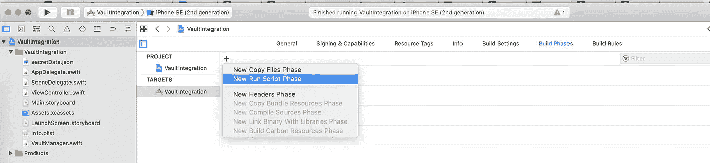

# 如何使用 Hashicorp Vault 保护 iOS 应用程序机密数据

> 原文：<https://betterprogramming.pub/how-to-secure-ios-app-secret-data-with-hashicorp-vault-c27ec17ef5fd>

## 与 iOS 应用程序集成保管库的指南


在 [Stockfresh](https://stockfresh.com/) 上 [kjpargeter](https://stockfresh.com/image/241034/bank-vault) 拍摄的照片。

在开发移动应用程序时，我们无时无刻不在与 API 进行交互。为了连接到这些 API，我们使用 API 键。这些 API 键非常重要，因为它们将我们映射/标识为我们试图集成的系统的唯一用户。我们总是需要确保这些 API 键不会被非预期的用户访问。速率限制、配额控制和安全性是 API 提供者拥有 API 密钥的部分原因。

良好的安全实践之一是不要将秘密和 API 密匙保存为源代码的一部分。但是如果我们不把它们放在源代码中，我们的代码将如何知道它们并消费它们呢？这个问题的答案是使用一种叫做“保险库”的安全工具有各种存储库选项来存储机密。我们将谈论[哈希公司的金库系统](https://learn.hashicorp.com/collections/vault/getting-started)。在本文中，我将带您了解如何将 vault 与 iOS 应用程序集成。

# 先决条件

1.  按照这些说明设置您的保险库。
2.  确保[您已经编写了](https://learn.hashicorp.com/tutorials/vault/getting-started-first-secret?in=vault/getting-started)您的 iOS 应用程序将使用的秘密。

# **与 iOS 应用集成**

保管库可用于读取和写入 API 密钥等应用程序机密。让我们深入了解我们将如何将保险库与我们的 iOS 应用程序实际集成的细节。

## 验证到保管库

为了与我们的保险库对话，我们需要首先验证我们自己。我们将使用我们在 vault 实现中支持的认证方法之一。这将取决于您在先决条件中的选择。一旦你通过认证，你会得到一个令牌，用来读取你的秘密。

## 预构建脚本



在 Xcode 中添加预构建的脚本。这将在构建您的应用程序代码之前从保险库中提取秘密。我们将使用上一步中检索到的令牌进行身份验证。假设你在你的 vault 服务器的`/v1/secret/foo` 路径上写了一个秘密。您可以通过 API 调用来读取它，如下所示:

```
curl -H "X-Vault-Token: {token}" -X GET http://{yourserver}/v1/secret/foo
```

您将得到一个 JSON 响应，其中包含存储在该路径中的秘密。例如:

```
{   
"tool1Apikey": "tool1ApiKey",
"tool2Apikey": "tool2ApiKey"
"tool3Apikey": "tool3ApiKey"
}
```

将 JSON 输出保存为一个文件，并随意命名。比如我准备给它取名`secretData.json`。这个文件将是项目目录的一部分，这样就可以从我们的应用程序代码中本地引用它。

## **读取秘密数据 JSON**

当我们的应用程序加载时，第三方库通常需要立即初始化。为了正确地初始化它们，我们需要 API 键。所以我们必须在 AppDelegate 中首先读取这个秘密文件。我们可以通过创建一个单例类(例如`VaultManager`)来轻松地限制整个责任，该类将读取`secretData` JSON，并使用我们可以在应用程序中使用的方便的 getters 来公开这些值。`VaultManager.swift`的代码应该是这样的:

在上面的代码片段中，singleton `VaultManager`将负责读取这个秘密，并使它可以在应用程序中任何需要的地方使用。

## **访问读取的秘密**

上面代码片段中的 vault manager 公开了一个方法调用:

```
func getSecretKey(withKeyName:SecretKey) ->String?
```

因此，如果我们需要在应用程序中的任何地方获取密钥，我们所要做的就是调用此方法并传递密钥名称。例如:

```
let keyValue = VaultManager.sharedInstance.getSecretKey(withKeyName: .tool1Apikey)
```

通过这种方式，我们完全消除了 API 密匙成为源代码一部分的需求。

# 结论

作为一个良好的安全实践，我们不应该在代码库中存储像 API 密匙这样的应用秘密。它们应该与应用程序动态打包。保管库是保护您的应用程序机密的绝佳工具。

您正在使用哪种保险存储解决方案？请在下面的评论中告诉我你的经历。