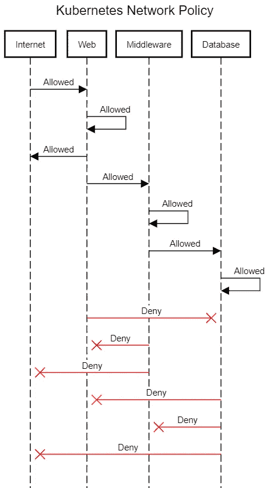

# 如何使用网络策略保护 Kubernetes

> 原文：<https://betterprogramming.pub/how-to-secure-kubernetes-using-network-policies-bbb940909364>

## Kubernetes 网络政策图解指南


Kushagra Kevat 在 [Unsplash](https://unsplash.com?utm_source=medium&utm_medium=referral) 上拍摄的照片

随着越来越多的组织采用 [Kubernetes](https://kubernetes.io/) 并在生产中运行它，有必要了解它的核心并适当地保护它。Kubernetes 改变了为每个应用程序运行单独虚拟机的传统概念，而是允许您忘记底层基础架构，只需在通用节点集群中部署 pod。这不仅简化了架构，还简化了基础架构的管理。

Kubernetes 是一个开源的容器编排平台，代码库可以在 GitHub 上在线获得。虽然这有助于社区的贡献，但也为黑客提供了寻找漏洞和准备攻击的机会。大多数设置 Kubernetes 的自动化工具都是为了迎合各种用户，因此它们在默认情况下并不实施所有的安全性。您必须有意识地尝试在您的 Kubernetes 集群中应用适当的安全策略，创建网络策略就是其中之一。

大多数组织运行分层体系结构，根据应用程序执行的功能对其进行分组。最常见的是三层架构。有一个 web 层负责托管用户界面和体验应用程序。业务层托管业务 API 以执行功能(也称为中间件)，数据层运行后端应用程序，如数据库。

为简单起见，默认情况下，Kubernetes 允许所有的 pod 相互通信。但是，您可以使用网络安全策略和入口在 Kubernetes 中实施分层架构。简单地说，Kubernetes 中的网络安全策略类似于防火墙。运行传统架构的组织通常拥有防火墙，只允许所需层或服务器之间的通信。

但是，与防火墙不同，网络策略在第 3 层分段模型上工作，而不是在第 7 层模型上工作，第 7 层模型更高级，被大多数现代防火墙和威胁检测软件使用。但是拥有一些控制权总比没有任何权限好，因此成为了安全的良好起点。

# 将架构层分成多个名称空间

让我们假设您的组织正在运行一个三层架构，并且您的堆栈中运行着基于 web 的应用程序、中间件应用程序和数据库应用程序。您已经将这些应用程序装箱，并决定转移到 Kubernetes。安全团队对默认设置不满意，他们希望您应用分层方法来复制他们在 Kubernetes 中的现有架构。

现有的体系结构将服务器分成三个逻辑区域，防火墙定义了它们之间的通信。下面是它的工作原理:

*   您不希望 web 应用程序直接与数据库交互，尽管它可以具有到 internet 的出站连接。那是暴露于外部世界的层。
*   除了数据库层，中间件不应该有任何出站连接，它应该只监听来自 web 层的请求。
*   数据库不应该连接到互联网或其层之外的任何其他应用程序，应该只允许来自中间件层的连接。

在 Kubernetes 世界中，您可以通过名称空间对应用程序进行分区。以下是解决问题的方法:

*   为 web 应用程序创建 web 命名空间。这一层没有任何限制，因为它将暴露于外部世界，并应与互联网交互。
*   为中间件应用程序创建一个中间件名称空间。创建仅允许来自 web 和中间件命名空间的连接的入口网络策略，以及仅允许到中间件和数据库命名空间的链接的出口网络策略。
*   为数据库应用程序创建数据库命名空间。创建仅允许来自中间件和数据库命名空间的连接的入口网络策略，以及仅允许到数据库命名空间的链接的出口网络策略。



您可以在命名空间层和 pod 层实施网络策略。尽管开发人员并不完美，但你并不想审查软件的每一个细节，因为这只会扼杀团队的生产力。平衡这一点的聪明方法是在名称空间上应用默认的网络策略，而不是依赖开发人员在 pod 级别上为您创建它。当然，这可能会随着您公司的安全原则而改变，您可能希望进行一些更细粒度的访问控制。Kubernetes 网络政策也有可能做到这一点。

您需要确认您通过 RBAC 认证和授权用户，并且开发人员只能访问他们团队的名称空间。在向团队成员授予任何集群级别的角色之前，请三思。您应该只为集群管理员以及网络和安全团队保留集群级别的角色。

# 应用网络策略

在 Kubernetes 中应用网络策略非常简单。您只需要创建网络策略清单，并使用`kubectl`命令在集群上应用它们。确保您拥有适当的群集级别权限。此外，检查您是否有允许在 Kubernetes 集群上安装网络策略的必要的网络插件，以及是否启用了网络策略。查看官方 [Kubernetes 文档](https://kubernetes.io/docs/concepts/extend-kubernetes/compute-storage-net/network-plugins/)了解更多详情。

我们将在名称空间级别应用默认的网络策略，并实施所需的规则来满足需求。让我们开始吧。

## 创建名称空间

创建 web、中间件和数据库名称空间，并分别用层“web”、“中间件”和“数据库”标记它们。

## 创建默认网络策略

web 名称空间可以允许所有连接，并且也不需要有出口规则，因为 web 应用程序的一些组件需要与 internet 应用程序通信。因此，我们不需要在 web 名称空间上应用任何网络策略。

我们将首先为中间件名称空间创建一个策略。为了测试，我配置了端口 80。您需要将其更改为您的中间件端口。

这成为我们的默认策略，因此适用于中间件名称空间中的所有 pod。让我们试着去理解 YAML:

*   像所有 Kubernetes 清单一样，YAML 文件以`apiVersion`开头。在这种情况下，`apiVersion`就是`networking.k8s.io/v1`。
*   我们正在创建的`Object`的`Kind`是一个`NetworkPolicy`。
*   在`middleware`名称空间中，网络策略的名称是`middleware-network-policy`。
*   `podSelector`是{}，表示名称空间中的所有 pod。
*   `policyType` 表示是`Ingress`还是`Egress`策略。对我们来说，两者都是。
*   `ingress` 部分有一个`from` 声明列表，定义了允许流量的位置。在这种情况下，它来自端口 80 上标记为`tier=web`或`tier=middleware`的所有名称空间。
*   `egress` 部分有一个定义允许的流量目的地的`to` 声明列表。在这种情况下，对于端口 80，它指向所有标记为`tier=database`或`tier=middleware`的名称空间。此外，它还有一个`to`声明，允许出站流量通过 UDP 端口 53 进行 DNS 解析。

现在让我们创建一个数据库网络策略。为了测试，我配置了端口 80。您需要将其更改为您的数据库端口。

就这样了！您已经成功创建了默认网络策略，用于在 Kubernetes 上实施您的组织策略。

# 是时候做些测试了

让我们创建三个 NGINX 部署，每个名称空间一个，看看它们是如何相互交互的。

```
$ kubectl create deployment nginx --image=ewoutp/docker-nginx-curl -n web
deployment.apps/nginx created$ kubectl create deployment nginx --image=ewoutp/docker-nginx-curl -n middleware
deployment.apps/nginx created$ kubectl create deployment nginx --image=ewoutp/docker-nginx-curl -n database
deployment.apps/nginx created$ kubectl get deployment --all-namespaces|grep nginx
database      nginx      1/1     1            1           20s
middleware    nginx      1/1     1            1           33s
web           nginx      1/1     1            1           65s
```

正如我们看到的，我们在所有三个名称空间上创建了部署。

我们先列出豆荚来获取它们的 IP。

```
$ kubectl get pod --all-namespaces -o wide|grep nginx
database      nginx-f67f7854c-k44gg  1/1     Running   0          65s     10.52.0.3     gke-cluster-3-default-pool-48567dd4-fmlf   <none>           <none>
middleware    nginx-f67f7854c-5l2zx  1/1     Running   0          60s     10.52.0.4     gke-cluster-3-default-pool-48567dd4-fmlf   <none>           <none>
web           nginx-f67f7854c-ldsbb  1/1     Running   0          69s     10.52.2.5     gke-cluster-3-default-pool-48567dd4-qgng   <none>           <none>
```

现在让我们在 web pod 上使用`kubectl exec`来检查它是否可以与中间件 pod 连接。

是的。我们可以。让我们尝试从中间件 pod 连接到数据库 pod。

```
$ kubectl exec -it nginx-f67f7854c-ldsbb -n web -- curl 10.52.0.3
^Ccommand terminated with exit code 130
```

当我们试图从 web pod 连接到数据库 pod 时，它会无限期等待并超时。我们预料到了这一点，因为来自 web 名称空间的任何 pod 都不应该直接与数据库名称空间 pod 通信。

如果我们尝试从中间件 pod 连接到数据库 pod，会发生什么情况？

我们得到了预期的回复！

web pod 的中间件怎么样？

```
$ kubectl exec -it nginx-f67f7854c-5l2zx -n middleware -- curl 10.52.0.5
^Ccommand terminated with exit code 130
```

正如我们所料，它也超时了。

现在让我们尝试一下数据库到中间件。

```
$ kubectl exec -it nginx-f67f7854c-5l2zx -n middleware -- curl 10.52.0.4
^Ccommand terminated with exit code 130
```

正如我们所料，它失败了。web pod 的数据库呢？

```
$ kubectl exec -it nginx-f67f7854c-5l2zx -n middleware -- curl 10.52.0.5
^Ccommand terminated with exit code 130
```

又暂停了。我们预料到了这一点，因为数据库只能与其名称空间内的 pod 通信。

让我们检查一下名称空间内的通信是否存在。为此，我们将启动另一组名为 NGINX-1 的 NGINX 部署。

```
$ kubectl create deployment nginx-1 --image=ewoutp/docker-nginx-curl -n web
deployment.apps/nginx-1 created$ kubectl create deployment nginx-1 --image=ewoutp/docker-nginx-curl -n middleware
deployment.apps/nginx-1 created$ kubectl create deployment nginx-1 --image=ewoutp/docker-nginx-curl -n database
deployment.apps/nginx-1 created$ kubectl get deployment --all-namespaces|grep nginx-1
database      nginx-1   1/1     1            1           21s
middleware    nginx-1   1/1     1            1           25s
web           nginx-1   1/1     1            1           32s$ kubectl get pod --all-namespaces -o wide|grep nginx-1
database      nginx-1-cd6cf6cc7-xz8lf   1/1     Running   0          64s   10.52.0.6     gke-cluster-3-default-pool-48567dd4-fmlf   <none>           <none>
middleware    nginx-1-cd6cf6cc7-27ztk   1/1     Running   0          68s   10.52.2.6     gke-cluster-3-default-pool-48567dd4-qgng   <none>           <none>
web           nginx-1-cd6cf6cc7-r6nj4   1/1     Running   0          75s   10.52.0.5     gke-cluster-3-default-pool-48567dd4-fmlf   <none>           <none>
```

酷，现在让我们在 web 名称空间上尝试 NGINX 到 NGINX-1。

而且很管用！中间件对中间件呢？

那也可以。和数据库添加到数据库窗格？

正如我们所料，这也很有效。

现在让我们通过服务来公开应用程序，看看它们是如何工作的。

```
$ kubectl expose deployment nginx --port 80 -n web
service/nginx exposed
$ kubectl expose deployment nginx --port 80 -n middleware
service/nginx exposed
$ kubectl expose deployment nginx --port 80 -n database
service/nginx exposed
$ kubectl get svc --all-namespaces|grep nginx
database      nginx ClusterIP  10.0.10.126     80/TCP          2m15s
middleware    nginx ClusterIP  10.0.2.63       80/TCP          2m20s
web           nginx ClusterIP  10.0.12.220     80/TCP          2m29s
```

现在让我们从 web 转向中间件，看看会发生什么。

从中间件到数据库？

它如预期的那样工作。从 web 到带有服务的数据库 pod 的 curl 怎么样？

```
$ kubectl exec -it nginx-f67f7854c-ldsbb -n web -- curl nginx.database
^Ccommand terminated with exit code 130
```

正如我们所料，这没有联系。至此，我们已经成功配置了网络策略，以在应用程序层内实施网络隔离。除非明确声明，否则默认情况下，任何开发人员都不能违反应用程序架构，并且您可以确保开发人员没有通过 RBAC 创建网络策略的权限。

# 多走一步

到目前为止，我们已经创建了默认的网络策略，以确保流量在正确的方向上流动，并且网络隔离到位。但是，我们刚刚根据名称空间隔离了网络。我们可以更进一步，在 pod 级别应用网络策略，以确保通信更加精细。只有正确的应用程序单元可以在正确的端口上访问正确的中间件组件，并且正确的中间件组件可以在正确的端口上连接到正确的数据库单元。

Kubernetes 的网络政策足够灵活，可以提供这种功能，我将简要介绍一下这种可能性。让我们看看它的网络策略清单结构。

```
apiVersion: networking.k8s.io/v1
kind: NetworkPolicy
metadata:
  name: test-network-policy
  namespace: default
spec:
  podSelector:
    matchLabels:
      role: db
  policyTypes:
  - Ingress
  - Egress
  ingress:
  - from:
    - ipBlock:
        cidr: 172.17.0.0/16
        except:
        - 172.17.1.0/24
    - namespaceSelector:
        matchLabels:
          project: myproject
    - podSelector:
        matchLabels:
          role: frontend
    ports:
    - protocol: TCP
      port: 6379
  egress:
  - to:
    - ipBlock:
        cidr: 10.0.0.0/24
    ports:
    - protocol: TCP
      port: 5978
```

*   在你的`ingress`中可以有多个`from`区块，在你的`egress`中可以有多个`to`区块。
*   你可以搭配一把`ipBlock`、`namespaceSelector`或者`podSelector`。
*   您只能允许流量通过特定的`protocol` 和`ports`。在上面的示例中，只允许从端口 6379 到端口 5978 的流量。
*   您还可以使用`except`声明排除 IP 范围的特定部分。在上面的示例中，来自 172.17.0.0/16 的流量是允许的，但来自子网 172.17.1.0/24 的流量除外，它是 172.17.0.0/16 范围的一部分。

您可以自由使用任何排列和组合来尽可能限制流量。

# 结论

感谢您通读！我希望你喜欢这篇文章。这些只是关于如何在您的 Kubernetes 集群中实施网络策略的一些指南。虽然您应该实现它，但是您可以根据团队的需求和安全策略进行更改。