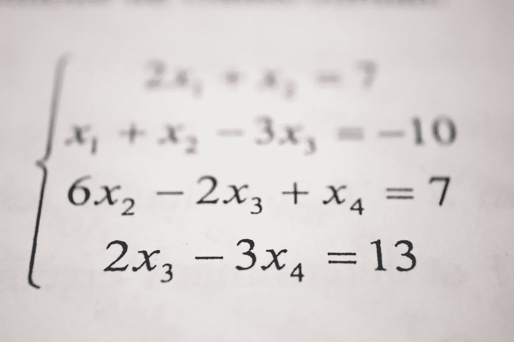

# 如何保护您的智能合同(第 2 部分)

> 原文：<https://betterprogramming.pub/how-to-secure-your-smart-contracts-part-2-d3ec21f8685a>

## 算术溢出和下溢



照片由 [Antoine Dautry](https://unsplash.com/@antoine1003?utm_source=unsplash&utm_medium=referral&utm_content=creditCopyText) 在 [Unsplash](https://unsplash.com/s/photos/maths?utm_source=unsplash&utm_medium=referral&utm_content=creditCopyText) 拍摄

*先决条件:对以太坊区块链和智能合约有基本的了解。*

# 介绍

这是保护您的智能合同系列的第 2 部分。[第 1 部分讨论了可重入性和所有者逻辑盗窃攻击](https://medium.com/coinmonks/how-to-secure-your-smart-contracts-dc500f2c8fca)。

在这里，我们将经历*算术溢出*和*下溢，*这是一种有时会潜入我们代码的逻辑弱点。我们将描述它们的含义，它们可能出现的例子，以及如何防止它们出现在我们的智能合约中。

# 它们是什么？

为了理解算术上溢和下溢，我们必须首先理解它们出现的数据类型。

以太坊虚拟机(EVM)整数的大小总是固定的。例如，`unit8`只能存储 0 到 255 之间(包括 0 和 255)的值。试图在`uint8`变量中存储值 256 将导致值 0。如果在执行前不进行检查，这是利用漏洞的最佳时机。

## 下溢

当从一个整数中减去一个值时，如果该整数的当前值小于被减的值，就会出现下溢。例如:

```
uint8 myValue = 2;
uint8 subValue = 3;uint8 result = myValue - subValue;
```

在这里，我们的`result`变量不会像我们认为的那样等于-1；`result`等于 255。

从 2 开始倒数，EVM 变成了 *…* 1 … 0 … 255。这被称为*下溢。*

## 充满

溢出是下溢的反义词。当一个值被添加到一个整数变量时，如果结果大于该变量的数据类型的最大限制，就会出现这种情况。例如:

```
uint8 myValue = 254;
uint8 addValue = 3;uint8 result = myValue + addValue;
```

在这里，我们的`result`变量并不像我们认为的那样等于 257。它被计算为 1，因为 255 是`uint8`的最大值。

从 254 开始向上数，EVM 是… 255 … 0 … 1。这就是所谓的*溢出。*

# 例子

考虑这段可靠性代码，在滚动到解释之前，您能发现问题吗？

```
mapping(address => uint) balances;function withdraw(uint _value) external {
    require(balances[msg.sender] - _value >= 0);
    balances[msg.sender] -= _value;
    msg.sender.transfer(_value);    
}
```

`require`语句要求发送方的余额减去取款金额大于或等于 0。这在逻辑上对我们是有意义的，因为我们不想让任何人提取超过他们余额的金额。但是，这容易受到下溢攻击。

如果攻击者在契约中存储了两个乙醚，并试图提取十个，那么`require`语句将允许这样做。这是因为减法会通过下溢到最大值而导致`balances[msg.sender] — _value`的结果大于或等于 0。因为整数是无符号的，只要`msg.sender`有余额，`require`语句就会*总是*通过。

按照这种逻辑，*任何人*在任何时点存入余额，都可以完全冲掉资金契约。

# 预防措施

始终使用提供更安全函数的库来执行基本运算。 [OpenZeppelin](https://openzeppelin.com/) 的 [SafeMath](https://github.com/OpenZeppelin/openzeppelin-contracts/blob/master/contracts/math/SafeMath.sol) 库是 Solidity 社区中最常用的。它提供了加、减、乘、除和取模的功能。

该库在发布之前经过了社区的彻底审查，因此我们可以对其防止算术逻辑错误的能力充满信心。下面是一个如何使用 SafeMath 的`sub()`函数而不是在我们的智能契约中使用减算术运算符的示例:

```
using SafeMath for uint;function withdraw(uint _value) external {
    require(balances[msg.sender].sub(_value) >= 0);
    balances[msg.sender] -= _value;
    msg.sender.transfer(_value);    
}
```

在这种情况下，如果我们试图提取超过余额的金额，那么`require`语句就会失败。这是因为`sub()`功能要求余额大于或等于`_value`。

# 进一步阅读

*   阅读本系列关于可重入性和所有者逻辑盗窃的第 1 部分。
*   浏览教程、演练、解释和备忘单的集合，积累您的区块链开发经验。

[](https://medium.com/blockcentric/blockchain-development-resources-b44b752f3248) [## 区块链开发资源马上跟进

### 学习区块链、以太坊和 DApp 开发的资源列表

medium.com](https://medium.com/blockcentric/blockchain-development-resources-b44b752f3248)