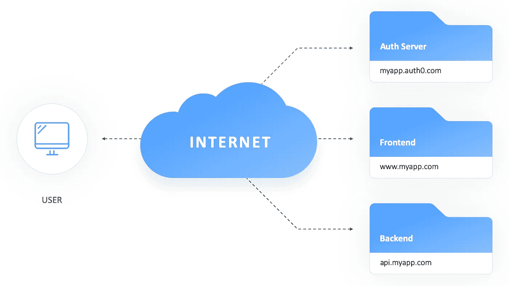
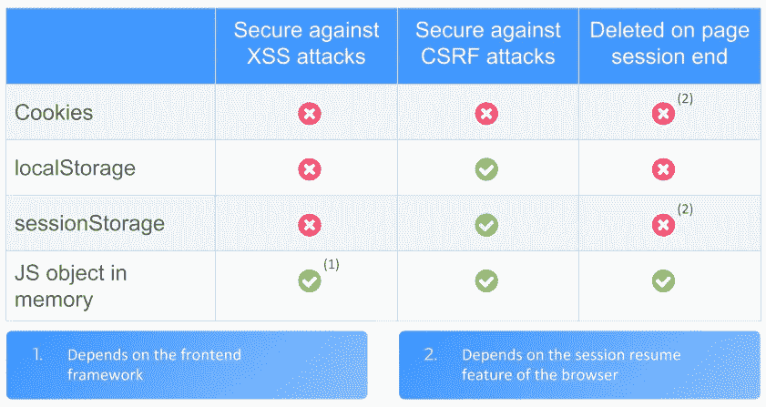
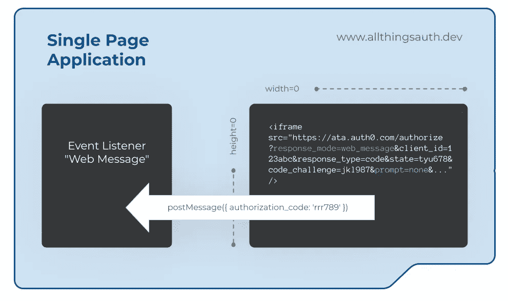

# 如何在单页面应用程序中安全地实现身份验证

> 原文：<https://betterprogramming.pub/how-to-securely-implement-authentication-in-single-page-applications-670534da746f>

## 探索 OAuth、OpenID Connect 及其常见的安全隐患


在 [Unsplash](https://unsplash.com?utm_source=medium&utm_medium=referral) 上由 [Jantine Doornbos](https://unsplash.com/@jantined?utm_source=medium&utm_medium=referral) 拍摄的照片

在本文中，我将重点讨论单页面应用程序中的身份验证。使用 [OAuth](https://oauth.net/2/) 和 [OpenID Connect (OIDC)](https://openid.net/connect/) 的正确流程是什么，在实现它时安全隐患在哪里？阅读完本文后，您应该能够为您的新应用程序正确地设计登录，并知道您当前的应用程序是否正在安全地使用 OAuth/OIDC。

请注意:对于单页面应用程序来说是正确的，对于其他形式的应用程序来说不一定是正确的，比如移动应用程序或经典的 web 应用程序(老派，嘘！).这里描述的一些概念仍然适用于这些类型的应用程序，其他的可能是错误的，甚至是不安全的。因此，请务必小心，始终确保将正确的概念应用到正确的应用中。

这将是关于这个主题的一系列文章中的第一篇。在这里，我想为理解 OAuth 和 OIDC 的必要部分打下基础，并概述导致某些架构决策的安全考虑。在后续文章中，我将使用不同的授权服务器提供者实现示例，并讨论它们之间的差异。

# 单页应用程序

单页面应用程序通常将所有的业务逻辑打包在用 [React](https://reactjs.org) 、 [Vue.js](https://vuejs.org) 、 [Angular](https://angular.io) 或类似语言编写的 JavaScript 前端部分中，并从后端 API 加载必要的数据。为了保护后端数据免受未经授权的访问，这些应用程序要求用户通过单独的授权服务器进行身份验证，并在成功登录后获得一个令牌。然后在调用后端时可以使用这个令牌，API 可以在后端验证令牌的有效性，从而验证调用用户的真实性。



单页应用程序的基本设置

授权服务器可以完全自行开发，也可以使用现有的第三方解决方案(如 [Keycloak](https://www.keycloak.org) )自行托管。第三种选择是使用认证即服务提供商，最受欢迎的选择是 [Auth0](https://auth0.com) 和 [Okta](https://www.okta.com) 。

# OAuth 和 OpenID 连接

所有这些认证和授权选项将或多或少地实现一套完整的 [OAuth v2](https://tools.ietf.org/html/rfc6749) 和 [OpenID Connect 1.0](https://openid.net/specs/openid-connect-core-1_0.html) 规范。OAuth 首先出现，并定义了本文中描述的大部分授权过程。这包括授权流、授权访问令牌的使用，以及实现和使用这些机制时的安全性考虑。OAuth 的问题在于，它被设计成*授权*(证明用户被允许执行某个动作)持有适当访问令牌的任何人访问 API 等资源。然而，这并不允许 API 基于该信息对用户进行认证(以证明请求用户确实是他们所声称的那个人)。输入 OpenID Connect。

OpenID Connect (OIDC)在 OAuth 之上添加了一个身份验证层，并定义了一个可以传递给应用程序的 ID 令牌。该 ID 令牌具有允许应用程序唯一标识用户的信息，并且由授权服务器额外签名。OIDC 还对 OAuth 定义的授权流做了一些调整，并引入了 [JSON Web Tokens (JWT)](https://tools.ietf.org/html/rfc7519) 作为交换信息的默认格式(例如在 ID 令牌中)。如今，OAuth 和 OpenID Connect 交织得如此之深，以至于经常很难理解哪个部分属于哪个规范。在大多数真实的用例中，这种区别是不必要的，只要您理解如何安全地结合使用这两种标准。

# 证明

当谈到 web 应用程序中的身份验证时，开发人员的脑海中会立即跳转到登录页面，用户在这里输入他们的用户名和密码，以证明他们确实是他们所声称的那个人。虽然这肯定是它最重要的方面，并且我们将在这篇文章的大部分时间里讨论这个主题，但是另外两个方面也需要解决:会话刷新和注销。

会话刷新是指在当前令牌过期时为用户获取新令牌的过程。这个特性对于用户体验至关重要——理想情况下，它让用户不必每隔一小时输入一次密码。现代 web 应用程序的用户习惯于在首次登录应用程序后很长时间内不必输入密码。想想看:你上一次在使用脸书的网络应用程序时输入密码是什么时候？可能不会很久，除非你换了浏览器或电脑。

另一方面，如果用户想要结束会话，web 应用程序还应该为用户提供显式注销的可能性。虽然这不是一个会被频繁使用的特性，但它仍然很重要。假设一个用户想要在同一个应用程序中使用两个帐户用于不同的目的。我自己使用两个 GitHub 账户已经有一段时间了，一个用于我的工作邮箱，另一个用于私人项目。要切换账号，我先注销一个，然后再登录另一个(不要告诉 Github，他们好像不喜欢这样)。

有时，用户只是想注销您的应用程序，因为他们使用的是共享电脑，不想让其他人使用该帐户。

# 注册

自 2019 年初以来，OAuth 工作组一直在[讨论](https://mailarchive.ietf.org/arch/browse/oauth/?gbt=1&index=6yWC59HcsIx4VWNOPb2FWNUUlUs)现代浏览器中 spa 的新建议。这导致了一个[草案](https://tools.ietf.org/html/draft-ietf-oauth-browser-based-apps-04)，它总结了当前所有针对 spa(或者他们称之为基于浏览器的应用)的安全最佳实践。这个和另一个重要的当前[草案文档](https://tools.ietf.org/html/draft-ietf-oauth-security-topics-13)是关于浏览器应用中 OAuth 的安全考虑，是这篇文章大部分的基础。

这些出版物的关键部分之一涵盖了将[授权代码流](https://oauth.net/2/grant-types/authorization-code/)与 [PKCE](https://tools.ietf.org/html/rfc7636) (发音:pixie)一起用于单页应用程序。在理解这篇文章中的概念时，理解这个流程已经让你离终点很近了。那么，让我们看看它是如何工作的:

1.  用户单击客户端应用程序中的登录按钮。
2.  客户端应用程序生成一个名为代码验证器的[加密随机](https://en.wikipedia.org/wiki/Cryptographically_secure_pseudorandom_number_generator)一次性密钥，对其进行哈希处理(结果称为代码挑战)并存储两个值。
3.  客户端应用程序生成另一个称为状态参数的加密随机一次性密钥并存储它。
4.  客户端应用程序将用户的浏览器重定向到授权服务器。重定向请求包含代码质询(哈希值)、重定向目标和状态作为 URL 参数。
5.  授权服务器显示登录表单，用户输入他们的用户名和密码。
6.  授权服务器验证用户名和密码，并在成功时生成加密随机授权码，并存储该密码挑战。
7.  授权服务器将用户的浏览器重定向回应用程序。重定向包含授权码和状态参数。
8.  客户端应用程序将存储的状态值与授权服务器返回的状态值进行比较。
9.  通过 XHR 邮政请求，客户端应用程序将授权代码和代码验证器发送到授权服务器。
10.  授权服务器验证授权代码和代码验证器。后者通过对其进行哈希运算，然后将其与存储的密码挑战进行比较来验证。
11.  成功时，授权服务器用访问令牌和 ID 令牌进行响应。
12.  客户端应用程序将两个令牌都存储在内存中。

在这些步骤之后，客户端应用程序已经获得了必要的令牌来调用 API 并从那里加载数据。很简单，对吧？

# 重定向保护

上述授权代码流中的一个关键步骤是从授权服务器重定向回客户端应用程序。重定向目标在原始请求中传递给授权服务器，在执行重定向之前，授权服务器必须仔细验证目标。如果攻击者能够操纵重定向目标参数或模拟它，他们就可能窃取授权代码，或者在最坏的情况下，甚至获得受害用户的令牌。

为了防止这类攻击，授权服务器必须只允许 URL 的显式白名单作为重定向目标。URL 必须用协议和路径完全限定，而不能使用正则表达式、通配符或白名单域。

```
// good redirect target
[https://www.allthingsauth.dev/callback](https://www.allthingsauth.dev/callback)// bad redirect target
*.allthingsauth.dev/*
```

在授权代码流中，我们还使用了 PKCE，这是为了避免在重定向步骤中发送访问令牌。相反，它在 POST 请求中用授权码交换访问令牌。这个 POST 请求受到在 [PKCE](https://tools.ietf.org/html/rfc7636) 扩展中指定的代码挑战和验证器值的保护。在重定向的 URL 中发送访问令牌会增加攻击面，因为它可能被窃取或无意中泄露，例如在浏览器历史记录、浏览器内扩展或通过 SSL 端接代理。这些问题存在于旧的[隐式流](https://oauth.net/2/grant-types/implicit/)中，但是现在通过授权代码流和 PKCE 得到了解决。

## SSL / TLS

如今，用 [TLS](https://en.wikipedia.org/wiki/Transport_Layer_Security) (以前称为 SSL)来保护你的应用程序是绝对必要的。当用户的数据从浏览器发送到服务器时，它会保护用户的数据，并帮助浏览器确保应用程序试图与之对话的服务器确实是它所声称的那个服务器。对于单页面应用程序设置，如上所述，这意味着您的所有主机都需要 TLS 证书:托管客户端应用程序的服务器、API 服务器和授权服务器。

本文中描述的 OAuth 的大多数安全性考虑都严重依赖于 TLS 提供的安全性。没有 TLS，您甚至不应该开始担心身份验证，而是去获得 TLS 证书。幸运的是，如今通过 [Let's Encrypt](https://letsencrypt.org) ，通过 [AWS](https://aws.amazon.com/certificate-manager/pricing/) 中的托管 DNS zone，甚至通过 [GitHub Pages](https://help.github.com/en/github/working-with-github-pages/securing-your-github-pages-site-with-https) 托管你的个人博客，为你的网站获取它既容易又便宜。

# 令牌存储

从我们的 auth 服务器获得一个访问令牌(可能还有一个 ID 令牌)后，问题就出现了:我们究竟应该把这个令牌存储在哪里，以便可以在 API 调用中进一步访问它，但它仍然尽可能地免受攻击？我想到了三个可能的选择:

*   饼干
*   HTML5 存储(本地存储或会话存储)
*   在 JavaScript 对象的内存中

从这些选项中，cookies 是最不可取的解决方案。为了能够在进一步的 JavaScript 逻辑中使用令牌，cookie 必须在没有`httpOnly`标志的情况下存储。不幸的是，这也使他们很容易成为[跨站脚本(XSS)](https://www.owasp.org/index.php/Cross-site_Scripting_(XSS)) 攻击的目标。此外，在某些情况下，令牌可能容易受到 [CSRF 攻击](https://www.owasp.org/index.php/Cross-Site_Request_Forgery_(CSRF))。

`LocalStorage`和`sessionStorage`是相似的:两者都是键值存储，可以通过 JavaScript 访问。两者之间唯一的区别是在页面会话结束后`sessionStorage`被清除，而`localStorage`被保留。这个特性使得 localStorage 不适合存储令牌。不幸的是，当标签或浏览器关闭时，`sessionStorage`通常不会被完全清除，因为现代浏览器支持在浏览器关闭后重新打开标签或恢复会话。这是根据[规范](https://html.spec.whatwg.org/multipage/webstorage.html#the-sessionstorage-attribute)制定的，但并不一定会让我们的生活变得更轻松。这两种 HTML5 存储机制都可以通过 JavaScript 读取，因此很容易被 XSS 攻击。

这使得在内存中的 JavaScript 对象中存储访问和 ID 标记成为最佳解决方案。它提供了针对 XSS 攻击的最佳保护——在 XSS 攻击中注入的内联脚本限制了对应用程序其余部分的对象范围的访问。这当然取决于所使用的框架和对象的实现方式。但是这会让我们走得太远，并将成为未来文章的素材。当页面或选项卡关闭时，内存中的对象也会被破坏，即使选项卡重新打开功能也无法恢复该对象。这种情况甚至会在简单的页面重新加载时破坏对象(`sessionStorage`在页面重新加载后仍然存在)。这给用户带来了不便，但应该可以通过良好的会话刷新机制来解决，如下所述:



# 跨站点脚本保护

当用户的令牌存储在浏览器中时，它们容易受到[跨站点脚本(XSS)](https://www.owasp.org/index.php/Cross-site_Scripting_(XSS)) 攻击，攻击者在受害者的浏览器中执行恶意的 JavaScript 代码。如果攻击者在您的应用程序中发现这样的漏洞，他们将能够窃取受害者的令牌，并因此访问受害者的帐户。我们如何防止这种情况发生？

在单页面应用程序的世界里，现在大多数框架都有内置的机制来防止 XSS 攻击。对于[反应](https://reactjs.org/docs/introducing-jsx.html#jsx-prevents-injection-attacks)、 [Vue.js](https://vuejs.org/v2/guide/security.html#HTML-content) 、[角度](https://angular.io/guide/security#xss)都是如此。如果你坚持这些原则，你的应用程序应该是安全的。不幸的是，历史上 XSS 漏洞经常是通过第三方库引入[。在您的应用程序中防止这些问题要困难得多，但是使用一个可靠的工具检查您的第三方库中已知的漏洞是可以做到的。从个人经验来说，我可以推荐](https://sqreen.github.io/VueXSSDemo/#/vux) [snyk.io](https://snyk.io/test/) 或者 [OWASP 依赖检查器](https://jeremylong.github.io/DependencyCheck/)。

另一条抵御 XSS 攻击的好防线是内容安全策略(CSP)。通过正确的设置，这可以非常有效地减少跨站点脚本:

```
Content-Security-Policy: default-src ‘none’; script-src ‘self’; style-src ‘self’ cdn.example.com; connect-src ‘self’
```

在单页面应用程序和身份验证的上下文中讨论这个标题的所有细节很容易成为另一篇文章的素材。也许过会儿。

# CSRF 保护

当使用授权代码流执行身份验证时，我们需要保护我们的用户免受 [CSRF 攻击](https://www.owasp.org/index.php/Cross-Site_Request_Forgery_(CSRF))，攻击者可以欺骗受害者授权登录请求。

为了防止这种攻击，我们手头有两种机制:PKCE 扩展和状态参数。前者确保启动授权代码流的客户端应用程序与稍后用授权代码交换令牌的应用程序是同一个应用程序。这可以防止 CSRF 攻击，因为攻击者无法在第二次请求中提供代码验证值，所以授权服务器可以识别攻击。

理论上，PKCE 扩展足以防止 CSRF 攻击，但它只给授权服务器检测攻击的机会。使用 state 参数，客户端应用程序也可以检测到 CSRF 攻击并停止身份验证过程。这是可能的，因为客户端应用程序随机选择状态参数值，然后将其与服务器响应中的值进行比较。因此，对 CSRF 保护同时使用 PKCE 扩展和状态参数是一种很好的做法。

# 会话刷新

当用户的当前访问令牌过期时，我们需要一种方法来更新它。为了避免要求用户再次输入密码，我们必须使用另一个已经存储在浏览器中的密码。我经常看到的方法是使用刷新令牌，将另一个令牌与访问和 ID 令牌一起存储在客户端应用程序中。这个刷新令牌通常是长期有效的，并且可以在授权服务器上交换一个新的访问令牌。这种方法的优点是它在最初的 [OAuth 规范](https://tools.ietf.org/html/rfc6749#section-10.4)中有描述，因此被大多数授权服务器实现所支持。

> 更新令牌，还是不更新令牌，这是一个问题。

刷新令牌的一大缺点是它们必须持久存储在客户端应用程序中。正如我们所知，在浏览器中，这只能通过非会话 cookies 或`localStorage`来实现，而这两种选项本质上都是不安全的，因为它们容易受到针对客户端应用程序的 XSS 攻击。此外，如果攻击者窃取了这样的刷新令牌，他们基本上可以创建任意多的访问令牌，并接管帐户。刷新令牌几乎和密码本身一样强大，你也不会将它存储在浏览器中，对吗？尽管最初的 OAuth 规范允许在基于浏览器的应用程序中使用刷新令牌，但主要的身份验证即服务提供商(Auth0 和 Okta)选择不允许单页面应用程序使用刷新令牌流，以保护他们的用户。

如果一个单页面应用程序决定冒这个险，向他们的用户提供刷新令牌，那么必须采取[特殊的](https://tools.ietf.org/html/draft-ietf-oauth-browser-based-apps-04#section-8) [预防措施](https://tools.ietf.org/html/draft-ietf-oauth-security-topics-13#section-4.12)。刷新令牌必须仅供单次使用，这意味着在刷新令牌被用来获得新的访问令牌之后，还必须授予新的刷新令牌，并且旧的刷新令牌必须被无效。刷新令牌还必须有一个过期时间，无论令牌是否已被使用，或者新令牌是否已被重复颁发，都会强制执行该时间。如果第一个刷新令牌在一周内有效，即使用户保持每小时生成新的访问和刷新令牌，当前活动的刷新令牌的有效期也不能长于最初的一周。这意味着刷新令牌的有效期将随着时间的推移而变短。

现在再读一遍最后一段，每读一次*刷新令牌这个词就拍一张！*

# 不可见刷新

一种应该被认为更安全，并且至少对用户友好的方法是不可见的(或者无声的)刷新。这个过程不是 OIDC 官方规范的一部分，但是像 Auth0 或 Okta 这样的大型身份验证即服务提供商支持它。不可见的会话刷新利用了这样一个事实，即当用户最初输入他们的用户名和密码时，一个会话 cookie 存储在授权服务器上。



单页应用程序的不可见会话刷新

为了在现代浏览器中启动不可见的刷新，客户端应用程序打开一个不可见的 iframe(通过将其宽度和高度设置为 0 ),并在其源中加载授权服务器的 URL。URL 包含`prompt=none`参数，该参数告诉授权服务器[不要与浏览器进行任何交互](https://openid.net/specs/openid-connect-core-1_0.html#AuthRequest)。此外，它通常包含一个特定于供应商的 URL 参数，该参数告诉授权服务器通过 web 消息进行响应(例如 Auth0 中的`response_mode=web_message`)。这样，授权服务器将通过检查用户与授权服务器的会话是否仍然有效来检查它是否可以静默地对用户进行身份验证。这是可能的，因为根据 HTTP 标准，iframe 触发的请求将自动包含用户与授权服务器的会话 cookie。

如果认证成功，授权服务器将[向包含授权码的父窗口发送](https://developer.mozilla.org/en-US/docs/Web/API/Window/postMessage)一条[网络消息](https://developer.mozilla.org/en-US/docs/Web/API/MessageEvent)。父窗口(客户端应用程序)将侦听消息，提取授权码，然后执行 PKCE 流。在此之后，客户端应用程序将拥有一个新的令牌，整个过程对用户来说是完全不可见的。

这种不可见刷新的安全性主要依赖于现代浏览器中 web 消息传递标准的安全性和授权服务器上的会话 cookie。因为 cookie 只在传统的浏览器发起的 HTTPs 请求中发送(不是通过 JS 发起的 XHR 请求)，所以会话 cookie 可以使用所有可用的 cookie 保护机制:`httpOnly`、`secure`和`sameSite`标志。总的来说，在我看来，这种方法远远优于基于刷新令牌的方法。

# 通过重定向刷新

如果由于某种原因无法进行不可见的刷新，后备解决方案可以是在访问令牌过期时通过浏览器重定向到授权服务器进行刷新。如果这是用`prompt=none`标志执行的，授权服务器将检查用户的会话 cookie，类似于静默刷新。如果会话仍然有效，它将使用授权码重定向回客户端应用程序，而无需用户交互。

这种方法具有良好的安全属性，因为与静默刷新类似，它也依赖于授权服务器的会话 cookie 的安全性。缺点是将执行完整的页面重新加载，尽管用户不必与授权服务器交互，但它在浏览器中是可见的，因为两个重定向将连续发生。页面重载的另一个负面影响是单页面应用程序中的状态丢失。这种效果的影响取决于应用程序的性质以及重定向后它能以多快的速度重新加载。良好的缓存和其他性能增强器，如 web workers 或服务器端渲染，可以改善体验。

# 注销

当用户通过点击客户端应用程序中的相应按钮发起注销时，需要发生两件事情:必须通知授权服务器，并且必须从客户端应用程序中删除任何令牌。有趣的是，OAuth 和 OIDC 规范都没有描述如何处理这样的注销。在大多数情况下，简单地重定向到授权服务器的注销端点(例如在 Auth0 的情况下是`/v2/logout`)就足够了。这将触发授权服务器终止用户会话，并从用户浏览器中删除其会话 cookies。之后，将发生重定向回应用程序—通过完成这个重定向周期，客户端应用程序将丢失其状态，并且存储在内存中的任何令牌都将被自动删除。如果令牌存储在其他位置，比如`sessionStorage`，那么这些令牌必须在重定向之前被明确删除。

恭喜你！如果您已经学了这么多，现在您应该知道 PKCE 的身份验证代码流如何用于单页面应用程序，以及哪些部分对于使用它的应用程序的安全性很重要。如果你像我一样，现在渴望在这么多理论之后看到并编写一些实际的代码，请继续关注下一部分，我将在真实的场景中实现所有这些。