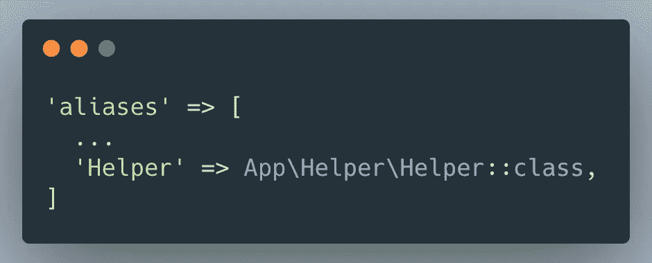

# 如何在 Laravel 中从 CSV 文件中植入数据库

> 原文：<https://betterprogramming.pub/how-to-seed-database-from-a-csv-file-in-laravel-83a54ce1015f>

## 从 CSV 文件快速生成 MySQL 数据库


由[诺德伍德主题](https://unsplash.com/@nordwood?utm_source=medium&utm_medium=referral)在 [Unsplash](https://unsplash.com?utm_source=medium&utm_medium=referral) 上拍摄的照片

可以使用 JSON 对象、数组和电子表格来播种数据库。

我最近遇到过一个情况，我不得不使用 Laravel 中的 CSV 文件作为 MySQL 数据库的种子。

在我的研究过程中，资源非常有限，我不得不拼凑几份研究来得出这个解决方案。这花了很长时间。因此，我决定为 Laravel 社区做出贡献，帮助任何可能面临同样困境的人。

# 意识形态

从电子表格中读取数据，将其附加到一个数组中，然后通过将其映射到数据库模型来播种数据库。

# 循序渐进

> 免责声明:创建您的项目，并已设置数据库。

## 方案

对于本指南，我们将考虑使用`posts.csv`文件在数据库中植入`posts`表。我建议用表名来命名 CSV 文件，因为这将带来整个系统的一致性。

## 创建模型

让我们从创建 Post 模型开始。创建模型时，记得使用单数形式。

表格以模型的复数形式命名。Laravel 足够聪明，可以创建复数形式的迁移文件。为了节省时间，让我们一起创建模型和迁移文件。

```
php artisan make:model Post --mirgation
```

这将创建类似于`2021_08_22_073753_create_posts_table.php`的 Post 模型和迁移文件。

在 app\models\ `Post.php`的 Post 模型中，我们定义了可填写的字段。

```
protected $fillable = ['title', 'subtitle', 'description'];
```

## 创建迁移

在位于`database\migrations\2021_08_22_073753_create_posts_table.php`的迁移文件中，我们定义了 posts 表的模式(表结构)。

Laravel 已经部分定义了模式。因此，我们只需要包含我们上面定义的可填充字段。

```
$table->string('title');
$table->string('subtitle')->nullable();
$table->string('description');
```

为了理解如何播种可空字段，我们将使副标题为可空。这将在下面的主题中讨论。

## 创建播种者

要创建种子文件，请运行以下命令。

```
php artisan make:seeder PostSeeder
```

种子文件将在`database\seeders\PostSeeder.php`创建。为了避免将来出现任何错误，为了安全起见，我们将`PostSeeder`包含在`DatabaseSeeders.php`中。

```
public function run(){
  $this->call([PostSeeder::class]);
}
```

如果您曾经想知道为什么您编写了 seeder，但是数据库没有被播种，并且没有错误，最可能的是，您想要检查您是否在`DatabaseSeeder.php`中包含了 seeder 类。

## 从 MySQL 派生 CSV

这是获取 CSV 文件格式的最安全的方式。不要自己创建 CSV，而是将表迁移到 MySQL 并导出为 CSV。这样，模式就不会出现诸如列拼写错误之类的人为错误。

希望您已经启动并运行了 MySQL 服务器，运行以下命令。

```
php artisan migrate:fresh
```

迁移后，查找`posts`表并将其导出为 CSV 文件。现在，您可以打开它并将其用作电子表格。

将导出的文件重命名为`posts.csv`。

您可以忽略`id`、`created_at`和`updated_at`列，因为我们将在播种它们之前选择与模型匹配的列。如果你愿意，你甚至可以删除它们。

让我们填写一些数据。

PS:原谅我可怜的创造力。

```
+-----+-----------+--------------------+--------------------+
| id  | tile      | subtitle           | description        |
+-----+-----------+--------------------+--------------------+
| 1   | Food      | Healthy Eating.    | How to eat healthy |
+-----+-----------+--------------------+--------------------+
| 2   | Sleep.    | Sleeping Well.     | How to sleep well  |
+-----+-----------+--------------------+--------------------+
| 3   | Love.     |                    |How to love.        |
+-----+-----------+--------------------+--------------------+
```

## 将 CSV 移动到公共文件夹中

您的代码可以访问公共文件夹中的文件。因此，在公共文件夹中创建一个名为 Seeders 的文件夹，并将您的 CSV 文件移动到其中。

```
public > Seeders > posts.csv
```

现在，您可以从 Laravel 项目中的任何控制器或种子中访问这些文件。

## 创建导入 CSV 功能

导航到您的 PostSeeder.php 文件。在`run()`函数中，创建一个导入 CSV 的函数。实施时确保遥控`<?php`。

要旨由[作者](https://umayir10.medium.com)

上面的函数获取 CSV 文件的文件路径并验证它。该函数返回一个对象数组，其中列的键值对映射到每个相应的数据行。现在，您的函数已经准备好使用模型中的 create 函数添加到 DB 中了。

## 编写播种逻辑

将下面的`import_CSV`函数插入到`PostSeeder.php`中，并将每条数据记录追加到 posts 表中。将这几行代码添加到`run()`函数中:

要旨由[作者](https://umayir10.medium.com)

## 附加到数据库

要为数据库设定种子，请在终端中运行命令。

```
php artisan migrate:fresh --seed
```

您可以通过访问 phpMyAdmin 并参考数据库中的 posts 表来验证这一点。`id`将自动递增，数据将填入`title`、`subtitle`和`description`。

Laravel 将在迁移和播种时自动填充`created_at`和`updated_at`。

# 代码重构

如果我不为你重构代码，我会是最差的程序员。最好的代码是经过重构的代码。所以让我们去重构我们的代码吧！

## 全局功能

假设您有许多 CSV 文件要播种，在不同的播种器上，您将不得不在您想要使用的每个播种器中不断复制`import_CSV`函数。这是复制是一种非常糟糕的做法。所以我们需要把我们的导入函数放在一个我们所有的控制器都可以访问的地方。

## 创建一个助手类

在 app 文件夹中，创建一个名为`Helper`的目录。在这个目录下，创建一个`Helper.php`文件。在这个文件中创建一个通用助手类**。**

```
<?phpnamespace App\Helper\Helper;class Helper{
  // code within helper class
}
```

正是在 Helper 类中，我们编写了想要全局访问的自定义函数。现在，我们需要在`config/app.php`文件的别名中注册这个调用。



[作者](https://umayir10.medium.com)截图

现在，我们的类和这个类中的函数可以从项目文件夹中的任何地方访问了。

## 使函数全局化

在`App/Helper/Helper.php`将`import_CSV`函数移动到助手类

要旨由[作者](https://umayir10.medium.com)

请注意，要从`Helper`类访问函数，函数需要是`public`和`static`。否则，在尝试调用该函数时，您可能会收到错误消息。

## 全局访问该函数

为了全局访问这个函数，就像 Laravel 中的任何其他类一样，我们需要将它导入给定的名称空间。简单的使用下面的命令来利用 helper 类。

```
use App\Helper\Helper;
```

要利用`import_CSV`函数，您可以从 Helper 类调用它，并像这样访问它。

```
$records = Helper::import_CSV()
```

这样，您将把所有从`import_csv`函数返回的数据放入`$records`变量中。

## 关于控制器和播种器的修正案。

现在，为了最终清理 PostSeeder.php，我们将使用上面两行代码来处理`import_CSV`函数的声明和调用。

要旨由[作者](https://umayir10.medium.com)

在清理代码并对其进行提炼之后，`PostSeeder.php`类看起来会像这样。最后，运行以下命令并在`phpMyAdmin`中检查您的数据库。

```
php artisan migrate:fresh --seed
```

# 结论

当我寻找一个 CSV 文件的种子时，资源是分散的，我不得不冒险尝试。所以我决定把这些放在一起，为 Laravel 社区和任何可能面临与我类似挑战的人做贡献。

我希望这个故事已经节省了你的时间，并帮助你实现了你想要的。

分享知识是获得知识的唯一途径。对于那些可能从这个故事中受益的人，请随意添加并通过评论做出贡献。

玩得开心！享受编码！