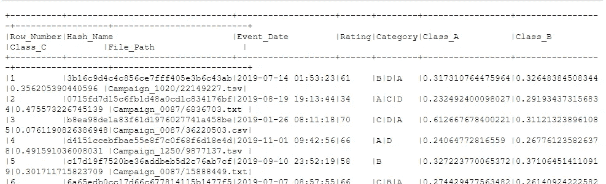
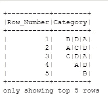
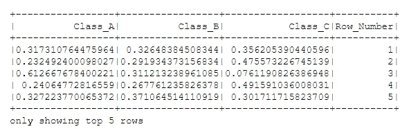
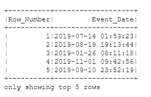
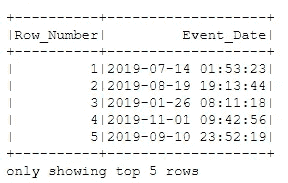

# 如何在 PySpark 中选择列

> 原文：<https://betterprogramming.pub/how-to-select-column-in-pyspark-c2bb8ddaa994>

## 一个简短的 PySpark 初学者教程


布兰登·莫温克尔在 [Unsplash](https://unsplash.com?utm_source=medium&utm_medium=referral) 上的照片

[](https://jorgepit-14189.medium.com/membership) [## 用我的推荐链接加入媒体-乔治皮皮斯

### 阅读乔治·皮皮斯(以及媒体上成千上万的其他作家)的每一个故事。您的会员费直接支持…

jorgepit-14189.medium.com](https://jorgepit-14189.medium.com/membership) 

在这个简短的教程中，我们将向您展示在 PySpark 中选择列的不同方法。一开始，我们将从 S3 加载一个 CSV 文件。

```
df **=** spark.read.options(header**=**True).csv("s3://my-bucket/folder1/")df.show()
```



或者如果我们想要得到列名的列表:

```
df.columns
```

我们得到:

```
['Row_Number', 'Hash_Name', 'Event_Date', 'Rating', 'Category', 'Class_A', 'Class_B', 'Class_C', 'File_Path']
```

# 按名称选择列

假设我们想要选择两列，即`Row_Number`和`Category`。让我们看看我们如何能做它。

```
df.select(df.Row_Number, df.Category).show(5)
```



或者我们可以如下传递列名(当列名包含空格等时，这很有用)

```
df.select(df['Row_Number'], df['Category']).show(5)
```


# 从列表中选择列

我们还可以从列名列表中选择列。例如:

```
df.select(['Row_Number','Category']).show(5)
```


请记住，它也可以在没有列表的情况下工作。例如:

```
df.select('Row_Number','Category').show(5)
```


# 使用 col()函数选择列

我们可以使用`functions`中的`col()`功能。例如:

```
**from** pyspark.sql.functions **import** coldf.select(col('Row_Number'),col('Category')).show(5)
```


# 选择包含正则表达式的列

我们可以使用正则表达式选择列。假设我们想要选择包含字符串`Class`和`Row_Number`的所有列。

```
df.select(df.colRegex("`Class.*`"), df["Row_Number"]).show(5)
```



# 基于列的索引选择列

间接地，我们可以根据列的索引来选择列。例如，假设我想选择第 1 列和第 3 列。

```
mylist = df.columns
idx = [0,2]df.select([mylist[i] for i in idx]).show(5)
```



# 使用 SQL 语句选择列

最后，还有一种通过运行 SQL 语句来选择列的替代方法。在这种情况下，我们需要首先创建一个临时视图，然后运行 SQL select 语句。

```
df.createOrReplaceTempView('mytable')spark.sql('SELECT Row_Number, Event_Date FROM mytable').show(5)
```



最初发布于[预测黑客](https://predictivehacks.com/?all-tips=how-to-select-columns-in-pyspark)