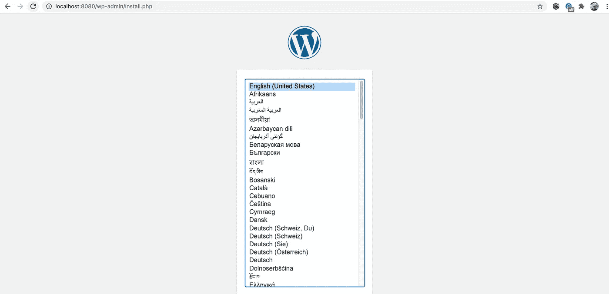
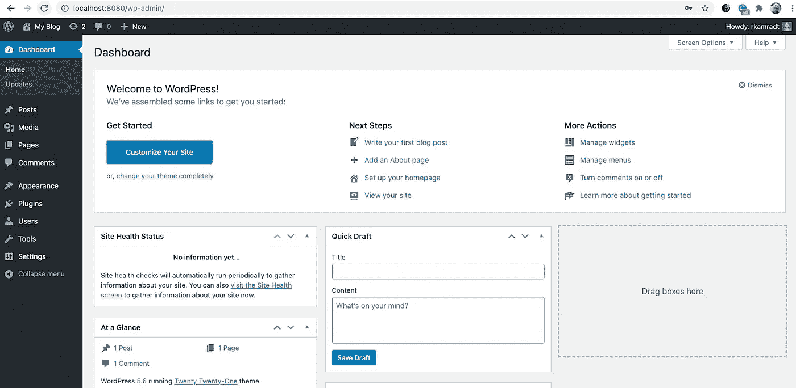

# 如何自托管 WordPress

> 原文：<https://betterprogramming.pub/how-to-self-host-wordpress-f3b9d3f3d964>

## 在部署 WordPress 之前在本地设置它


来自 [Pixabay](https://pixabay.com/?utm_source=link-attribution&utm_medium=referral&utm_campaign=image&utm_content=265132) 的图片由[沃纳·莫泽](https://pixabay.com/users/pixelcreatures-127599/?utm_source=link-attribution&utm_medium=referral&utm_campaign=image&utm_content=265132)拍摄

WordPress 主机有很多选择。许多都是单击选项，你输入几个值，你的网站就开始运行了。但是你知道幕后是怎么回事吗？我从来不喜欢以简单的方式做事，我喜欢知道发生了什么，即使这意味着避免单击解决方案。

我还想在本地运行一个 WordPress，这样我可以尝试不同的插件和主题，但仍然可以很快回到一些理智的起点。但是我不想开始在我的笔记本电脑上安装很多软件。对于那些熟悉我写作的人，我相信你能明白我的意思。我能从 Docker 上运行 WordPress 和伴随的进程吗？

我浏览了一下 Docker Hub，我惊喜地发现这里有一张官方图片。它还有一个漂亮的`docker-compose.yml`文件。

```
version: '3.1'services:wordpress:
    image: wordpress
    restart: always
    ports:
      - 8080:80
    environment:
      WORDPRESS_DB_HOST: db
      WORDPRESS_DB_USER: exampleuser
      WORDPRESS_DB_PASSWORD: examplepass
      WORDPRESS_DB_NAME: exampledb
    volumes:
      - wordpress:/var/www/htmldb:
    image: mysql:5.7
    restart: always
    environment:
      MYSQL_DATABASE: exampledb
      MYSQL_USER: exampleuser
      MYSQL_PASSWORD: examplepass
      MYSQL_RANDOM_ROOT_PASSWORD: '1'
    volumes:
      - db:/var/lib/mysqlvolumes:
  wordpress:
  db:
```

显然，这只适合在`localhost`上运行，因为它没有强密码——我必须提供一个包含这些密码的环境文件。但是首先，我把它复制到一个本地目录并运行`docker-compose up`，在几分钟内，我可以浏览到`[http://localhost:8080/](http://localhost:8080/)`并看到新的安装:



到目前为止，一切顺利！在你选择了一种语言后，另一个屏幕将会出现并询问一些问题。最重要的是登录时使用的用户名和密码。一定要记住那些！完成该屏幕后，您必须登录。然后，你会看到正常的 WordPress 管理界面。



这就是你自己的个人 WordPress 沙盒！

有几件事我想立刻改变:MySQL 数据库和 WordPress 使用 Docker 卷存储数据的方式。我想将它从卷中移出，并将它们映射到本地目录。这样，我可以看到其中发生了什么，我可以通过删除它们来清除它们，而不是记住 Docker-volume delete 命令。

另外，我想从目录外的环境文件中读取数据，这样它就不会意外地提交给 GitHub。使用`Ctrl-C`停止服务器，使用`docker-compose down`移除容器。

新的`docker-compose.yml`文件将如下所示:

```
version: '3.1'
services:
  wordpress:
    image: wordpress
    restart: always
    ports:
      - 8080:80
    env_file:
      - ../config/wordpress.env
    volumes:
     - ./wordpress:/var/www/html
  db:
    image: mysql:5.7
    restart: always
    env_file:
      - ../config/wordpress.env
    volumes:
      - ./data:/var/lib/mysql
```

WordPress 和 MySql 都会在../config/wordpress.env，应该是这样的:

```
WORDPRESS_DB_HOST=db
WORDPRESS_DB_USER=wpuser
WORDPRESS_DB_PASSWORD=<password>
WORDPRESS_DB_NAME=wpdb
MYSQL_DATABASE=wpdb
MYSQL_USER=wpuser
MYSQL_PASSWORD=<password>
MYSQL_RANDOM_ROOT_PASSWORD=1
```

用强密码替换`<password>`，并且必须匹配。注意，`WORDPRESS_DB_HOST`是`db`。这是 Docker Compose 服务名称，它为其内部 DNS 名称。

我还创建了`wordpress`和`data`目录，并在其中放了一个`.gitignore`文件，这样 Git 会将它们添加到我的存储库中，当我将它们移到云中时，我就不必创建它们了，稍后您会看到。我不希望将这些目录中的文件签入存储库，所以这些目录中的`.gitignore`文件看起来像这样:

```
# Ignore all files in this dir...
*# ... except for this one.
!.gitignore
```

完成所有这些后，你可以用`docker-compose up`再次启动 WordPress。浏览至`[http://localhost:8080/](http://localhost:8080/)`，浏览两个设置屏幕，再次进入主管理屏幕。打开一个新的终端模拟器窗口，您可以看到`data`和`wordpress`目录现在被文件填满了。

现在，我打算玩玩我的新沙盒，尝试一些插件和主题，用我可以不费吹灰之力从头开始的知识。我会把脚本放到 GitHub 中，这样你就可以访问它们了，尽管现在只有一个脚本。

在我的下一篇文章中，我将带着我所拥有的，向你展示如何把它托管在互联网上。

[](https://github.com/rkamradt/wordpress/tree/v0.1) [## rkamradt/wordpress

### 这将为你启动一个 WordPress 实例。你需要一个..带有…的/config/wordpress.env 文件

github.com](https://github.com/rkamradt/wordpress/tree/v0.1)