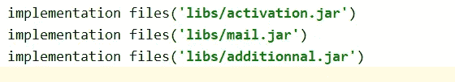
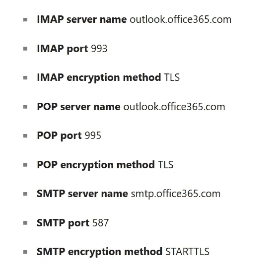
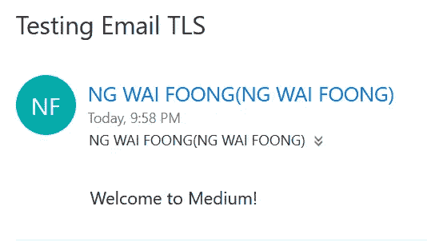
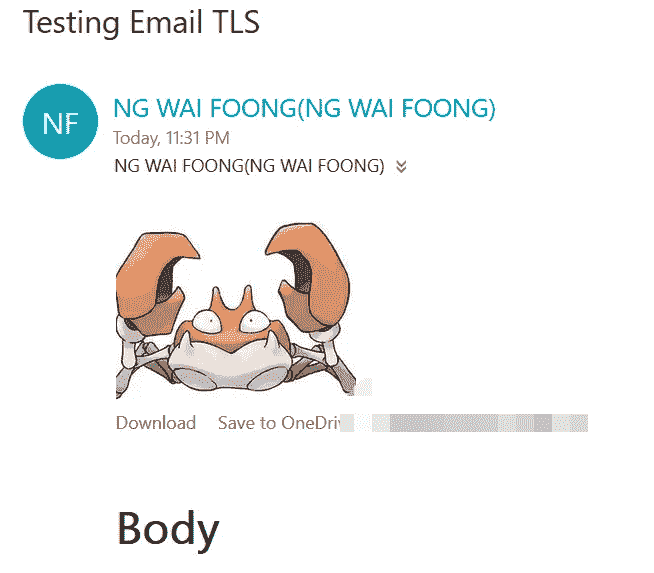
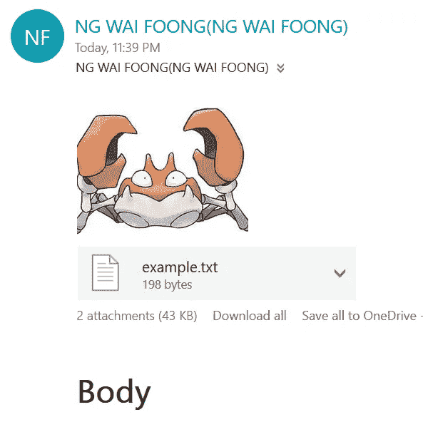

# 如何在 Android 中发送带附件的电子邮件

> 原文：<https://betterprogramming.pub/how-to-send-an-email-with-attachments-in-android-b2d75123f7e7>

## 使用 JavaMail 库直接从 Java 应用程序或 Android 应用程序发送电子邮件


照片由 [Thanh Mai Nguyen](https://unsplash.com/@thanhy_99?utm_source=unsplash&utm_medium=referral&utm_content=creditCopyText) 在 [Unsplash](https://unsplash.com/s/photos/email?utm_source=unsplash&utm_medium=referral&utm_content=creditCopyText) 上拍摄

通过阅读这篇文章，你将学会在 Android 应用程序中直接发送电子邮件。我们将使用 [JavaMail API](https://javaee.github.io/javamail/) ，它有助于简化对 SMTP 服务器的认证。

JavaMail API:

> “…提供一个独立于平台和协议的框架来构建邮件和消息传递应用程序。JavaMail API 是一个可选的软件包，可用于 Java SE 平台，也包含在 Java EE 平台中。

本文分为三个部分:

1.  设置
2.  履行
3.  结论

# 1.设置

确保您已经安装了 Android Studio，并下载了必要的 SDK 和构建工具。

用`Empty Activity`创建一个新项目。前往以下[下载链接](https://code.google.com/archive/p/javamail-android/downloads)并下载所有文件。您应该有以下文件。

*   `[additionnal.jar](https://storage.googleapis.com/google-code-archive-downloads/v2/code.google.com/javamail-android/additionnal.jar)`
*   `[mail.jar](https://storage.googleapis.com/google-code-archive-downloads/v2/code.google.com/javamail-android/mail.jar)`
*   `[activation.jar](https://storage.googleapis.com/google-code-archive-downloads/v2/code.google.com/javamail-android/activation.jar)`

请注意，这些依赖项不是最新版本。如果你想获得最新版本，请点击下面的 [JavaMail 链接](https://javaee.github.io/javamail/)并下载相应的`javax.mail.jar`1 . 6 . 2 版本。

将所有 jar 文件放在项目的`libs`文件夹中。


作者图片

右键单击它们，然后“添加为库”。检查`gradle.build (Module: app)`文件。依赖项中应该有以下代码。



作者图片

同步梯度只是为了确保模块被正确加载，以防你有冲突的类和函数。进入*构建*菜单，点击*清理项目*子菜单。

转到`AndroidManifest.xml`文件，添加以下权限。您需要提供应用程序访问来使用`INTERNET`。

```
<uses-permission android:name="android.permission.INTERNET"/>
```

让我们进入下一部分，启动您的 Android 项目。

# 2.履行

让我们创建一个名为`SendEmailService`的新类。我们将把它作为应用程序的单例对象。

```
public class SendEmailService {}
```

## 导入

在 MainActivity.java 顶部添加以下进口声明。

如果您不确定要导入哪个模块，请继续下一部分，因为稍后您可以通过将鼠标悬停在错误上并点击`Alt+Shift+Enter`，或者简单地通过`Alt+Enter`跳转到特定错误并进行适当的导入声明来轻松导入它。

你甚至可以将鼠标悬停在错误上，点击*导入类*，Android Studio 会自动为你导入。如果同一个类名有多个选择，请确保选择了正确的类。

如果您遇到导入错误的问题，请确保您已经安装了适当的依赖项。

## 初始化

在您的`SendEmailService`类中，添加以下变量。用您的电子邮件和相应的密码替换输入。

创建一个接受`Context`参数的同步`getInstance`方法。

建议在初始化时使用一个`context`，因为它为我们以后处理 UI 提供了更多的灵活性。我们将使用这个函数作为初始化，以确保只创建一个对象。

创建一个构造函数并添加以下初始化。

请注意，我使用 Outlook 作为 SMTP 服务器，连接基于 TLS。事实上，您可以使用自己的 SMTP 服务器或第三方服务，如 Gmail 或 Outlook。

您必须根据将要使用的 SMTP 服务器的设置来修改参数。您必须允许第三方服务访问您的电子邮件。

Outlook 的设置如下。如果您正在使用其他 SMTP 服务器，请进行相应的修改。



作者图片

让我们创建一个`SendEmail`函数，它将托管发送电子邮件所需的所有代码。

```
public void SendEmail() {}
```

在捕捉`MessagingException`的函数内增加一个`try catch`块。

```
try {}
catch(MessagingException e) {
    e.printStackTrace();
}
```

## 哑剧

下一步是创建电子邮件。将以下代码放入`try catch`块中。您可以使用自己的电子邮件来设置发送者和接收者电子邮件，以进行测试。

如果您将它发送给多个接收者，您可以依靠`InternetAdresss`函数来解析它。只需将它们作为逗号分隔的单个字符串添加即可。

如果有问题，将它们存储在一个列表中，并使用以下代码:

```
List<String> recipient = new ArrayList<String>();
//add item to list
String.*join*(**","**, recipient);
```

完成后，添加下面的代码以方便消息发送。

```
Transport.*send*(message);
```

## 异步任务

您不能直接从主线程运行该调用，因为它会阻塞进程。因此，将会出现错误。

您可以通过将它包装在一个`Runnable`函数中来轻松解决它。我正在使用`AsyncTask`来实现这一点。只需将下面的代码放在您的`onCreate`函数中，或者放在一个将在`Button click`期间被调用的函数中进行测试。

## 执行服务

在最新的更新中，Android 中的文档建议使用`java.util.concurrent`来代替，因为`AsyncTask`在 API 级别 r 中已被否决。


图片作者。摘自[安卓](https://developer.android.com/reference/android/os/AsyncTask)

添加以下导入语句:

```
import java.util.concurrent.ExecutorService;                       import java.util.concurrent.Executors;
```

创建一个新的`ExecutorService`对象。我将只用一个`SingleTheadExecutor`。

```
static final ExecutorService emailExecutor = Executors.newSingleThreadExecutor();
```

用以下代码替换`AsyncTask`部分:

运行该应用程序时，您应该能够在邮箱中获得以下结果。



作者图片

## 使用 MimeMultipart 的图像附件

对于添加图像附件，您可以通过利用`MimeMultipart`类来完成。

让我们注释掉`setText`函数，并继续在`Transport.send`函数上方多写几行 Java 代码。如下初始化`MimeMultipart`变量:

```
Multipart multipart = newMimeMultipart();
```

设置一个`MimeBodyPart`，用各自的文本调用`setContent`。您也可以指定一个 HTML 文本。完成后，通过调用`addBodyPart`函数将身体部位添加到`MimeMultipart`变量中。

```
BodyPart messageBodyPart = new MimeBodyPart();String htmlText = "<H1>*Welcome to Medium!*</H1>";
messageBodyPart.setContent(htmlText, "text/html");
multipart.addBodyPart(messageBodyPart);
```

为了发送图像，你必须把它转换成字节数组。假设您的 XML 中有一个 ID 为 image 的`ImageView`。只需添加以下导入。

```
**import** android.widget.ImageView;
```

初始化你的`MainActivity`类中的一个变量。

```
private ImageView mImageView;
```

通过在`onCreate`函数中找到 ID 来分配图像视图。

```
mImageView = (ImageView) findViewById(R.id.*image*);
```

您可以通过下面的方法从`ImageView`中获取`Bitmap`对象。

```
Bitmap bitmap = ((BitmapDrawable) mImageView.getDrawable()).getBitmap();
```

您必须修改`sendEmail`函数来接受位图作为参数。

```
public void SendEmail(Bitmap bitmap)
```

在`SendEmail`函数中，继续在`addBodyPart`后添加以下代码。我们将从`ImageView`中获取位图，并在`ByteArrayOutputStream`中捕获字节数组。

```
ByteArrayOutputStream baos = new ByteArrayOutputStream();
bitmap.compress(Bitmap.CompressFormat.*JPEG*, 100, baos);
byte[] imageInByte = baos.toByteArray();
```

从字节数组中创建一个新的`MimeBodyPart`和一个`ByteArrayDataSource`。

您可以根据自己的偏好设置文件名。通过调用`addBodyPart`函数，继续将身体部位添加到`MimeMultipart`变量中。

最后，调用`setContent`并传入`Transport.send`函数正上方的 multipart。

```
message.setContent(multipart);
Transport.*send*(message);
```

你应该可以在你的邮箱里看到下面的邮件。



作者图片

## 文本附件

您也可以添加文本附件文件。

在`message.setContent`函数上添加以下代码。我将从字符串的字节数组中创建一个简单的`ByteArrayDataSource`。如果您正在编写 Unicode 文本，也可以将`Charset`参数作为 UTF-8 来传递。

您应该能够获得以下结果



作者图片

## 信任商店

如果由于`TrustStore`问题而导致发送错误，请添加以下属性。

请注意，这只有在您使用最新版本的 JavaMail 时才有效。理论上，您可以传入`*`作为允许所有证书的值，但是建议不要这样做。

```
prop.put("mail.smtp.ssl.trust", "smtp.office365.com");
```

## MailCapCommandMap

如果遇到 MIME 类型的问题，您需要添加下面的导入声明。

```
import javax.activation.CommandMap;
import javax.activation.MailcapCommandMap;
```

在`Properties`的正上方，添加以下代码。这是为了确保它可以处理我们的电子邮件中的所有类型的 MIME。

在这个 [GitHub](https://gist.github.com/wfng92/f131ea2d96d0d90338bb496aac97cfdc) 链接上，你可以随意查看`SendEmailService.java`的完整代码。

# 3.结论

让我们回顾一下你今天所学的内容。我们从一个简单的设置开始，下载必要的 JAR 文件并将其作为库添加到项目中。此外，我们在`AndroidManifest.xml`中明确设置了`INTERNET`访问的权限。

接下来，我们创建了一个简单的 singleton `SendEmailService`类。在类内部，我们声明了一些导入语句并初始化了一些有用的变量。

我们深入探讨了如何创建 MIME 电子邮件。我们还尝试在`AsyncTask`或`ExecutorService`里发送一封简单的文本邮件。

后来，我们将图像和文本附件作为`MimeMultipart`对象的一部分添加到电子邮件中。

感谢阅读这篇文章。希望在下一篇文章中再见到你！

# 参考

1.  [用 Java 发送电子邮件](https://www.tutorialspoint.com/java/java_sending_email.htm)
2.  [用 Java 发送图像附件邮件](https://www.tutorialspoint.com/javamail_api/javamail_api_send_inlineimage_in_email.htm)
3.  [JavaMail 存档](https://code.google.com/archive/p/javamail-android/)
4.  [JavaMail 下载](https://code.google.com/archive/p/javamail-android/downloads)
5.  [JavaMail 甲骨文](https://www.oracle.com/technetwork/java/javamail/index.html)